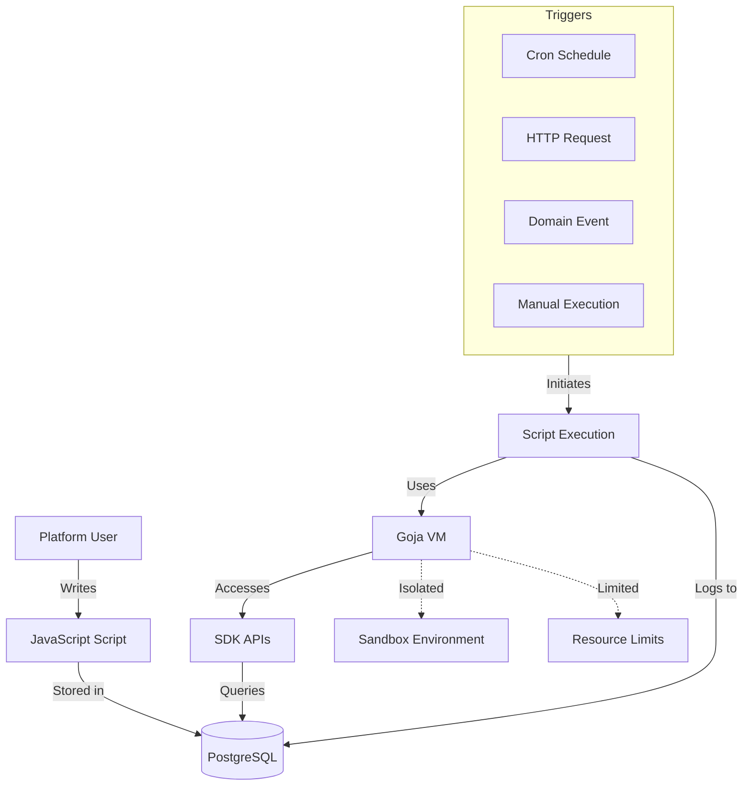
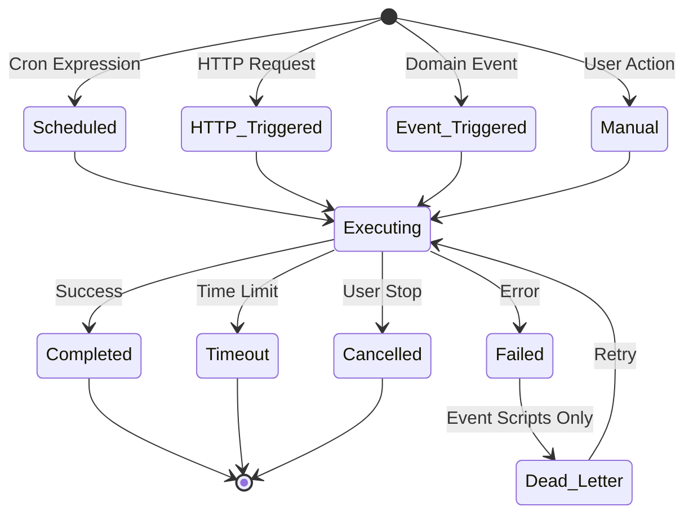
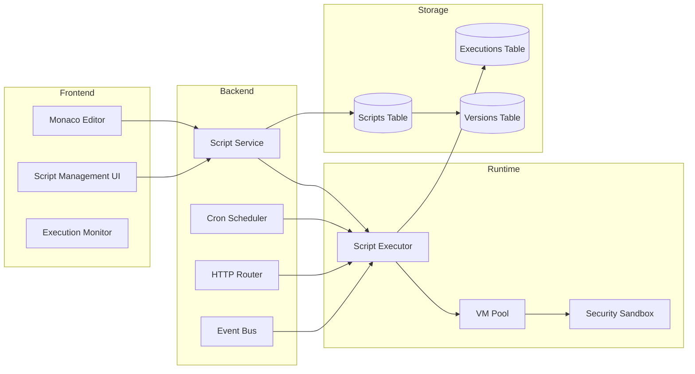
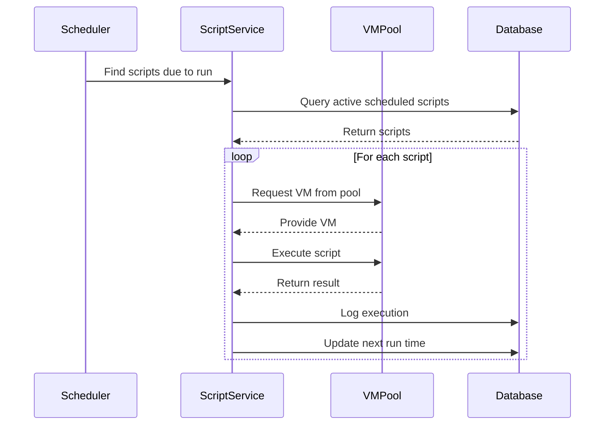
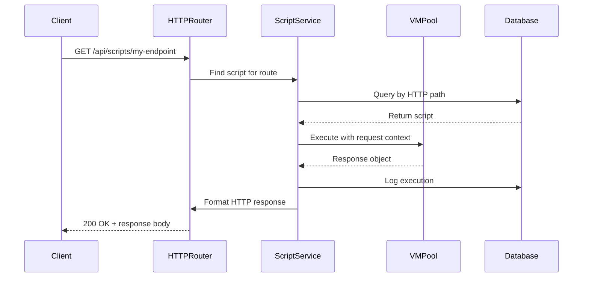
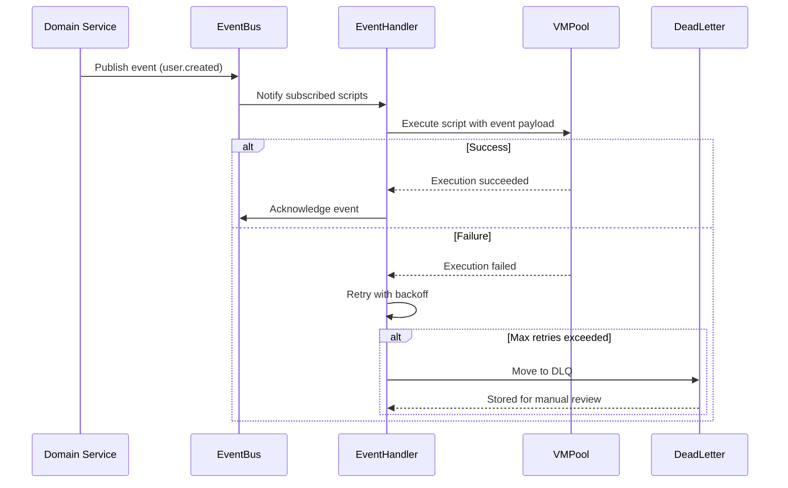
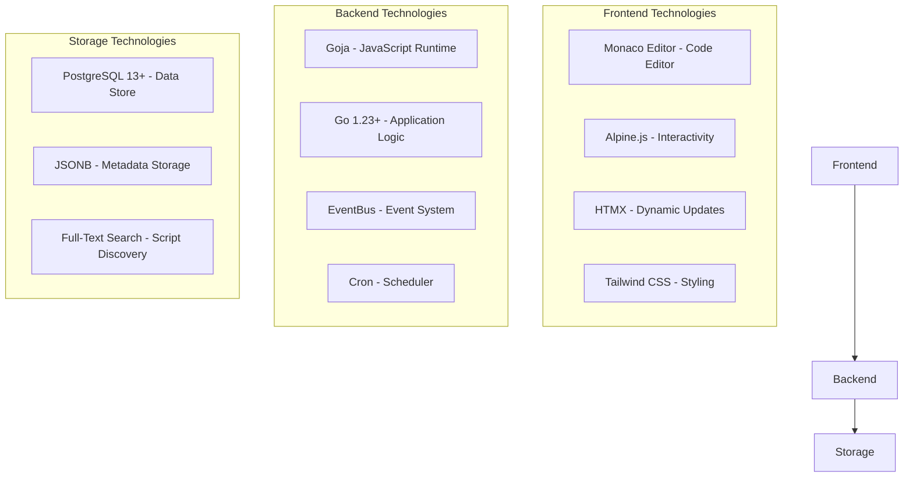
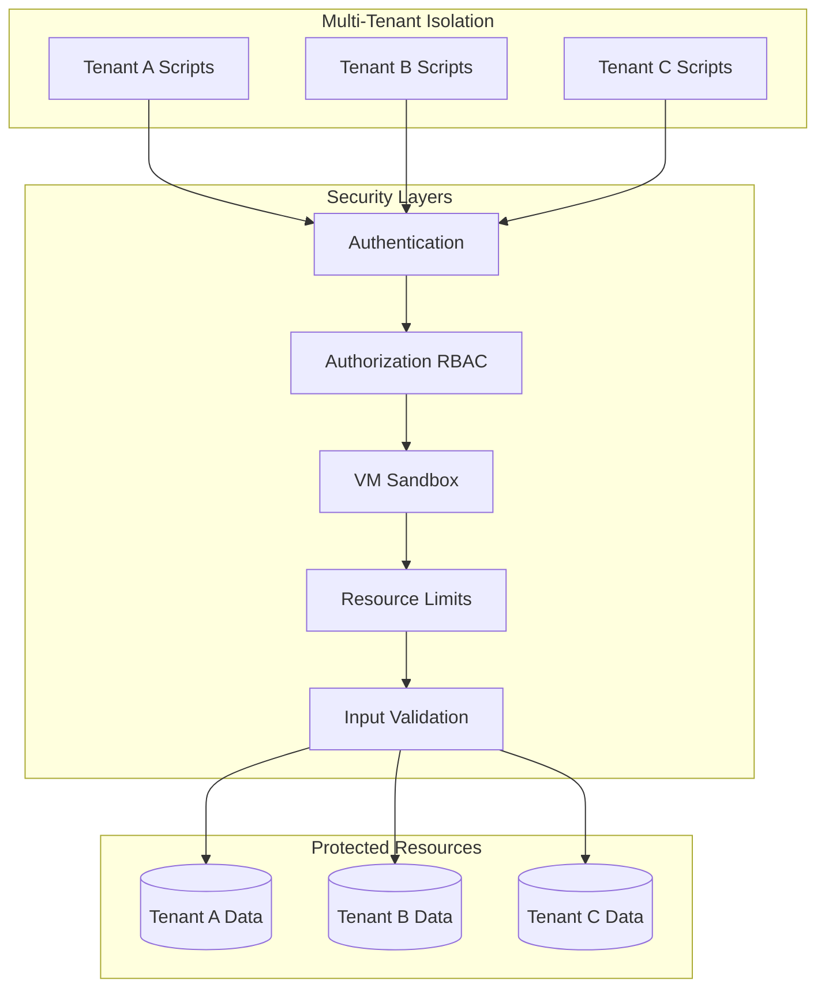
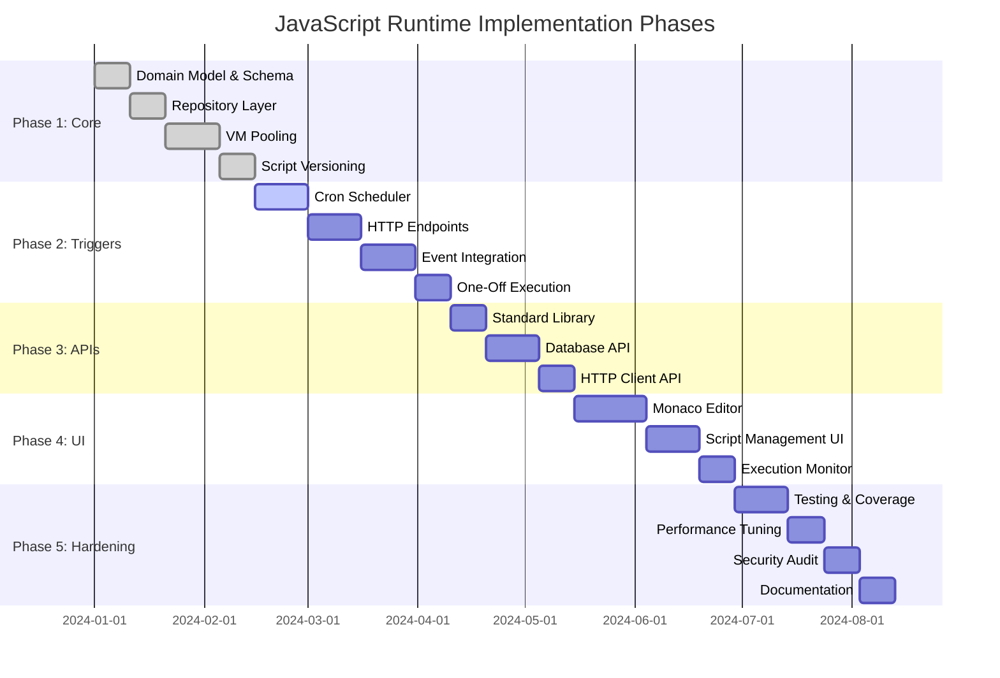

# JavaScript Runtime - Overview

## Executive Summary

The JavaScript Runtime feature enables IOTA SDK users to extend platform functionality through user-defined JavaScript code execution in a secure, multi-tenant sandboxed environment. This feature supports scheduled scripts (cron), HTTP endpoint scripts, event-triggered scripts, one-off scripts, and embedded scripts.

## System Capabilities

### Script Execution Triggers

### Core Components

## Glossary of Terms

**Script**: User-defined JavaScript code stored in the database with metadata, resource limits, and trigger configuration.

**Execution**: A single run of a script, tracked with input/output, status, metrics, and error details.

**VM Pool**: Pre-warmed Goja virtual machines ready to execute scripts, reducing cold-start latency.

**Sandbox**: Isolated execution environment with restricted access to system resources and tenant data.

**Trigger**: Event or condition that initiates script execution (cron schedule, HTTP request, domain event, manual trigger).

**Resource Limits**: Constraints on script execution (max duration, memory, API calls, concurrent executions).

**Tenant Isolation**: Multi-tenant security boundary ensuring scripts can only access data within their tenant context.

**Script Type**: Classification of script by trigger mechanism (Scheduled, HTTP, Event, OneOff, Embedded).

**Execution Status**: State of script run (Pending, Running, Completed, Failed, Timeout, Cancelled).

**Script Status**: Lifecycle state (Draft, Active, Paused, Disabled, Archived).

**Version**: Immutable snapshot of script source code for audit trail and rollback.

**Dead Letter**: Failed event-triggered execution moved to retry queue or manual review.

**Cron Expression**: Schedule definition using standard cron syntax (e.g., `0 0 * * *`).

**HTTP Path**: URL endpoint mapped to a script (e.g., `/api/scripts/my-handler`).

**Event Type**: Domain event name that triggers script execution (e.g., `user.created`, `payment.processed`).

**Metadata**: Key-value pairs for script categorization, tagging, and custom configuration.

## Quick Navigation

1. **[00-overview.md](./00-overview.md)** (this file) - Executive summary, glossary, feature list
2. **[01-architecture.md](./01-architecture.md)** - System design, component diagrams, integration points
3. **[02-domain-model.md](./02-domain-model.md)** - DDD entities, aggregates, value objects, domain events
4. **[03-database-schema.md](./03-database-schema.md)** - PostgreSQL schema, indexes, constraints
5. **[04-repository-layer.md](./04-repository-layer.md)** - Repository interfaces and patterns
6. **[05-service-layer.md](./05-service-layer.md)** - Business logic and orchestration
7. **[06-runtime-engine.md](./06-runtime-engine.md)** - VM pooling and execution engine
8. **[07-api-bindings.md](./07-api-bindings.md)** - JavaScript SDK APIs
9. **[08-event-integration.md](./08-event-integration.md)** - Event-driven architecture
10. **[09-presentation-layer.md](./09-presentation-layer.md)** - UI, controllers, templates
11. **[10-security-model.md](./10-security-model.md)** - Sandboxing, isolation, limits
12. **[11-advanced-features.md](./11-advanced-features.md)** - Monitoring, optimization, health checks
13. **[12-implementation-plan.md](./12-implementation-plan.md)** - Phased rollout strategy

## Related GitHub Issues

**Core Infrastructure:**
- [#411](https://github.com/iota-uz/iota-sdk/issues/411) - JavaScript Runtime Core
- [#412](https://github.com/iota-uz/iota-sdk/issues/412) - VM Pooling & Resource Management
- [#413](https://github.com/iota-uz/iota-sdk/issues/413) - Script Versioning & Audit Trail
- [#148](https://github.com/iota-uz/iota-sdk/issues/148) - Monaco Editor Integration

**Trigger Mechanisms:**
- [#414](https://github.com/iota-uz/iota-sdk/issues/414) - Scheduled Scripts (Cron)
- [#415](https://github.com/iota-uz/iota-sdk/issues/415) - HTTP Endpoint Scripts
- [#416](https://github.com/iota-uz/iota-sdk/issues/416) - Event-Triggered Scripts
- [#417](https://github.com/iota-uz/iota-sdk/issues/417) - One-Off Script Execution

**API & Bindings:**
- [#418](https://github.com/iota-uz/iota-sdk/issues/418) - Standard Library API
- [#419](https://github.com/iota-uz/iota-sdk/issues/419) - Database Access API
- [#420](https://github.com/iota-uz/iota-sdk/issues/420) - HTTP Client API

## Feature Capabilities

### 1. Scheduled Scripts (Cron)

**What It Does:**
Executes scripts automatically on a defined schedule using standard cron expressions, with timezone support and automatic retry for failures.

**How It Works:**
- Scripts are registered with cron expressions (e.g., `0 0 * * *` for daily at midnight)
- Scheduler continuously monitors for scripts due to run
- Scripts execute in isolated VMs with tenant context
- Next run time calculated automatically
- Overlapping executions prevented via locking

**Use Cases:**
- Nightly data exports
- Weekly report generation
- Monthly billing runs
- Hourly data synchronization

**Acceptance Criteria:**
- ✅ Support standard cron syntax (minute, hour, day, month, weekday)
- ✅ Accurate next run calculation with timezone support
- ✅ Prevent overlapping executions via database locks
- ✅ Log all execution attempts with timestamps
- ✅ Handle daylight saving time transitions

### 2. HTTP Endpoint Scripts

**What It Does:**
Maps user-defined JavaScript scripts to HTTP routes, allowing custom API endpoints with full request/response control.

**How It Works:**
- Scripts registered with HTTP paths (e.g., `/api/scripts/custom-handler`)
- HTTP router matches incoming requests to scripts
- Request data (method, headers, body, query params) passed to script
- Script returns response object (status, headers, body)
- Authentication/authorization applied before script execution

**Use Cases:**
- Custom API endpoints
- Webhooks for third-party integrations
- Data validation endpoints
- Custom business logic APIs

**Acceptance Criteria:**
- ✅ Support GET, POST, PUT, DELETE, PATCH methods
- ✅ Access to request headers, query params, body
- ✅ Return custom status codes and headers
- ✅ Integrate with RBAC for authorization
- ✅ Handle JSON, form data, plain text inputs

### 3. Event-Triggered Scripts

**What It Does:**
Automatically executes scripts in response to domain events (e.g., user.created, payment.processed), with retry logic and dead letter queue for failures.

**How It Works:**
- Scripts subscribe to specific event types
- EventBus publishes domain events after business operations
- Matching scripts queued for execution
- Failed executions retried with exponential backoff
- Persistent failures moved to dead letter queue for manual review

**Use Cases:**
- Send email on user registration
- Update inventory on order completion
- Log audit trail on payment
- Trigger notifications on status change

**Acceptance Criteria:**
- ✅ Subscribe to multiple event types per script
- ✅ Access full event payload in script
- ✅ Retry failed executions with exponential backoff
- ✅ Dead letter queue for persistent failures
- ✅ Tenant isolation for event filtering

### 4. One-Off Scripts

**What It Does:**
Allows manual, ad-hoc execution of scripts via UI or API, with support for input parameters and result inspection.

**How It Works:**
- User triggers execution from UI or API
- Optional input parameters passed to script
- Script executes synchronously or asynchronously
- Results displayed in UI or returned via API
- Full execution history maintained

**Use Cases:**
- Data migration scripts
- One-time fixes
- Testing business logic
- Administrative tasks

**Acceptance Criteria:**
- ✅ Execute script from UI with parameter input
- ✅ Execute script via API endpoint
- ✅ Support synchronous (wait for result) and async execution
- ✅ Display execution output in UI
- ✅ Cancel running executions

### 5. Embedded Scripts

**What It Does:**
Enables programmatic script execution from Go code, allowing dynamic business logic within the application.

**How It Works:**
- Go code invokes script service with script identifier
- Script executes in shared VM pool
- Results returned to calling code
- Tenant context automatically injected

**Use Cases:**
- Custom validation rules
- Dynamic pricing calculations
- Extensible business logic
- Plugin architecture

**Acceptance Criteria:**
- ✅ Invoke scripts from Go service layer
- ✅ Pass structured input data
- ✅ Receive typed output data
- ✅ Handle execution errors gracefully
- ✅ Respect tenant isolation

## Technology Stack

### Technology Choices

**Goja JavaScript Engine:**
- **What**: Pure Go implementation of ECMAScript 5.1+ with select ES6 features
- **Why**: No CGO dependencies, excellent Go interoperability, memory-safe execution
- **Trade-offs**: Limited ES6+ features compared to V8, slower than native engines
- **Benefits**: Simplified deployment, built-in performance optimizations, active maintenance

**Monaco Editor:**
- **What**: Browser-based code editor powering VS Code
- **Why**: Industry-standard editor with IntelliSense, syntax highlighting, error detection
- **Benefits**: Autocomplete for SDK APIs, diff view for versions, customizable themes
- **Integration**: Embedded in IOTA SDK UI with real-time validation

**PostgreSQL Persistence:**
- **What**: ACID-compliant relational database
- **Why**: JSON/JSONB support, robust indexing, multi-tenant row-level security
- **Benefits**: Audit trail with versioning, full-text search, referential integrity

**VM Pooling:**
- **What**: Pre-warmed Goja VMs ready for execution
- **Why**: Reduced cold-start latency, fair scheduling, resource isolation
- **Benefits**: Graceful degradation under load, per-tenant limits, idle cleanup

## Security Model

**Multi-Tenant Isolation:**
- Tenant ID automatically injected into script execution context
- Database queries scoped to tenant via WHERE clauses
- No cross-tenant data access possible
- Separate execution tracking per tenant

**Resource Limits:**
- Maximum execution time (configurable timeout)
- Maximum memory usage per script
- Maximum API call rate
- Maximum concurrent executions per tenant
- Maximum script source code size

**Sandbox Restrictions:**
- No file system access
- No network access (except via controlled HTTP client API)
- No process spawning or system calls
- No native module loading
- No eval() or Function() constructor (configurable)

**Input Validation:**
- Script source code sanitization before storage
- Execution input validation against schemas
- SQL injection prevention in API bindings
- XSS prevention in HTTP response outputs

## Success Criteria & Acceptance

### Performance Requirements
- ✅ Script execution start time < 100ms (from warm VM pool)
- ✅ Support 1000+ concurrent script executions
- ✅ Script listing query response < 50ms
- ✅ Version diff rendering < 200ms
- ✅ Cold VM warmup time < 500ms

### Reliability Requirements
- ✅ 99.9% uptime for script execution service
- ✅ Zero data loss on script updates (versioning)
- ✅ Graceful degradation under resource pressure
- ✅ Automatic retry for transient failures (event-triggered only)
- ✅ Dead letter queue for persistent failures

### Usability Requirements
- ✅ Intuitive script editor with IntelliSense/autocomplete
- ✅ Clear error messages with line numbers and context
- ✅ Searchable execution logs with filtering
- ✅ Version history with one-click rollback
- ✅ Real-time execution status updates

### Security Requirements
- ✅ Zero cross-tenant data leaks (isolation verification)
- ✅ All executions respect resource limits (timeout, memory)
- ✅ Complete audit trail for script changes
- ✅ Security review for all exposed APIs
- ✅ Malicious script detection and prevention

## Implementation Roadmap

**Phase 1: Core Infrastructure** (Issues #411, #412, #413)
- Domain model with entities and value objects
- PostgreSQL schema with multi-tenant isolation
- Repository layer with CRUD operations
- VM pooling for execution
- Script versioning for audit trail

**Phase 2: Execution Triggers** (Issues #414, #415, #416, #417)
- Cron scheduler integration
- HTTP endpoint routing
- EventBus subscription
- One-off execution API

**Phase 3: API Bindings** (Issues #418, #419, #420)
- Standard library (console, JSON, date, math)
- Database query builder with tenant scoping
- HTTP client with request/response handling
- IOTA SDK service integrations

**Phase 4: UI & Editor** (Issue #148)
- Monaco Editor integration with IntelliSense
- Script CRUD management UI
- Execution monitoring dashboard
- Version diff viewer with rollback

**Phase 5: Production Hardening**
- Comprehensive test coverage (unit, integration, E2E)
- Performance benchmarking and optimization
- Security audit and penetration testing
- User documentation and API reference
