# JavaScript Runtime - Architecture

## System Overview

The JavaScript Runtime module is a self-contained IOTA SDK module following Domain-Driven Design (DDD) principles. It integrates with the IOTA SDK application layer, EventBus, and database pool while maintaining clear boundaries and multi-tenant isolation.

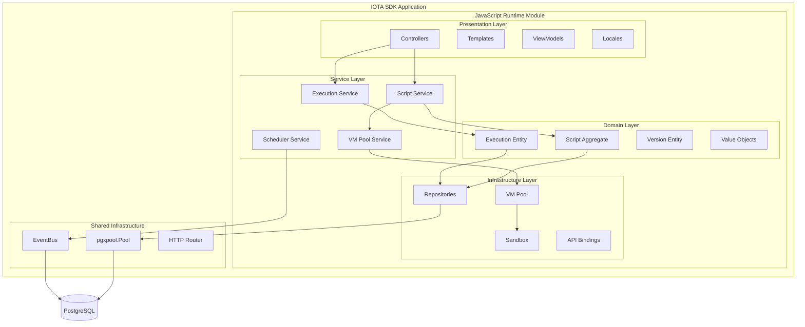

## Layer Responsibilities

### Presentation Layer
**What It Does:**
- Handles HTTP requests and responses for script management
- Provides Monaco Editor integration for code editing
- Transforms domain data into UI-friendly formats via ViewModels
- Manages multi-language translations (en, ru, uz)

**Components:**
- **Controllers**: HTTP endpoints for CRUD operations, execution monitoring
- **Templates**: Templ-based UI templates for script listing, editing, execution history
- **ViewModels**: Transform domain entities to presentation-friendly structures
- **Locales**: Translation files for all user-facing text

### Service Layer
**What It Does:**
- Orchestrates business logic and coordinates between domain and infrastructure
- Manages script lifecycle (create, update, delete, execute)
- Coordinates VM pool operations and resource allocation
- Handles cron scheduling and event subscriptions

**Components:**
- **Script Service**: CRUD operations, validation, versioning
- **Execution Service**: Script execution orchestration, result tracking
- **VM Pool Service**: VM lifecycle management, warm-up, cleanup
- **Scheduler Service**: Cron job scheduling, next run calculation
- **Event Handler Service**: Event subscription, script matching, execution triggering

### Domain Layer
**What It Does:**
- Defines core business entities and rules
- Enforces invariants and validation logic
- Publishes domain events for state changes
- Provides repository interfaces (contracts)

**Components:**
- **Script Aggregate**: Root entity with execution triggers, resource limits, status
- **Execution Entity**: Single script run with input/output, status, metrics
- **Version Entity**: Immutable snapshot of script source for audit trail
- **Value Objects**: ScriptType, ScriptStatus, ExecutionStatus, ResourceLimits, CronExpression, TriggerData

### Infrastructure Layer
**What It Does:**
- Implements repository interfaces from domain layer
- Provides VM execution environment and API bindings
- Manages cron scheduling infrastructure
- Handles database persistence with tenant isolation

**Components:**
- **Repositories**: Script, Execution, Version data access with PostgreSQL
- **VM Pool**: Goja VM lifecycle, warm-up, acquisition, release
- **Sandbox**: Script execution environment with resource limits
- **API Bindings**: JavaScript APIs (console, database, HTTP client)
- **Scheduler**: Cron job execution coordinator

## Data Flow Patterns

### 1. Scheduled Script Execution

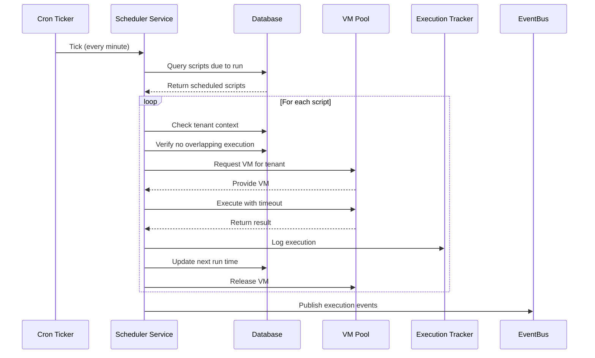

**Key Steps:**
1. Cron ticker triggers scheduler every minute
2. Query active scheduled scripts due to run (filtered by tenant)
3. Check for overlapping executions via database lock
4. Acquire VM from pool (tenant-scoped)
5. Inject tenant context and API bindings
6. Execute with timeout enforcement
7. Store results and update next run time
8. Release VM back to pool
9. Publish execution events for monitoring

### 2. HTTP Endpoint Script Execution

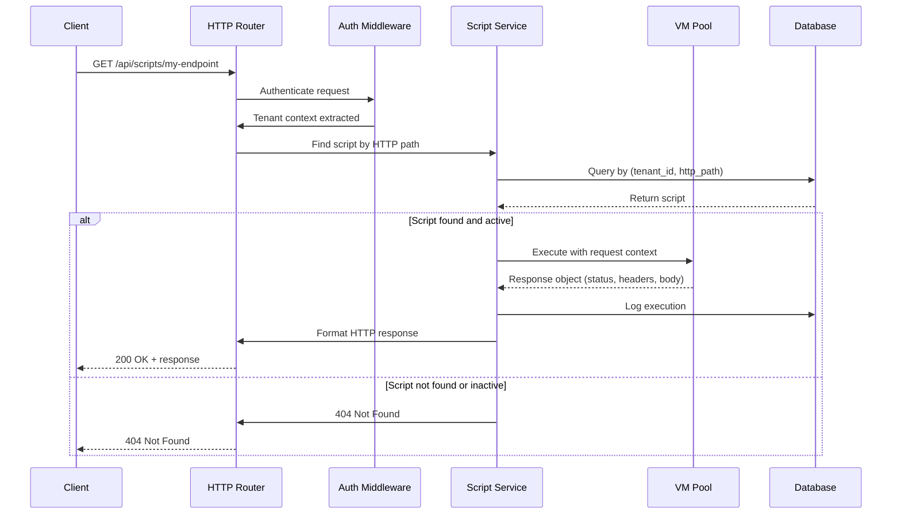

**Key Steps:**
1. Client sends HTTP request to registered endpoint
2. Authentication middleware extracts tenant context
3. Router matches request path to script
4. Query script by tenant ID and HTTP path
5. Verify script is active and matches HTTP method
6. Acquire VM and inject HTTP request object
7. Execute script with timeout
8. Script returns response object (status, headers, body)
9. Log execution and format HTTP response
10. Return response to client

### 3. Event-Triggered Script Execution

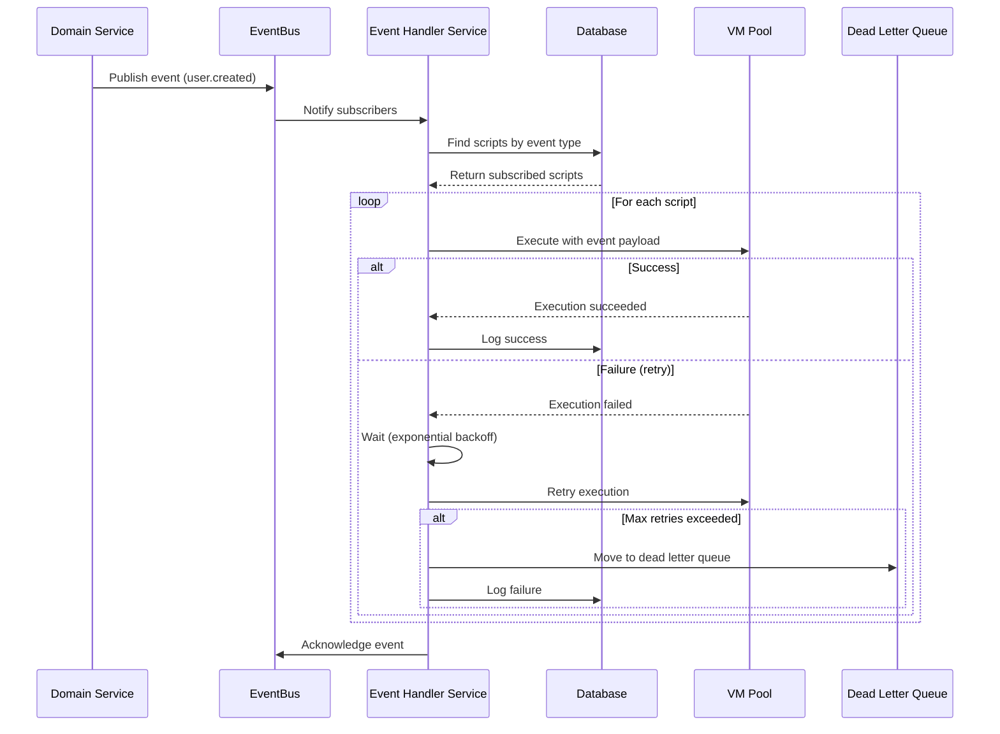

**Key Steps:**
1. Domain service publishes event to EventBus
2. Event Handler receives event notification
3. Query scripts subscribed to event type (filtered by tenant)
4. For each matching script, execute in VM pool
5. Pass event payload to script as input
6. On failure, retry with exponential backoff
7. After max retries, move to dead letter queue
8. Log all execution attempts
9. Acknowledge event to EventBus

## Key Design Decisions

### 1. Why Goja?

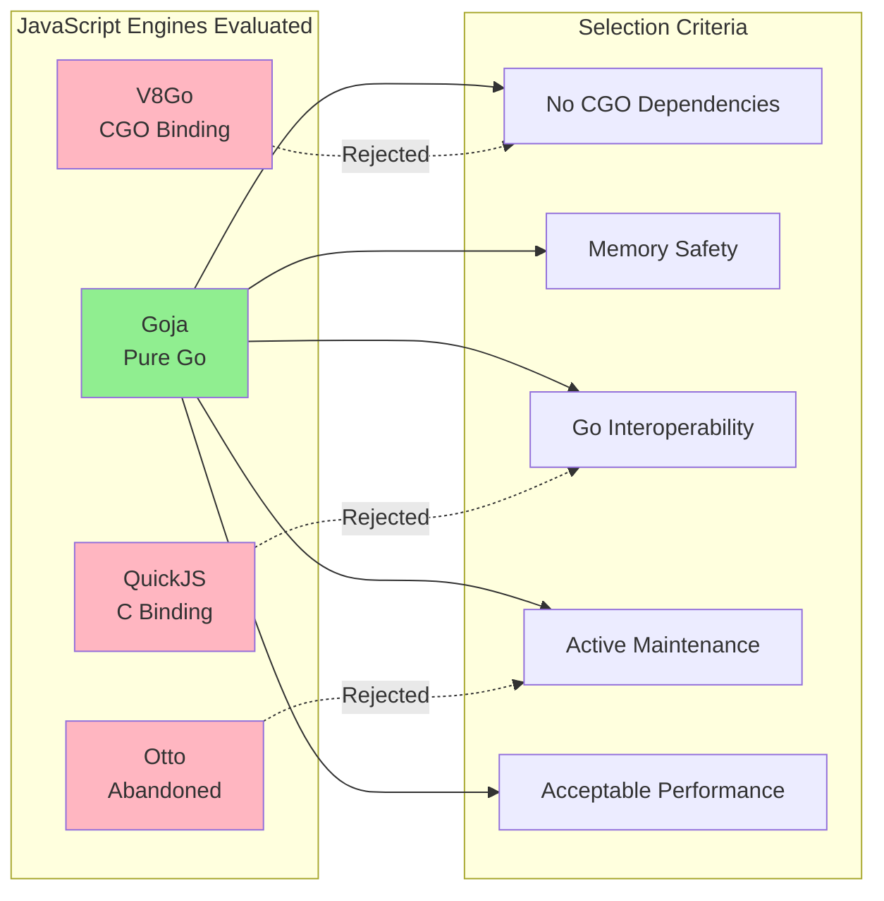

**Decision**: Use Goja as the JavaScript runtime engine.

**Rationale:**
- **Pure Go Implementation**: No CGO dependencies, simplified deployment, cross-platform compatibility
- **Memory Safety**: Runs in Go's memory-safe environment, preventing buffer overflows and memory corruption
- **Excellent Go Interoperability**: Seamless mapping between Go and JavaScript types, easy API binding
- **Active Maintenance**: Regular updates, responsive maintainers, strong community
- **ECMAScript 5.1+ Compatibility**: Covers majority of business logic use cases
- **Built-in Optimizations**: JIT compilation, inline caching, escape analysis

**Alternatives Considered:**
- **V8 (via V8Go)**: Rejected due to CGO requirement, complex deployment, larger binary size
- **QuickJS**: Rejected due to C dependency, less mature Go bindings
- **Otto**: Rejected due to abandoned maintenance, ECMAScript 5 only, slower performance

**Trade-offs Accepted:**
- Slower execution compared to V8 (acceptable for business logic, not compute-intensive tasks)
- Limited ES6+ features (workarounds available, most features via polyfills)
- No native async/await (use callbacks or synchronous patterns)

### 2. Why VM Pooling?

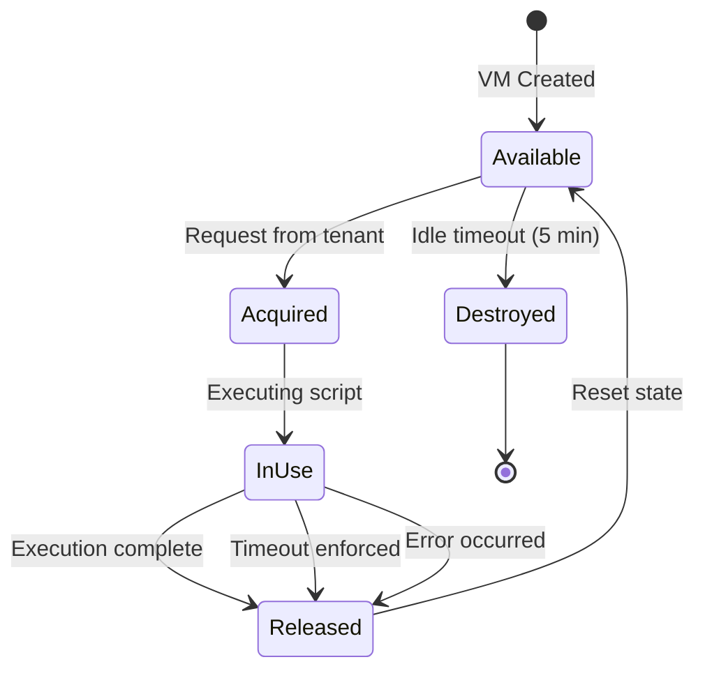

**Decision**: Implement a pool of pre-warmed Goja VMs.

**Rationale:**
- **Reduced Latency**: Pre-warmed VMs eliminate cold-start overhead (100ms+ → <10ms)
- **Resource Isolation**: One tenant per VM prevents cross-tenant interference
- **Fair Scheduling**: Pool management ensures fair access across tenants
- **Memory Efficiency**: Reuse VMs across executions, reducing GC pressure
- **Graceful Degradation**: Pool size auto-adjusts under load

**Implementation Strategy:**
- Initial pool size: 10 VMs (configurable via environment)
- Expansion: Add VMs on demand up to max (100 VMs default)
- Idle timeout: 5 minutes of inactivity → VM released
- Per-tenant limit: Max 5 concurrent VMs per tenant (prevent monopolization)
- Warm-up: Pre-load standard library and common APIs

### 3. Multi-Tenant Architecture

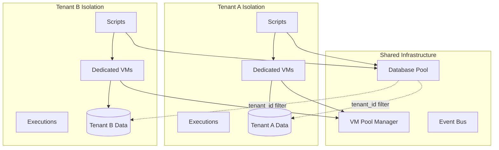

**Decision**: Enforce tenant isolation at all layers (database, VM, API).

**Rationale:**
- **Security**: Zero cross-tenant data leaks, even under VM compromise
- **Compliance**: Data residency requirements, audit trails per tenant
- **Fair Resource Usage**: Prevent one tenant from starving others
- **Billing**: Per-tenant execution metrics for usage-based pricing

**Implementation:**
- **Database**: `tenant_id` in all tables, row-level security policies
- **VM Context**: Tenant ID injected into global scope, all APIs check tenant context
- **API Bindings**: Database queries automatically scoped to `tenant_id` via composables
- **Execution Tracking**: Separate execution logs per tenant
- **Resource Limits**: Per-tenant quotas (executions/hour, concurrent VMs, storage)

**Tenant Context Available in Scripts:**
- `context.tenantId` - Current tenant identifier
- `context.userId` - Authenticated user identifier
- `context.organizationId` - Organization identifier within tenant
- All API calls automatically inherit tenant context

### 4. Integration Points with IOTA SDK

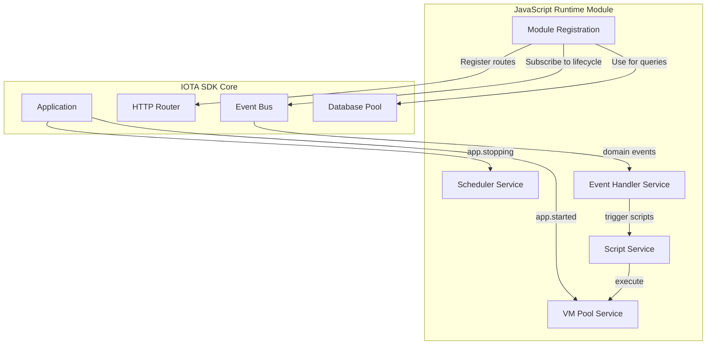

#### Application Lifecycle Integration
**What It Does:**
- Module registers with `application.Application` on startup
- Subscribes to application lifecycle events (`app.started`, `app.stopping`)
- Registers HTTP routes for script management
- Starts background services (scheduler, VM pool)

**How It Works:**
1. Module registration called during application bootstrap
2. Routes registered with application router
3. EventBus subscriptions established for lifecycle events
4. Background goroutines started for scheduler and VM pool
5. On shutdown, graceful drain of pending executions

#### EventBus Integration
**What It Does:**
- Subscribes to wildcard pattern (`*`) to receive all domain events
- Matches incoming events to subscribed scripts by event type
- Triggers script execution with event payload as input
- Handles retry logic and dead letter queue

**How It Works:**
1. Event Handler Service subscribes to all events
2. On event publish, query scripts by event type and tenant
3. Execute each matching script asynchronously
4. Log execution results and handle failures

#### Database Pool Integration
**What It Does:**
- Uses shared PostgreSQL connection pool via `pgxpool.Pool`
- Leverages composables for tenant isolation (`composables.UseTenantID`)
- Participates in transactions via `composables.UseTx`

**How It Works:**
1. Repository receives context with tenant ID
2. Composables extract tenant ID from context
3. All queries include `tenant_id` in WHERE clause
4. Row-level security enforced at database level

## Module Structure (DDD)

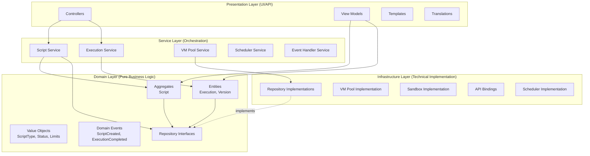

**Directory Structure:**
- `domain/` - Pure business logic, no external dependencies
  - `aggregates/` - Root entities with business rules
  - `entities/` - Domain entities with identity
  - `value_objects/` - Immutable value types
  - `events/` - Domain event definitions
  - `repositories/` - Repository interface contracts

- `services/` - Business logic orchestration
  - `*_service.go` - Service implementations
  - `*_service_test.go` - Service tests

- `infrastructure/` - Technical implementations
  - `persistence/` - Repository implementations
  - `runtime/` - VM pool, sandbox, API bindings
  - `scheduler/` - Cron scheduler implementation

- `presentation/` - UI and API layer
  - `controllers/` - HTTP endpoint handlers
  - `viewmodels/` - Domain to UI transformation
  - `templates/` - Templ-based UI templates
  - `locales/` - Translation files (en, ru, uz)

## Performance Considerations

### VM Pool Optimization

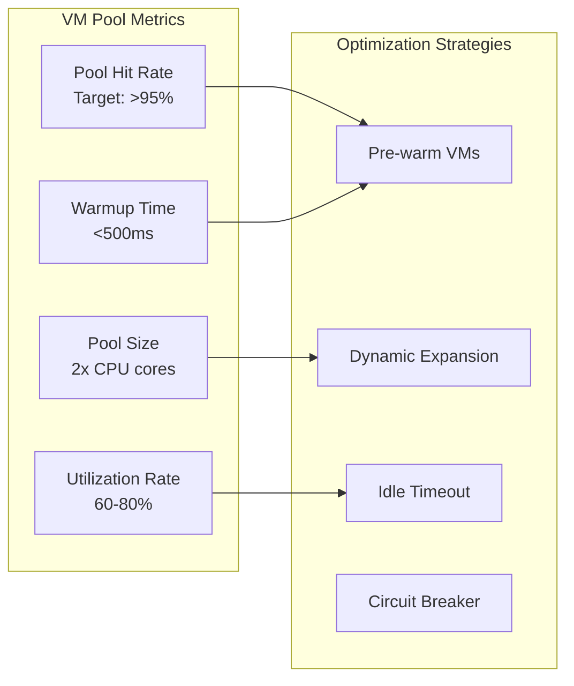

**VM Pool Tuning:**
- Monitor pool hit rate (target: >95%)
- Adjust pool size based on CPU cores (2x cores as starting point)
- Use worker pool pattern for parallel execution
- Implement circuit breaker for overload protection

**Database Query Optimization:**
- Index on `(tenant_id, status)` for active script lookups
- Index on `(tenant_id, type, status)` for type-based filtering
- Partial index on `cron_expression IS NOT NULL` for scheduler
- Composite index on `(tenant_id, http_path, http_methods)` for endpoint lookup
- Use `EXPLAIN ANALYZE` to validate query plans

**Memory Management:**
- Set max heap size per VM (default: 64MB)
- Monitor memory usage via runtime.MemStats
- Implement memory pressure eviction (release idle VMs)
- Use sync.Pool for frequently allocated objects

**Concurrency Control:**
- Use worker pool with bounded goroutines (max: 1000)
- Implement semaphore for concurrent executions per tenant
- Use context.WithTimeout for all script executions
- Graceful shutdown with drain period (30 seconds)

## Security Architecture

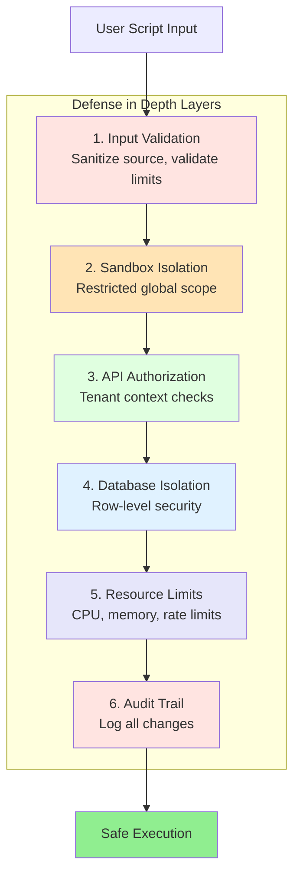

**Defense in Depth:**
1. **Input Validation**: Sanitize script source, validate resource limits
2. **Sandbox Isolation**: Goja VM with restricted global scope
3. **API Authorization**: Check tenant context in all API bindings
4. **Database Isolation**: Row-level security with `tenant_id`
5. **Resource Limits**: CPU timeout, memory limit, rate limiting
6. **Audit Trail**: Log all script changes and executions

**Attack Surface Mitigation:**
- No `eval()` or `Function()` constructor in user scripts
- No access to Go runtime internals
- No file system or network access (except controlled HTTP client)
- No reflection or code generation APIs
- All API bindings go through authorization layer

## Monitoring & Observability

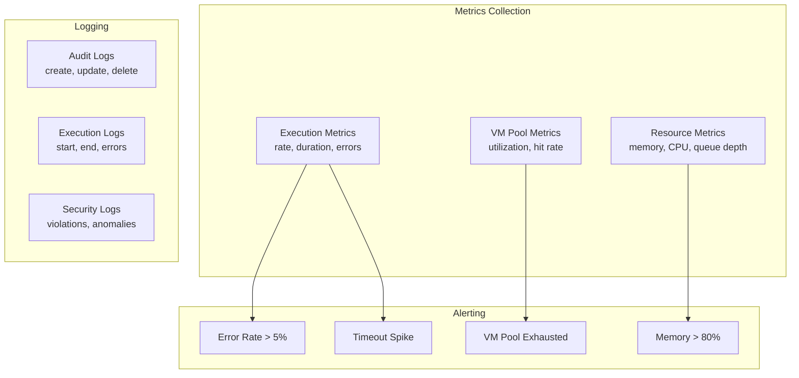

**Metrics to Track:**
- Script executions per second (by tenant, by type)
- VM pool utilization (available, in-use, total)
- Execution duration (p50, p95, p99)
- Error rate (by error type)
- Memory usage per VM
- Queue depth for pending executions

**Logging:**
- Script creation/update/delete with user ID
- Execution start/end with duration
- Errors with stack trace and line number
- Resource limit violations
- API call logs (sanitized for PII)

**Alerting:**
- Error rate > 5% for 5 minutes
- VM pool exhaustion (all VMs in use)
- Execution timeout spike
- Memory usage > 80% of limit
- Database connection pool exhaustion

## Acceptance Criteria

### Architecture Requirements
- ✅ Module follows DDD layer boundaries (domain, service, infrastructure, presentation)
- ✅ Domain layer has zero external dependencies
- ✅ Repository interfaces defined in domain, implemented in infrastructure
- ✅ Multi-tenant isolation enforced at all layers
- ✅ Integration with IOTA SDK via application interface

### Performance Requirements
- ✅ VM pool hit rate > 95% under normal load
- ✅ Cold VM warmup time < 500ms
- ✅ Script execution start latency < 100ms (warm pool)
- ✅ Support 1000+ concurrent executions
- ✅ Database queries use indexed columns for tenant filtering

### Security Requirements
- ✅ Tenant ID enforced in all database queries
- ✅ VM sandbox prevents access to Go runtime
- ✅ Resource limits enforced (timeout, memory, rate)
- ✅ Audit trail for all script modifications
- ✅ No cross-tenant data access possible

### Integration Requirements
- ✅ Graceful startup and shutdown with IOTA SDK lifecycle
- ✅ EventBus integration for event-triggered scripts
- ✅ HTTP router integration for endpoint scripts
- ✅ Database pool integration with composables
- ✅ Monitoring metrics exposed via Prometheus
