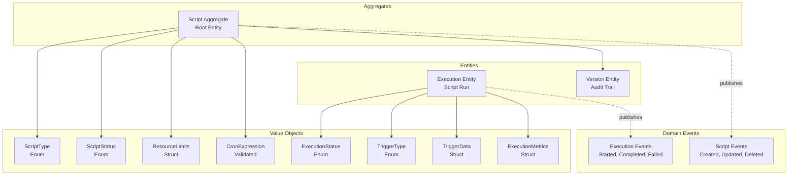
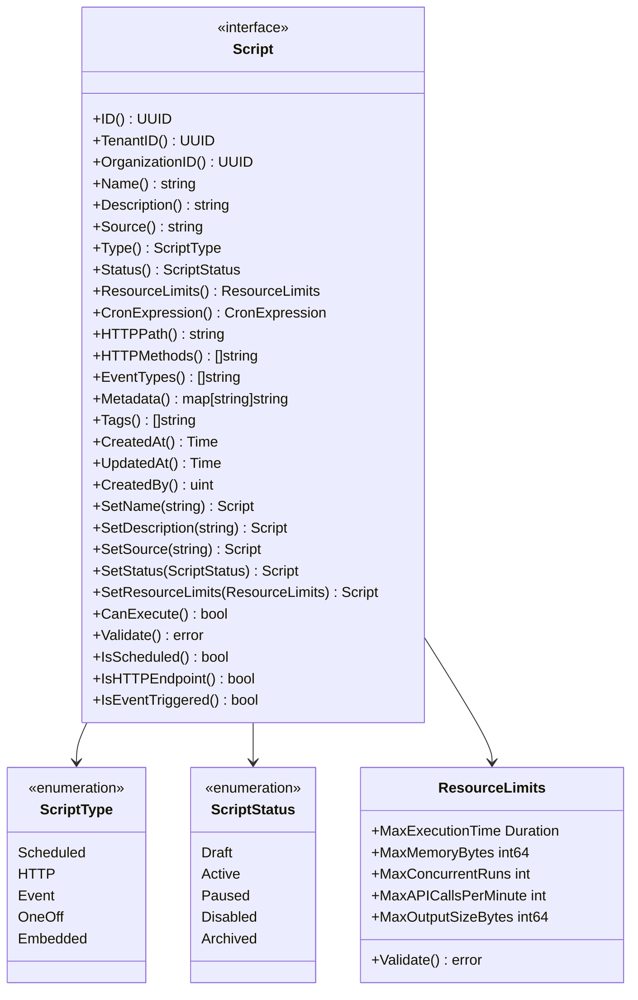
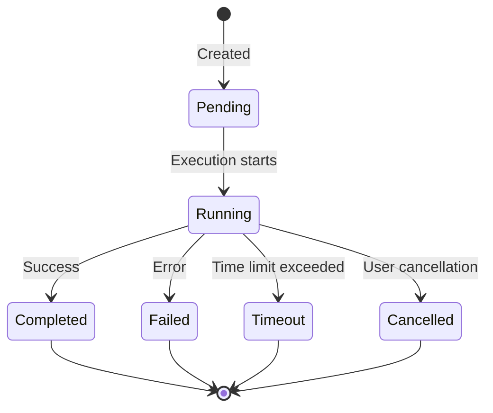
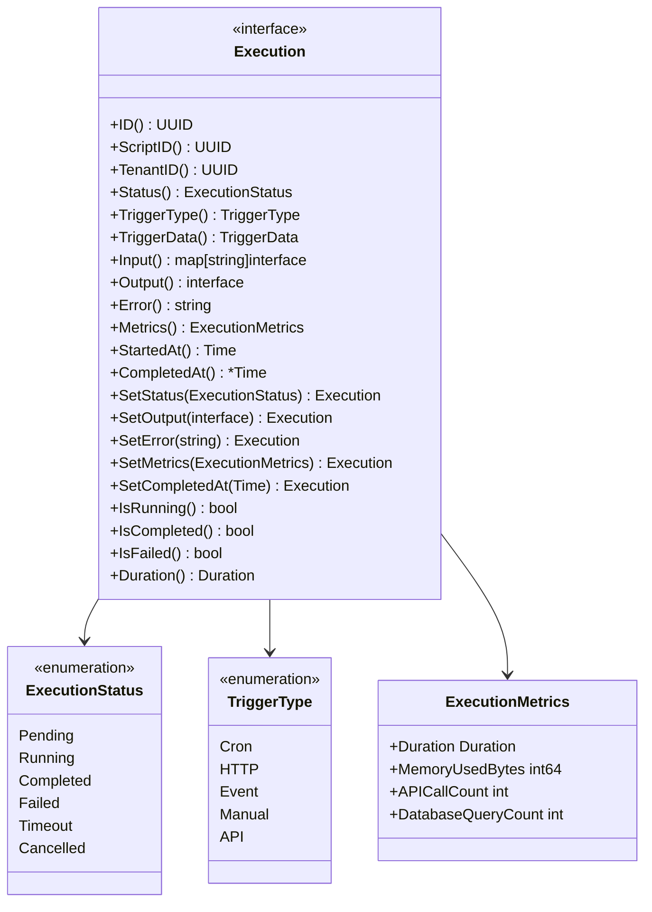
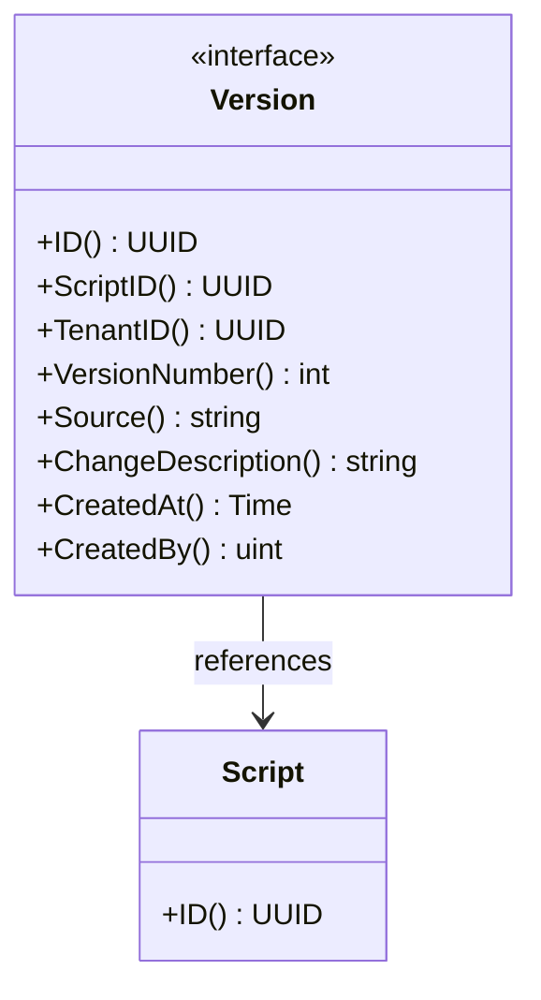
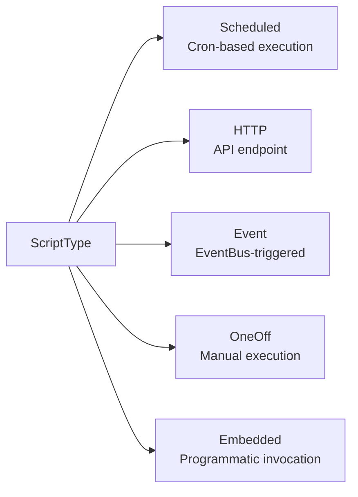
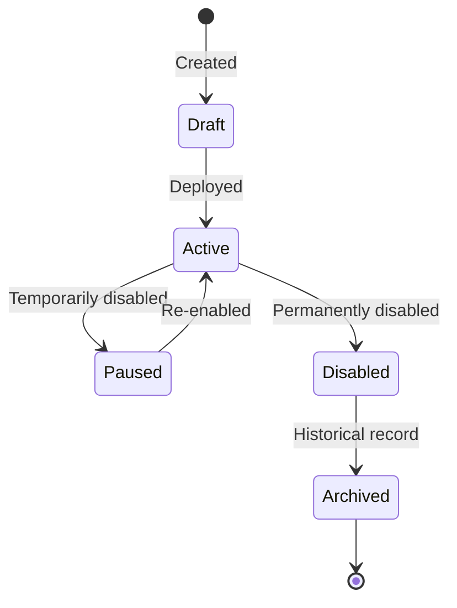
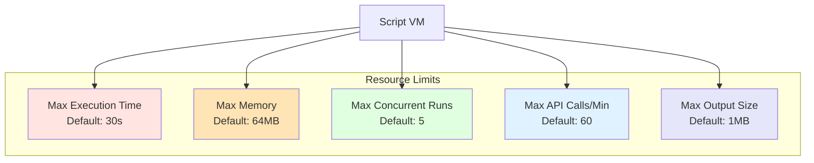
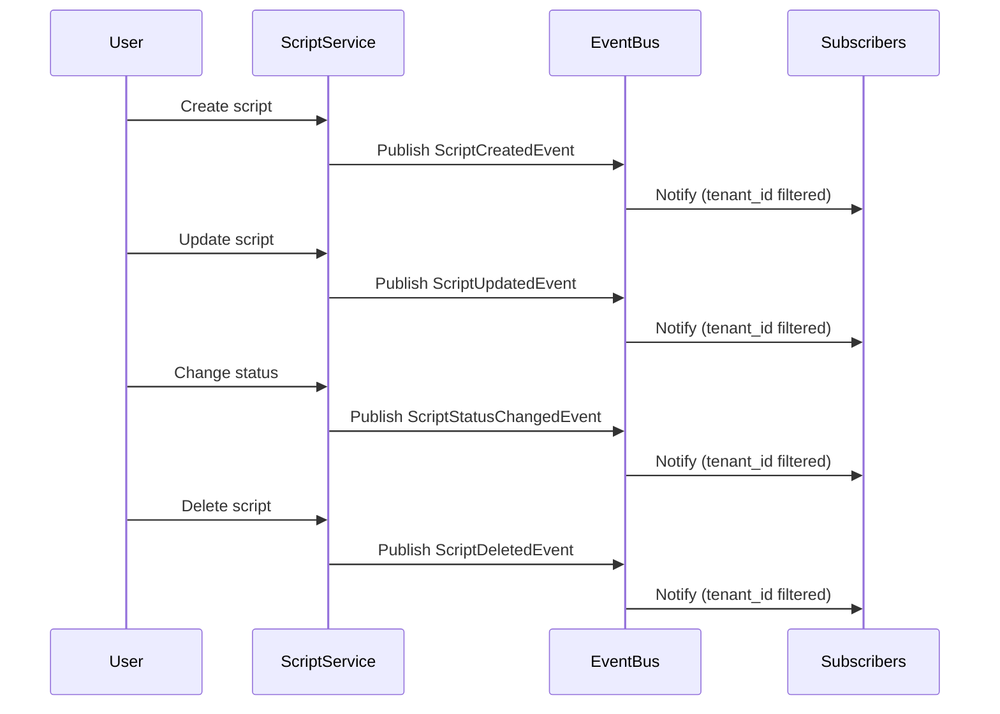
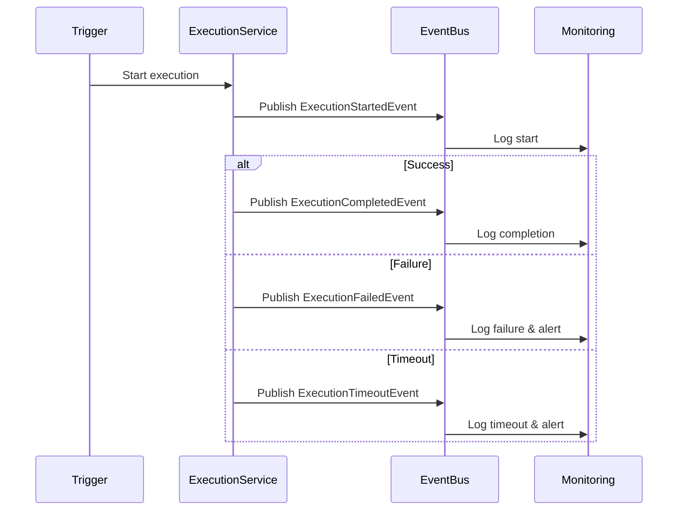

# JavaScript Runtime - Domain Model

## Overview

The JavaScript Runtime domain model follows DDD principles with aggregates as interfaces, entities with immutable setters, value objects for type safety, and domain events for lifecycle tracking.

## Script Aggregate

**What It Is:**
The Script aggregate is the root entity representing a user-defined JavaScript program with metadata, resource limits, and trigger configuration. It serves as the consistency boundary for all script-related operations.

**Core Attributes:**
- **Identity**: ID (UUID), TenantID, OrganizationID
- **Basic Properties**: Name, Description, Source code
- **Classification**: Type (scheduled/HTTP/event/oneoff/embedded), Status (draft/active/paused/disabled/archived)
- **Resource Management**: ResourceLimits (timeout, memory, concurrency, rate limits)
- **Trigger Configuration**: CronExpression (for scheduled), HTTPPath/HTTPMethods (for HTTP endpoints), EventTypes (for event-driven)
- **Metadata**: Key-value pairs for tagging, custom configuration
- **Audit Trail**: CreatedAt, UpdatedAt, CreatedBy

**Business Rules:**
- Name and source code are required (non-empty)
- Tenant ID is required (multi-tenant isolation)
- Type-specific validation enforced:
  - **Scheduled scripts** must have valid cron expression
  - **HTTP endpoint scripts** must have HTTP path defined
  - **Event-triggered scripts** must have at least one event type
- Only scripts with `Active` status can execute
- All setters return new instance (immutability pattern)

**Behavior:**
- `CanExecute()` - Returns true only when status is Active
- `Validate()` - Enforces all business rules before persistence
- `IsScheduled()` / `IsHTTPEndpoint()` / `IsEventTriggered()` - Type checking helpers
- Functional options pattern for flexible construction
- Immutable setters ensure state changes create new instances

## Execution Entity

**What It Is:**
The Execution entity represents a single run of a script with input, output, status, metrics, and timing information. It provides complete traceability for script executions.

**Core Attributes:**
- **Identity**: ID (UUID), ScriptID (reference), TenantID
- **Status Tracking**: ExecutionStatus (pending/running/completed/failed/timeout/cancelled)
- **Trigger Information**: TriggerType, TriggerData (event payload, HTTP request, cron trigger)
- **Input/Output**: Input parameters (map), Output result (any type), Error message (if failed)
- **Performance Metrics**: Duration, memory usage, API call count, database query count
- **Timestamps**: StartedAt, CompletedAt (nullable until finished)

**Business Rules:**
- Execution starts in `Pending` status
- Status transitions must follow valid state machine
- Duration calculated from start to completion (or current time if running)
- CompletedAt is null until execution finishes
- Metrics captured at completion (duration, memory, API calls)

**Behavior:**
- `IsRunning()` - Check if execution is in progress
- `IsCompleted()` - Check if execution finished successfully
- `IsFailed()` - Check if execution ended in failure or timeout
- `Duration()` - Calculate execution duration (completed time - started time, or now - started time if still running)
- Immutable setters for status, output, error, metrics, completion time

## Version Entity

**What It Is:**
The Version entity provides an immutable audit trail of script source code changes. Each time a script is updated, a new version is created with the complete source snapshot.

**Core Attributes:**
- **Identity**: ID (UUID), ScriptID (reference), TenantID
- **Version Tracking**: VersionNumber (auto-increment), Source (complete code snapshot)
- **Change Tracking**: ChangeDescription (human-readable explanation)
- **Audit Fields**: CreatedAt, CreatedBy (user who made the change)

**Business Rules:**
- Version is immutable (no setters, only getters)
- Version number increments sequentially for each script
- Complete source code stored for rollback capability
- Change description optional but recommended for audit clarity

**Behavior:**
- Read-only entity (no state mutations)
- Provides historical record for compliance and debugging
- Enables script rollback to previous versions
- Supports diff operations between versions

## Value Objects

### ScriptType Enum

**What It Defines:**
Classification of scripts by their execution trigger mechanism.

**Values:**
- **Scheduled**: Executed on cron schedule (e.g., daily reports)
- **HTTP**: Executed on HTTP request (e.g., webhooks)
- **Event**: Executed on domain events (e.g., user.created)
- **OneOff**: Manually triggered via UI/API (e.g., data migration)
- **Embedded**: Programmatically invoked from Go code (e.g., custom validation)

**Validation:**
- `IsValid()` method checks if value is one of the defined types

### ScriptStatus Enum

**What It Defines:**
Lifecycle state of a script.

**Values:**
- **Draft**: Being edited, not yet deployable
- **Active**: Running and executable, available for triggers
- **Paused**: Temporarily disabled, can be re-enabled
- **Disabled**: Permanently disabled, manual intervention required to reactivate
- **Archived**: Historical record only, cannot be re-enabled

**Validation:**
- `IsValid()` method checks if value is one of the defined states

### ExecutionStatus Enum

**What It Defines:**
Current state of a script execution.

**Values:**
- **Pending**: Queued for execution, waiting for VM availability
- **Running**: Currently executing in VM
- **Completed**: Successful completion with output
- **Failed**: Error during execution (exception, validation failure)
- **Timeout**: Exceeded maximum execution time
- **Cancelled**: Manually stopped by user

**Validation:**
- `IsValid()` method checks if value is one of the defined states

### TriggerType Enum

**What It Defines:**
Mechanism that initiated a script execution.

**Values:**
- **Cron**: Scheduled execution via cron scheduler
- **HTTP**: HTTP request to registered endpoint
- **Event**: Domain event from EventBus
- **Manual**: User-initiated execution via UI
- **API**: Programmatic invocation from Go code

### ResourceLimits Struct

**What It Defines:**
Constraints on script execution to prevent resource exhaustion and ensure fair usage across tenants.

**Fields:**
- **MaxExecutionTime**: Maximum duration for script execution (timeout enforcement)
- **MaxMemoryBytes**: Maximum memory allocation per execution
- **MaxConcurrentRuns**: Maximum parallel executions of same script
- **MaxAPICallsPerMinute**: Rate limit for API calls (database, HTTP client)
- **MaxOutputSizeBytes**: Maximum size of execution output

**Defaults:**
- Execution time: 30 seconds
- Memory: 64 MB
- Concurrent runs: 5
- API calls: 60 per minute
- Output size: 1 MB

**Validation:**
- All numeric values must be positive
- Enforced at VM execution time
- Customizable per script or tenant

### CronExpression Value Object

**What It Is:**
Validated cron expression for scheduled script execution.

**Behavior:**
- Parses and validates cron syntax using `robfig/cron` library
- Supports standard 5-field cron format (minute, hour, day, month, weekday)
- Calculates next execution time from current time
- Immutable once created

**Validation:**
- Syntax validation on creation
- Invalid expressions rejected with error
- Prevents storage of malformed cron expressions

**Methods:**
- `String()` - Returns original expression
- `Next(time.Time)` - Calculates next execution time after given time

### TriggerData Value Object

**What It Is:**
Context information about what triggered a script execution.

**Fields:**
- **EventType**: Name of domain event (for event-triggered)
- **HTTPMethod**: HTTP method (GET, POST, etc.) for HTTP-triggered
- **HTTPPath**: HTTP path for HTTP-triggered
- **CronTrigger**: Cron expression that triggered execution
- **Payload**: Additional context data (event payload, HTTP request body)

**Usage:**
- Provides full context to script about its trigger
- Available to script via `context.trigger` object
- Enables scripts to handle different trigger types

### ExecutionMetrics Struct

**What It Is:**
Performance and resource usage metrics captured during script execution.

**Fields:**
- **Duration**: Total execution time (start to completion)
- **MemoryUsedBytes**: Peak memory consumption
- **APICallCount**: Number of API calls made (database, HTTP)
- **DatabaseQueryCount**: Number of database queries executed

**Usage:**
- Captured automatically by VM execution engine
- Stored with execution record for analysis
- Used for performance monitoring and optimization
- Enables billing based on resource consumption

## Domain Events

### Script Lifecycle Events

**Event Types:**
- **ScriptCreatedEvent**: `jsruntime.script.created`
  - Payload: ScriptID, TenantID, Name, Type, CreatedBy, CreatedAt
  - Published when new script is created

- **ScriptUpdatedEvent**: `jsruntime.script.updated`
  - Payload: ScriptID, TenantID, UpdatedBy, UpdatedAt, VersionNumber
  - Published when script source or configuration changes

- **ScriptDeletedEvent**: `jsruntime.script.deleted`
  - Payload: ScriptID, TenantID, DeletedBy, DeletedAt
  - Published when script is permanently removed

- **ScriptStatusChangedEvent**: `jsruntime.script.status_changed`
  - Payload: ScriptID, TenantID, OldStatus, NewStatus, ChangedBy, ChangedAt
  - Published when script status transitions (draft → active, active → paused, etc.)

### Execution Lifecycle Events

**Event Types:**
- **ExecutionStartedEvent**: `jsruntime.execution.started`
  - Payload: ExecutionID, ScriptID, TenantID, TriggerType, StartedAt
  - Published when script execution begins

- **ExecutionCompletedEvent**: `jsruntime.execution.completed`
  - Payload: ExecutionID, ScriptID, TenantID, Duration, CompletedAt
  - Published on successful execution

- **ExecutionFailedEvent**: `jsruntime.execution.failed`
  - Payload: ExecutionID, ScriptID, TenantID, Error, FailedAt
  - Published when execution encounters error

- **ExecutionTimeoutEvent**: `jsruntime.execution.timeout`
  - Payload: ExecutionID, ScriptID, TenantID, Duration, TimeoutAt
  - Published when execution exceeds time limit

**All Events Include:**
- Tenant ID for multi-tenant event filtering
- Timestamps for chronological ordering
- Relevant entity IDs for correlation

## Acceptance Criteria

### Script Aggregate
- ✅ Implements all getter methods for attributes
- ✅ All setters return new instance (immutability pattern)
- ✅ `Validate()` enforces business rules (name, source, tenant ID required)
- ✅ Type-specific validation (cron for scheduled, path for HTTP, events for event-triggered)
- ✅ `CanExecute()` returns true only when status is Active
- ✅ Constructor uses functional options pattern
- ✅ Private struct implementation, public interface contract
- ✅ Zero external dependencies in domain layer

### Execution Entity
- ✅ Tracks execution lifecycle (pending → running → completed/failed)
- ✅ Stores input, output, error message, performance metrics
- ✅ Immutable setters for status, output, error, metrics, completion time
- ✅ `Duration()` calculates elapsed time (completed - started, or now - started)
- ✅ Business methods for status checks (IsRunning, IsCompleted, IsFailed)
- ✅ Supports all trigger types (cron, HTTP, event, manual, API)

### Version Entity
- ✅ Immutable audit trail (no setters, only getters)
- ✅ Version number increments on each script change
- ✅ Stores complete source code snapshot for rollback
- ✅ Change description for human-readable audit trail
- ✅ Created by user ID for accountability

### Value Objects
- ✅ ScriptType enum with 5 types (Scheduled, HTTP, Event, OneOff, Embedded)
- ✅ ScriptStatus enum with 5 states (Draft, Active, Paused, Disabled, Archived)
- ✅ ExecutionStatus enum with 6 states (Pending, Running, Completed, Failed, Timeout, Cancelled)
- ✅ TriggerType enum with 5 types (Cron, HTTP, Event, Manual, API)
- ✅ ResourceLimits with sensible defaults (30s timeout, 64MB memory, 5 concurrent, 60 API calls/min, 1MB output)
- ✅ CronExpression validated using `robfig/cron` parser
- ✅ All enums implement `IsValid()` method for validation

### Domain Events
- ✅ Events for script lifecycle (created, updated, deleted, status changed)
- ✅ Events for execution lifecycle (started, completed, failed, timeout)
- ✅ All events include tenant ID for multi-tenant event filtering
- ✅ Event types follow naming convention: `jsruntime.{entity}.{action}`
- ✅ Events published via EventBus for decoupled system integration
