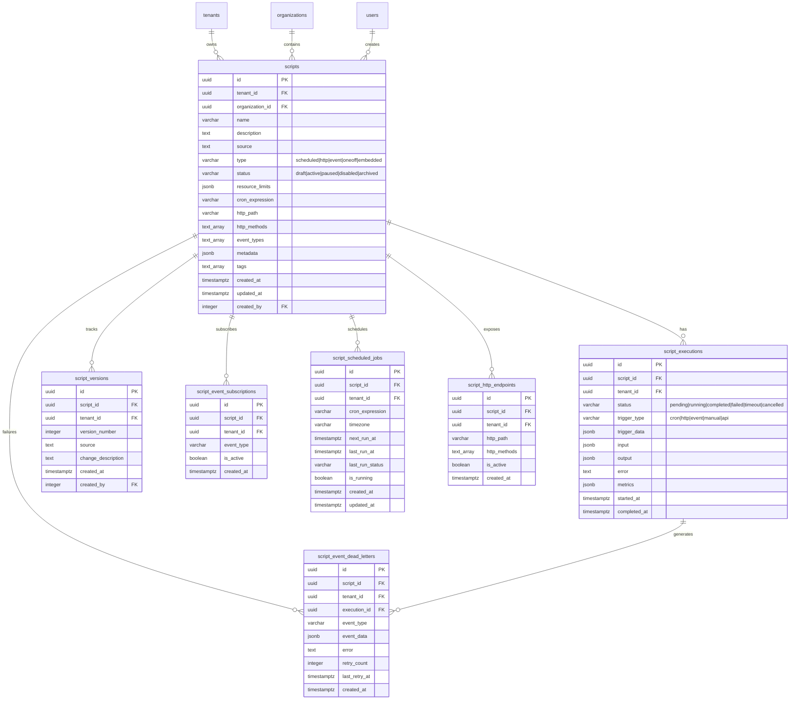
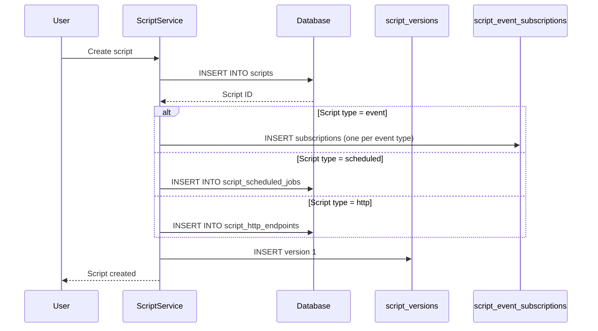
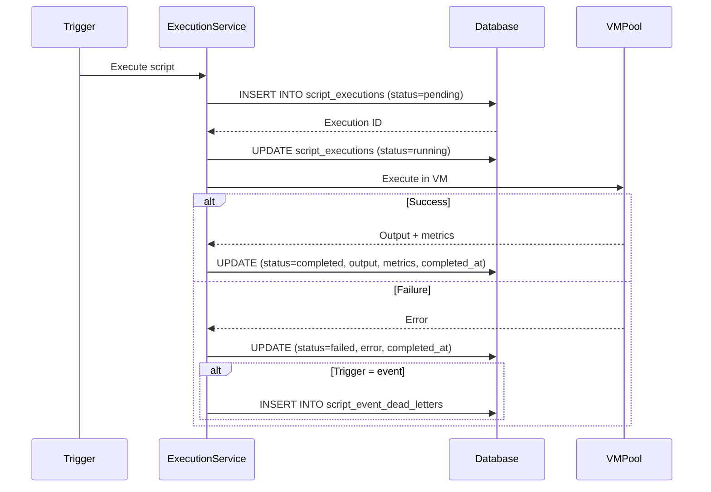
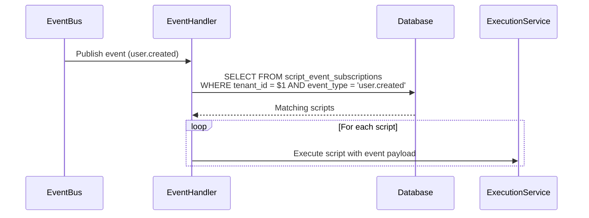
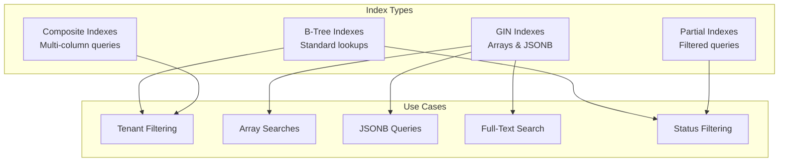
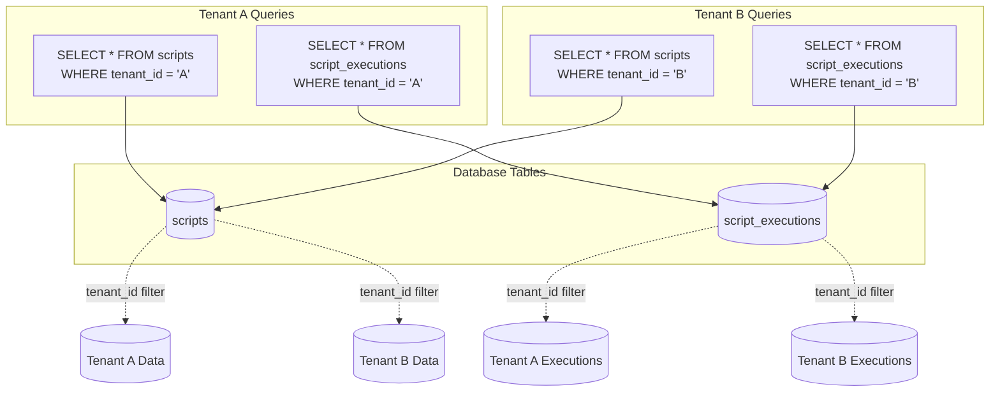
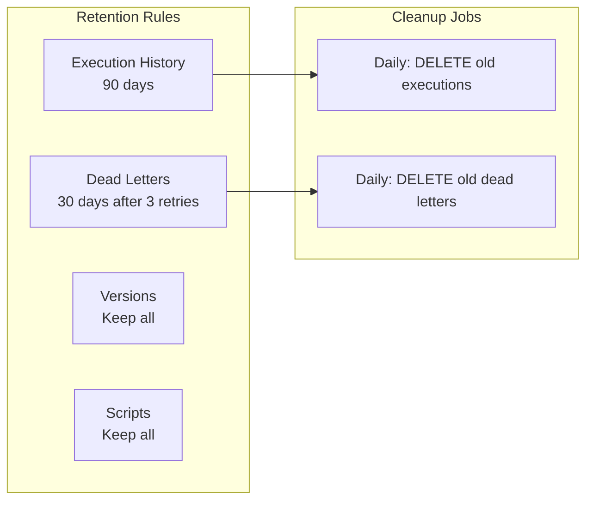

# JavaScript Runtime - Database Schema

## Overview

The JavaScript Runtime database schema uses PostgreSQL with multi-tenant isolation, referential integrity, and performance indexes. All tables include `tenant_id` for tenant isolation and follow IOTA SDK migration patterns using sql-migrate.

## Table Purposes

### 1. scripts (Core Table)

**What It Stores:**
Main table storing script definitions with metadata, resource limits, and trigger configuration.

**Key Fields:**
- **Identity**: id (UUID), tenant_id, organization_id
- **Basic Attributes**: name, description, source (JavaScript code)
- **Classification**: type (scheduled/http/event/oneoff/embedded), status (draft/active/paused/disabled/archived)
- **Resource Limits**: JSONB with max_execution_time_ms, max_memory_bytes, max_concurrent_runs, max_api_calls_per_minute, max_output_size_bytes
- **Trigger Config**: cron_expression, http_path, http_methods (array), event_types (array)
- **Metadata**: JSONB for custom fields, tags (array) for categorization
- **Audit**: created_at, updated_at, created_by

**Business Rules Enforced:**
- Name must be unique per tenant
- HTTP path must be unique per tenant
- Scheduled scripts require cron_expression
- HTTP scripts require http_path
- Event scripts require at least one event type
- Type and status restricted to valid enum values

**Indexes:**
- Primary access: tenant_id + status
- Type filtering: tenant_id + type + status
- HTTP lookup: tenant_id + http_path (partial, where http_path IS NOT NULL)
- Event lookup: event_types (GIN array index)
- Cron lookup: tenant_id + cron_expression (partial)
- Metadata search: metadata (GIN JSONB index)
- Tags filtering: tags (GIN array index)
- Full-text search: name + description (GIN tsvector)

### 2. script_executions (Execution History)

**What It Stores:**
Execution history with input/output, status, metrics, and error tracking.

**Key Fields:**
- **Identity**: id (UUID), script_id (reference), tenant_id
- **Status**: status (pending/running/completed/failed/timeout/cancelled)
- **Trigger Info**: trigger_type, trigger_data (JSONB with event/HTTP/cron context)
- **Input/Output**: input (JSONB), output (JSONB), error (text)
- **Performance**: metrics (JSONB with duration_ms, memory_used_bytes, api_call_count, database_query_count)
- **Timing**: started_at, completed_at (nullable until finished)

**Indexes:**
- Execution lookup: script_id, tenant_id + script_id
- Status filtering: tenant_id + status
- Recent executions: tenant_id + started_at DESC
- Trigger analysis: tenant_id + trigger_type
- Pending queue: tenant_id + status (partial, where status = 'pending')
- Running monitor: tenant_id + status (partial, where status = 'running')

### 3. script_versions (Audit Trail)

**What It Stores:**
Version history for script source code changes (immutable audit trail).

**Key Fields:**
- **Identity**: id (UUID), script_id (reference), tenant_id
- **Versioning**: version_number (incrementing integer), source (complete code snapshot)
- **Change Tracking**: change_description (human-readable notes)
- **Audit**: created_at, created_by

**Business Rules Enforced:**
- Version number must be unique per script
- Versions are immutable (no updates, only inserts)
- Sequential version numbering (1, 2, 3, ...)

**Indexes:**
- Version lookup: script_id
- Recent versions: script_id + created_at DESC
- Tenant filtering: tenant_id

### 4. script_event_subscriptions (Event Routing)

**What It Stores:**
Event-triggered script registrations for fast event-to-script lookup.

**Key Fields:**
- **Identity**: id (UUID), script_id (reference), tenant_id
- **Subscription**: event_type (domain event name), is_active (boolean)
- **Audit**: created_at

**Business Rules Enforced:**
- One subscription per script + event_type pair (unique constraint)
- Event type must match domain event naming convention

**Indexes:**
- Fast event routing: tenant_id + event_type (partial, where is_active = true)
- Script subscriptions: script_id

**Usage:**
Enables O(1) lookup of scripts to execute when domain event is published.

### 5. script_scheduled_jobs (Cron Scheduler State)

**What It Stores:**
Cron job state tracking (next run time, last run, execution status).

**Key Fields:**
- **Identity**: id (UUID), script_id (reference, unique), tenant_id
- **Scheduling**: cron_expression, timezone, next_run_at, last_run_at
- **Status**: last_run_status, is_running (lock to prevent overlapping)
- **Audit**: created_at, updated_at

**Business Rules Enforced:**
- One scheduled job per script (script_id unique)
- is_running prevents overlapping executions

**Indexes:**
- Next run lookup: next_run_at (partial, where is_running = false)
- Script job lookup: script_id
- Tenant filtering: tenant_id

**Usage:**
Scheduler queries by next_run_at to find jobs due for execution.

### 6. script_http_endpoints (HTTP Routing)

**What It Stores:**
HTTP endpoint routing table for fast path-to-script lookup.

**Key Fields:**
- **Identity**: id (UUID), script_id (reference, unique), tenant_id
- **Routing**: http_path (URL path), http_methods (array of GET/POST/PUT/DELETE)
- **Status**: is_active (boolean)
- **Audit**: created_at

**Business Rules Enforced:**
- One endpoint per script (script_id unique)
- HTTP path must be unique per tenant

**Indexes:**
- Fast path routing: tenant_id + http_path (partial, where is_active = true)
- Script endpoint lookup: script_id

**Usage:**
HTTP middleware queries by tenant_id + http_path to route requests to scripts.

### 7. script_event_dead_letters (Failure Tracking)

**What It Stores:**
Failed event-triggered executions for retry or manual review.

**Key Fields:**
- **Identity**: id (UUID), script_id (reference), tenant_id, execution_id (reference)
- **Event Data**: event_type, event_data (JSONB with original payload)
- **Failure Info**: error (text), retry_count (integer), last_retry_at
- **Audit**: created_at

**Business Rules Enforced:**
- Maximum 3 retry attempts (enforced by application logic)

**Indexes:**
- Failure lookup: tenant_id, script_id
- Recent failures: tenant_id + created_at DESC
- Retry queue: retry_count (partial, where retry_count < 3)

**Usage:**
Background worker retries failed executions with exponential backoff.

## Data Flow Patterns

### Script Creation Flow

### Script Execution Flow

### Event Subscription Lookup

## Index Strategy

### Index Types Used

**GIN Indexes** (for array/JSONB columns):
- `event_types` - Fast event type membership lookup
- `metadata` - JSONB key/value search and filtering
- `tags` - Tag-based filtering and search
- Full-text search on name + description (tsvector)

**Partial Indexes** (for filtered queries):
- `http_path IS NOT NULL` - Only HTTP endpoint scripts (reduces index size)
- `status = 'pending'` - Pending executions queue
- `is_running = false` - Available scheduled jobs
- `retry_count < 3` - Retriable dead letters
- `is_active = true` - Active subscriptions/endpoints

**Composite Indexes** (for common query patterns):
- `(tenant_id, status)` - Active scripts by tenant
- `(tenant_id, type, status)` - Scripts by type and status
- `(tenant_id, script_id)` - Execution history per script
- `(tenant_id, http_path)` - HTTP endpoint routing
- `(tenant_id, event_type)` - Event subscription lookup

## Multi-Tenant Isolation

**Isolation Strategy:**
- All tables include `tenant_id` column with NOT NULL constraint
- All queries include `WHERE tenant_id = $1` clause
- UNIQUE constraints scoped to tenant (name, http_path)
- Indexes include `tenant_id` as first column for partition pruning
- Foreign keys enforce referential integrity within tenant

**Benefits:**
- Zero cross-tenant data leaks
- Query performance via index partition pruning
- Business rules enforced per tenant (unique names, paths)
- Audit trail segregated by tenant

## Performance Optimization

### Query Patterns

**Active Script Lookup (Scheduler):**
- Index used: `idx_scripts_tenant_type_status`
- Filters: tenant_id, type='scheduled', status='active'
- Expected rows: 10-100 per tenant

**HTTP Endpoint Routing:**
- Index used: `idx_http_endpoints_path`
- Filters: tenant_id, http_path, is_active=true
- Expected rows: 1 (unique path per tenant)
- Join with scripts for source code retrieval

**Event Subscription Lookup:**
- Index used: `idx_event_subs_tenant_event`
- Filters: tenant_id, event_type, is_active=true
- Expected rows: 0-10 per event type
- Join with scripts for source code retrieval

**Execution History (Paginated):**
- Index used: `idx_executions_tenant_started_at`
- Filters: tenant_id
- Order: started_at DESC
- Limit/Offset for pagination

### Retention Policy

**Execution History Cleanup:**
- Retention: 90 days
- Target: Completed, failed, and timeout executions
- Frequency: Daily cleanup job
- Preserves: Running and pending executions

**Dead Letter Cleanup:**
- Retention: 30 days
- Condition: retry_count >= 3 (max retries reached)
- Frequency: Daily cleanup job
- Preserves: Retriable failures (retry_count < 3)

**Versions & Scripts:**
- Retention: Indefinite (audit trail, rollback capability)
- No automatic cleanup
- Manual archival available via status='archived'

## Migration Strategy

**Migration File Pattern:**
- Filename: `{timestamp}_create_jsruntime_tables.sql`
- Format: sql-migrate with Up/Down sections
- Markers: `-- +migrate Up` and `-- +migrate Down`
- Complex DDL wrapped with `-- +migrate StatementBegin` / `-- +migrate StatementEnd`

**Up Migration Creates:**
1. scripts (core table)
2. script_executions (history)
3. script_versions (audit)
4. script_event_subscriptions (event routing)
5. script_scheduled_jobs (cron state)
6. script_http_endpoints (HTTP routing)
7. script_event_dead_letters (failure tracking)
8. All indexes (performance)

**Down Migration Drops:**
- Tables in reverse dependency order (dead_letters → endpoints → scheduled_jobs → subscriptions → versions → executions → scripts)
- CASCADE drops automatically remove dependent rows
- Indexes dropped automatically with tables

**Testing:**
- Test Up migration: creates all tables and indexes
- Test Down migration: removes all tables cleanly
- Test reversibility: Up → Down → Up cycle succeeds

## Acceptance Criteria

### Schema Design
- ✅ All tables include `tenant_id` with foreign key to tenants
- ✅ CHECK constraints enforce enum values (type, status, trigger_type)
- ✅ UNIQUE constraints prevent duplicate names, paths per tenant
- ✅ Foreign key CASCADE deletes for script-related tables
- ✅ JSONB columns for flexible metadata, limits, metrics
- ✅ TEXT[] arrays for http_methods, event_types, tags

### Indexes
- ✅ Tenant isolation indexes on all tables
- ✅ Composite indexes for common query patterns
- ✅ Partial indexes for filtered queries (active, pending, etc.)
- ✅ GIN indexes for array and JSONB columns
- ✅ Full-text search index for script discovery

### Migrations
- ✅ Up migration creates all tables and indexes
- ✅ Down migration drops tables in reverse dependency order
- ✅ StatementBegin/StatementEnd wrappers for complex DDL
- ✅ Migration filename includes timestamp: `{timestamp}_create_jsruntime_tables.sql`
- ✅ Test reversibility: Up → Down → Up cycle

### Multi-Tenant Isolation
- ✅ All queries include `tenant_id` in WHERE clause
- ✅ UNIQUE constraints scoped to tenant (name, http_path)
- ✅ Indexes leverage `tenant_id` for partition pruning
- ✅ No cross-tenant data access possible

### Data Integrity
- ✅ Foreign key constraints for referential integrity
- ✅ CHECK constraints for business rule validation
- ✅ NOT NULL constraints for required fields
- ✅ DEFAULT values for timestamps, arrays, JSONB

### Performance
- ✅ Indexes support all common query patterns
- ✅ Partial indexes reduce index size and improve performance
- ✅ GIN indexes enable efficient array/JSONB searches
- ✅ Full-text search for script discovery
- ✅ Retention policies prevent unbounded table growth
