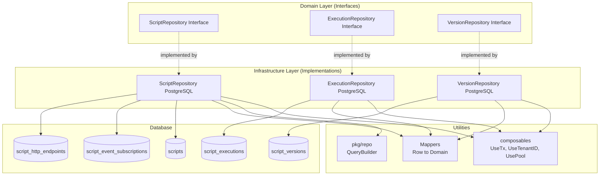
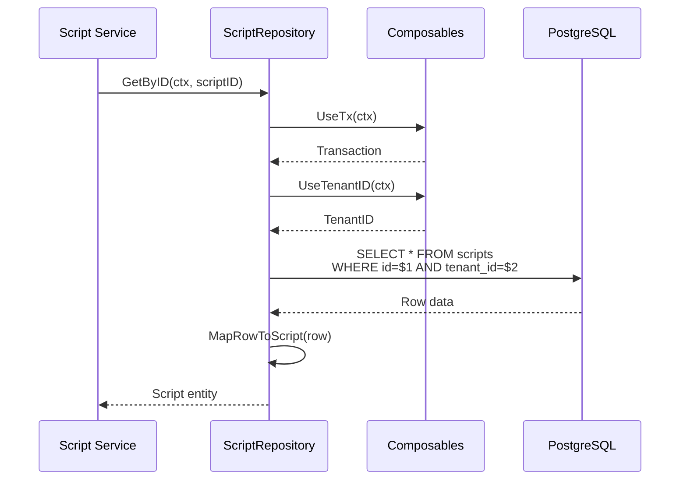
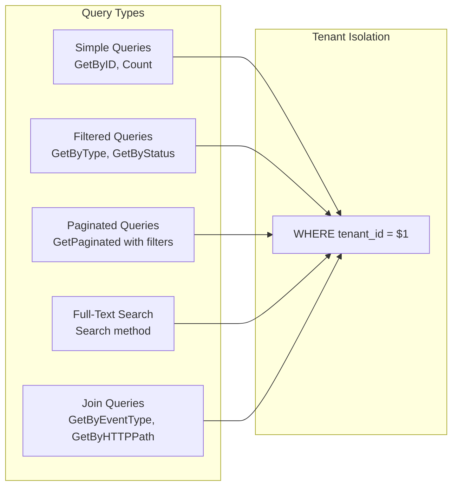
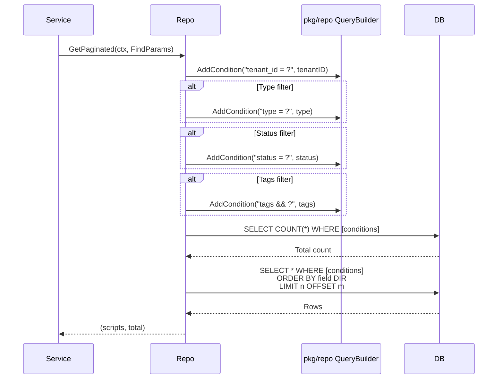
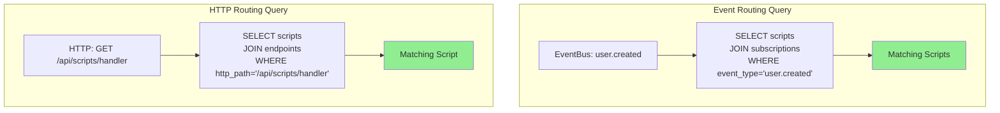
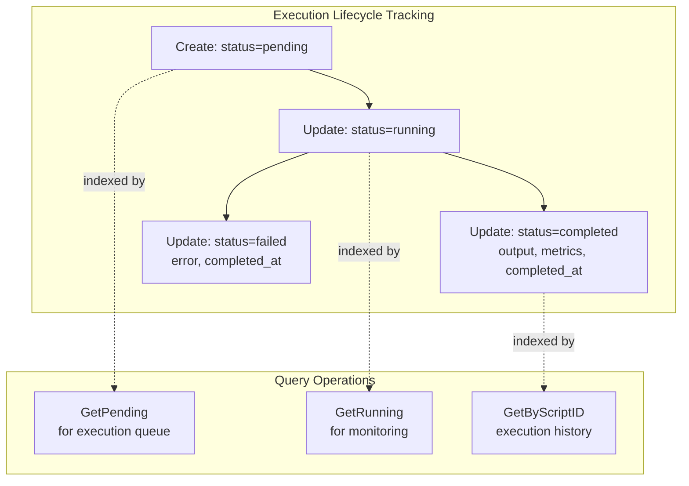
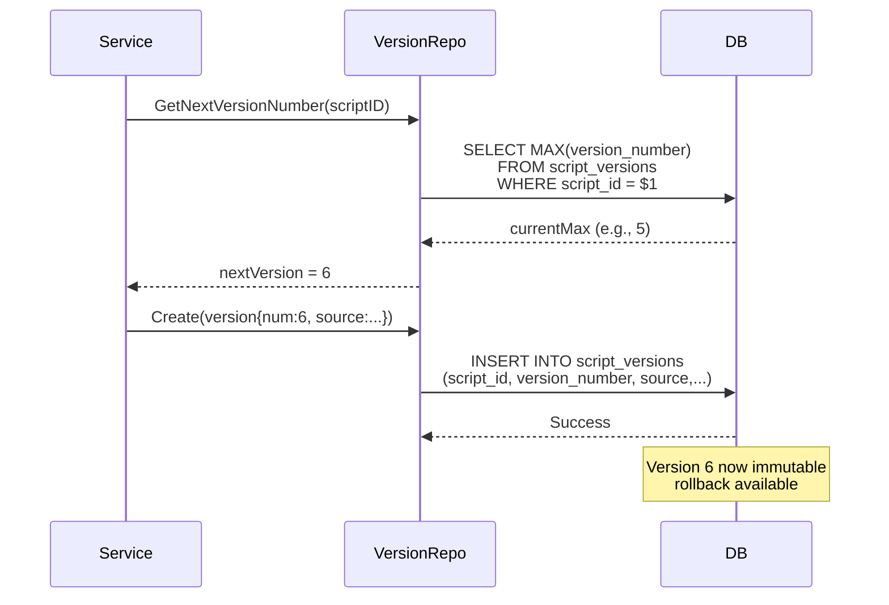
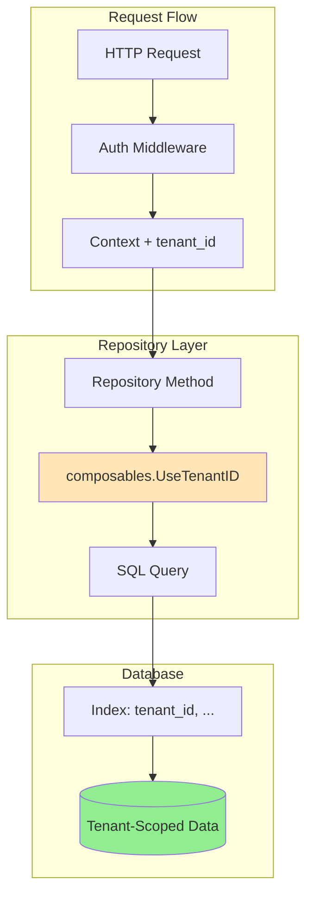
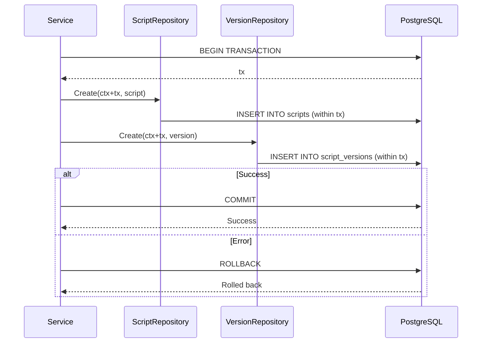

# JavaScript Runtime - Repository Layer

## Overview

The repository layer implements data access for JavaScript Runtime entities following IOTA SDK patterns with multi-tenant isolation, parameterized queries, and the `pkg/repo` dynamic query builder.



## Repository Pattern

**What It Does:**
Repositories provide an abstraction layer between domain logic and data persistence, enabling testability and separation of concerns.

**How It Works:**
- Interfaces defined in domain layer with domain types
- Implementations in infrastructure layer with database logic
- Composables inject tenant context, transactions, and connection pool
- Mappers convert between database rows and domain entities
- Query builder constructs dynamic queries safely



## ScriptRepository

**What It Provides:**
Complete CRUD operations for scripts with type-specific queries, full-text search, and pagination.

**Key Operations:**
- **Retrieval**: Count, GetAll, GetByID, GetByName, GetPaginated
- **Type-Specific**: GetByType, GetByEventType, GetByHTTPPath, GetScheduled
- **Mutation**: Create, Update, Delete
- **Validation**: Exists, NameExists, HTTPPathExists
- **Search**: Full-text search on name and description



### Pagination and Filtering

**What It Does:**
GetPaginated supports dynamic filtering, sorting, and pagination using the `pkg/repo` query builder.

**Filters Available:**
- Type (scheduled, HTTP, event, oneoff, embedded)
- Status (draft, active, paused, disabled, archived)
- Tags (array intersection)

**How It Works:**
1. Build WHERE conditions dynamically based on provided filters
2. Execute COUNT query to get total results
3. Execute SELECT query with LIMIT/OFFSET for pagination
4. Sort by configurable field and direction (ASC/DESC)
5. All queries scoped to tenant automatically



### Event and HTTP Routing Queries

**What It Does:**
Specialized queries for event subscription and HTTP endpoint routing with joins to supporting tables.

**GetByEventType:**
- Joins scripts with script_event_subscriptions
- Filters by tenant_id, event_type, is_active=true, status=active
- Returns all scripts subscribed to the event type

**GetByHTTPPath:**
- Joins scripts with script_http_endpoints
- Filters by tenant_id, http_path, is_active=true, status=active
- Returns the script mapped to the HTTP path



## ExecutionRepository

**What It Provides:**
CRUD operations for script executions with status-based filtering and retention cleanup.

**Key Operations:**
- **Retrieval**: Count, GetAll, GetByID, GetByScriptID, GetPaginated
- **Status Queries**: GetPending, GetRunning, GetByStatus
- **Mutation**: Create, Update, Delete
- **Cleanup**: DeleteOlderThan (retention policy)

**Pagination Filters:**
- Script ID (executions for specific script)
- Status (pending, running, completed, failed, timeout, cancelled)
- Trigger type (cron, HTTP, event, manual, API)
- Date range (started from/to timestamps)



## VersionRepository

**What It Provides:**
Immutable audit trail for script source code changes with versioning.

**Key Operations:**
- **Retrieval**: GetByScriptID, GetByScriptIDAndVersion, GetLatestVersion
- **Creation**: Create (insert only, no updates)
- **Utility**: GetNextVersionNumber (auto-increment)

**How It Works:**
1. When script is created, version 1 is inserted
2. When script is updated, new version is inserted with incremented number
3. Version records are never updated or deleted (immutable)
4. GetLatestVersion retrieves most recent version for rollback
5. Version numbers are sequential per script (1, 2, 3, ...)



## Tenant Isolation Pattern

**What It Does:**
Ensures all queries are automatically scoped to the current tenant, preventing cross-tenant data access.

**How It Works:**
1. Context carries tenant ID via middleware
2. Repository extracts tenant ID using `composables.UseTenantID(ctx)`
3. All queries include `WHERE tenant_id = $tenantID` clause
4. Indexes leverage tenant_id for efficient partition pruning



**Benefits:**
- **Security**: Impossible to access other tenant's data
- **Performance**: Indexes on tenant_id enable fast lookups
- **Simplicity**: No manual tenant filtering in service layer
- **Consistency**: Pattern enforced across all repositories

## Mapper Pattern

**What It Does:**
Converts database rows (with nullable fields and JSONB) to domain entities.

**How It Works:**
1. Scan database row into struct with sql.Null types
2. Parse JSONB columns (resource_limits, metadata)
3. Parse arrays (http_methods, event_types, tags)
4. Handle nullable fields (cron_expression, http_path, organization_id)
5. Build domain entity using functional options pattern
6. Return immutable domain entity

```mermaid
graph LR
    subgraph "Database Row"
        DBRow[ScriptRow<br/>- ID: uuid<br/>- ResourceLimits: JSONB<br/>- HTTPPath: sql.NullString<br/>- Metadata: JSONB<br/>- Tags: TEXT[]]
    end

    subgraph "Mapper"
        Parse[Parse JSONB/Arrays]
        HandleNulls[Handle Nullable Fields]
        BuildOptions[Build Functional Options]
    end

    subgraph "Domain Entity"
        DomainScript[Script Interface<br/>- Immutable<br/>- Business Methods<br/>- Validation]
    end

    DBRow --> Parse
    Parse --> HandleNulls
    HandleNulls --> BuildOptions
    BuildOptions --> DomainScript

    style Parse fill:#FFE4E1
    style HandleNulls fill:#E0FFE0
    style BuildOptions fill:#E0F2FF
```

**Key Responsibilities:**
- **Type Conversion**: Database types → Domain types
- **Null Handling**: sql.NullString → optional fields
- **JSONB Parsing**: []byte → structs/maps
- **Array Parsing**: []string → domain arrays
- **Validation**: Domain entity validates on construction

## Transaction Support

**What It Does:**
Repositories participate in transactions managed by the service layer.

**How It Works:**
1. Service layer begins transaction
2. Transaction stored in context
3. Repository extracts transaction via `composables.UseTx(ctx)`
4. All queries executed within transaction
5. Service commits or rolls back transaction



**Benefits:**
- **Atomicity**: Multiple repository calls in single transaction
- **Consistency**: Related records created/updated together
- **Rollback**: Automatic rollback on errors
- **Flexibility**: Service layer controls transaction boundaries

## Acceptance Criteria

### Repository Interfaces
- ✅ All interfaces defined in domain layer (`modules/jsruntime/domain/repositories/`)
- ✅ Use domain types only (no database types in interface)
- ✅ Field enums for sortable/filterable columns
- ✅ FindParams struct for pagination and filtering
- ✅ SortBy options (ASC, DESC)

### ScriptRepository
- ✅ Implements all CRUD operations (Count, GetAll, GetByID, GetByName, Create, Update, Delete)
- ✅ GetPaginated with filtering (type, status, tags)
- ✅ Type-specific queries (GetByType, GetByEventType, GetByHTTPPath, GetScheduled)
- ✅ Existence checks (Exists, NameExists, HTTPPathExists)
- ✅ Full-text search (Search method)
- ✅ All queries include `tenant_id` for isolation
- ✅ Uses `composables.UseTx()` and `composables.UsePool()`
- ✅ Uses `composables.UseTenantID()` for automatic tenant scoping

### ExecutionRepository
- ✅ CRUD operations for executions
- ✅ Status-based retrieval (GetPending, GetRunning, GetByStatus)
- ✅ Pagination with filters (script ID, status, trigger type, date range)
- ✅ Cleanup method (DeleteOlderThan) for retention policy

### VersionRepository
- ✅ Retrieval by script ID and version number
- ✅ GetLatestVersion for current version
- ✅ GetNextVersionNumber for auto-increment
- ✅ Create only (no update/delete for immutable audit trail)

### Mappers
- ✅ MapRowToScript converts DB row to domain entity
- ✅ Handles nullable fields (sql.NullString, sql.NullInt64)
- ✅ Parses JSONB columns (resource_limits, metadata)
- ✅ Parses arrays (http_methods, event_types, tags)
- ✅ Uses functional options pattern for entity construction

### Error Handling
- ✅ All methods define `serrors.Op` for operation tracking
- ✅ Errors wrapped with `serrors.E(op, err)`
- ✅ ErrScriptNotFound returned when query returns no rows
- ✅ Proper error propagation through layers

### Performance
- ✅ Parameterized queries ($1, $2) - no SQL concatenation
- ✅ SQL as constants (no string building in methods)
- ✅ Uses `pkg/repo.QueryBuilder` for dynamic filters
- ✅ Leverages indexes from schema (tenant_id, type, status, paths)
- ✅ EXPLAIN ANALYZE run on complex queries during development

### Multi-Tenant Isolation
- ✅ All queries scoped to tenant via composables
- ✅ UNIQUE constraints prevent duplicate names/paths per tenant
- ✅ Indexes include tenant_id for partition pruning
- ✅ Zero cross-tenant data access possible

### Transaction Support
- ✅ Repositories participate in service-layer transactions
- ✅ Transaction extracted via composables.UseTx(ctx)
- ✅ Multiple repository calls can share transaction
- ✅ Rollback on any error in transaction
