# JavaScript Runtime - Service Layer

## Overview

The service layer orchestrates business logic, coordinates between repositories, manages VM execution, and enforces permissions and validation rules.

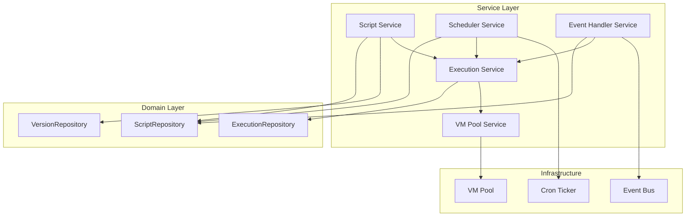

## Script Service

**What It Does:**
Manages script lifecycle (CRUD), versioning, validation, and permissions enforcement.

**Responsibilities:**
- Create/update/delete scripts with business validation
- Automatic version creation on updates
- Permission checks via RBAC
- Name and HTTP path uniqueness validation
- Type-specific validation (cron, HTTP, event requirements)

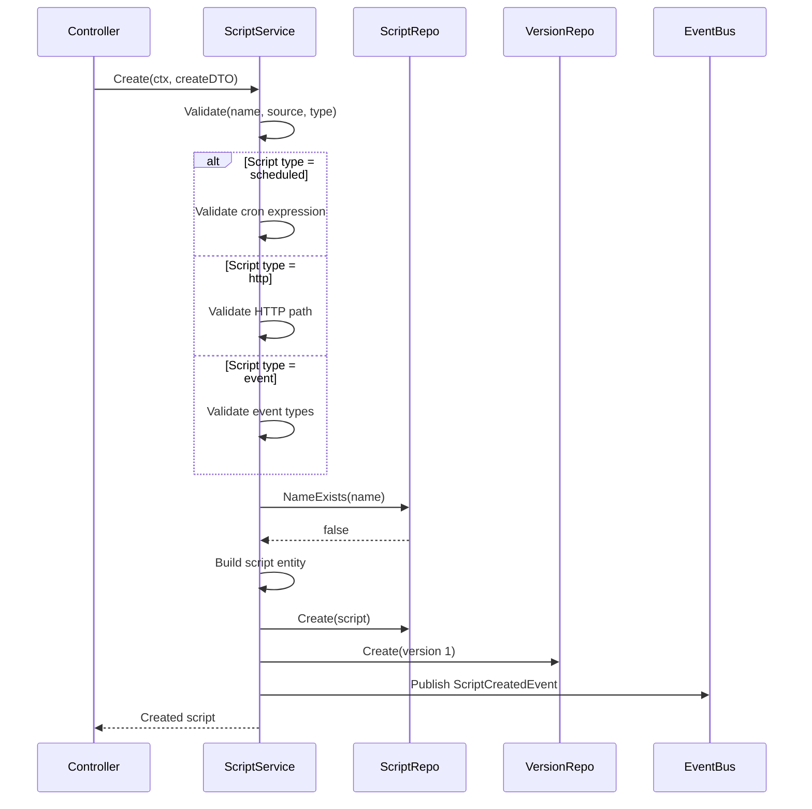

### Update Flow with Versioning

**What It Does:**
Updates script and creates immutable version snapshot automatically.

**How It Works:**
1. Retrieve existing script by ID
2. Validate update permissions
3. Apply updates to script entity
4. Validate updated script
5. Get next version number
6. Create new version record
7. Update script in database
8. Publish ScriptUpdatedEvent

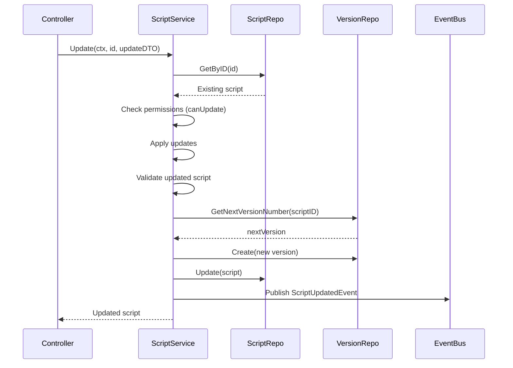

## Execution Service

**What It Does:**
Orchestrates script execution, manages execution lifecycle, tracks metrics, and handles errors.

**Responsibilities:**
- Create execution records
- Acquire VM from pool
- Execute script with timeout
- Capture output and metrics
- Handle errors and retries (event-triggered only)
- Update execution status

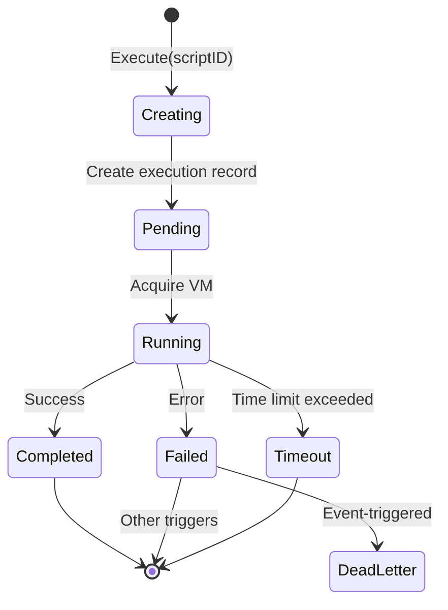

### Execution Flow

**How It Works:**
1. Validate script exists and is active
2. Create execution record (status: pending)
3. Acquire VM from pool
4. Update status to running
5. Execute script in VM with timeout
6. Capture output and metrics
7. Update status to completed/failed
8. Release VM back to pool
9. Publish ExecutionCompletedEvent/ExecutionFailedEvent

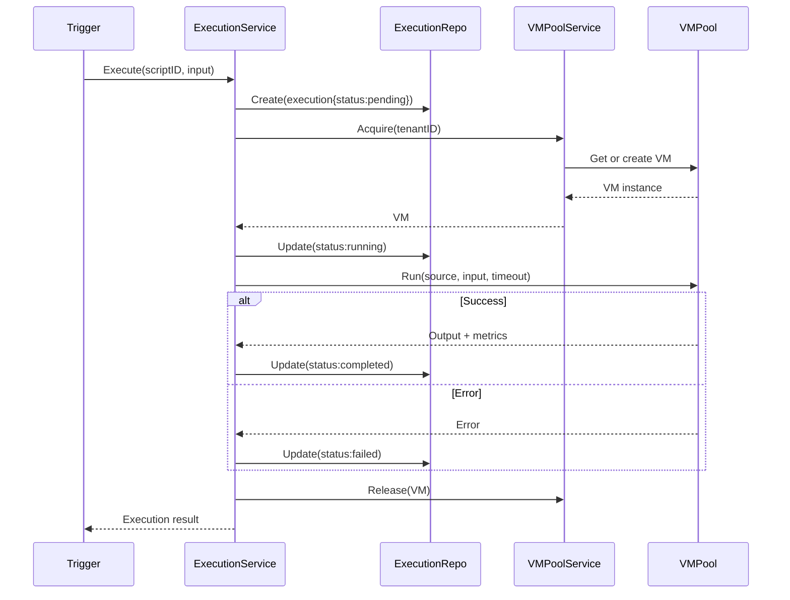

## VM Pool Service

**What It Does:**
Manages VM lifecycle, pool size, warm-up, acquisition, and resource limits.

**Responsibilities:**
- Initialize VM pool on startup
- Warm up VMs with standard library
- Acquire VM for tenant (create if needed)
- Release VM back to pool
- Enforce per-tenant VM limits
- Cleanup idle VMs
- Monitor pool metrics

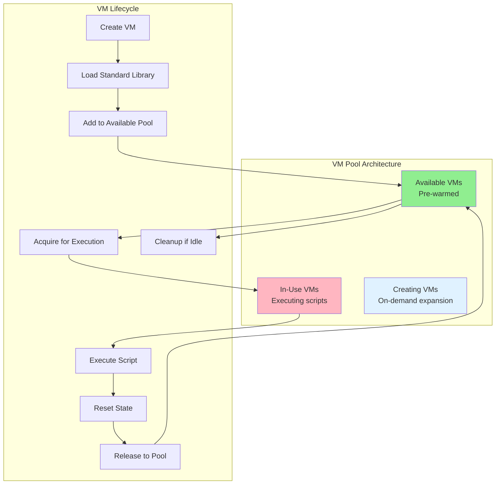

### Pool Management Strategy

**What It Does:**
Balances VM availability with resource usage through dynamic pool sizing.

**Strategy:**
- **Initial Pool Size**: 10 VMs (configurable)
- **Expansion**: Create new VM if pool empty (up to max: 100)
- **Per-Tenant Limit**: Max 5 concurrent VMs per tenant
- **Idle Timeout**: 5 minutes of inactivity → VM destroyed
- **Warm-up**: Pre-load standard library and common APIs
- **Fair Scheduling**: Round-robin across tenants

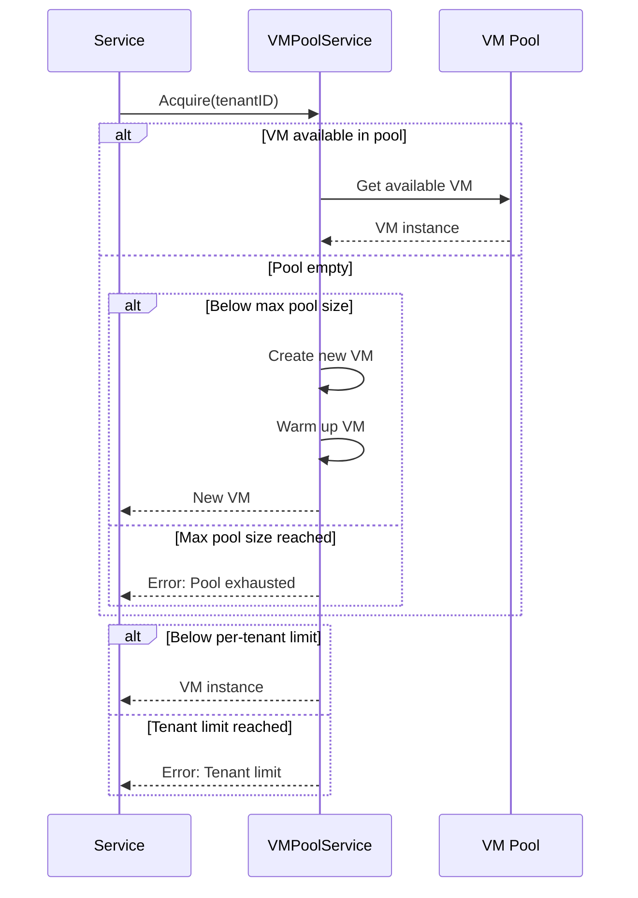

## Scheduler Service

**What It Does:**
Manages cron-based script execution with next run calculation and overlap prevention.

**Responsibilities:**
- Find scripts due to run every minute
- Calculate next run time from cron expression
- Prevent overlapping executions via lock
- Trigger script execution
- Update next run time and last run status

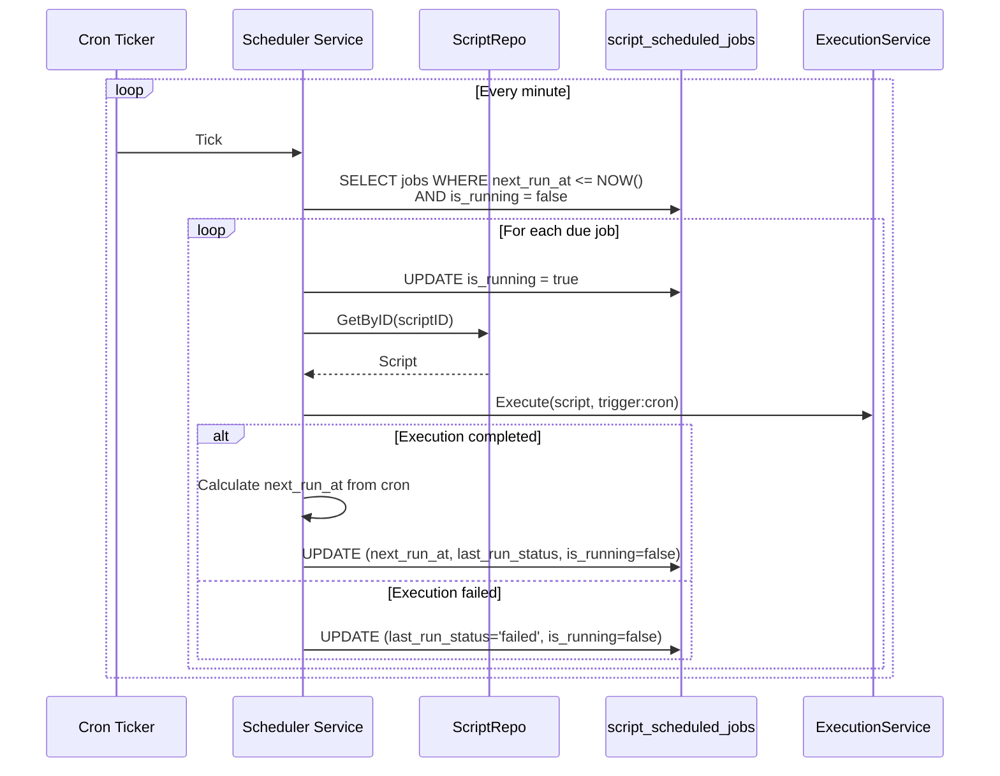

### Cron Expression Calculation

**What It Does:**
Calculates next execution time based on cron expression and timezone.

**Supported Patterns:**
- Standard 5-field cron (minute, hour, day, month, weekday)
- Timezone support (default: UTC)
- Handles daylight saving time transitions

**Examples:**
- `0 0 * * *` - Daily at midnight
- `*/15 * * * *` - Every 15 minutes
- `0 9 * * 1-5` - Weekdays at 9 AM
- `0 0 1 * *` - First day of month

## Event Handler Service

**What It Does:**
Subscribes to domain events and triggers matching scripts with retry logic and dead letter queue.

**Responsibilities:**
- Subscribe to all domain events via EventBus
- Find scripts subscribed to event type
- Trigger script execution with event payload
- Retry failed executions with exponential backoff
- Move persistent failures to dead letter queue

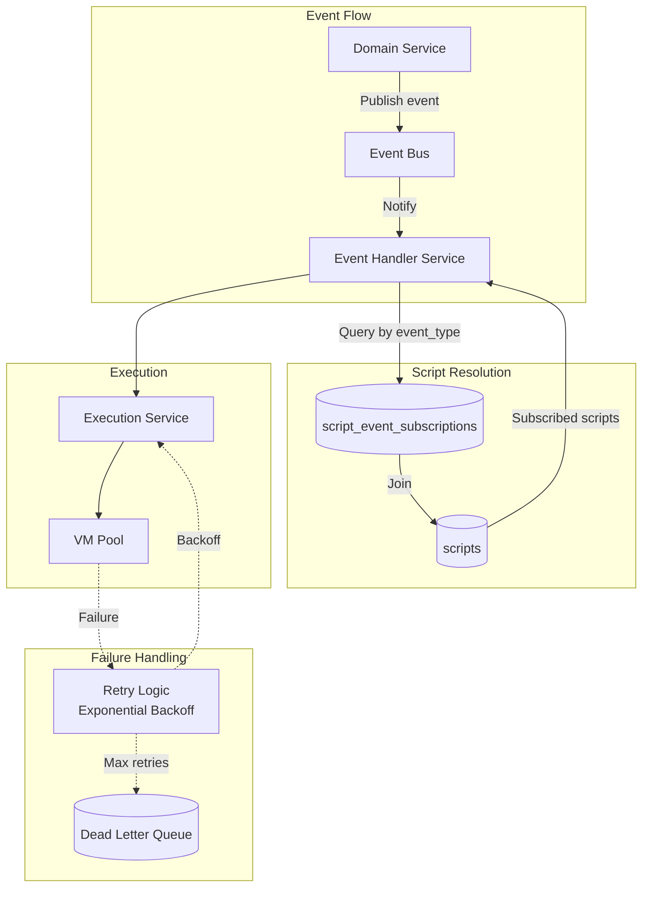

### Retry Strategy

**What It Does:**
Automatically retries failed event-triggered executions with exponential backoff.

**Strategy:**
- **Max Retries**: 3 attempts
- **Backoff**: 1s, 2s, 4s (exponential)
- **Dead Letter**: After 3 failures, move to DLQ
- **Manual Review**: DLQ entries require manual intervention

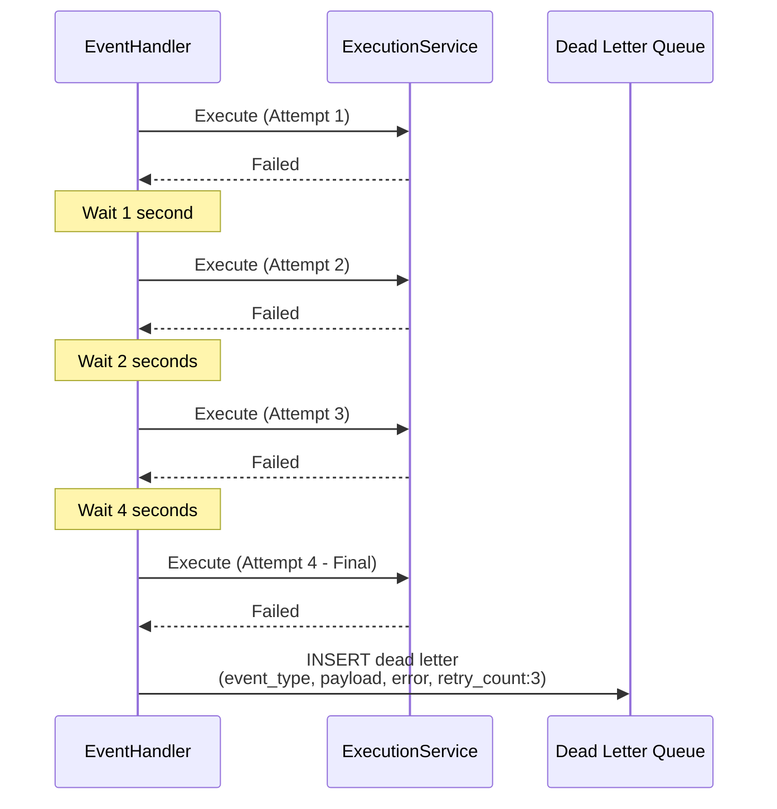

## Business Rules and Validation

**Script Creation:**
- Name required (non-empty)
- Source code required (non-empty)
- Name must be unique per tenant
- Type-specific validation:
  - Scheduled: Valid cron expression required
  - HTTP: HTTP path required and unique per tenant
  - Event: At least one event type required

**Script Update:**
- User has permission to update script
- Name uniqueness maintained (if changed)
- HTTP path uniqueness maintained (if changed)
- Version created automatically

**Script Execution:**
- Script must exist and be active
- User has permission to execute script (for manual triggers)
- Resource limits enforced (timeout, memory, concurrency)

**Permission Checks:**
- `canCreateScript` - Create new scripts
- `canUpdateScript` - Modify existing scripts
- `canDeleteScript` - Remove scripts
- `canExecuteScript` - Manually trigger scripts
- `canViewExecutions` - View execution history

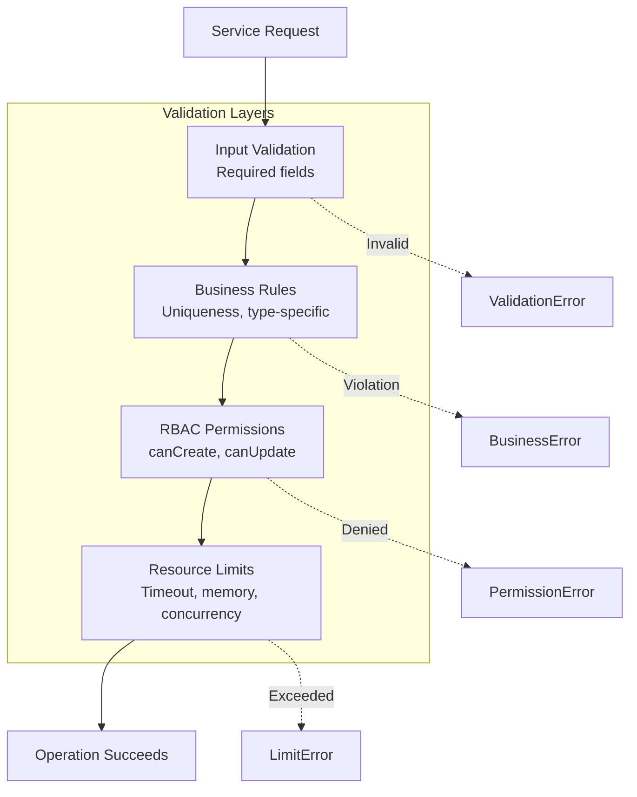

## Error Handling

**What It Does:**
Consistent error handling across all service methods using `serrors` package.

**Pattern:**
- Define operation constant: `const op serrors.Op = "ServiceName.MethodName"`
- Wrap all errors: `return serrors.E(op, err)`
- Use error kinds: `serrors.KindValidation`, `serrors.KindNotFound`, `serrors.KindPermission`
- Provide context: `serrors.E(op, serrors.KindValidation, "name is required")`

**Error Propagation:**
- Repository errors wrapped with operation context
- Validation errors include field name and reason
- Permission errors include required permission
- Business rule errors include constraint violated

## Acceptance Criteria

### Script Service
- ✅ CRUD operations with validation and permissions
- ✅ Automatic versioning on create and update
- ✅ Name uniqueness validation per tenant
- ✅ HTTP path uniqueness validation per tenant
- ✅ Type-specific validation (cron, HTTP, event)
- ✅ Permission checks via RBAC (canCreate, canUpdate, canDelete)
- ✅ Event publishing (ScriptCreated, ScriptUpdated, ScriptDeleted)

### Execution Service
- ✅ Execute method coordinates full execution lifecycle
- ✅ Status transitions (pending → running → completed/failed)
- ✅ VM acquisition and release
- ✅ Timeout enforcement via context
- ✅ Metrics capture (duration, memory, API calls)
- ✅ Error handling and logging
- ✅ Event publishing (ExecutionStarted, ExecutionCompleted, ExecutionFailed)

### VM Pool Service
- ✅ Initialize pool with configurable size
- ✅ Warm up VMs with standard library
- ✅ Acquire VM with per-tenant limits
- ✅ Release VM and reset state
- ✅ Cleanup idle VMs after timeout
- ✅ Metrics tracking (available, in-use, total)
- ✅ Graceful shutdown with drain period

### Scheduler Service
- ✅ Find jobs due to run every minute
- ✅ Calculate next run from cron expression
- ✅ Prevent overlapping executions via is_running lock
- ✅ Trigger script execution via Execution Service
- ✅ Update next run time and last run status
- ✅ Handle timezone conversions

### Event Handler Service
- ✅ Subscribe to all domain events via EventBus
- ✅ Find scripts by event type (via repository)
- ✅ Trigger execution with event payload
- ✅ Retry failed executions with exponential backoff
- ✅ Move to dead letter queue after max retries
- ✅ Log all event-triggered executions

### Business Rules
- ✅ Script validation enforced before persistence
- ✅ Permission checks via sdkcomposables.CanUser()
- ✅ Resource limits validated
- ✅ Type-specific requirements validated
- ✅ Uniqueness constraints enforced

### Error Handling
- ✅ All methods use serrors.Op for operation tracking
- ✅ Errors wrapped with serrors.E(op, err)
- ✅ Error kinds used (Validation, NotFound, Permission)
- ✅ Contextual error messages with details
- ✅ Proper error propagation through layers

### Integration
- ✅ Services use repository interfaces (not implementations)
- ✅ DI via constructor injection
- ✅ Transaction management for multi-step operations
- ✅ EventBus integration for domain events
- ✅ Composables for tenant context extraction
