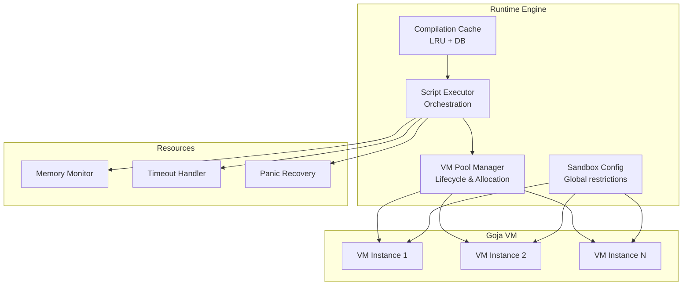
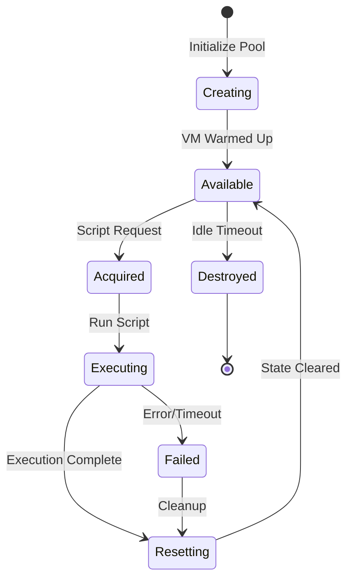
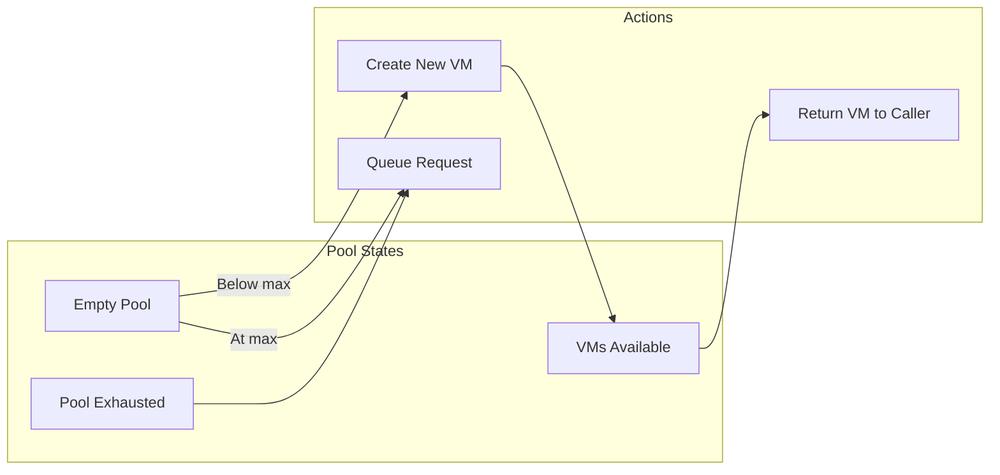
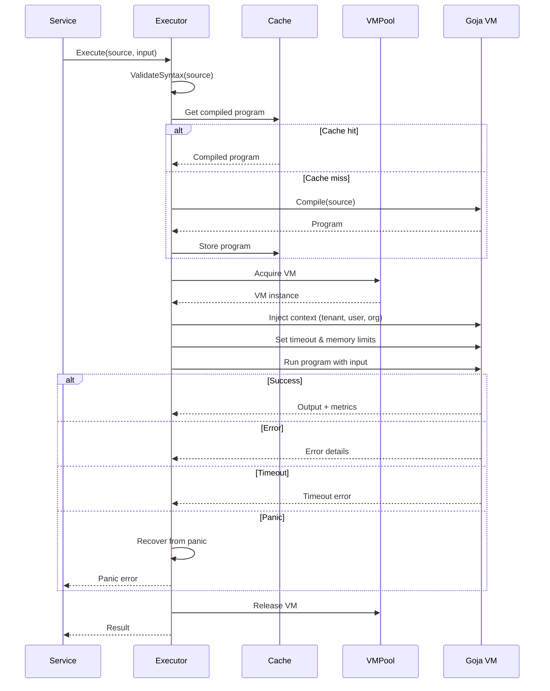
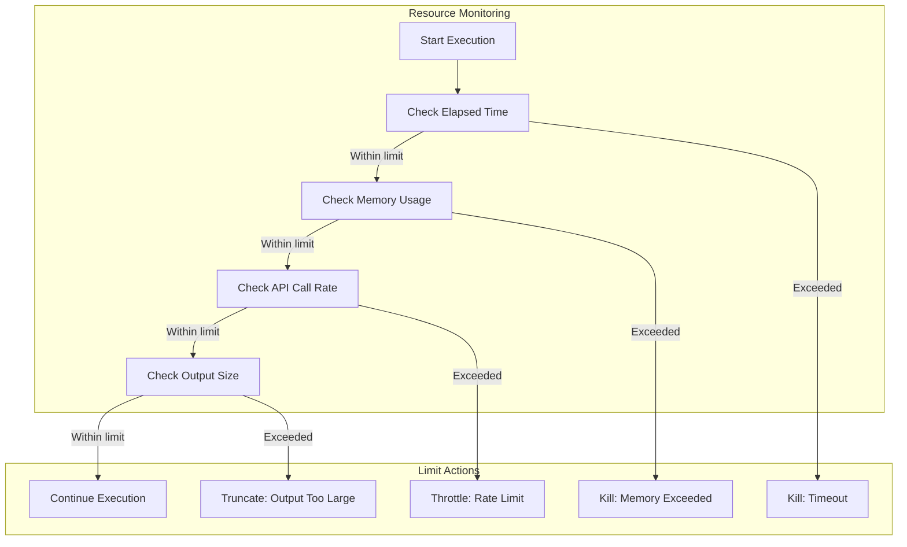
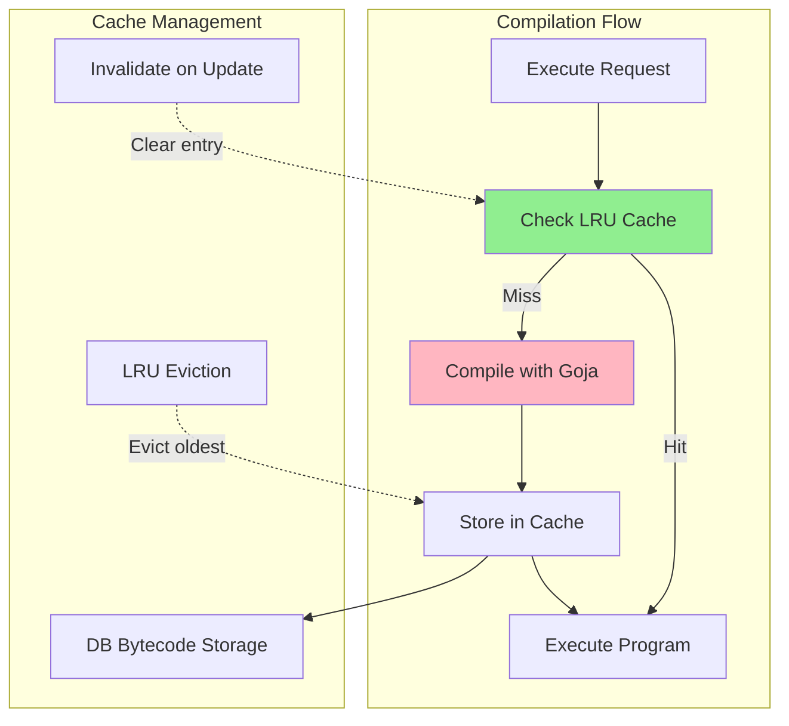
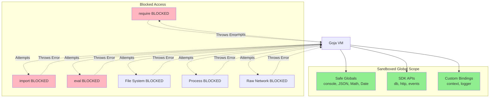
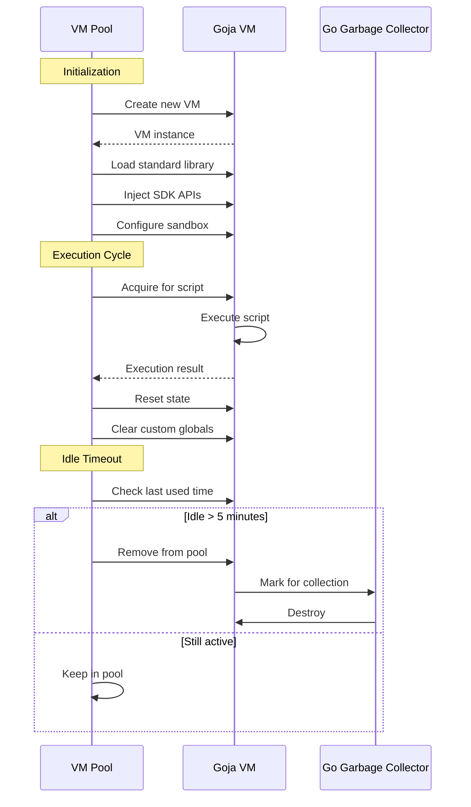
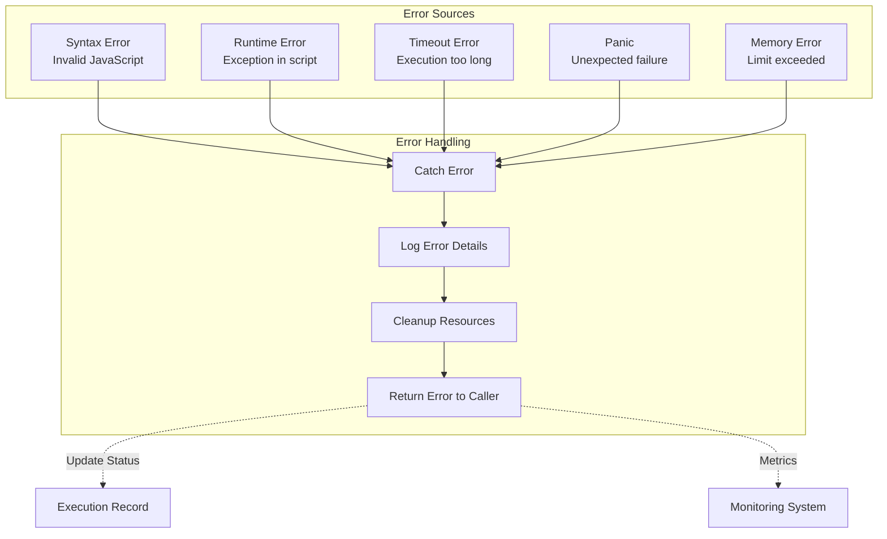
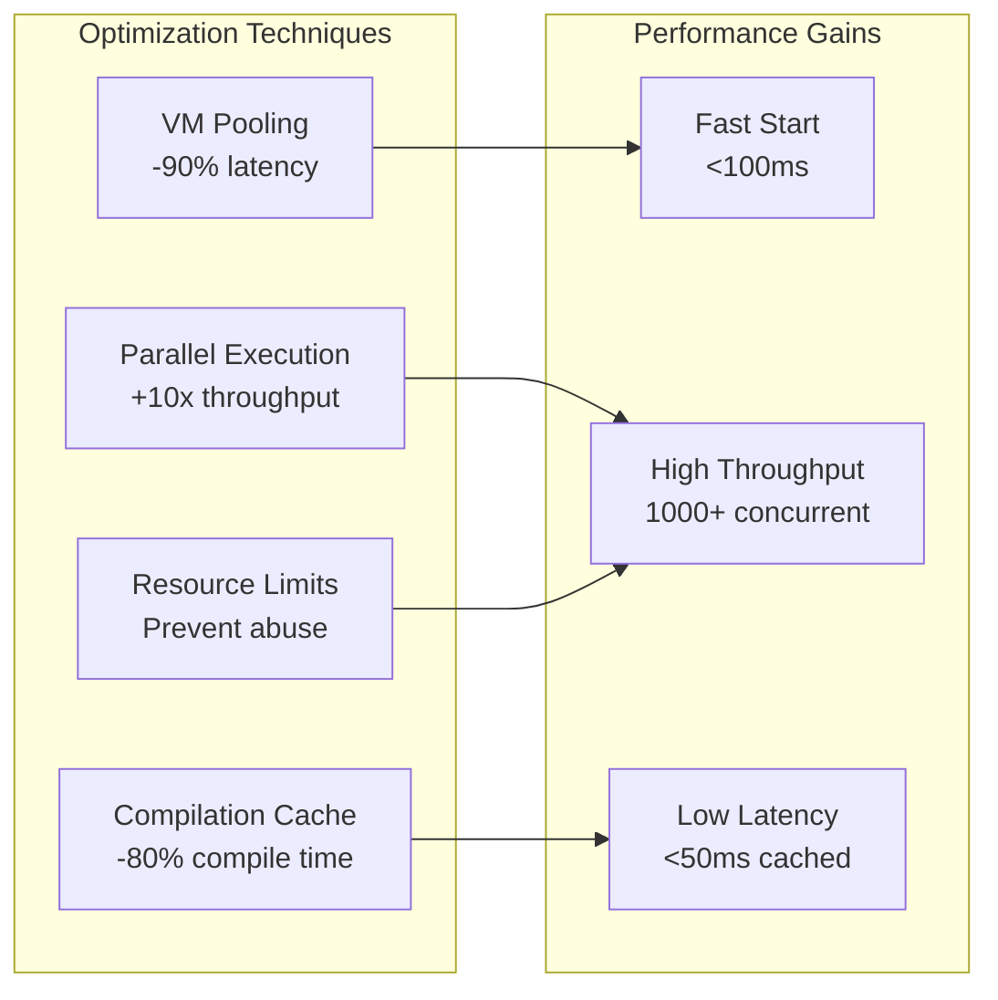

# JavaScript Runtime - Runtime Engine

## Overview

The runtime engine provides JavaScript execution using Goja VM with pooling, resource limits, compilation caching, and security sandboxing.

## VM Pool Manager

**What It Does:**
Manages a pool of pre-warmed Goja VM instances for reduced latency and fair resource distribution.

**How It Works:**
- Pre-creates configurable number of VM instances on startup
- Warm-up includes loading standard library and common APIs
- Acquires VMs on-demand with per-tenant limits
- Releases VMs back to pool after execution
- Cleans up idle VMs after timeout
- Tracks metrics (available, in-use, total)

### Pool Configuration

**Default Settings:**
- Initial pool size: 10 VMs
- Maximum pool size: 100 VMs
- Per-tenant limit: 5 concurrent VMs
- Idle timeout: 5 minutes
- Warm-up time: <500ms per VM

**Dynamic Expansion:**
- Creates new VM if pool empty and below max
- Expands during high load
- Contracts during idle periods
- Fair scheduling across tenants

## Script Executor

**What It Does:**
Orchestrates script execution with timeout enforcement, memory monitoring, and panic recovery.

**Responsibilities:**
- Validate script syntax before execution
- Inject context (tenant, user, organization)
- Set resource limits (timeout, memory)
- Execute script in sandboxed VM
- Capture output and metrics
- Handle errors and panics gracefully

### Resource Limits Enforcement

**What It Does:**
Enforces strict resource limits to prevent abuse and ensure fair usage.

**Limits Applied:**
- **Execution Time**: Context timeout (default 30s)
- **Memory**: Goja runtime.MemoryLimit (default 64MB)
- **API Calls**: Rate limiter (default 60/minute)
- **Output Size**: Max result size (default 1MB)
- **Concurrent Runs**: Per-script concurrency (default 5)

## Compilation Cache

**What It Does:**
Caches compiled JavaScript programs to reduce compilation overhead on repeated executions.

**Strategy:**
- LRU cache for frequently executed scripts
- Cache key: hash of source code
- Cache size: 1000 programs (configurable)
- Optional bytecode storage in database
- Automatic invalidation on script updates

### Cache Benefits

**Performance Improvements:**
- **First run**: Parse + Compile + Execute (~50ms overhead)
- **Cached runs**: Execute only (~5ms overhead)
- **90% hit rate** for frequently used scripts
- **10x faster** for cached scripts

## Sandbox Configuration

**What It Does:**
Restricts VM global scope to prevent access to dangerous APIs and ensure security.

**Blocked Globals:**
- `require()` - No module loading
- `import()` - No dynamic imports
- `eval()` - No code evaluation (configurable)
- `Function()` - No function constructor
- File system APIs (no `fs` module)
- Process APIs (no `process`, `child_process`)
- Network APIs (except controlled HTTP client)

**Allowed Globals:**
- `console` - Custom implementation with logging
- `JSON` - Parse/stringify
- `Math` - Mathematical functions
- `Date` - Date/time operations
- `Array`, `Object`, `String`, `Number` - Standard types
- Custom SDK APIs (via injection)

## VM Lifecycle

**What It Does:**
Manages complete lifecycle from creation to destruction with proper cleanup.

**Lifecycle Stages:**
1. **Creation**: New Goja VM instance allocated
2. **Warm-up**: Load standard library and SDK APIs
3. **Ready**: Added to available pool
4. **Acquisition**: Removed from pool for execution
5. **Execution**: Script runs with resource limits
6. **Reset**: Clear state and custom globals
7. **Release**: Return to available pool
8. **Destruction**: Garbage collected after idle timeout

## Error Handling and Recovery

**What It Does:**
Gracefully handles errors, panics, and timeouts without crashing the application.

**Error Types:**
- **Syntax Errors**: Detected during compilation, returned before execution
- **Runtime Errors**: JavaScript exceptions caught and returned as errors
- **Timeout Errors**: Context cancellation triggers graceful shutdown
- **Panic Recovery**: Go panics caught and converted to errors
- **Memory Errors**: Out-of-memory conditions handled gracefully

### Panic Recovery Pattern

**What It Does:**
Captures Go panics during script execution and converts them to structured errors.

**How It Works:**
1. Defer recovery function before execution
2. Execute script in protected context
3. On panic, capture stack trace
4. Convert panic to error with context
5. Clean up VM state
6. Return error to caller

## Performance Optimization

**Strategies Applied:**
- **VM Pooling**: Eliminate VM creation overhead (~100ms → <10ms)
- **Compilation Caching**: Reduce parse/compile time (90% hit rate)
- **Lazy Loading**: Load APIs only when needed
- **Memory Limits**: Prevent runaway memory usage
- **Concurrent Execution**: Multiple VMs execute scripts in parallel

**Performance Targets:**
- Cold start (new VM): <500ms
- Warm start (pooled VM): <100ms
- Cached execution: <50ms
- Throughput: 1000+ concurrent executions

## Acceptance Criteria

### VM Pool Manager
- ✅ Initialize pool with configurable size on startup
- ✅ Pre-warm VMs with standard library and SDK APIs
- ✅ Acquire VM with per-tenant concurrency limits
- ✅ Release VM and reset state after execution
- ✅ Cleanup idle VMs after timeout period
- ✅ Track metrics (available, in-use, total VMs)
- ✅ Graceful shutdown with drain period

### Script Executor
- ✅ Validate JavaScript syntax before execution
- ✅ Inject tenant, user, organization context
- ✅ Enforce timeout via context cancellation
- ✅ Monitor memory usage and enforce limits
- ✅ Capture output and execution metrics
- ✅ Handle errors and panics gracefully
- ✅ Return structured error with context

### Compilation Cache
- ✅ LRU cache for compiled programs (1000 entries)
- ✅ Cache key based on source code hash
- ✅ Store in memory for fast access
- ✅ Optional bytecode persistence to database
- ✅ Automatic invalidation on script updates
- ✅ 90%+ cache hit rate for frequently used scripts

### Sandbox Configuration
- ✅ Block dangerous globals (require, import, eval, fs, process)
- ✅ Allow safe globals (console, JSON, Math, Date)
- ✅ Inject SDK APIs (database, HTTP, events)
- ✅ Custom console implementation with logging
- ✅ Prevent access to Go runtime internals
- ✅ No code generation or reflection APIs

### Resource Limits
- ✅ Execution timeout enforced via context (default 30s)
- ✅ Memory limit enforced via Goja (default 64MB)
- ✅ API call rate limiting (default 60/minute)
- ✅ Output size limit (default 1MB)
- ✅ Per-script concurrency limit (default 5)

### Error Handling
- ✅ Syntax errors detected during compilation
- ✅ Runtime errors caught and structured
- ✅ Timeout errors returned with context
- ✅ Panics recovered and converted to errors
- ✅ Memory errors handled gracefully
- ✅ All errors logged with stack traces

### Performance
- ✅ Cold start (new VM) <500ms
- ✅ Warm start (pooled VM) <100ms
- ✅ Cached execution <50ms
- ✅ Support 1000+ concurrent executions
- ✅ Compilation cache hit rate >90%
- ✅ VM pool utilization 60-80% under normal load
