# JavaScript Runtime - API Bindings

## Overview

API bindings expose controlled JavaScript APIs to scripts for database access, HTTP requests, caching, logging, and event publishing with tenant isolation and security enforcement.

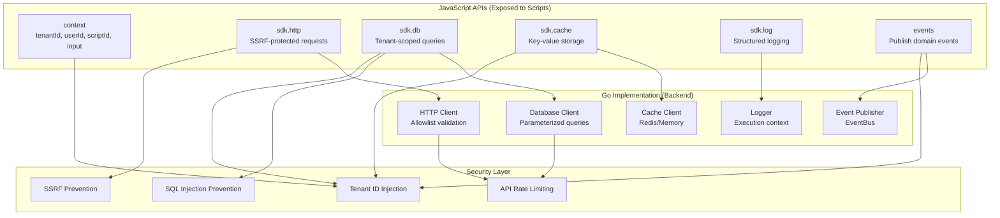

## Context API

**What It Provides:**
Execution context information available to every script via the `context` global object.

**Available Properties:**
- `context.tenantId` - Current tenant UUID (read-only)
- `context.userId` - Authenticated user ID (read-only)
- `context.organizationId` - Organization UUID (read-only)
- `context.scriptId` - Executing script UUID (read-only)
- `context.executionId` - Current execution UUID (read-only)
- `context.input` - Input parameters passed to script
- `context.trigger` - Trigger information (type, event data, HTTP request)

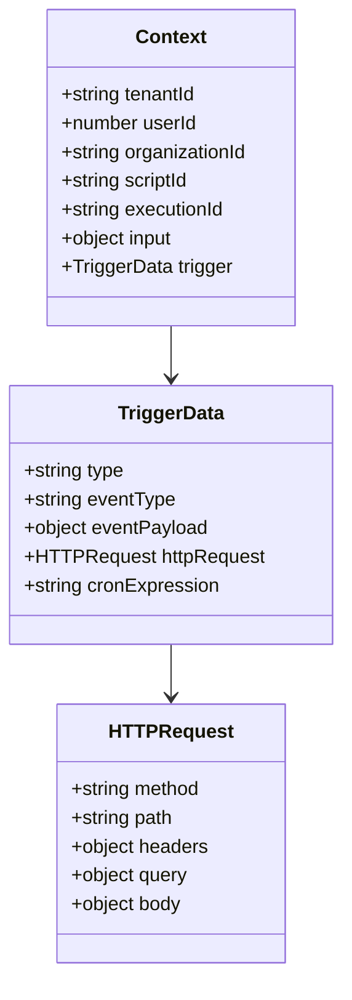

**Usage Example (conceptual):**
- Access tenant: `const tenantId = context.tenantId`
- Access input: `const name = context.input.name`
- Check trigger: `if (context.trigger.type === 'http')`

## HTTP Client API

**What It Provides:**
SSRF-protected HTTP client for making external API calls from scripts.

**Methods:**
- `sdk.http.get(url, options)` - GET request
- `sdk.http.post(url, body, options)` - POST request
- `sdk.http.put(url, body, options)` - PUT request
- `sdk.http.delete(url, options)` - DELETE request
- `sdk.http.patch(url, body, options)` - PATCH request

**Options:**
- `headers` - Custom HTTP headers (object)
- `query` - Query parameters (object)
- `timeout` - Request timeout in milliseconds (default: 10000)

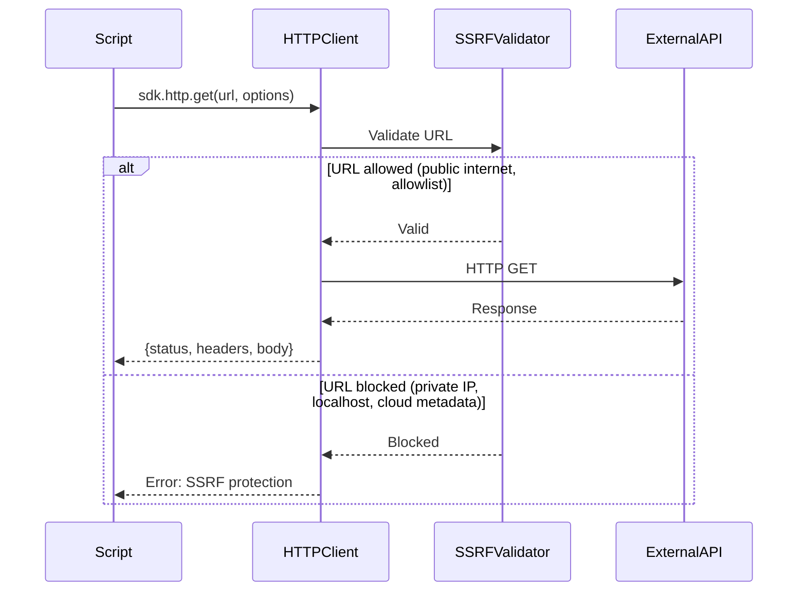

### SSRF Protection

**What It Does:**
Prevents scripts from accessing internal/private network resources.

**Blocked URLs:**
- Private IP ranges (10.0.0.0/8, 172.16.0.0/12, 192.168.0.0/16)
- Localhost (127.0.0.1, ::1)
- Link-local addresses (169.254.0.0/16)
- Cloud metadata endpoints (169.254.169.254)
- Internal DNS names

**Allowed URLs:**
- Public internet (default)
- Configured allowlist domains
- Specific partner APIs

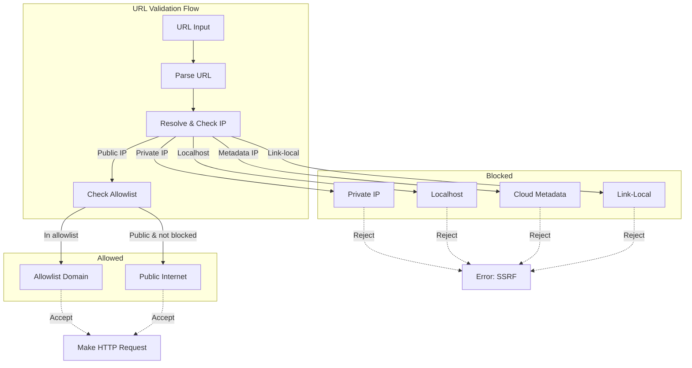

## Database API

**What It Provides:**
Tenant-scoped database queries with automatic tenant_id injection and SQL injection prevention.

**Methods:**
- `sdk.db.query(sql, params)` - Execute SELECT query
- `sdk.db.execute(sql, params)` - Execute INSERT/UPDATE/DELETE
- `sdk.db.queryOne(sql, params)` - Get single row
- `sdk.db.transaction(fn)` - Execute in transaction

**Security Features:**
- Automatic tenant_id injection in WHERE clause
- Parameterized queries only (no string concatenation)
- Read-only access for SELECT (no DDL/DCL)
- Row count limits (max 1000 rows)
- Query timeout (max 5 seconds)

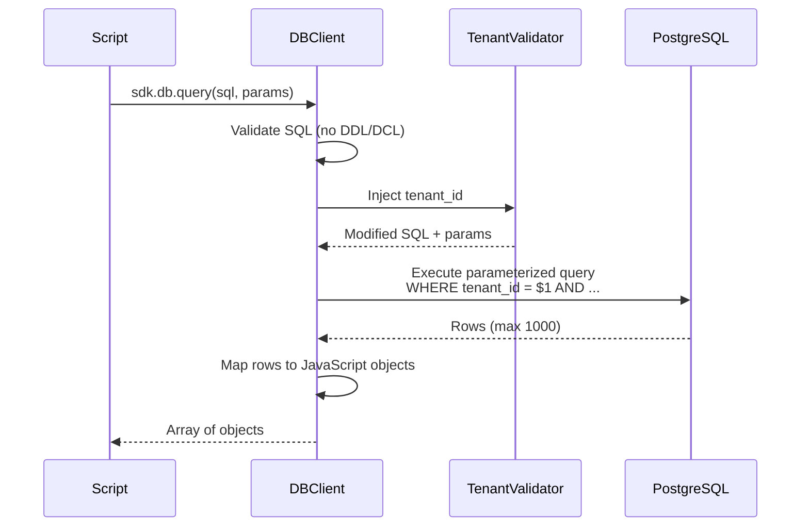

### Query Patterns

**Supported Queries:**
- SELECT with filters, joins, aggregations
- INSERT with returning clause
- UPDATE with WHERE clause
- DELETE with WHERE clause
- Transactions (BEGIN, COMMIT, ROLLBACK)

**Restricted Operations:**
- No DDL (CREATE, ALTER, DROP)
- No DCL (GRANT, REVOKE)
- No TRUNCATE or VACUUM
- No file system access (COPY, pg_read_file)

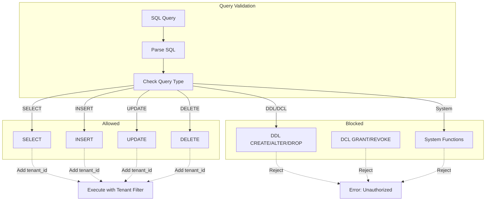

## Cache API

**What It Provides:**
Tenant-scoped key-value cache for temporary data storage.

**Methods:**
- `sdk.cache.get(key)` - Retrieve value by key
- `sdk.cache.set(key, value, ttl)` - Store value with TTL (seconds)
- `sdk.cache.delete(key)` - Remove key
- `sdk.cache.exists(key)` - Check if key exists
- `sdk.cache.increment(key, delta)` - Atomic increment
- `sdk.cache.expire(key, ttl)` - Update TTL

**Automatic Prefixing:**
- Keys automatically prefixed with `tenant:{tenantId}:script:{scriptId}:`
- Prevents cross-tenant and cross-script key collisions
- Transparent to script (script sees unprefixed keys)

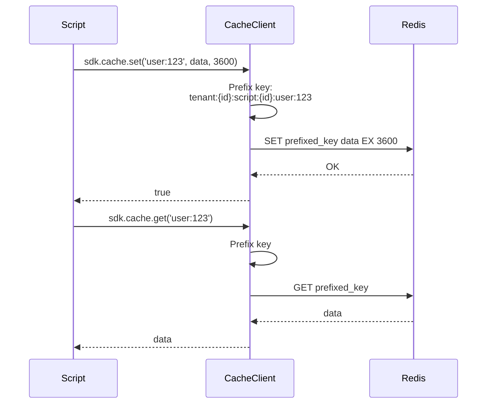

## Logging API

**What It Provides:**
Structured logging with automatic execution context linkage.

**Methods:**
- `sdk.log.debug(message, metadata)` - Debug level
- `sdk.log.info(message, metadata)` - Info level
- `sdk.log.warn(message, metadata)` - Warning level
- `sdk.log.error(message, metadata)` - Error level

**Automatic Context:**
- tenant_id, user_id, organization_id
- script_id, execution_id
- Timestamp, log level
- Custom metadata from script

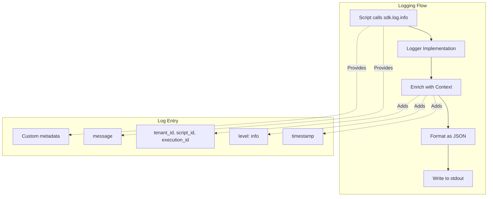

## Events API

**What It Provides:**
Publish domain events to EventBus with tenant isolation.

**Methods:**
- `events.publish(eventType, payload)` - Publish event
- Event types follow convention: `module.entity.action`

**Automatic Enrichment:**
- Tenant ID automatically injected
- Timestamp added
- Source script ID tracked
- Event ID generated

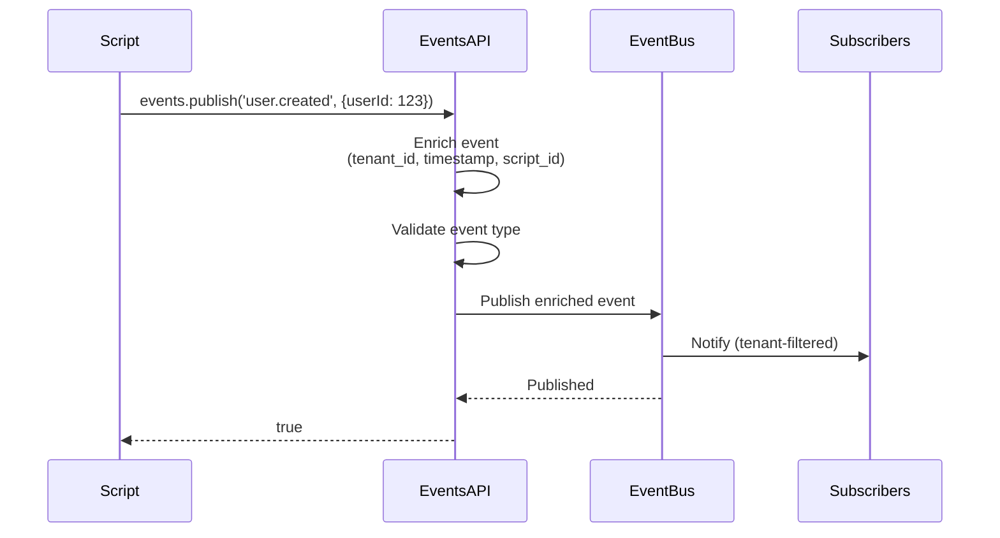

## Rate Limiting

**What It Does:**
Prevents abuse by limiting API call frequency per script execution.

**Limits:**
- Database queries: 60 per minute
- HTTP requests: 60 per minute
- Cache operations: 120 per minute
- Event publishes: 30 per minute
- Log entries: 100 per minute

**How It Works:**
- Token bucket algorithm per execution
- Refills at configured rate
- Blocks when bucket empty
- Returns error with retry-after

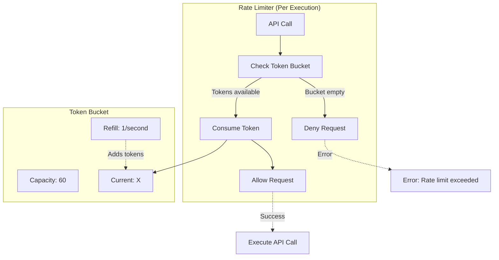

## API Injection Process

**What It Does:**
Injects all APIs into Goja VM global scope before script execution.

**Injection Steps:**
1. Create API client instances (HTTP, DB, Cache, Logger, Events)
2. Inject execution context (`context` global)
3. Bind HTTP client methods to `sdk.http` namespace
4. Bind database methods to `sdk.db` namespace
5. Bind cache methods to `sdk.cache` namespace
6. Bind logger methods to `sdk.log` namespace
7. Bind event publisher to `events` global
8. Set tenant ID in all API clients

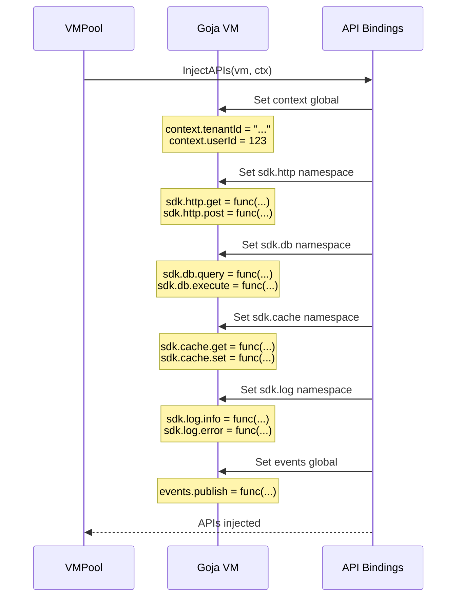

## Acceptance Criteria

### Context API
- ✅ context.tenantId available (read-only, non-null)
- ✅ context.userId available (read-only, may be null)
- ✅ context.organizationId available (read-only, may be null)
- ✅ context.scriptId available (read-only, non-null)
- ✅ context.executionId available (read-only, non-null)
- ✅ context.input provides script input parameters
- ✅ context.trigger provides trigger information

### HTTP Client API
- ✅ Support GET, POST, PUT, DELETE, PATCH methods
- ✅ Custom headers and query parameters
- ✅ Request timeout configurable (default 10s)
- ✅ SSRF protection blocks private IPs
- ✅ SSRF protection blocks cloud metadata
- ✅ Allowlist domains bypass SSRF checks
- ✅ Rate limiting (60 requests/minute)

### Database API
- ✅ sdk.db.query executes SELECT with tenant filter
- ✅ sdk.db.execute for INSERT/UPDATE/DELETE
- ✅ sdk.db.queryOne returns single row
- ✅ sdk.db.transaction for atomic operations
- ✅ Automatic tenant_id injection in WHERE
- ✅ Parameterized queries only (SQL injection prevention)
- ✅ Row limit (max 1000 rows)
- ✅ Query timeout (max 5 seconds)
- ✅ Block DDL/DCL operations

### Cache API
- ✅ sdk.cache.get/set/delete/exists methods
- ✅ sdk.cache.increment for atomic counters
- ✅ sdk.cache.expire to update TTL
- ✅ Automatic key prefixing (tenant + script)
- ✅ TTL in seconds (default: no expiration)
- ✅ Rate limiting (120 operations/minute)

### Logging API
- ✅ sdk.log.debug/info/warn/error methods
- ✅ Automatic context enrichment (tenant, script, execution)
- ✅ Custom metadata support
- ✅ JSON formatted output
- ✅ Rate limiting (100 logs/minute)

### Events API
- ✅ events.publish method
- ✅ Automatic tenant ID injection
- ✅ Timestamp and event ID generation
- ✅ Source script ID tracking
- ✅ Event type validation
- ✅ Rate limiting (30 events/minute)

### Security
- ✅ All APIs enforce tenant isolation
- ✅ No cross-tenant data access possible
- ✅ SSRF protection for HTTP calls
- ✅ SQL injection prevention for database
- ✅ Rate limiting prevents abuse
- ✅ API errors include safe error messages (no stack traces to scripts)
