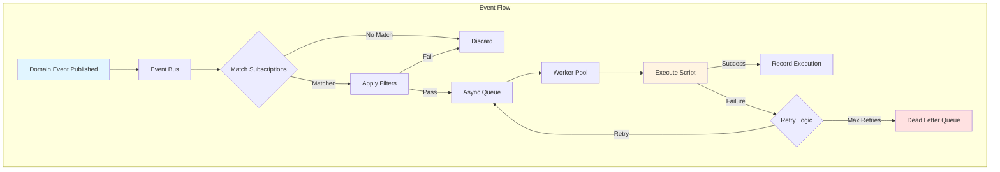
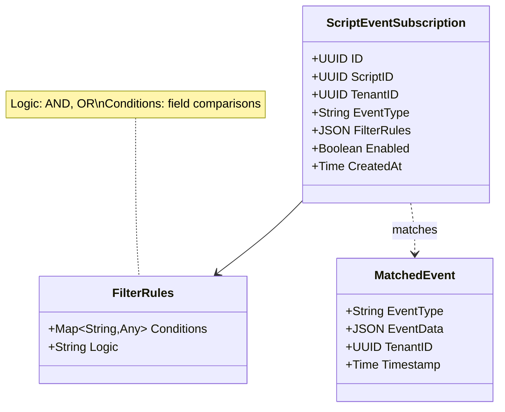
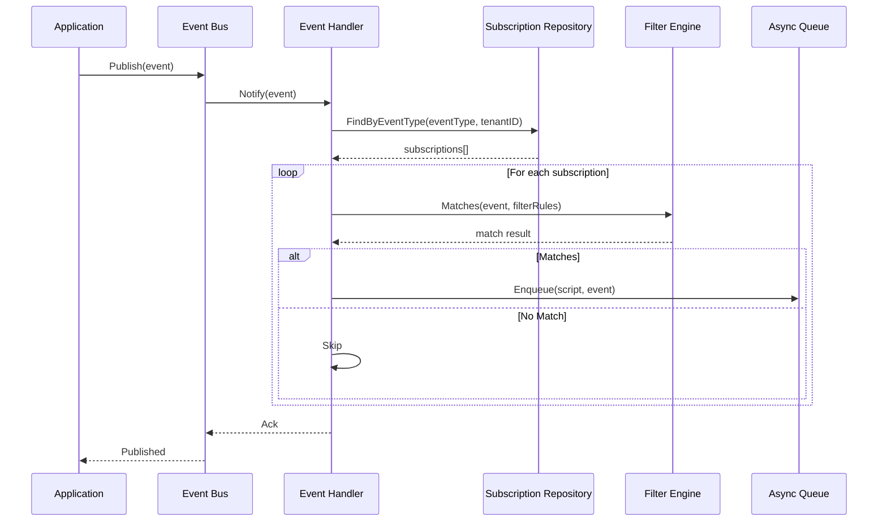
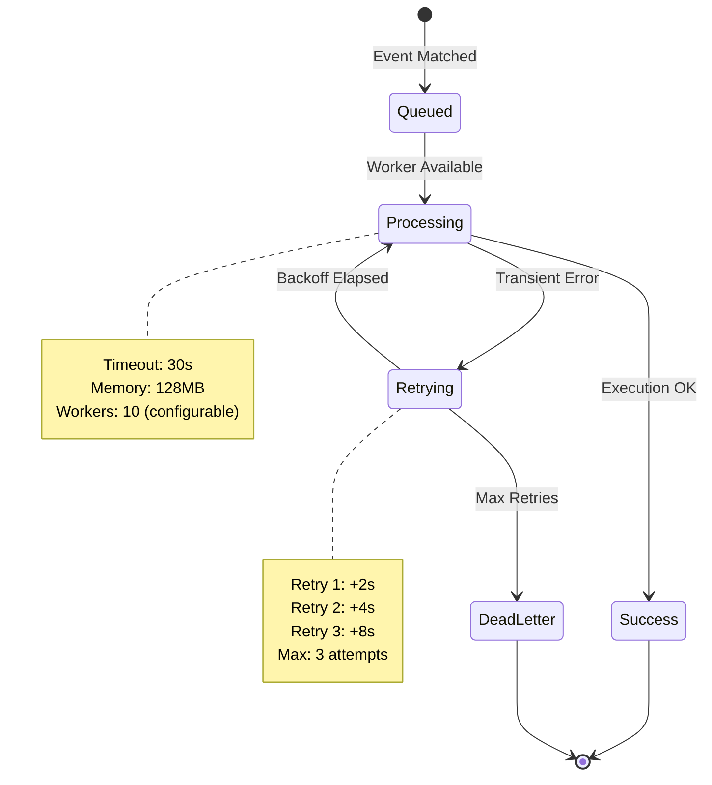
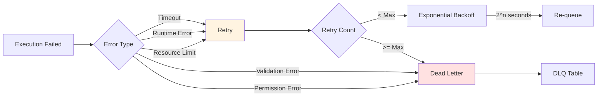
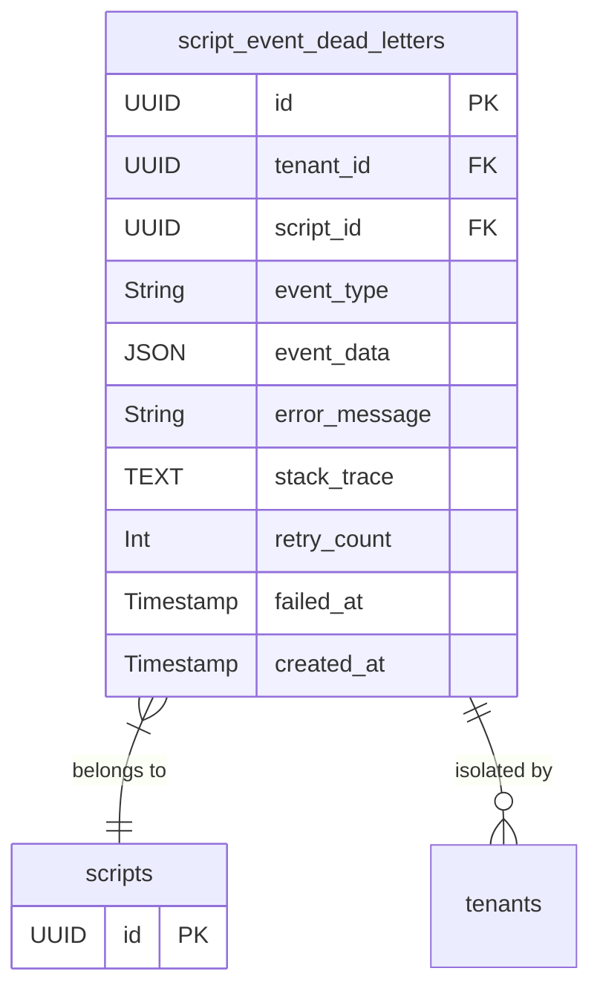
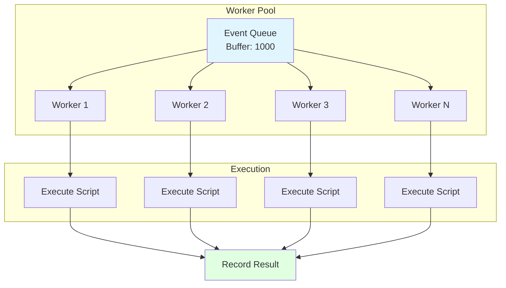
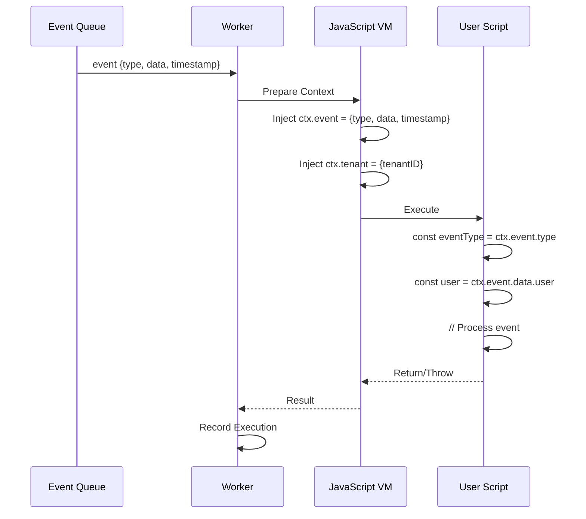
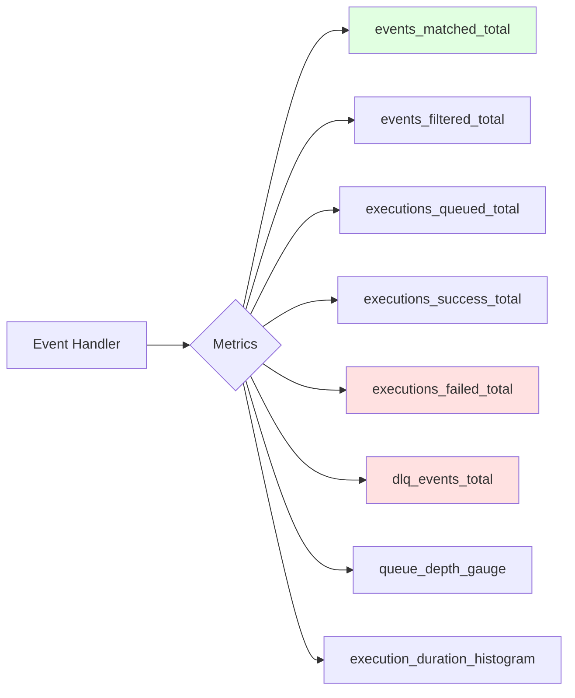

# JavaScript Runtime - Event Integration Specification

**Status:** Implementation Ready
**Layer:** Infrastructure Layer
**Dependencies:** Event bus, Runtime engine, Service layer
**Related Issues:** #415, #418, #419

---

## Overview

Event integration enables scripts to react to domain events across the application. Scripts subscribe to specific event types, apply filters to match relevant events, and execute asynchronously with retry logic and dead letter queue handling.

## What It Does

The event integration system:
- **Subscribes** scripts to domain events by event type and optional filters
- **Routes** events to matching scripts based on subscription rules
- **Executes** scripts asynchronously without blocking the event publisher
- **Retries** failed executions with exponential backoff
- **Captures** permanently failed events in a Dead Letter Queue (DLQ)
- **Monitors** event processing with metrics and logging

## How It Works

### Event Subscription Model

Scripts declare which events they want to process:

**What It Does:**
- Stores event subscriptions per script with tenant isolation
- Defines filter rules for conditional event matching
- Enables/disables subscriptions without deleting

**How It Works:**
1. Script declares event type interest (e.g., `"user.created"`)
2. Optional filter rules narrow matching (e.g., `{"role": "admin"}`)
3. Event bus queries active subscriptions for each published event
4. Filter engine evaluates rules against event data
5. Matched events queue for execution

### Event Matching Flow

**What It Does:**
- Matches events to subscriptions in real-time
- Filters events based on subscription rules
- Queues matched events for async execution

**How It Works:**
1. Application publishes domain event to event bus
2. Event handler receives event notification
3. Repository queries subscriptions by event type and tenant
4. Filter engine evaluates each subscription's rules
5. Matched scripts enqueue for execution
6. Publisher receives acknowledgment (non-blocking)

### Async Execution Queue

**What It Does:**
- Executes scripts asynchronously without blocking event publishers
- Manages worker pool for concurrent execution
- Retries failed executions with exponential backoff
- Moves permanently failed events to Dead Letter Queue

**How It Works:**
1. Matched events enter async queue (buffered channel)
2. Worker goroutines consume events from queue
3. Each worker executes script with event data as input
4. Success: Record execution, continue to next event
5. Failure: Apply retry logic with exponential backoff
6. Max retries exceeded: Move to Dead Letter Queue

### Retry Strategy

**What It Does:**
- Distinguishes transient failures (retry) from permanent failures (DLQ)
- Applies exponential backoff to prevent thundering herd
- Limits retry attempts to prevent infinite loops

**How It Works:**
1. **Transient Errors** (timeout, runtime crash): Retry with backoff
2. **Permanent Errors** (validation, permission): Send to DLQ immediately
3. **Retry Delays**: 2^n seconds (2s, 4s, 8s)
4. **Max Retries**: 3 attempts (configurable)
5. **Backoff**: `time.Sleep(2^retryCount * time.Second)`

### Dead Letter Queue (DLQ)

**What It Does:**
- Captures events that failed after all retry attempts
- Stores error context for debugging (error message, stack trace)
- Enables manual review and reprocessing
- Maintains tenant isolation for failed events

**How It Works:**
1. After max retries exceeded, event moves to DLQ
2. Record captures:
    - Event type and data
    - Script ID and tenant ID
    - Error message and stack trace
    - Retry count and failure timestamp
3. Admins query DLQ for debugging
4. Manual reprocessing: Fix script, re-publish event

### Worker Pool Management

**What It Does:**
- Manages fixed pool of worker goroutines
- Prevents unbounded concurrency
- Gracefully shuts down on application exit

**How It Works:**
1. On startup: Spawn N worker goroutines (default: 10)
2. Workers consume from buffered event queue (size: 1000)
3. Each worker processes one event at a time
4. On shutdown: Close queue, wait for workers to finish (WaitGroup)

### Event Data Injection

**What It Does:**
- Injects event data into JavaScript execution context
- Provides tenant context for multi-tenant operations
- Makes event metadata available to scripts

**How It Works:**
1. Worker receives event from queue
2. VM prepares execution context with:
    - `ctx.event.type`: Event type string
    - `ctx.event.data`: Event payload (JSON)
    - `ctx.event.timestamp`: Event time
    - `ctx.tenant.id`: Tenant UUID
3. Script accesses event via `ctx` global
4. Script processes event data and returns/throws

### Monitoring and Metrics

**What It Does:**
- Tracks event processing metrics for observability
- Exposes Prometheus-compatible metrics
- Enables alerting on failures and queue depth

**Metrics:**
- `events_matched_total`: Counter of matched events
- `events_filtered_total`: Counter of filtered-out events
- `executions_queued_total`: Counter of queued executions
- `executions_success_total`: Counter of successful executions
- `executions_failed_total`: Counter of failed executions (by error type)
- `dlq_events_total`: Counter of events sent to DLQ
- `queue_depth_gauge`: Current queue size
- `execution_duration_histogram`: Execution time distribution

## Acceptance Criteria

### Event Subscription
- [ ] Scripts can subscribe to event types via database records
- [ ] Subscriptions support optional filter rules (AND/OR logic)
- [ ] Subscriptions can be enabled/disabled without deletion
- [ ] Subscriptions enforce tenant isolation (no cross-tenant)

### Event Matching
- [ ] Events route to all matching subscriptions
- [ ] Filter rules correctly evaluate against event data
- [ ] Non-matching events are discarded without execution
- [ ] Matching completes within 10ms per event

### Async Execution
- [ ] Events execute asynchronously (non-blocking publishers)
- [ ] Worker pool size is configurable
- [ ] Queue buffer size is configurable
- [ ] Graceful shutdown waits for in-flight executions

### Retry Logic
- [ ] Transient errors trigger retry with exponential backoff
- [ ] Permanent errors skip retry and go to DLQ immediately
- [ ] Max retry count is configurable (default: 3)
- [ ] Retry delays follow 2^n pattern (2s, 4s, 8s)

### Dead Letter Queue
- [ ] Failed events after max retries save to DLQ
- [ ] DLQ records include error message and stack trace
- [ ] DLQ supports manual review via admin UI
- [ ] DLQ maintains tenant isolation

### Monitoring
- [ ] All metrics export to Prometheus
- [ ] Alerts trigger on high failure rate (>10%)
- [ ] Alerts trigger on queue depth (>90% capacity)
- [ ] Execution duration tracks p50, p95, p99

### Security
- [ ] Event data sanitized before injection into VM
- [ ] Tenant ID validated for all operations
- [ ] Scripts cannot access events from other tenants
- [ ] Filter rules validated to prevent injection attacks

---

**Dependencies:**
- Event bus implementation in application core
- Runtime engine (VM, VMPool) from Phase 1
- ExecutionService for script execution
- Metrics framework (Prometheus)

**Performance Targets:**
- Event matching: < 10ms per event
- Queue throughput: > 100 events/sec
- Execution latency: < 2s (p95)
- DLQ write latency: < 100ms
