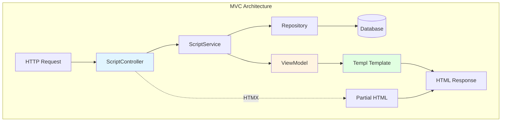
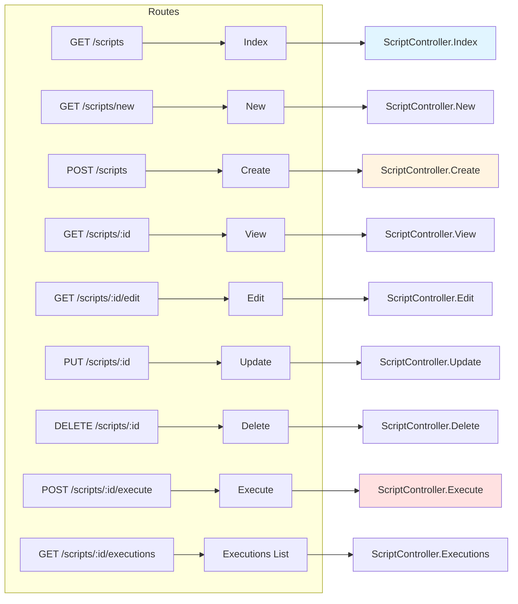
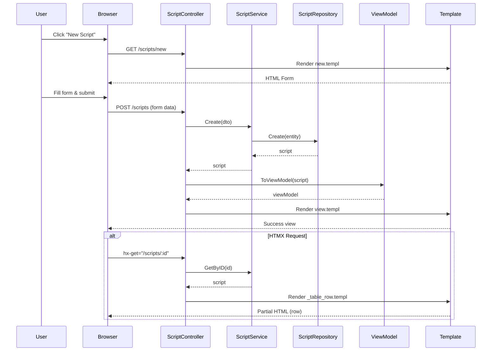
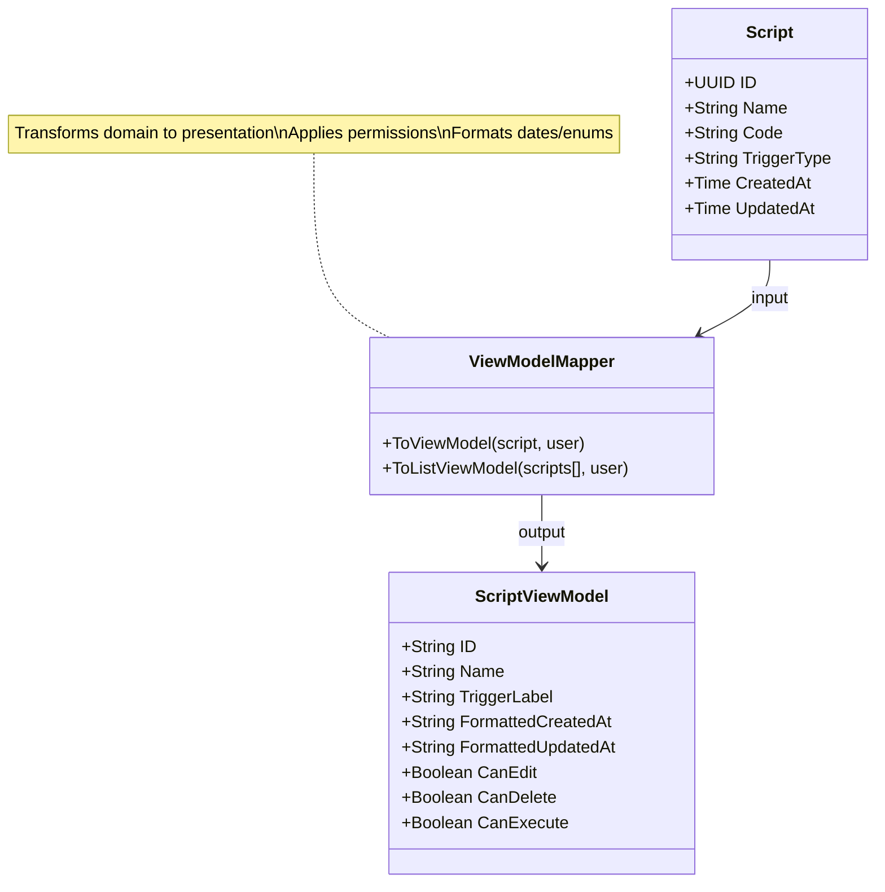
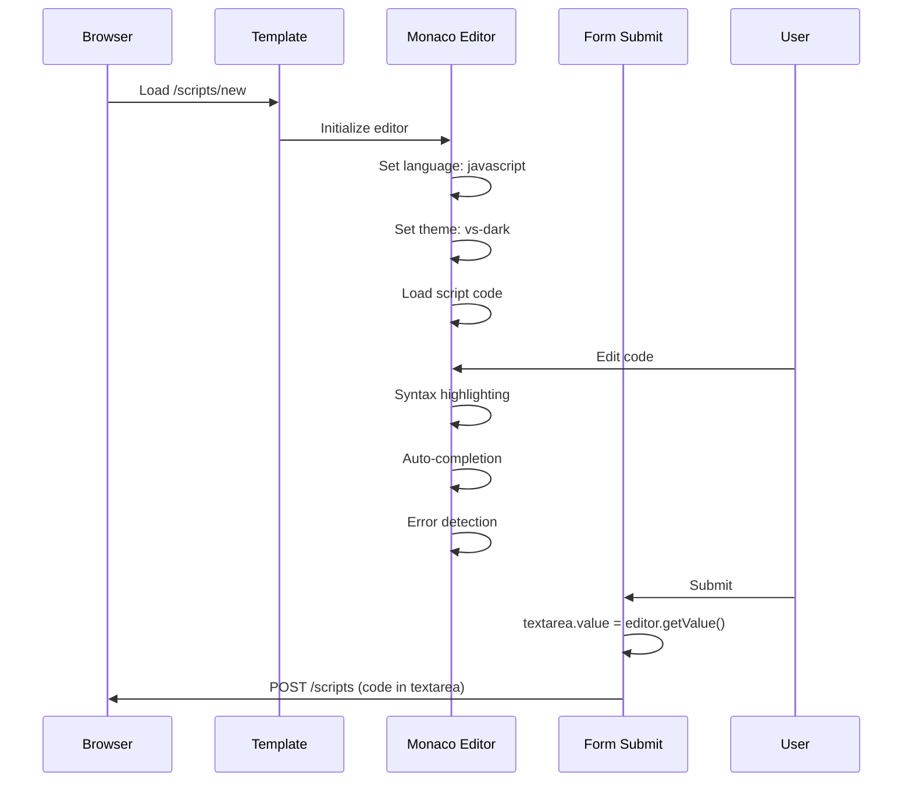
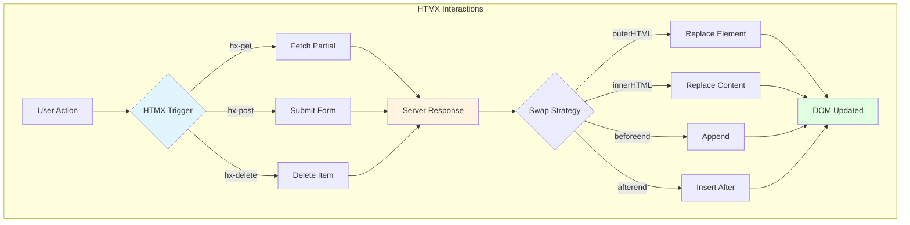
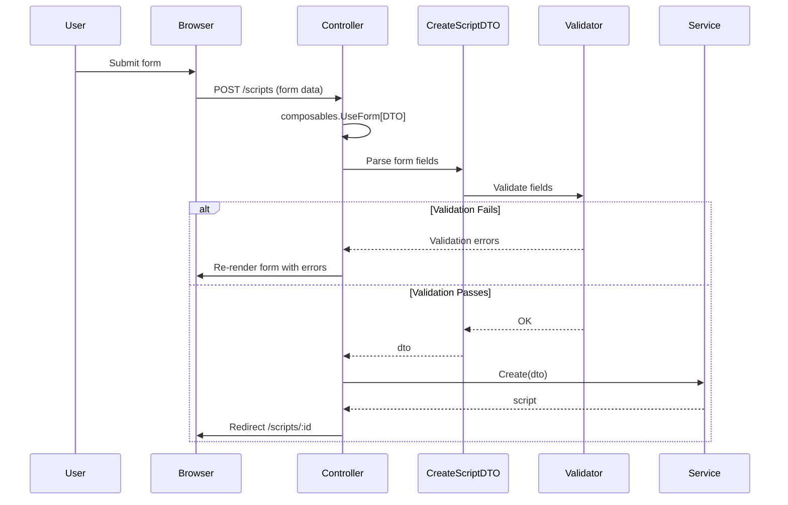
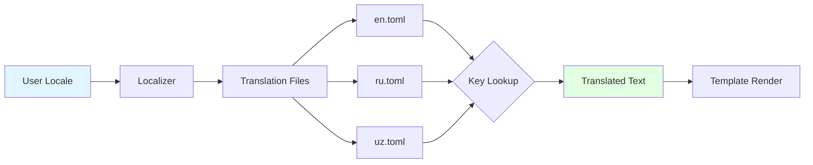
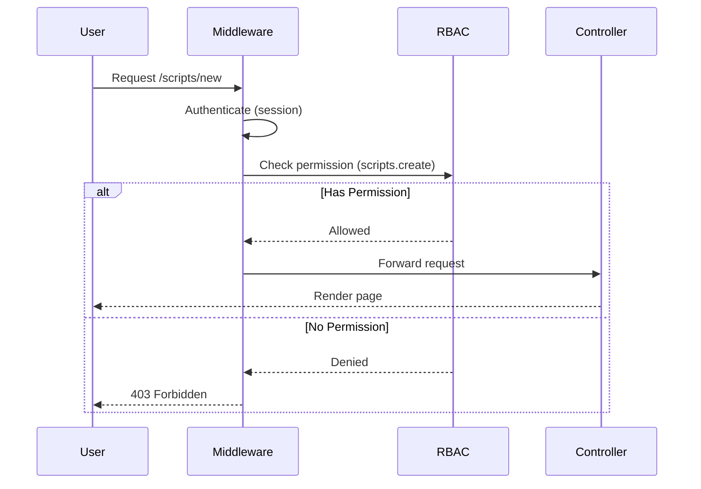

# JavaScript Runtime - Presentation Layer Specification

## Overview

The presentation layer provides web UI for managing JavaScript scripts, viewing executions, editing code with Monaco editor, and handling HTMX-powered interactions. It follows MVC architecture with controllers, ViewModels, Templ templates, and localization.



## What It Does

The presentation layer:
- **Renders** script management UI with list, create, edit, view pages
- **Handles** form submissions for script CRUD operations
- **Displays** execution history with real-time updates via HTMX
- **Integrates** Monaco editor for JavaScript code editing
- **Localizes** UI text in English, Russian, Uzbek
- **Validates** user permissions via RBAC middleware

## How It Works

### Controller Structure



**What It Does:**
- Maps HTTP routes to controller methods
- Applies authentication and permission middleware
- Handles both full-page and HTMX partial responses

**How It Works:**
1. Router registers routes with controller methods
2. Middleware chain executes: Auth → RBAC → Handler
3. Controller method extracts request data (path params, query, form)
4. Service layer processes business logic
5. ViewModel transforms domain entities for display
6. Template renders HTML (full page or HTMX partial)

### CRUD Workflow



**What It Does:**
- Renders form for new script creation
- Validates form data via DTO
- Creates script entity via service
- Redirects to script view on success
- Supports HTMX partial updates for dynamic UI

**How It Works:**
1. **GET /scripts/new**: Render empty form
2. **POST /scripts**: Parse form → DTO → Service → Create entity
3. **Success**: Redirect to `/scripts/:id`
4. **Validation Error**: Re-render form with errors
5. **HTMX**: Return partial HTML for in-place updates

### ViewModel Transformation



**What It Does:**
- Transforms domain entities into presentation-friendly structures
- Formats dates, enums, UUIDs for display
- Computes permission flags (CanEdit, CanDelete) based on user role
- Separates domain logic from presentation logic

**How It Works:**
1. Controller receives domain entity from service
2. ViewModel mapper transforms entity:
    - UUID → string
    - Timestamp → formatted date string
    - Enum → localized label
    - Compute permissions based on user role
3. ViewModel passes to template
4. Template renders using ViewModel fields

### Monaco Editor Integration



**What It Does:**
- Provides rich code editor with syntax highlighting
- Offers auto-completion and error detection
- Synchronizes editor content with form textarea
- Supports JavaScript language mode

**How It Works:**
1. Template includes Monaco editor library (CDN or bundled)
2. JavaScript initializes editor on page load:
    ```javascript
    const editor = monaco.editor.create(container, {
        value: initialCode,
        language: 'javascript',
        theme: 'vs-dark'
    });
    ```
3. User edits code with syntax highlighting
4. On form submit: `textarea.value = editor.getValue()`
5. Form submits code to server

### HTMX Patterns



**What It Does:**
- Enables dynamic UI updates without full page reloads
- Handles form submissions with partial HTML responses
- Supports real-time execution history updates
- Provides smooth UX with loading indicators

**Common Patterns:**
1. **Execute Script Button:**
    ```html
    <button hx-post="/scripts/:id/execute"
            hx-target="#execution-history"
            hx-swap="afterbegin">
        Execute
    </button>
    ```
2. **Delete Script Link:**
    ```html
    <a hx-delete="/scripts/:id"
       hx-confirm="Delete this script?"
       hx-target="closest tr"
       hx-swap="outerHTML swap:1s">
        Delete
    </a>
    ```
3. **Live Execution Rows:**
    ```html
    <div id="execution-history"
         hx-get="/scripts/:id/executions"
         hx-trigger="every 5s">
        <!-- Execution rows -->
    </div>
    ```

### Form Handling



**What It Does:**
- Parses form data into DTO structs
- Validates input fields (required, length, format)
- Displays validation errors inline
- Prevents invalid data from reaching service layer

**How It Works:**
1. Controller uses `composables.UseForm[CreateScriptDTO](r)` to parse form
2. DTO struct tags define validation rules:
    ```go
    type CreateScriptDTO struct {
        Name        string `form:"Name" validate:"required,min=3,max=100"`
        Code        string `form:"Code" validate:"required"`
        TriggerType string `form:"TriggerType" validate:"required,oneof=manual scheduled event http"`
    }
    ```
3. Validator checks rules, returns errors map
4. Controller re-renders form with errors if validation fails
5. Valid DTO passes to service layer

### Localization



**What It Does:**
- Provides UI text in English, Russian, Uzbek
- Translates labels, buttons, error messages, enums
- Supports parameterized translations (e.g., "Hello, {name}")
- Falls back to English if translation missing

**Translation Keys Structure:**
```
Scripts.Title = "Scripts"
Scripts.New = "New Script"
Scripts.Form.Name = "Script Name"
Scripts.Form.Code = "JavaScript Code"
Scripts.Enums.TriggerType.MANUAL = "Manual"
Scripts.Enums.TriggerType.SCHEDULED = "Scheduled"
Scripts.Enums.TriggerType.EVENT = "Event"
Scripts.Messages.Created = "Script created successfully"
Scripts.Errors.NotFound = "Script not found"
```

**Template Usage:**
```templ
<h1>{ ctx.T("Scripts.Title") }</h1>
<button>{ ctx.T("Scripts.New") }</button>
<label>{ ctx.T("Scripts.Form.Name") }</label>
```

### Permission Guards



**What It Does:**
- Enforces RBAC permissions on all script operations
- Protects routes with middleware
- Hides UI elements based on user permissions
- Returns 403 for unauthorized access

**Permission Mapping:**
- **View Scripts**: `scripts.read`
- **Create Script**: `scripts.create`
- **Edit Script**: `scripts.update`
- **Delete Script**: `scripts.delete`
- **Execute Script**: `scripts.execute`

**Route Protection:**
```go
router.Use(middleware.Authorize())
router.Use(middleware.RequirePermission("scripts.read"))
```

**Template Conditionals:**
```templ
@if ctx.User.HasPermission("scripts.create") {
    <a href="/scripts/new">New Script</a>
}
```

## Acceptance Criteria

### Controller Routes
- [ ] All routes registered with correct HTTP methods
- [ ] Authentication middleware applied to all routes
- [ ] RBAC middleware enforces permissions
- [ ] HTMX requests return partial HTML
- [ ] Full requests return complete pages

### ViewModels
- [ ] ViewModels transform all domain entities
- [ ] Dates formatted according to user locale
- [ ] Enums translated to localized labels
- [ ] Permission flags computed correctly

### Templates
- [ ] All pages use Templ (no raw HTML strings)
- [ ] CSRF tokens included in all forms
- [ ] HTMX attributes set correctly
- [ ] Monaco editor initializes on edit pages
- [ ] Responsive design (mobile-friendly)

### Forms
- [ ] All forms use DTO structs with validation tags
- [ ] Validation errors display inline
- [ ] CamelCase field names match DTO struct
- [ ] Form submissions handled via HTMX or standard POST

### Localization
- [ ] All 3 languages (en, ru, uz) have complete translations
- [ ] No hardcoded strings in templates
- [ ] Parameterized translations work correctly
- [ ] Fallback to English if translation missing

### Permissions
- [ ] Unauthorized users see 403 for protected routes
- [ ] UI elements hidden based on permissions
- [ ] Permission checks performed on both routes and templates
- [ ] Tenant isolation enforced in all queries

### HTMX Integration
- [ ] Execute button triggers HTMX POST
- [ ] Delete link triggers HTMX DELETE with confirm
- [ ] Execution history polls every 5 seconds
- [ ] Loading indicators show during requests
- [ ] Errors display via HTMX response

### Monaco Editor
- [ ] Editor loads with JavaScript syntax highlighting
- [ ] Auto-completion suggests JavaScript keywords
- [ ] Editor syncs with form textarea on submit
- [ ] Theme matches application (light/dark mode)

---

**File Structure:**
```
modules/scripts/
├── presentation/
│   ├── controllers/
│   │   └── script_controller.go
│   ├── viewmodels/
│   │   ├── script_viewmodel.go
│   │   ├── execution_viewmodel.go
│   │   └── version_viewmodel.go
│   ├── templates/
│   │   └── pages/
│   │       └── scripts/
│   │           ├── index.templ
│   │           ├── new.templ
│   │           ├── edit.templ
│   │           ├── view.templ
│   │           ├── _table.templ
│   │           └── _execution_row.templ
│   └── locales/
│       ├── en.toml
│       ├── ru.toml
│       └── uz.toml
```

**Performance Targets:**
- Page load: < 500ms (p95)
- HTMX partial render: < 100ms (p95)
- Monaco editor initialization: < 1s
- Form validation: < 50ms
