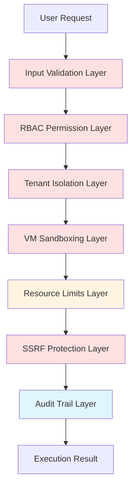
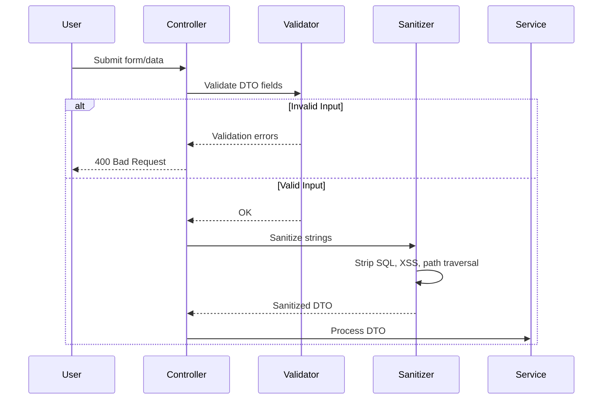
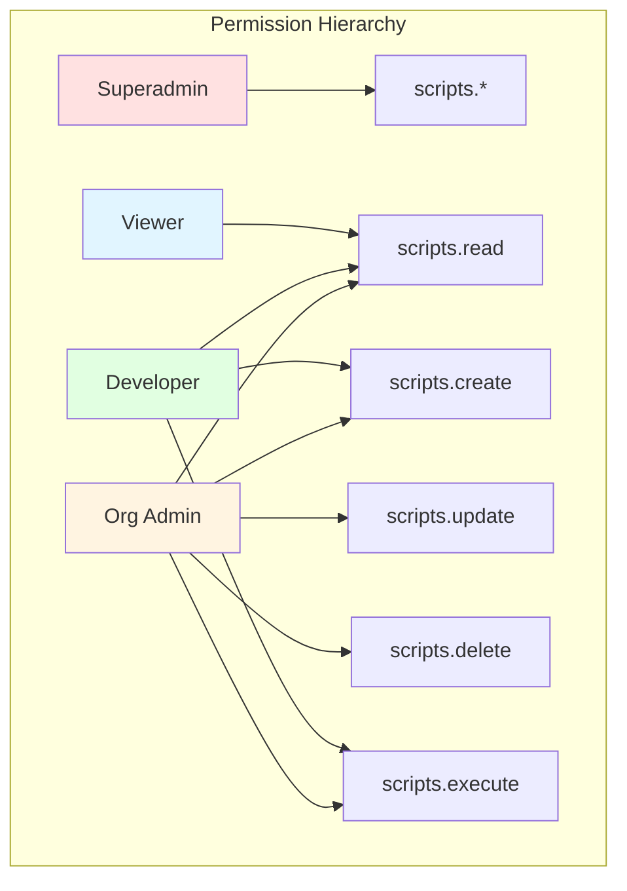
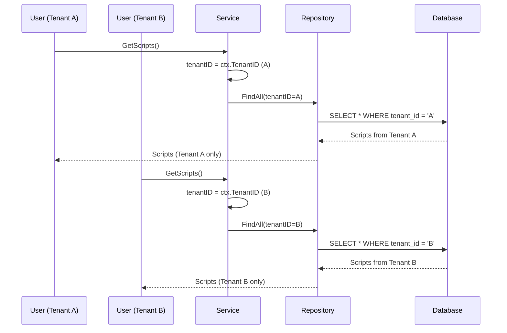
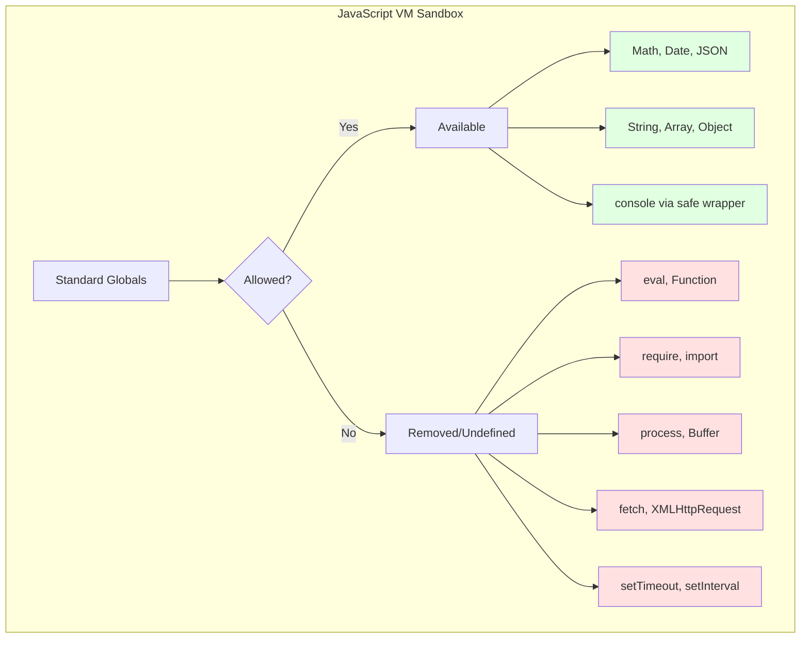
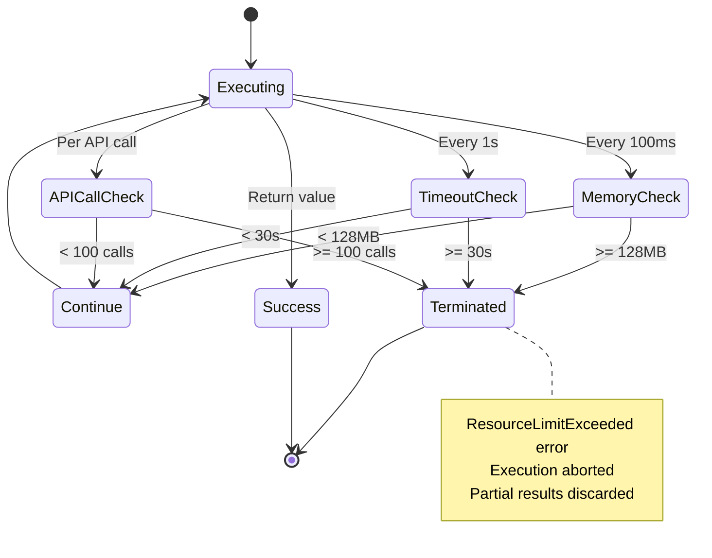
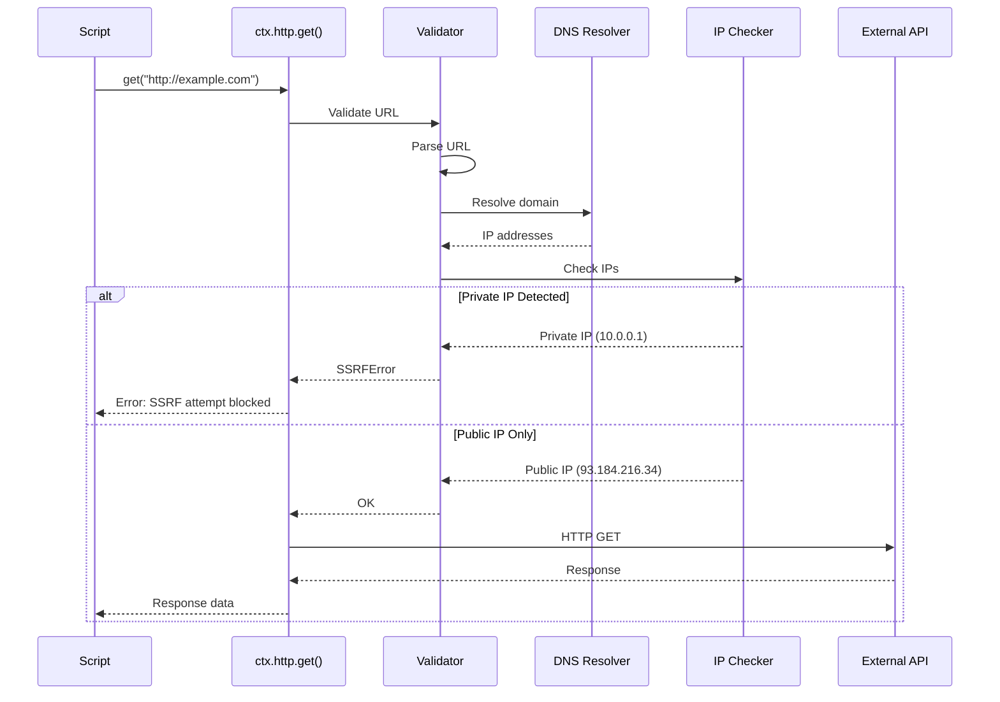
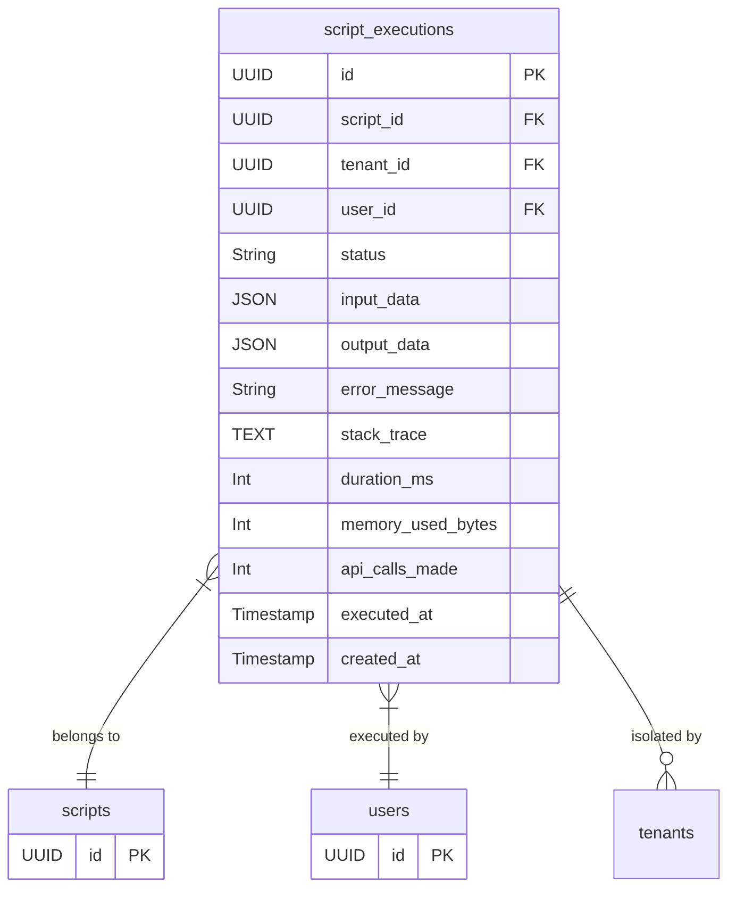

# JavaScript Runtime - Security Model Specification

## Overview

The security model protects the JavaScript runtime from malicious code, unauthorized access, resource abuse, and cross-tenant data leakage. It implements defense-in-depth with multiple security layers from input validation through SSRF protection.



## What It Does

The security model:
- **Validates** all user input to prevent injection attacks
- **Enforces** RBAC permissions for script operations
- **Isolates** tenant data to prevent cross-tenant access
- **Sandboxes** JavaScript execution to remove dangerous globals
- **Limits** resource usage (CPU, memory, API calls) to prevent abuse
- **Blocks** SSRF attacks on HTTP requests
- **Logs** all executions for audit and compliance

## How It Works

### Layer 1: Input Validation



**What It Does:**
- Validates input types, lengths, formats, required fields
- Sanitizes strings to prevent SQL injection, XSS, path traversal
- Rejects malformed or malicious input before processing

**Validation Rules:**
- **Script Name**: Required, 3-100 chars, alphanumeric + spaces
- **Script Code**: Required, max 100KB
- **Trigger Type**: Required, enum (manual, scheduled, event, http)
- **Cron Schedule**: Valid cron expression if trigger=scheduled
- **HTTP Path**: Valid URL path if trigger=http
- **Event Type**: Valid event name if trigger=event

**Sanitization:**
- Strip HTML tags from text fields
- Escape SQL special characters
- Validate file paths (no `..`, absolute paths only)
- URL-encode user input in URLs

### Layer 2: RBAC Permissions



**What It Does:**
- Controls who can create, read, update, delete, execute scripts
- Enforces role-based access at route and service levels
- Prevents privilege escalation

**Permissions:**
- `scripts.read`: View scripts and execution history
- `scripts.create`: Create new scripts
- `scripts.update`: Edit existing scripts
- `scripts.delete`: Delete scripts
- `scripts.execute`: Manually execute scripts

**Permission Checks:**
```
Route Middleware → Check permission → Allow/Deny
Service Method → Check permission → Allow/Deny (defense in depth)
Template Rendering → Check permission → Show/Hide UI elements
```

**Role Assignments:**
- **Superadmin**: All permissions across all tenants
- **Org Admin**: All permissions within their organization
- **Developer**: Read, Create, Execute (no Delete)
- **Viewer**: Read only

### Layer 3: Tenant Isolation



**What It Does:**
- Ensures users only access data from their own tenant
- Prevents cross-tenant data leakage
- Validates tenant context in all database queries

**Enforcement:**
- **Context Propagation**: `composables.UseTenantID(ctx)` in all repositories
- **WHERE Clause**: `tenant_id = $1` in ALL queries (SELECT, UPDATE, DELETE)
- **Foreign Keys**: All tables reference tenants table for integrity
- **Validation**: Reject requests if tenantID missing or invalid

**Database Schema:**
```sql
-- All tables include tenant_id
CREATE TABLE scripts (
    id UUID PRIMARY KEY,
    tenant_id UUID NOT NULL REFERENCES tenants(id),
    ...
);

-- Composite index for tenant queries
CREATE INDEX idx_scripts_tenant ON scripts(tenant_id, created_at DESC);
```

### Layer 4: VM Sandboxing



**What It Does:**
- Removes dangerous JavaScript globals that could compromise security
- Provides safe alternatives for approved operations
- Freezes injected context objects to prevent tampering

**Removed Globals:**
- `eval()`, `Function()`: Dynamic code execution
- `require()`, `import`: Module loading
- `process`, `Buffer`: Node.js APIs
- `fetch()`, `XMLHttpRequest`: Uncontrolled network access
- `setTimeout()`, `setInterval()`: Timing attacks
- `localStorage`, `sessionStorage`: Browser storage

**Allowed Globals:**
- `Math`, `Date`, `JSON`: Standard utilities
- `String`, `Array`, `Object`: Data structures
- `console` (safe wrapper): Logging (captured, not printed)

**Safe API Injection:**
```javascript
// Injected via ctx (frozen object)
const ctx = Object.freeze({
    db: { query, insert, update, delete },
    http: { get, post, put, delete },
    cache: { get, set, delete },
    events: { publish },
    logger: { info, warn, error }
});
```

### Layer 5: Resource Limits



**What It Does:**
- Prevents resource exhaustion from malicious or inefficient scripts
- Enforces CPU, memory, API call, output size limits
- Terminates runaway scripts gracefully

**Limits:**
- **Execution Timeout**: 30 seconds (configurable)
- **Memory Limit**: 128MB per execution (configurable)
- **API Call Limit**: 100 calls per execution (db, http, cache combined)
- **Output Size**: 1MB max return value
- **HTTP Response Size**: 10MB max per request

**Enforcement:**
- **Timeout**: Context cancellation after duration
- **Memory**: Periodic heap size checks (approximate)
- **API Calls**: Counter incremented per API call, checked before execution
- **Output**: JSON marshal size check after return

**Error Responses:**
```
TimeoutExceeded: "Script execution exceeded 30s timeout"
MemoryLimitExceeded: "Script exceeded 128MB memory limit"
APICallLimitExceeded: "Script exceeded 100 API call limit"
OutputTooLarge: "Return value exceeded 1MB size limit"
```

### Layer 6: SSRF Protection



**What It Does:**
- Prevents Server-Side Request Forgery (SSRF) attacks
- Blocks HTTP requests to private IP ranges
- Validates DNS resolution before making requests
- Prevents access to internal services

**Blocked Targets:**
- **Private IPs**: 10.0.0.0/8, 172.16.0.0/12, 192.168.0.0/16
- **Loopback**: 127.0.0.0/8, ::1/128
- **Link-Local**: 169.254.0.0/16, fe80::/10
- **Localhost**: localhost, 0.0.0.0
- **Cloud Metadata**: 169.254.169.254 (AWS, GCP, Azure)

**Validation Flow:**
1. Parse URL from script input
2. Resolve domain to IP addresses (DNS lookup)
3. Check all resolved IPs against blocklist
4. If any IP is private/blocked, reject request
5. If all IPs are public, allow request
6. Apply timeout (10s) and size limits (10MB)

**Configuration:**
```go
type SSRFConfig struct {
    BlockPrivateIPs    bool     // Default: true
    BlockedCIDRs       []string // Additional CIDRs to block
    AllowedDomains     []string // Whitelist specific domains
    RequestTimeout     time.Duration // Default: 10s
    MaxResponseSize    int64    // Default: 10MB
}
```

### Layer 7: Audit Trail



**What It Does:**
- Records every script execution with metadata
- Captures input, output, errors, performance metrics
- Enables forensic analysis and compliance auditing
- Supports debugging and monitoring

**Audit Fields:**
- **Script ID**: Which script executed
- **Tenant ID**: Which tenant initiated execution
- **User ID**: Which user triggered execution (if manual)
- **Status**: success, failure, timeout, limit_exceeded
- **Input Data**: Event data or manual input (JSON)
- **Output Data**: Script return value (JSON, truncated if > 1MB)
- **Error Message**: Exception message
- **Stack Trace**: JavaScript stack trace
- **Duration**: Execution time in milliseconds
- **Memory Used**: Approximate heap size
- **API Calls**: Count of db, http, cache calls
- **Timestamps**: executed_at, created_at

**Retention:**
- Keep execution logs for 90 days (configurable)
- Archive old logs to cold storage (S3, etc.)
- Index on (tenant_id, executed_at) for fast queries

## Security Best Practices

### Code Review
- [ ] All user-generated scripts reviewed by admins before enabling
- [ ] Automated static analysis detects common vulnerabilities
- [ ] Scripts flagged if they contain suspicious patterns

### Monitoring
- [ ] Alert on high API call rates (potential abuse)
- [ ] Alert on frequent timeouts (inefficient code)
- [ ] Alert on SSRF attempts (security incident)
- [ ] Track execution duration trends (performance regression)

### Incident Response
- [ ] Disable malicious scripts immediately
- [ ] Revoke permissions for compromised users
- [ ] Audit logs reviewed for suspicious activity
- [ ] Post-incident analysis with remediation plan

## Acceptance Criteria

### Input Validation
- [ ] All DTOs have validation tags (required, min, max, format)
- [ ] Sanitization applied to all string inputs
- [ ] Invalid input returns 400 with clear error messages
- [ ] SQL injection attempts blocked

### RBAC Permissions
- [ ] All routes protected by authentication middleware
- [ ] Permission checks enforce least privilege
- [ ] Unauthorized access returns 403 Forbidden
- [ ] Permissions tested in integration tests

### Tenant Isolation
- [ ] All queries include tenant_id WHERE clause
- [ ] Cross-tenant access returns empty results (not error)
- [ ] Foreign keys enforce referential integrity
- [ ] Tenant context validated in all service methods

### VM Sandboxing
- [ ] Dangerous globals (eval, require, fetch) are undefined
- [ ] Injected ctx object is frozen (immutable)
- [ ] Standard globals (Math, JSON) remain available
- [ ] console.log output captured, not printed to stdout

### Resource Limits
- [ ] Execution timeout enforced (30s default)
- [ ] Memory limit enforced (128MB default)
- [ ] API call limit enforced (100 calls default)
- [ ] Output size limit enforced (1MB default)
- [ ] Limit violations logged to audit trail

### SSRF Protection
- [ ] Private IPs blocked (10.x, 192.168.x, 127.x)
- [ ] Cloud metadata endpoints blocked (169.254.169.254)
- [ ] DNS resolution validates all IPs before request
- [ ] SSRF attempts logged as security incidents
- [ ] Allowed domains whitelist supported

### Audit Trail
- [ ] Every execution logged to database
- [ ] Logs include input, output, error, metrics
- [ ] Logs retained for 90 days minimum
- [ ] Audit logs accessible via admin UI
- [ ] Logs immutable (no updates, append-only)

---

**Threat Modeling:**
- **Code Injection**: Mitigated by VM sandboxing (no eval)
- **SSRF**: Mitigated by IP validation and DNS checks
- **Resource Exhaustion**: Mitigated by resource limits
- **Data Leakage**: Mitigated by tenant isolation
- **Privilege Escalation**: Mitigated by RBAC enforcement
- **Credential Theft**: Mitigated by no access to process.env

**Compliance:**
- **GDPR**: Audit logs track data processing
- **SOC 2**: Multi-tenant isolation, RBAC, audit trails
- **PCI DSS**: Input validation, encryption at rest/transit
