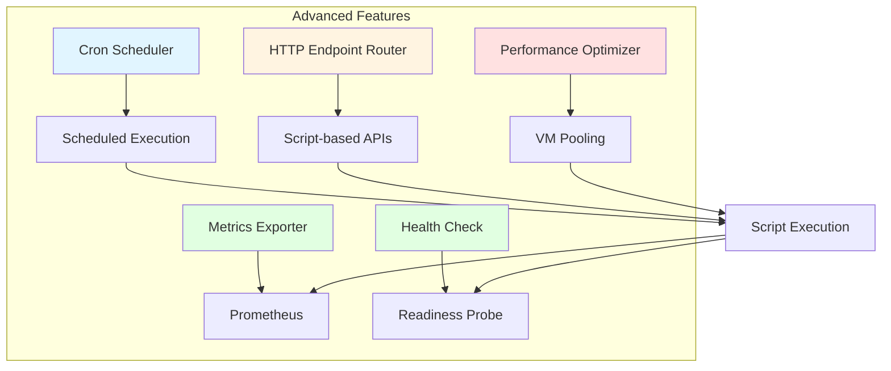
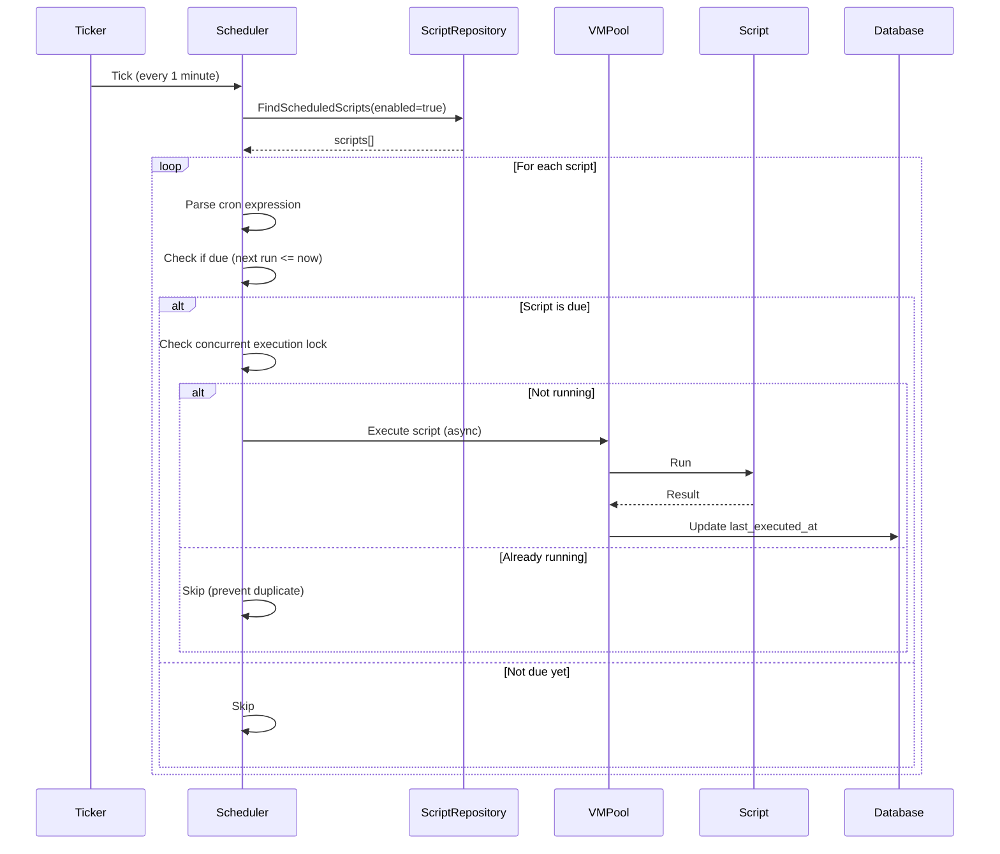
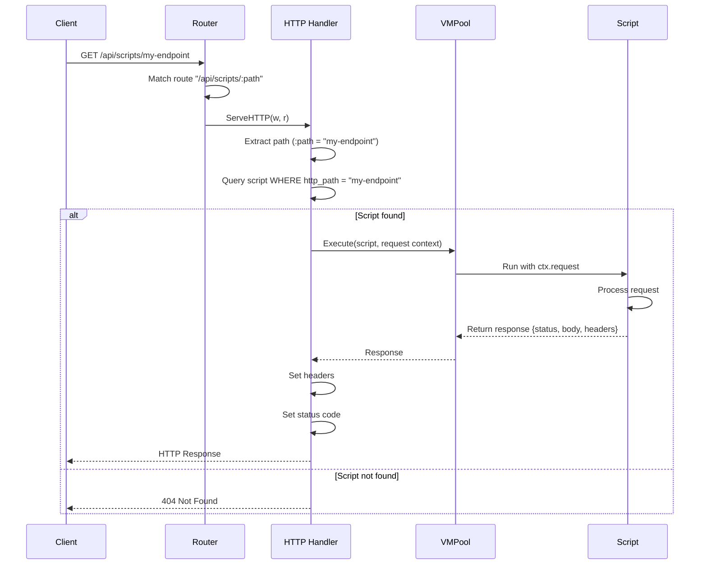
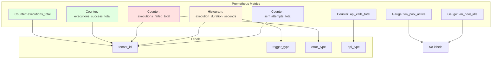
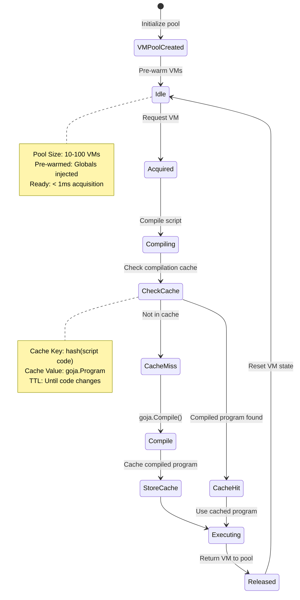
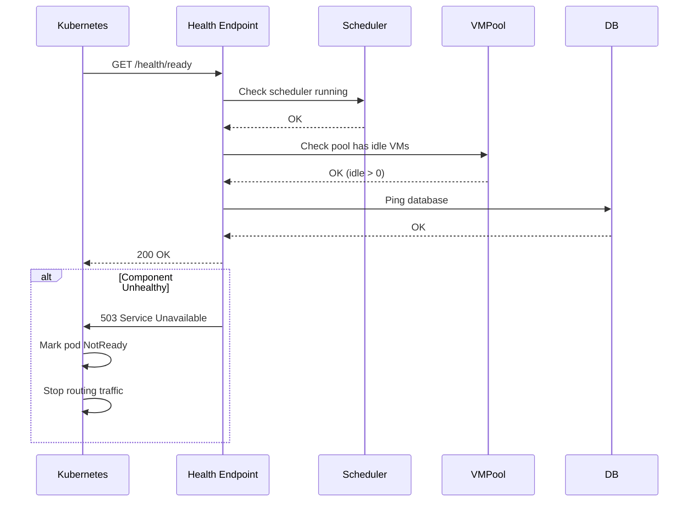

# JavaScript Runtime - Advanced Features Specification

## Overview

Advanced features enhance the JavaScript runtime with cron scheduling, HTTP endpoint registration, monitoring/metrics, performance optimization, and health checks for production readiness.



## What It Does

Advanced features enable:
- **Scheduled Execution** via cron expressions for periodic tasks
- **HTTP Endpoints** for script-based API routes
- **Monitoring** with Prometheus metrics for observability
- **Performance** optimization via VM pooling and compilation caching
- **Health Checks** for Kubernetes readiness and liveness probes

## How It Works

### Feature 1: Cron Scheduler



**What It Does:**
- Executes scripts on cron schedules (e.g., "0 0 * * *" for daily)
- Prevents concurrent execution of same script
- Updates last execution timestamp
- Supports standard cron syntax

**Cron Expression Format:**
```
┌───────────── minute (0 - 59)
│ ┌───────────── hour (0 - 23)
│ │ ┌───────────── day of month (1 - 31)
│ │ │ ┌───────────── month (1 - 12)
│ │ │ │ ┌───────────── day of week (0 - 6) (Sunday to Saturday)
│ │ │ │ │
* * * * *
```

**Examples:**
- `0 0 * * *` - Daily at midnight
- `*/5 * * * *` - Every 5 minutes
- `0 9-17 * * 1-5` - Hourly during business hours (Mon-Fri)
- `0 0 1 * *` - First day of every month

**Concurrency Prevention:**
```go
type SchedulerLock struct {
    runningScripts sync.Map // scriptID -> bool
}

func (s *Scheduler) Execute(scriptID UUID) {
    if _, loaded := s.runningScripts.LoadOrStore(scriptID, true); loaded {
        return // Already running, skip
    }
    defer s.runningScripts.Delete(scriptID)

    // Execute script...
}
```

**Database Fields:**
```sql
ALTER TABLE scripts ADD COLUMN schedule VARCHAR(100);
ALTER TABLE scripts ADD COLUMN last_executed_at TIMESTAMP;
ALTER TABLE scripts ADD COLUMN next_run_at TIMESTAMP;
```

### Feature 2: HTTP Endpoint Registration



**What It Does:**
- Registers scripts as HTTP endpoints
- Routes requests to scripts based on path matching
- Injects request context (method, headers, body, query params)
- Returns script response with custom status, headers, body

**Request Context Injection:**
```javascript
// Available in script via ctx.request
const request = {
    method: "GET",
    path: "/api/scripts/my-endpoint",
    headers: {
        "Content-Type": "application/json",
        "Authorization": "Bearer ..."
    },
    query: { page: "1", limit: "10" },
    body: { ... }, // Parsed JSON if Content-Type: application/json
    params: { id: "123" } // Path parameters
};

// Script returns response
return {
    status: 200,
    headers: { "Content-Type": "application/json" },
    body: { message: "Success", data: [...] }
};
```

**Route Registration:**
```go
router.HandleFunc("/api/scripts/{path:.*}", httpEndpointHandler)
```

**Database Fields:**
```sql
ALTER TABLE scripts ADD COLUMN http_path VARCHAR(255);
ALTER TABLE scripts ADD COLUMN http_method VARCHAR(10); -- GET, POST, PUT, DELETE
CREATE UNIQUE INDEX idx_scripts_http_path ON scripts(tenant_id, http_path, http_method);
```

**Security:**
- HTTP endpoints require authentication (same as web UI)
- RBAC permissions apply (scripts.execute)
- Tenant isolation enforced (query by tenant_id)
- Rate limiting applied per tenant

### Feature 3: Monitoring & Metrics



**What It Does:**
- Exposes Prometheus metrics for monitoring
- Tracks execution counts, durations, errors
- Monitors VM pool health and API usage
- Labels metrics by tenant, trigger type, error type

**Metric Definitions:**

**Counters:**
- `script_executions_total{tenant_id, trigger_type}` - Total executions
- `script_executions_success_total{tenant_id, trigger_type}` - Successful executions
- `script_executions_failed_total{tenant_id, trigger_type, error_type}` - Failed executions
- `script_api_calls_total{tenant_id, api_type}` - API calls (db, http, cache)
- `script_ssrf_attempts_total{tenant_id}` - Blocked SSRF attempts

**Histograms:**
- `script_execution_duration_seconds{tenant_id, trigger_type}` - Execution time distribution
    - Buckets: [0.1, 0.5, 1, 2, 5, 10, 30]

**Gauges:**
- `script_vm_pool_active` - Active VMs in pool
- `script_vm_pool_idle` - Idle VMs in pool
- `script_vm_pool_capacity` - Max VMs in pool

**Prometheus Query Examples:**
```promql
# P95 execution duration by tenant
histogram_quantile(0.95, sum(rate(script_execution_duration_seconds_bucket[5m])) by (tenant_id, le))

# Error rate by tenant
sum(rate(script_executions_failed_total[5m])) by (tenant_id) / sum(rate(script_executions_total[5m])) by (tenant_id)

# VM pool utilization
script_vm_pool_active / script_vm_pool_capacity
```

**Alerting Rules:**
```yaml
groups:
  - name: script_alerts
    rules:
      - alert: HighScriptErrorRate
        expr: sum(rate(script_executions_failed_total[5m])) by (tenant_id) / sum(rate(script_executions_total[5m])) by (tenant_id) > 0.1
        for: 5m
        annotations:
          summary: "High script error rate for tenant {{ $labels.tenant_id }}"

      - alert: VMPoolExhausted
        expr: script_vm_pool_idle == 0
        for: 2m
        annotations:
          summary: "VM pool has no idle VMs"

      - alert: SSRFAttemptsDetected
        expr: rate(script_ssrf_attempts_total[1m]) > 0
        for: 1m
        annotations:
          summary: "SSRF attempts detected for tenant {{ $labels.tenant_id }}"
```

### Feature 4: Performance Optimization



**What It Does:**
- **VM Pooling**: Reuses pre-initialized VMs to eliminate startup overhead
- **Compilation Caching**: Caches compiled JavaScript programs to skip parsing
- **Connection Pooling**: Reuses database connections across executions
- **Lazy Loading**: Only loads required modules and APIs

**VM Pool Benefits:**
- **Cold Start**: ~50ms (compile + initialize + execute)
- **Warm Start**: ~5ms (execute from pool)
- **Improvement**: 10x faster execution for frequent scripts

**Compilation Cache:**
```go
type CompilationCache struct {
    cache sync.Map // scriptID -> goja.Program
}

func (c *CompilationCache) Get(scriptID UUID, code string) (*goja.Program, bool) {
    if prog, ok := c.cache.Load(scriptID); ok {
        return prog.(*goja.Program), true
    }
    return nil, false
}

func (c *CompilationCache) Set(scriptID UUID, prog *goja.Program) {
    c.cache.Store(scriptID, prog)
}

func (c *CompilationCache) Invalidate(scriptID UUID) {
    c.cache.Delete(scriptID)
}
```

**Cache Invalidation:**
- On script update: Delete cached program
- On version change: Delete cached program
- On deployment: Clear all cache (optional)

**Connection Pooling:**
```go
// Database connection pool (shared across executions)
db, err := sql.Open("postgres", dsn)
db.SetMaxOpenConns(25)
db.SetMaxIdleConns(5)
db.SetConnMaxLifetime(5 * time.Minute)
```

### Feature 5: Health Checks



**What It Does:**
- Provides health check endpoints for Kubernetes
- Validates critical components (scheduler, VM pool, database)
- Supports readiness and liveness probes
- Enables graceful degradation

**Endpoints:**

**Readiness Probe** (`/health/ready`):
- Checks if service can handle requests
- Returns 200 if ready, 503 if not ready
- Checks:
    - [ ] Scheduler is running
    - [ ] VM pool has idle VMs (> 0)
    - [ ] Database is reachable (ping)
    - [ ] Event bus is connected

**Liveness Probe** (`/health/live`):
- Checks if service is alive (not deadlocked)
- Returns 200 if alive, 503 if dead
- Checks:
    - [ ] Goroutines are responsive (timeout < 1s)
    - [ ] No panic in main loop

**Kubernetes Configuration:**
```yaml
livenessProbe:
  httpGet:
    path: /health/live
    port: 8080
  initialDelaySeconds: 30
  periodSeconds: 10
  timeoutSeconds: 1
  failureThreshold: 3

readinessProbe:
  httpGet:
    path: /health/ready
    port: 8080
  initialDelaySeconds: 10
  periodSeconds: 5
  timeoutSeconds: 1
  failureThreshold: 2
```

**Graceful Shutdown:**
```go
func (s *Server) Shutdown(ctx context.Context) error {
    // Stop accepting new requests
    s.httpServer.Shutdown(ctx)

    // Stop scheduler (no new executions)
    s.scheduler.Stop()

    // Wait for in-flight executions (with timeout)
    s.vmPool.Drain(ctx)

    // Close database connections
    s.db.Close()

    return nil
}
```

## Acceptance Criteria

### Cron Scheduler
- [ ] Supports standard cron syntax (5-field)
- [ ] Executes scripts on schedule (±1 minute accuracy)
- [ ] Prevents concurrent execution of same script
- [ ] Updates last_executed_at and next_run_at fields
- [ ] Handles timezone configuration (UTC default)
- [ ] Logs scheduler errors to audit trail

### HTTP Endpoints
- [ ] Scripts register as HTTP endpoints via http_path field
- [ ] Routes match requests to scripts by path
- [ ] Request context injected (method, headers, body, query, params)
- [ ] Script response sets status, headers, body
- [ ] Supports GET, POST, PUT, DELETE methods
- [ ] Enforces authentication and RBAC permissions
- [ ] Rate limiting applied per tenant

### Monitoring & Metrics
- [ ] All metrics export to Prometheus at /metrics
- [ ] Execution duration tracked as histogram (p50, p95, p99)
- [ ] Success and failure counters labeled by tenant, trigger type
- [ ] VM pool gauges (active, idle, capacity)
- [ ] API call counters labeled by type (db, http, cache)
- [ ] SSRF attempt counter tracks blocked requests
- [ ] Metrics retained for 15 days minimum

### Performance Optimization
- [ ] VM pool pre-warms N VMs on startup (configurable)
- [ ] VM acquisition time < 1ms (p95)
- [ ] Compilation cache stores goja.Program per script
- [ ] Cache invalidates on script update
- [ ] Connection pooling limits max connections (25 default)
- [ ] Execution latency < 100ms for cached scripts (p95)

### Health Checks
- [ ] Readiness probe checks scheduler, VM pool, database
- [ ] Liveness probe checks goroutine responsiveness
- [ ] Endpoints return 200 OK when healthy, 503 when unhealthy
- [ ] Kubernetes integration tested (livenessProbe, readinessProbe)
- [ ] Graceful shutdown waits for in-flight executions
- [ ] Shutdown timeout configurable (default: 30s)

---

**Configuration:**
```yaml
jsruntime:
  scheduler:
    enabled: true
    tick_interval: 1m
    timezone: UTC

  http_endpoints:
    enabled: true
    base_path: /api/scripts
    rate_limit: 100/min

  metrics:
    enabled: true
    path: /metrics
    retention_days: 15

  vm_pool:
    size: 20
    max_idle: 10
    prewarm: true

  compilation_cache:
    enabled: true
    max_size: 1000
    ttl: 1h

  health_checks:
    readiness_path: /health/ready
    liveness_path: /health/live
    shutdown_timeout: 30s
```

**Performance Benchmarks:**
- Cron scheduler overhead: < 1% CPU
- HTTP endpoint latency: < 50ms (p95) for cached scripts
- VM pool acquisition: < 1ms (p95)
- Compilation cache hit rate: > 90%
- Metrics export latency: < 10ms
- Health check latency: < 5ms
