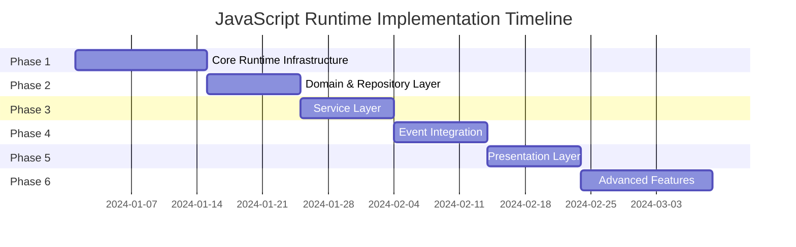
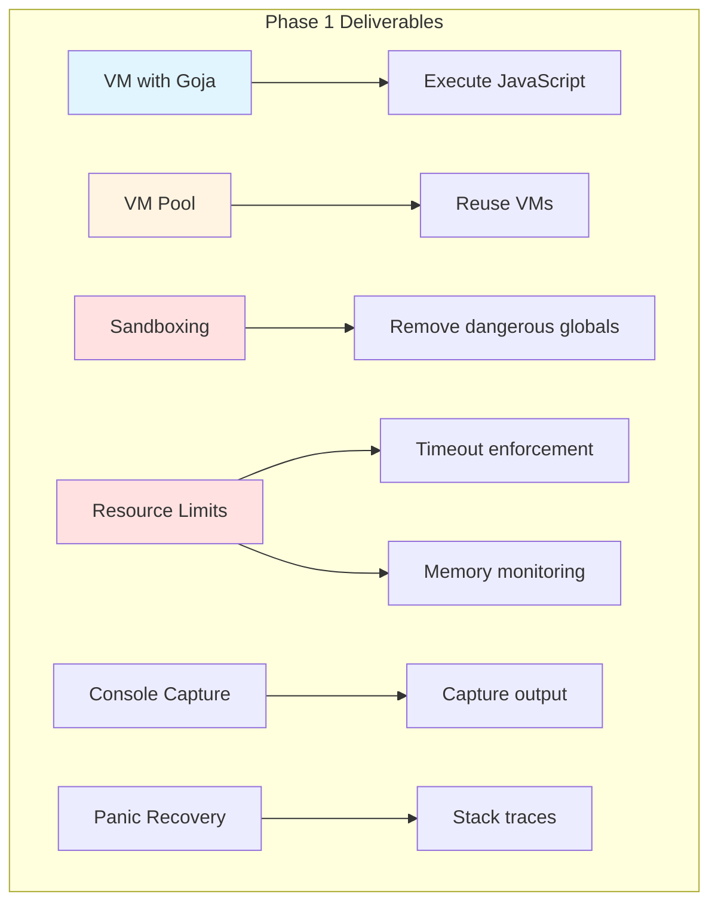
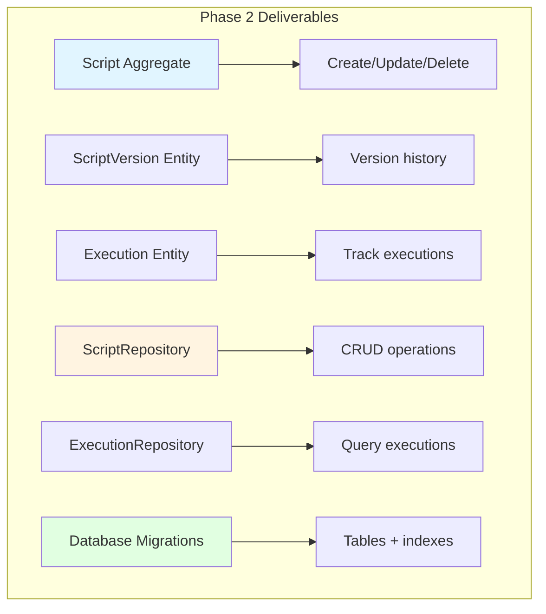
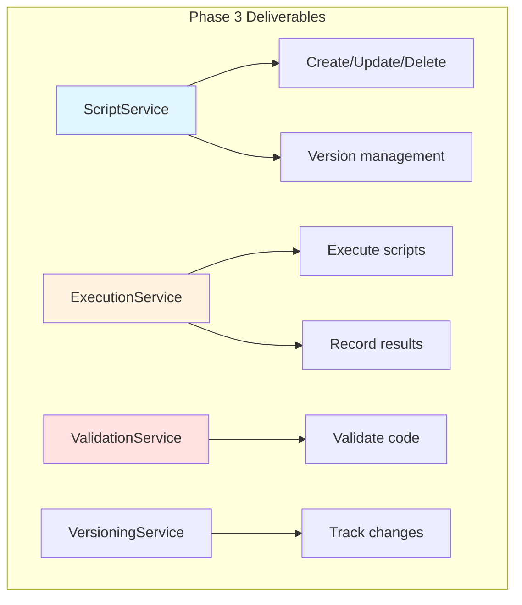
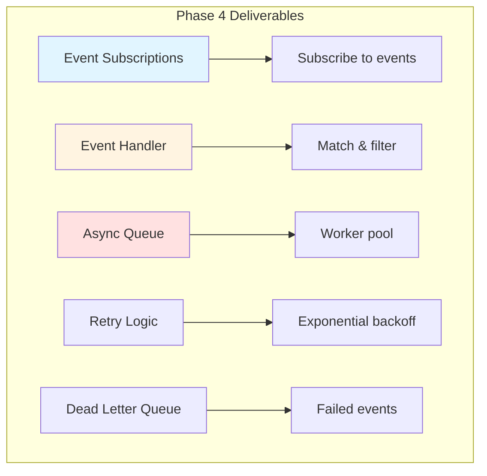
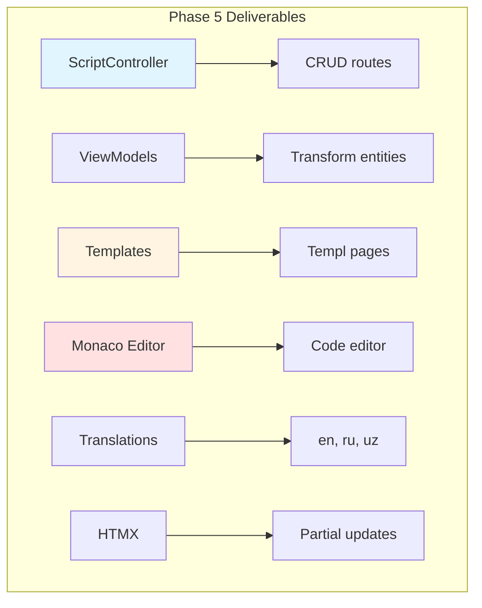
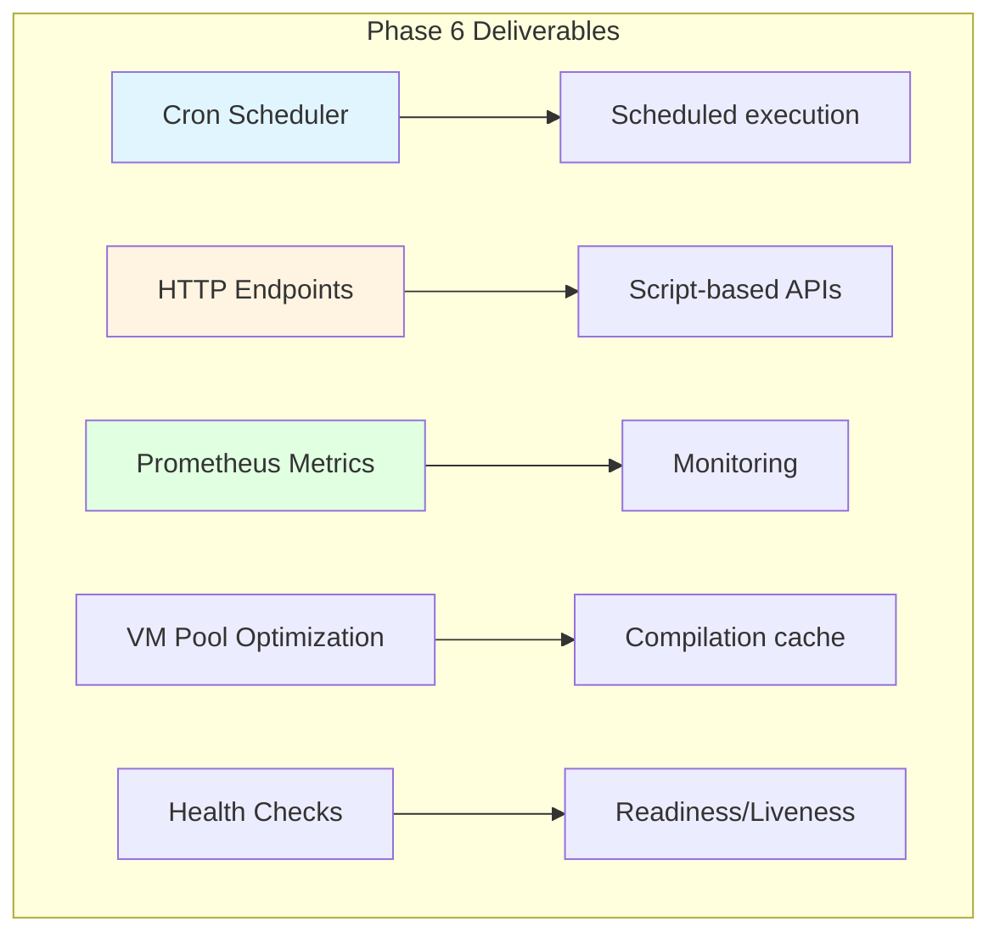
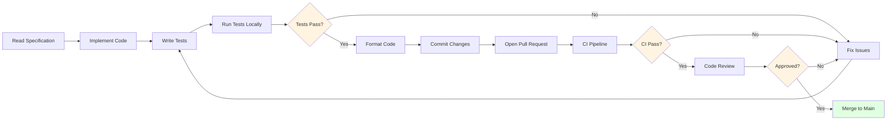
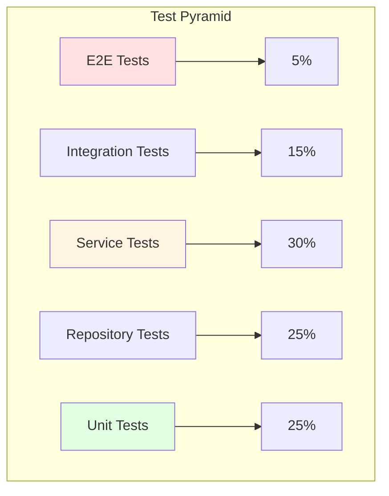

# JavaScript Runtime - Implementation Plan

## Overview

This plan breaks down the JavaScript Runtime feature into 6 phased milestones with clear dependencies, deliverables, testing requirements, and timelines. Each phase builds on the previous, enabling incremental delivery and validation.



## What It Does

The implementation plan:
- **Structures** development into manageable phases
- **Defines** clear acceptance criteria per phase
- **Identifies** dependencies between components
- **Estimates** realistic timelines
- **Prioritizes** core functionality before advanced features

## How It Works

### Phase 1: Core Runtime Infrastructure (Foundation)

**Duration:** 2 weeks
**Goal:** Build foundational JavaScript execution engine with sandboxing and resource controls



**Tasks:**
- [ ] Create `pkg/jsruntime/` package structure
- [ ] Implement `VM` struct with `goja` integration
- [ ] Implement `VMPool` with acquire/release pattern
- [ ] Add sandboxing (remove `eval`, `require`, `fetch`)
- [ ] Implement `ResourceLimits` configuration
- [ ] Add timeout enforcement via context cancellation
- [ ] Add memory usage monitoring (approximate)
- [ ] Implement panic recovery with stack traces
- [ ] Add console output capture
- [ ] Write unit tests (>80% coverage)

**Files to Create:**
```
pkg/jsruntime/
├── vm.go                    # VM struct, sandboxing, execution
├── vm_pool.go               # VM pool implementation
├── resource_limits.go       # ResourceLimits, ExecutionContext
├── console.go               # Console output capture
├── vm_test.go               # Unit tests
├── vm_pool_test.go          # Pool tests
└── resource_limits_test.go  # Limits tests
```

**Acceptance Criteria:**
- [ ] Can execute simple JavaScript with `console.log()`
- [ ] Dangerous globals (`eval`, `fetch`, `require`) are undefined
- [ ] Execution timeouts after configured duration (30s default)
- [ ] Panic recovery prevents VM crashes
- [ ] Console output is captured and returned
- [ ] VM pool can acquire/release VMs concurrently
- [ ] Memory usage monitoring works (approximate)
- [ ] Unit tests pass with >80% coverage

**Dependencies:** None (foundation layer)

---

### Phase 2: Domain & Repository Layer

**Duration:** 1.5 weeks
**Goal:** Define domain entities, value objects, and data persistence



**Tasks:**
- [ ] Define domain entities (Script, ScriptVersion, Execution)
- [ ] Define value objects (TriggerType, ExecutionStatus)
- [ ] Create repository interfaces in domain layer
- [ ] Implement repository in infrastructure layer
- [ ] Create database migration (7 tables)
- [ ] Add indexes for performance
- [ ] Add composite indexes for tenant isolation
- [ ] Write repository tests (ITF framework)

**Files to Create:**
```
modules/scripts/
├── domain/
│   ├── aggregates/
│   │   └── script.go
│   ├── entities/
│   │   ├── script_version.go
│   │   └── script_execution.go
│   ├── value_objects/
│   │   ├── trigger_type.go
│   │   └── execution_status.go
│   └── repositories/
│       ├── script_repository.go
│       └── execution_repository.go
├── infrastructure/
│   └── persistence/
│       ├── script_repository.go
│       ├── execution_repository.go
│       ├── script_repository_test.go
│       └── execution_repository_test.go
migrations/
└── {timestamp}_create_script_tables.sql
```

**Acceptance Criteria:**
- [ ] Script aggregate implements Create, Update, Delete, Enable, Disable
- [ ] ScriptVersion tracks code changes with timestamps
- [ ] Execution entity stores status, output, error, metrics
- [ ] All repositories enforce tenant isolation (tenant_id in WHERE)
- [ ] Migration creates all 7 tables with proper constraints
- [ ] Indexes exist for foreign keys and common queries
- [ ] Repository tests cover CRUD, pagination, filtering
- [ ] Migration reversibility tested (Up→Down→Up)

**Dependencies:** Phase 1 (VM execution)

---

### Phase 3: Service Layer

**Duration:** 1.5 weeks
**Goal:** Implement business logic and orchestration



**Tasks:**
- [ ] Implement ScriptService (CRUD operations)
- [ ] Implement ExecutionService (execute, record)
- [ ] Implement ValidationService (syntax check, forbidden patterns)
- [ ] Implement VersioningService (track changes, rollback)
- [ ] Add permission checks (`sdkcomposables.CanUser`)
- [ ] Add error wrapping (`serrors.E`)
- [ ] Write service tests (ITF framework)

**Files to Create:**
```
modules/scripts/
├── services/
│   ├── script_service.go
│   ├── execution_service.go
│   ├── validation_service.go
│   ├── versioning_service.go
│   ├── script_service_test.go
│   ├── execution_service_test.go
│   ├── validation_service_test.go
│   └── versioning_service_test.go
```

**Acceptance Criteria:**
- [ ] ScriptService creates scripts with automatic versioning
- [ ] ScriptService enforces RBAC permissions (create, update, delete)
- [ ] ExecutionService executes scripts with resource limits
- [ ] ExecutionService records output, errors, metrics to database
- [ ] ValidationService detects forbidden patterns (eval, require)
- [ ] VersioningService creates new version on code change
- [ ] Service tests cover happy path, errors, permissions
- [ ] All tests use ITF framework with parallel execution

**Dependencies:** Phase 1 (VM), Phase 2 (Repositories)

---

### Phase 4: Event Integration

**Duration:** 1.5 weeks
**Goal:** Enable scripts to react to domain events



**Tasks:**
- [ ] Create event subscription repository
- [ ] Implement event handler (subscribe to event bus)
- [ ] Implement filter engine for conditional matching
- [ ] Implement async queue with worker pool
- [ ] Implement retry logic with exponential backoff
- [ ] Implement Dead Letter Queue (DLQ) repository
- [ ] Add metrics (events_matched, executions_queued, dlq_events)
- [ ] Write integration tests (event flow end-to-end)

**Files to Create:**
```
modules/scripts/
├── domain/
│   └── repositories/
│       ├── event_subscription_repository.go
│       └── dead_letter_queue_repository.go
├── infrastructure/
│   └── persistence/
│       ├── event_subscription_repository.go
│       └── dead_letter_queue_repository.go
├── services/
│   ├── event_handler_service.go
│   ├── filter_engine_service.go
│   └── retry_service.go
migrations/
└── {timestamp}_add_event_subscriptions.sql
```

**Acceptance Criteria:**
- [ ] Scripts can subscribe to event types via database
- [ ] Event handler matches events to subscriptions
- [ ] Filter engine evaluates AND/OR rules against event data
- [ ] Async queue processes events with configurable worker pool
- [ ] Retry logic applies exponential backoff (2s, 4s, 8s)
- [ ] DLQ captures events after max retries
- [ ] Metrics track matched events, failures, DLQ entries
- [ ] Integration tests verify event flow end-to-end

**Dependencies:** Phase 3 (ExecutionService)

---

### Phase 5: Presentation Layer

**Duration:** 1.5 weeks
**Goal:** Build web UI for script management



**Tasks:**
- [ ] Implement ScriptController (Index, New, Create, Edit, Update, Delete, View, Execute)
- [ ] Implement ViewModels (ScriptViewModel, ExecutionViewModel)
- [ ] Create Templ templates (index, new, edit, view, partials)
- [ ] Integrate Monaco editor for code editing
- [ ] Add translations (en.toml, ru.toml, uz.toml)
- [ ] Add HTMX interactions (execute button, delete link, live executions)
- [ ] Add RBAC middleware to routes
- [ ] Write controller tests (ITF framework)

**Files to Create:**
```
modules/scripts/
├── presentation/
│   ├── controllers/
│   │   ├── script_controller.go
│   │   └── script_controller_test.go
│   ├── viewmodels/
│   │   ├── script_viewmodel.go
│   │   └── execution_viewmodel.go
│   ├── templates/
│   │   └── pages/
│   │       └── scripts/
│   │           ├── index.templ
│   │           ├── new.templ
│   │           ├── edit.templ
│   │           ├── view.templ
│   │           ├── _table.templ
│   │           └── _execution_row.templ
│   └── locales/
│       ├── en.toml
│       ├── ru.toml
│       └── uz.toml
```

**Acceptance Criteria:**
- [ ] All CRUD routes accessible and functional
- [ ] Monaco editor loads with JavaScript syntax highlighting
- [ ] Forms submit with CSRF tokens
- [ ] HTMX execute button updates execution history
- [ ] HTMX delete link removes script row with confirmation
- [ ] Translations complete for all 3 languages
- [ ] ViewModels format dates, enums, permissions
- [ ] Controller tests verify routes, permissions, HTMX responses
- [ ] UI responsive (mobile-friendly)

**Dependencies:** Phase 3 (Services)

---

### Phase 6: Advanced Features

**Duration:** 2 weeks
**Goal:** Add production-ready features (cron, HTTP endpoints, monitoring)



**Tasks:**
- [ ] Implement cron scheduler (ticker every 1 minute)
- [ ] Implement HTTP endpoint router (script-based APIs)
- [ ] Add Prometheus metrics (counters, histograms, gauges)
- [ ] Add compilation cache (goja.Program)
- [ ] Add health check endpoints (/health/ready, /health/live)
- [ ] Add graceful shutdown logic
- [ ] Write performance benchmarks
- [ ] Write end-to-end tests

**Files to Create:**
```
modules/scripts/
├── services/
│   ├── scheduler_service.go
│   ├── http_endpoint_service.go
│   └── metrics_service.go
├── infrastructure/
│   ├── scheduler.go
│   ├── http_router.go
│   └── metrics.go
pkg/jsruntime/
├── compilation_cache.go
└── health.go
```

**Acceptance Criteria:**
- [ ] Cron scheduler executes scripts on schedule (±1 minute)
- [ ] HTTP endpoints route requests to scripts by path
- [ ] Prometheus metrics export at /metrics
- [ ] Compilation cache reduces latency by 10x for frequent scripts
- [ ] Health checks return 200 OK when ready
- [ ] Graceful shutdown waits for in-flight executions
- [ ] Performance benchmarks verify targets (< 100ms p95)
- [ ] E2E tests verify full workflow (create → schedule → execute)

**Dependencies:** Phase 4 (Event Integration), Phase 5 (UI)

---

## Implementation Workflow

### Development Process



**Per Feature:**
1. Read specification for phase/component
2. Implement code following DDD patterns
3. Write tests (ITF framework, >80% coverage)
4. Run tests locally: `go test -v ./path -count=1`
5. Format code: `make fix imports && make fix fmt`
6. Commit changes: `git commit -m "feat: implement X"`
7. Open pull request with description
8. CI pipeline runs tests, linting, coverage
9. Code review by team
10. Merge to main after approval

### Testing Strategy



**Test Coverage Targets:**
- **Unit Tests** (25%): VM, VMPool, ResourceLimits, CompilationCache
- **Repository Tests** (25%): CRUD, pagination, tenant isolation
- **Service Tests** (30%): Business logic, validation, permissions
- **Integration Tests** (15%): Event flow, async queue, retry logic
- **E2E Tests** (5%): Full workflow (UI → Service → DB → Execution)

**Test Execution:**
- Run all: `make test` (10-minute timeout for full suite)
- Run targeted: `go test -v ./modules/scripts/services -run ^TestCreate$ -count=1`
- Run with coverage: `make test coverage`

### Risk Mitigation

**Identified Risks:**

| Risk | Mitigation |
|------|------------|
| Goja performance | Benchmark early (Phase 1), implement VM pooling (Phase 1), add compilation cache (Phase 6) |
| Memory leaks | Monitor memory usage (Phase 1), add limits (Phase 1), load test (Phase 6) |
| Security vulnerabilities | Implement sandboxing (Phase 1), SSRF protection (Phase 3), code review (all phases) |
| Database performance | Add indexes (Phase 2), use EXPLAIN ANALYZE (Phase 2), optimize queries (Phase 3) |
| Event queue backpressure | Configurable worker pool (Phase 4), buffered queue (Phase 4), metrics/alerts (Phase 6) |
| Deployment complexity | Health checks (Phase 6), graceful shutdown (Phase 6), documentation (all phases) |

### Success Metrics

**Performance:**
- [ ] Execution latency < 100ms (p95) for cached scripts
- [ ] Execution latency < 500ms (p95) for uncached scripts
- [ ] Event processing throughput > 100 events/sec
- [ ] VM pool acquisition < 1ms (p95)

**Reliability:**
- [ ] Success rate > 99% for valid scripts
- [ ] Retry logic recovers > 80% of transient failures
- [ ] DLQ captures < 1% of events

**Security:**
- [ ] 100% tenant isolation (no cross-tenant access)
- [ ] 100% RBAC enforcement (all routes protected)
- [ ] SSRF attempts blocked (0 successful attacks)

**Usability:**
- [ ] Page load time < 500ms (p95)
- [ ] Monaco editor initialization < 1s
- [ ] Form validation feedback < 50ms

## Acceptance Criteria (Overall)

### Phase Completion
- [ ] All 6 phases completed in sequence
- [ ] Each phase passes acceptance criteria before starting next
- [ ] All tests green (>80% coverage)
- [ ] All code reviewed and merged to main

### Production Readiness
- [ ] Feature flags enable/disable functionality
- [ ] Prometheus metrics export and alerting configured
- [ ] Health checks integrated with Kubernetes
- [ ] Documentation complete (README, API docs, runbooks)
- [ ] Load testing validates performance targets
- [ ] Security audit passes (OWASP Top 10)

### Migration & Rollout
- [ ] Database migrations tested (Up→Down→Up)
- [ ] Zero-downtime deployment validated
- [ ] Rollback plan documented and tested
- [ ] Feature released behind flag (phased rollout)
- [ ] Monitoring dashboards created (Grafana)
- [ ] Runbooks written for common issues

---

**Estimated Total Duration:** 10-12 weeks (2.5-3 months)

**Team Size:** 2-3 developers (backend/fullstack)

**Dependencies:**
- Event bus implementation (existing)
- RBAC system (existing)
- Multi-tenant infrastructure (existing)
- Prometheus setup (existing)
- Kubernetes cluster (existing)
