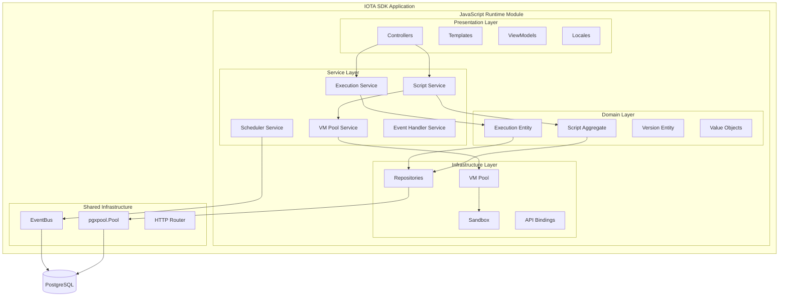

# Technical Spec: JavaScript Runtime

**Status:** Implementation Ready

## Architecture Overview

The JavaScript Runtime module is a self-contained IOTA SDK module following Domain-Driven Design (DDD) principles. It provides JavaScript execution capabilities with Goja VM engine, multi-tenant isolation, cron scheduling, HTTP endpoints, and event-driven script execution.

**Integration Points:**
- **Application Lifecycle**: Module registers routes, subscribes to lifecycle events (`app.started`, `app.stopping`)
- **EventBus**: Subscribes to all domain events, triggers matching scripts asynchronously
- **Database Pool**: Shares `pgxpool.Pool` with tenant isolation via composables
- **HTTP Router**: Registers script management routes and dynamic script endpoints

**Design Decision: Goja Runtime Engine**
- Pure Go implementation (no CGO dependencies)
- Memory safety via Go's environment
- Excellent Go-JavaScript interoperability
- ECMAScript 5.1+ compatibility with optimizations
- Trade-off: Slower than V8, but simpler deployment and cross-platform compatibility

## Implementation

### Domain Layer

**Aggregates:**
- **Script**: Root entity with execution triggers, resource limits, status
  - Functional options pattern for construction
  - Immutable setters (return new instances)
  - Business rules: name uniqueness per tenant, type-specific validation
  - Statuses: draft, active, paused, disabled, archived

**Entities:**
- **Execution**: Single script run with input/output, status, metrics
  - Lifecycle: pending → running → completed/failed/timeout
  - Captures duration, memory usage, API call count
- **Version**: Immutable snapshot of script source for audit trail
  - Sequential versioning (1, 2, 3, ...)
  - Created automatically on script create/update

**Value Objects:**
- **ScriptType**: scheduled, http, event, oneoff, embedded
- **ScriptStatus**: draft, active, paused, disabled, archived
- **ExecutionStatus**: pending, running, completed, failed, timeout, cancelled
- **ResourceLimits**: timeout, memory, API calls, output size
- **CronExpression**: cron syntax validation and next run calculation
- **TriggerData**: HTTP path/methods, event types, cron schedule

**Repository Interfaces** (defined in domain):
- `ScriptRepository`: CRUD, type-specific queries, pagination, search
- `ExecutionRepository`: CRUD, status queries, cleanup
- `VersionRepository`: retrieval, auto-increment versioning

### Service Layer

**Script Service:**
- CRUD operations with business validation
- Automatic version creation on updates
- Permission checks via `sdkcomposables.CanUser()`
- Name and HTTP path uniqueness validation
- Type-specific validation (cron, HTTP, event requirements)

**Execution Service:**
- Orchestrates script execution lifecycle
- Acquires VM from pool, executes with timeout
- Captures output, metrics, errors
- Updates execution status (pending → running → completed/failed)
- Publishes domain events (ExecutionStarted, ExecutionCompleted)

**VM Pool Service:**
- Manages VM lifecycle (create, warm-up, acquire, release, cleanup)
- Pool sizing: initial 10 VMs, max 100 VMs, per-tenant limit 5 VMs
- Idle timeout: 5 minutes → VM destroyed
- Warm-up: pre-load standard library and SDK APIs

**Scheduler Service:**
- Finds scripts due to run every minute
- Calculates next run time from cron expression
- Prevents overlapping executions via `is_running` lock
- Triggers execution via Execution Service
- Updates `next_run_at` and `last_run_status`

**Event Handler Service:**
- Subscribes to all domain events via EventBus wildcard (`*`)
- Matches events to scripts by event type and tenant
- Executes matching scripts asynchronously with event payload
- Retry logic: exponential backoff (2s, 4s, 8s), max 3 attempts
- Dead Letter Queue: captures permanently failed events

### Infrastructure Layer

**Repositories** (PostgreSQL):
- Interfaces in domain, implementations in infrastructure
- `composables.UseTx()` for transactions
- `composables.UseTenantID()` for tenant isolation (all queries include `WHERE tenant_id = $1`)
- Parameterized queries ($1, $2), SQL as constants
- `pkg/repo.QueryBuilder` for dynamic filters
- Mappers: database rows → domain entities (handle JSONB, arrays, nullables)

**VM Pool:**
- Pre-warmed Goja VMs for reduced latency (100ms+ → <10ms)
- VM states: available → acquired → executing → released → destroyed
- Dynamic expansion under load, contraction during idle
- Fair scheduling: round-robin across tenants

**Sandbox:**
- Restricted global scope (no `eval`, `require`, `import`, `fs`, `process`)
- Allowed globals: `console`, `JSON`, `Math`, `Date`, standard types
- Injected SDK APIs: `ctx.db`, `ctx.http`, `ctx.cache`, `ctx.events`, `ctx.logger`
- Frozen context objects to prevent tampering

**API Bindings:**
- Database: query, insert, update, delete (tenant-scoped automatically)
- HTTP: get, post, put, delete (SSRF protection)
- Cache: get, set, delete
- Events: publish
- Logger: info, warn, error

**Runtime Engine:**
- Compilation cache: LRU 1000 programs, cache key = source hash, 90%+ hit rate
- Resource limits: timeout (30s), memory (64MB), API calls (100), output (1MB)
- Error handling: syntax, runtime, timeout, panic recovery
- Performance: cold start <500ms, warm start <100ms, cached <50ms

**Cron Scheduler:**
- Standard 5-field cron syntax (minute, hour, day, month, weekday)
- Timezone support (default: UTC)
- Concurrency prevention via `sync.Map` lock

### Presentation Layer

**Controllers:**
- Script CRUD: list, create, update, delete
- Execution: manual trigger, view history
- HTTP endpoint handler: dynamic script-based routes
- Auth middleware via `middleware.Authorize()`
- DI with `di.H` for service dependencies

**ViewModels:**
- Transform domain entities to UI-friendly structures
- Located in `modules/jsruntime/presentation/viewmodels/`
- Pure transformation logic (no business logic)

**Templates:**
- Script listing, create/edit forms, execution history
- Monaco Editor integration for code editing
- HTMX interactions via `pkg/htmx` package
- CSRF tokens in forms

**Translations:**
- Multi-language support: en.toml, ru.toml, uz.toml
- Hierarchical keys: `JSRuntime.Form.FieldName`
- Enum patterns: `JSRuntime.Enums.ScriptType.SCHEDULED`

## Permissions

**Permission Keys:**
- `scripts.read` - View scripts and execution history
- `scripts.create` - Create new scripts
- `scripts.update` - Edit existing scripts
- `scripts.delete` - Delete scripts
- `scripts.execute` - Manually execute scripts

**Role Access:**

| Role | Access Level |
|------|--------------|
| Superadmin | Full access (all tenants) |
| Org Admin | Full access (own organization) |
| Developer | Read, Create, Execute (no Delete) |
| Viewer | Read only |

## Performance Considerations

**VM Pool Optimization:**
- Target pool hit rate: >95%
- Pool size: 2x CPU cores (starting point)
- Utilization target: 60-80%
- Worker pool pattern for parallel execution
- Circuit breaker for overload protection

**Database Query Optimization:**
- Index on `(tenant_id, status)` for active script lookups
- Index on `(tenant_id, type, status)` for type filtering
- Partial index on `cron_expression IS NOT NULL` for scheduler
- Composite index on `(tenant_id, http_path, http_methods)` for HTTP routing
- Use `EXPLAIN ANALYZE` to validate query plans

**Memory Management:**
- Max heap size per VM: 64MB
- Monitor via `runtime.MemStats`
- Memory pressure eviction (release idle VMs)
- `sync.Pool` for frequently allocated objects

**Concurrency Control:**
- Worker pool with bounded goroutines (max: 1000)
- Semaphore for concurrent executions per tenant
- `context.WithTimeout` for all script executions
- Graceful shutdown with drain period (30 seconds)

**Compilation Cache:**
- LRU cache: 1000 programs
- Cache hit rate: >90% target
- Invalidation on script updates
- Optional bytecode persistence to database

**Metrics Targets:**
- Cold start (new VM): <500ms
- Warm start (pooled VM): <100ms
- Cached execution: <50ms
- Throughput: 1000+ concurrent executions

## Security Considerations

**Defense in Depth Layers:**

1. **Input Validation**
   - Validate types, lengths, formats, required fields
   - Sanitize strings (strip HTML, escape SQL, no path traversal)
   - Script code max 100KB

2. **RBAC Permissions**
   - Route middleware checks permissions
   - Service layer checks permissions (defense in depth)
   - Template rendering hides unauthorized actions

3. **Tenant Isolation**
   - `tenant_id` in all database queries via `composables.UseTenantID(ctx)`
   - Row-level security at database level
   - Zero cross-tenant data access possible

4. **VM Sandboxing**
   - Remove dangerous globals: `eval`, `Function`, `require`, `import`, `fs`, `process`
   - Allow safe globals: `console`, `JSON`, `Math`, `Date`
   - Freeze injected context objects

5. **Resource Limits**
   - Execution timeout: 30s (configurable)
   - Memory limit: 64MB (configurable)
   - API call limit: 100 calls per execution
   - Output size: 1MB max

6. **SSRF Protection**
   - Block private IPs: 10.0.0.0/8, 172.16.0.0/12, 192.168.0.0/16
   - Block loopback: 127.0.0.0/8, ::1/128
   - Block cloud metadata: 169.254.169.254
   - DNS resolution validates all IPs before HTTP request

7. **Audit Trail**
   - Log all script changes (create, update, delete)
   - Log all executions (input, output, errors, metrics)
   - Retention: 90 days minimum
   - Immutable logs (append-only)

**Threat Mitigation:**
- Code Injection: Mitigated by VM sandboxing (no eval)
- SSRF: Mitigated by IP validation and DNS checks
- Resource Exhaustion: Mitigated by resource limits
- Data Leakage: Mitigated by tenant isolation
- Privilege Escalation: Mitigated by RBAC enforcement

## Dependencies

**Internal:**
- `modules/core` - User, organization, tenant management
- `pkg/composables` - Tenant context, transactions, pagination
- `pkg/htmx` - HTMX helpers for controllers
- `pkg/repo` - Dynamic query builder
- `pkg/serrors` - Error handling
- `application.Application` - Module registration, lifecycle
- `EventBus` - Event subscriptions and publishing

**External:**
- `github.com/dop251/goja` - JavaScript runtime engine
- `github.com/robfig/cron/v3` - Cron expression parsing
- `github.com/jackc/pgx/v5` - PostgreSQL driver
- `github.com/prometheus/client_golang` - Metrics export

## Testing Strategy

**Unit Tests:**
- Domain entities: validation, business rules, immutability
- Value objects: cron parsing, resource limits validation
- Mappers: database row to domain entity conversion

**Repository Tests:**
- CRUD operations with tenant isolation
- Unique constraint violations (name, HTTP path)
- Pagination and filtering
- Event/HTTP routing queries
- Transaction support

**Service Tests:**
- Script CRUD with versioning
- Execution lifecycle (pending → running → completed)
- Permission checks (authorized/unauthorized)
- Business rule validation (name uniqueness, type requirements)
- VM pool acquisition/release

**Integration Tests:**
- Cron scheduler triggers execution
- HTTP endpoint routes to script
- Event bus triggers matching scripts
- Retry logic and dead letter queue
- End-to-end script execution flow

**Performance Tests:**
- VM pool hit rate >95%
- Execution latency <100ms (warm pool)
- Throughput 1000+ concurrent executions
- Memory leak detection (long-running tests)

**Security Tests:**
- Cross-tenant access blocked
- SSRF attempts blocked
- Resource limit enforcement
- Sandbox escape attempts fail
- RBAC permission enforcement

**Manual Testing:**
- Monaco Editor integration
- UI responsiveness (HTMX)
- Error messages clarity
- Metrics dashboard accuracy

## Open Questions

- Should we support ES6+ features via Babel transpilation?
- What retention period for execution logs in production?
- Should we allow user-defined npm packages (with sandboxing)?
- How to handle long-running scripts (>30s)?
- Should we support WebAssembly execution in addition to JavaScript?
