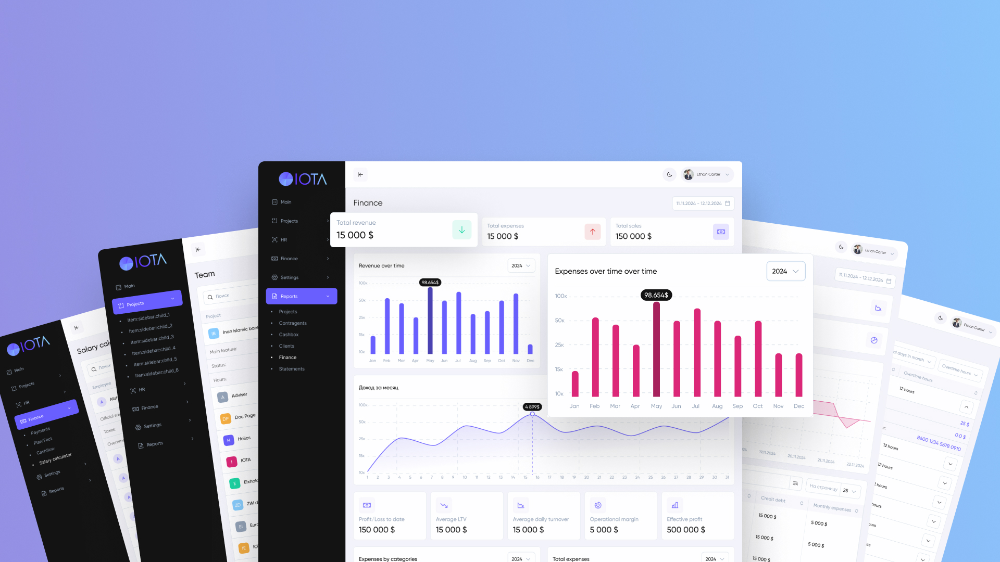

# IOTA SDK

## 🔗 Links

- [Discord Community](https://discord.gg/zKeTEZAQqF): Join our community for support and Q&A
- [Contribution Guide](docs/CONTRIBUTING.MD): Learn how to contribute to the project
- [Setup Demo](https://github.com/iota-uz/sdk-demo): Learn how to setup IOTA-SDK
- [Demo stand](https://demo.iotaerp.com): Explore the SDK UI
- [Docker hub](https://hub.docker.com/r/iotauz/sdk) - Official Docker images
- [Roadmap (Coming soon...)](docs/): Explore our upcoming features and milestones
- [Figma Designs (Coming soon...)](https://www.figma.com/): Access and contribute to our open-source designs

## 🛠 Built With

- [Go](https://go.dev): A statically typed, compiled programming language designed for high performance.
- [htmx](https://htmx.org): Enables modern interactivity with minimal JavaScript.
- [Alpine.js](https://alpinejs.dev): A lightweight JavaScript framework for reactive components.
- [Templ](https://templ.sh): A powerful templating system for building server-rendered web applications.

---  

## A Modular and Configurable ERP Solution

**IOTA SDK** is an open-source, modular, and feature-complete **ERP system** designed to adapt to multiple economic
sectors, including **finance**, **manufacturing**, and **warehouse management**. Inspired by leading platforms like
Odoo, IOTA SDK provides an intuitive framework to accelerate enterprise operations and unlock efficiency with powerful
tools and integrations.

---  

## 🚀 Key Features

- **Configurable Architecture**: Fully modular components to customize workflows.
- **Industry-Specific Modules**: Finance, manufacturing, warehouse management, and more.
- **GraphQL API**: Simplifies querying and data management.
- **Open Source**: Fully extensible and transparent.

---  

## 📅 Roadmap

We have an ambitious roadmap to enhance IOTA SDK's capabilities and provide a robust framework for ERP needs across
various industries. Here's what's in the pipeline:

### Core Modules

- **Finance & Accounting**: Develop comprehensive tools for managing financial operations, including general ledger,
  accounts payable/receivable, and payroll.

### Work In Progress

- **CRM**: Building a customer relationship management module to streamline client interactions and sales processes.
- **BI‑Chat**: Introducing a business intelligence chatbot for real-time data insights and reporting.

### Upcoming Features

- **HRM**: Integrate a human resources management module for employee onboarding, payroll, and benefits.
- **Password Vault**: Securely store and manage sensitive credentials within the platform.
- **DSL**: Integrate V8/Python for scripting and customizations.
- **Logging**: Implement a logging system for tracking user actions and system events.
- **Invoice and Document Generation**: Leverage [GOBL](https://github.com/invopop/gobl) for generating and managing
  invoices and other essential business documents.
- **Documentation Website**: Launch a comprehensive docs website to streamline onboarding and provide detailed guidance
  for developers and users.
- **Open Source Designs and Documentation**: Share Figma designs and other internal documentation to help the community
  understand the vision and contribute more effectively.

---  

## 📄 Licence

Apache 2.0 

Updated at Jan 6, 2025

## 🌟 Join Us

  

We welcome contributions to improve and expand IOTA SDK! Check out our [contributing guide](docs/CONTRIBUTING.MD) to get
started.

