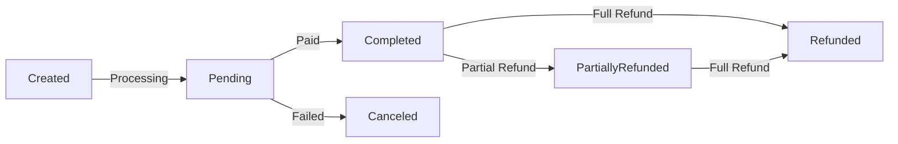
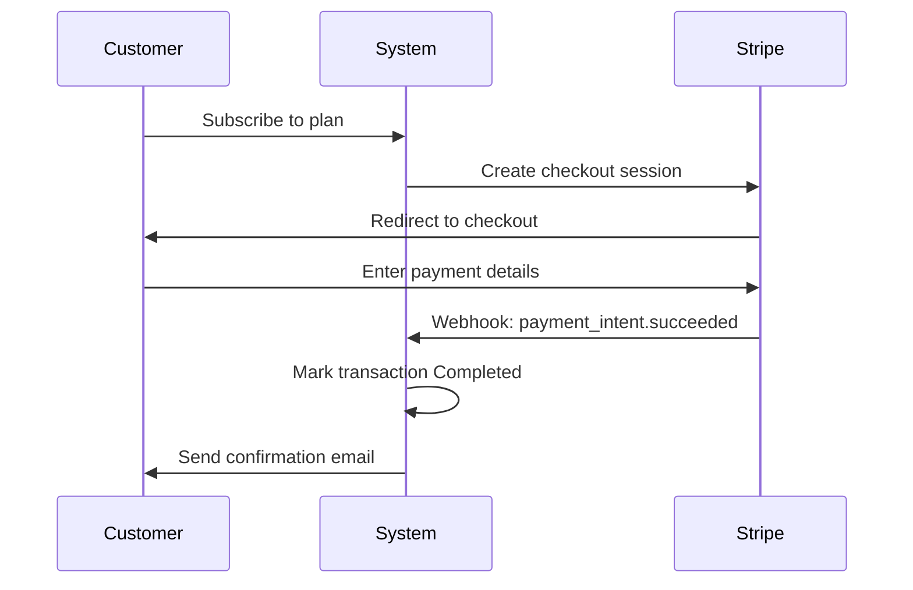
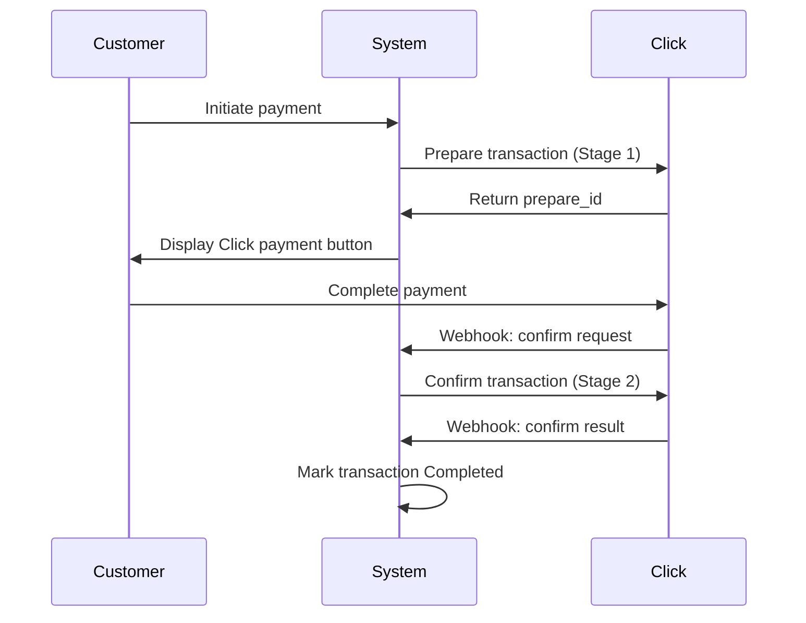
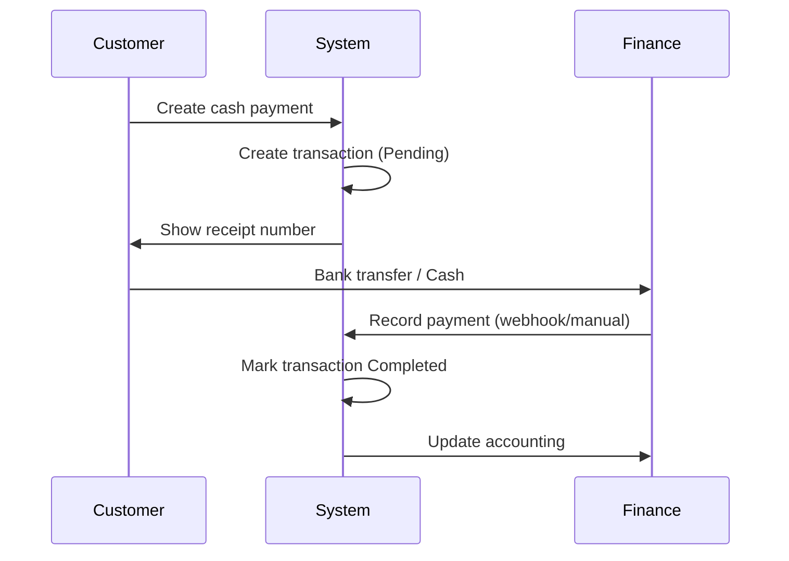

# Business Requirements

## Problem Statement

Organizations need to process payments from customers through multiple payment channels:

- **International payments** via Stripe for global customers
- **Regional payments** via Click, Payme, Octo for Central Asian markets
- **Manual payments** via cash for offline transactions
- **Custom integrations** via custom payment processors

The billing module must:

1. **Support multiple gateways** with unified transaction model
2. **Handle payment lifecycle** (pending → completed → refunded)
3. **Track transaction details** specific to each gateway
4. **Enable reconciliation** with payment processors
5. **Provide webhook support** for asynchronous confirmations
6. **Support refunds and cancellations** for customer service
7. **Maintain audit trail** for compliance and debugging

## Payment Gateways

### Stripe (International)

**Use Cases**:
- Subscription billing for SaaS products
- One-time payments from international customers
- Card processing
- Customer management

**Key Features**:
- Checkout sessions
- Subscription data (trial periods, billing info)
- Customer reference IDs
- Webhook-based confirmation

**Flow**:
```
1. Create Stripe session
2. Generate checkout URL
3. Customer redirects to Stripe
4. Stripe sends webhook: payment_intent.succeeded
5. Mark transaction as Completed
```

### Click (Uzbek Payment System)

**Use Cases**:
- Uzbek customer payments
- E-commerce transactions
- Merchant integration

**Key Features**:
- Prepare/Confirm flow (two-stage)
- Merchant and shop IDs
- Payment status tracking
- Service integration

**Flow**:
```
1. Client prepares transaction with merchant ID
2. Click generates payment link
3. Customer pays on Click UI
4. Click confirms transaction
5. System marks as Completed
```

### Payme (Uzbek Aggregator)

**Use Cases**:
- Uzbek e-wallet payments
- Multi-receiver payments
- Mobile money integration

**Key Features**:
- Account-based transactions
- Multi-receiver support
- State management (pending, completed, cancelled)
- Reason codes for failures

**Flow**:
```
1. Create transaction with account info
2. Payme handles payment routing
3. Payme sends state update
4. System marks transaction completed/cancelled
```

### Octo (Card Processing)

**Use Cases**:
- Direct card processing
- International transactions
- Risk assessment

**Key Features**:
- Card type and country tracking
- RRN (Retrieval Reference Number)
- Auto-capture options
- Risk levels

**Flow**:
```
1. Initialize Octo payment
2. Customer enters card details
3. Octo processes authorization
4. Callback updates transaction
5. Mark as Completed with card details
```

### Cash (Manual)

**Use Cases**:
- Cash payments
- Bank transfers
- Manual reconciliation

**Key Features**:
- No external integration
- Custom data storage
- Manual status update
- Flexible reconciliation

**Flow**:
```
1. Create cash transaction
2. Record receipt number/reference
3. Manually mark as Completed
4. Reconcile with bank statement
```

### Integrator (Custom)

**Use Cases**:
- Custom payment processors
- Legacy system integration
- Proprietary payment methods

**Key Features**:
- Flexible data structure
- Error code tracking
- Custom provider implementation
- Integration-specific logic

## Transaction Lifecycle

### Transaction States



### State Transitions

| From | To | Condition | Action |
|------|---|---------| -------|
| Created | Pending | Transaction created in system | Initial state |
| Pending | Completed | Payment processor confirms | Mark complete, publish event |
| Pending | Canceled | Payment fails/timeout | Clean up, notify customer |
| Completed | Refunded | Full refund requested | Process refund with provider |
| Completed | PartiallyRefunded | Partial refund requested | Process partial refund |
| PartiallyRefunded | Refunded | Remainder refunded | Complete refund cycle |

## Payment Workflows

### Stripe Subscription Flow



### Click Two-Stage Flow



### Cash/Manual Flow



## Business Rules

### Transaction Rules

1. **Immutable Creation Fields**: Once created, ID, TenantID, Gateway cannot change
2. **Amount Precision**: Stored in cents (no floating-point)
3. **Currency Support**: ISO 4217 codes (UZS, USD, EUR, etc.)
4. **Status Transitions**:
   - Pending → Completed, Canceled
   - Completed → Refunded, PartiallyRefunded
   - PartiallyRefunded → Refunded
   - No other transitions allowed

5. **Refund Constraints**:
   - Full refund: Refund amount = Transaction amount
   - Partial refund: Refund amount < Transaction amount
   - Cannot refund more than transaction amount

6. **Provider Integration**:
   - Provider creates details object
   - Details contain provider-specific state
   - Provider handles external communication

### Gateway-Specific Rules

#### Stripe Rules
- Session ID must be unique within tenant
- Client reference ID used for idempotency
- Subscription data optional but recommended for subscriptions
- Items list defines what's being purchased

#### Click Rules
- Merchant ID and Service ID from Click dashboard
- Prepare must succeed before confirm
- Prepare ID stored for transaction tracking
- Payment status codes defined by Click

#### Payme Rules
- Merchant ID identifies organization in Payme
- Account field maps to customer/invoice
- State codes: 0 (new), 1 (confirmed), 2 (cancelled)
- Receivers enable split payments

#### Octo Rules
- Shop ID identifies merchant
- Auto-capture can be on or off
- RRN only available after authorization
- Test flag indicates sandbox vs. production

#### Cash Rules
- Data field is flexible JSON
- Must include provider reference (receipt #, check #)
- Manual status updates by finance team
- Requires audit trail for SOX compliance

## Reconciliation

### Daily Reconciliation Process

```
1. Download transactions from gateway
2. Match with system transactions by ID/reference
3. Identify discrepancies:
   - Missing in system (create record)
   - Missing in gateway (investigate)
   - Amount mismatch (flag for investigation)
4. Report discrepancies to finance team
5. Archive successful reconciliation
```

### Gateway Callbacks/Webhooks

**Stripe**:
- Listens on `payment_intent.succeeded`
- Updates transaction to Completed
- Handles `charge.refunded` for refunds

**Click**:
- Validates Click signature
- Processes prepare and confirm callbacks
- Updates payment status

**Payme**:
- Validates merchant ID
- Processes state changes
- Handles receiver confirmations

**Octo**:
- Validates signature
- Updates transaction with card details
- Handles risk assessment

## Refund Policy

### Full Refunds

**Allowed for**:
- Canceled transactions (no refund needed)
- Completed transactions within refund window (typically 90 days)

**Process**:
1. Retrieve original transaction
2. Verify refundable status
3. Call provider refund API
4. Mark transaction as Refunded
5. Send customer refund confirmation

### Partial Refunds

**Allowed for**:
- Overpayment (customer paid too much)
- Disputed charges (partial resolution)
- Item returns (refund specific items)

**Process**:
1. Retrieve original transaction
2. Verify refund amount ≤ remaining balance
3. Call provider partial refund API
4. Mark transaction as PartiallyRefunded
5. Update customer invoice

## Error Handling

### Provider-Specific Errors

**Stripe**:
- Card declined → Retry or use different card
- Expired card → Update payment method
- Unauthorized → 3D Secure required

**Click**:
- Prepare failed → Check merchant ID
- Confirm timeout → Payment may still process
- Invalid signature → Check Click settings

**Payme**:
- Service unavailable → Retry with backoff
- Invalid account → Check account format
- Receiver not found → Update receivers list

**Octo**:
- Card limit exceeded → Try lower amount
- Fraud detected → Contact support
- Technical error → Retry transaction

### System Error Handling

- Network errors: Retry with exponential backoff
- Database errors: Rollback transaction, notify operator
- Validation errors: Return error to user
- Timeout errors: Mark as pending, manual reconciliation

## Compliance & Security

### PCI Compliance

- **Never store**: Full card numbers, CVV
- **Card data handling**: Use tokenization (provider-managed)
- **Logs**: Sanitize sensitive data
- **Encryption**: TLS for all provider communication

### Audit Trail

- **Log every**: Transaction state change, refund, cancellation
- **Include**: User, timestamp, reason, amount
- **Retention**: Keep indefinitely for compliance
- **Access**: Restrict to authorized personnel only

### Anti-Fraud

- **Duplicate detection**: Check for duplicate transactions in short timeframe
- **Velocity checks**: Limit transactions per customer per timeframe
- **Amount limits**: Set per-transaction and per-customer limits
- **Monitoring**: Alert on unusual patterns

## Reporting

### Financial Reports

1. **Revenue Report**:
   - Completed transactions by period
   - By customer, product, region
   - By payment method

2. **Refund Report**:
   - Refunds by reason
   - Refund rate analysis
   - Trend tracking

3. **Payment Gateway Report**:
   - Transactions by gateway
   - Success rate per gateway
   - Failed transaction analysis

### Operational Reports

1. **Settlement Report**:
   - Settled amounts by gateway
   - Pending settlements
   - Settlement timeline

2. **Reconciliation Report**:
   - Successfully reconciled transactions
   - Discrepancies
   - Manual adjustments

3. **Support Report**:
   - Refund requests
   - Dispute handling
   - Customer communications

## Success Criteria

1. **Payment Processing**: 99.9% transaction success rate
2. **Latency**: <500ms transaction creation
3. **Reconciliation**: Daily reconciliation within 24 hours
4. **Error Handling**: <0.1% provider integration failures
5. **Security**: 100% PCI compliance
6. **Audit Trail**: Complete transaction history for 7+ years
7. **Multi-Gateway**: Support all target payment processors
8. **Customer Experience**: Clear payment status and confirmations
