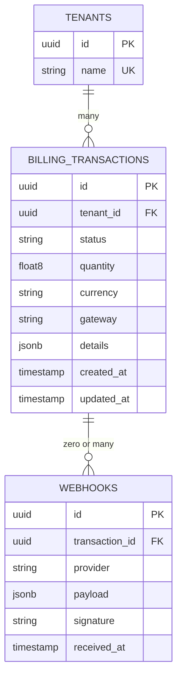
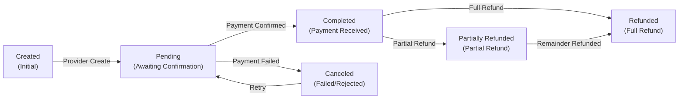

# Data Model

## Entity Relationship Diagram



## Database Schema

### Billing Transactions Table

**Purpose**: Store payment transaction records with gateway-specific details

```sql
CREATE TABLE billing_transactions (
    id uuid PRIMARY KEY DEFAULT gen_random_uuid(),
    tenant_id uuid NOT NULL REFERENCES tenants(id) ON DELETE CASCADE,
    status varchar(50) NOT NULL,
    quantity float8 NOT NULL,
    currency varchar(3) NOT NULL,
    gateway varchar(50) NOT NULL,
    details jsonb NOT NULL,
    created_at timestamp with time zone DEFAULT now(),
    updated_at timestamp with time zone DEFAULT now(),
    CHECK (gateway IN ('click', 'payme', 'octo', 'stripe', 'cash', 'integrator')),
    CHECK (status IN ('pending', 'completed', 'canceled', 'refunded', 'partially_refunded'))
);

CREATE INDEX billing_transactions_tenant_id_idx ON billing_transactions(tenant_id);
CREATE INDEX billing_transactions_status_idx ON billing_transactions(status);
CREATE INDEX billing_transactions_gateway_idx ON billing_transactions(gateway);
CREATE INDEX billing_transactions_created_at_idx ON billing_transactions(created_at);
CREATE INDEX billing_transactions_details_gin ON billing_transactions USING gin(details);
```

**Columns**:

- `id` (UUID): Unique transaction identifier
  - Auto-generated using `gen_random_uuid()`
  - Immutable after creation
  - Global uniqueness (UUID v4)

- `tenant_id` (UUID): Multi-tenant isolation
  - Required (NOT NULL)
  - Foreign key to `tenants` table
  - Cascade delete: Removing tenant removes transactions
  - Indexed for efficient queries

- `status` (VARCHAR 50): Transaction state
  - Required (NOT NULL)
  - Values: `pending`, `completed`, `canceled`, `refunded`, `partially_refunded`
  - CHECK constraint enforces valid values
  - Indexed for status queries

- `quantity` (FLOAT8): Amount in cents
  - Required (NOT NULL)
  - Minor currency units (cents for USD, fils for AED, tiyn for UZS)
  - Examples:
    - 100 UZS = 100.0
    - 10.50 USD = 1050.0
  - Stored as float for precision with typical currency amounts

- `currency` (VARCHAR 3): ISO 4217 currency code
  - Required (NOT NULL)
  - Examples: `USD`, `EUR`, `UZS`, `AED`
  - No FK constraint (supports any ISO code)
  - Paired with quantity for complete amount

- `gateway` (VARCHAR 50): Payment processor
  - Required (NOT NULL)
  - Values: `click`, `payme`, `octo`, `stripe`, `cash`, `integrator`
  - CHECK constraint enforces valid values
  - Indexed for gateway-specific queries
  - Determines details format and provider handling

- `details` (JSONB): Gateway-specific transaction data
  - Required (NOT NULL, but can be empty {})
  - JSON Binary format (JSONB for efficient querying)
  - Structure varies by gateway:
    - **Stripe**: Session IDs, subscription data, items
    - **Click**: Merchant IDs, prepare/confirm IDs, payment status
    - **Payme**: Transaction states, accounts, receivers
    - **Octo**: Card info, RRN, risk levels
    - **Cash**: Custom data map (receipt #, etc.)
    - **Integrator**: Custom data with error codes

- `created_at` / `updated_at` (TIMESTAMPTZ): Temporal tracking
  - Automatic timestamps
  - Support audit trails and sorting
  - `created_at` never changes (immutable)
  - `updated_at` updates on status change or refund

**Constraints**:
- Primary Key: `id`
- Foreign Key: `tenant_id` (cascade)
- Check: Valid gateway values
- Check: Valid status values
- Unique: None (ID is sufficient)

**Indexes**:
- `tenant_id` (essential for multi-tenant queries)
- `status` (for status filtering)
- `gateway` (for provider-specific queries)
- `created_at` (for reporting/sorting)
- `details` GIN (for JSON field searching)

## Details JSON Schema

### Stripe Details

```json
{
  "mode": "payment|subscription",
  "billing_reason": "subscription_cycle|customer_request",
  "session_id": "cs_live_a1b2c3d4e5f6g7h8...",
  "client_reference_id": "invoice-123",
  "invoice_id": "in_1234567890abcdef...",
  "subscription_id": "sub_1234567890abcdef...",
  "customer_id": "cus_abcdef123456...",
  "subscription_data": {
    "description": "Premium subscription",
    "trial_period_days": 14
  },
  "items": [
    {
      "price_id": "price_1234567890abcdef...",
      "quantity": 1,
      "adjustable_quantity": {
        "enabled": true,
        "minimum": 1,
        "maximum": 10
      }
    }
  ],
  "success_url": "https://example.com/success?session_id={CHECKOUT_SESSION_ID}",
  "cancel_url": "https://example.com/cancel",
  "url": "https://checkout.stripe.com/pay/cs_test_..."
}
```

### Click Details

```json
{
  "service_id": 12345,
  "merchant_id": 9876,
  "merchant_user_id": 555,
  "merchant_trans_id": "inv-12345",
  "merchant_prepare_id": 1234567890,
  "merchant_confirm_id": 1234567891,
  "pay_doc_id": 9999,
  "payment_id": 8888,
  "payment_status": 1,
  "sign_time": "20231215101530",
  "sign_string": "hash_signature_here",
  "error_code": 0,
  "error_note": "",
  "link": "https://click.uz/pay/?token=abc123",
  "params": {
    "invoice_id": "INV-001",
    "customer": "John Doe"
  }
}
```

### Payme Details

```json
{
  "merchant_id": "01234567890123456789",
  "id": "2023123101530123456789",
  "transaction": "2023123101530123456789",
  "state": 2,
  "time": 1702558500000,
  "created_time": 1702558400000,
  "perform_time": 1702558500000,
  "cancel_time": null,
  "account": {
    "invoice_id": "INV-001"
  },
  "receivers": [
    {
      "id": "user123",
      "amount": 100000000
    }
  ],
  "additional": {
    "detail": "Payment for invoice INV-001"
  },
  "reason": 0,
  "error_code": 0,
  "link": "https://checkout.paycom.uz/",
  "params": {}
}
```

### Octo Details

```json
{
  "octo_shop_id": 12345,
  "shop_transaction_id": "ORDER-001",
  "octo_payment_uuid": "550e8400-e29b-41d4-a716-446655440000",
  "init_time": "2023-12-15T10:15:30Z",
  "auto_capture": true,
  "test": false,
  "status": "SUCCESS",
  "description": "Order #001",
  "card_type": "VISA",
  "card_country": "KZ",
  "card_is_physical": true,
  "card_masked_pan": "400000****0002",
  "rrn": "123456789012",
  "risk_level": 1,
  "refunded_sum": 0,
  "transfer_sum": 100000,
  "return_url": "https://example.com/return",
  "notify_url": "https://example.com/notify",
  "octo_pay_url": "https://pay.octo.uz/pay?id=...",
  "signature": "signature_hash",
  "hash_key": "merchant_hash_key",
  "payed_time": "2023-12-15T10:15:45Z",
  "error": 0,
  "err_message": ""
}
```

### Cash Details

```json
{
  "receipt_number": "RCP-2023-001",
  "payment_date": "2023-12-15",
  "payment_method": "cash|bank_transfer",
  "payer_name": "John Doe",
  "notes": "Payment for invoice INV-001"
}
```

### Integrator Details

```json
{
  "provider_name": "CustomProvider",
  "provider_transaction_id": "tx_12345",
  "provider_reference": "REF-001",
  "data": {
    "custom_field_1": "value1",
    "custom_field_2": "value2"
  },
  "error_code": 0,
  "error_note": ""
}
```

## Data Types Rationale

### FLOAT8 for Quantity

**Decision**: Use FLOAT8 for amount storage

**Rationale**:
- Typical currency amounts fit within double precision
- Simpler to work with than BIGINT cents conversion
- PostgreSQL FLOAT8 can represent integer values exactly
- SUM/AVG aggregates work directly without conversion

**Alternative Rejected**: DECIMAL
- Would require more storage (12+ bytes)
- Slower aggregation operations
- Overkill for typical payment amounts

### JSONB for Details

**Decision**: Use JSONB (not TEXT or separate tables) for gateway details

**Rationale**:
- Gateway-specific schema varies significantly
- JSONB supports efficient querying with indices
- No schema migration needed to add new gateway
- Flexible for future provider requirements
- Supports complex nested structures

**GIN Index Pattern**:
```sql
-- Query by Click merchant ID
SELECT * FROM billing_transactions
WHERE gateway = 'click' AND details->>'merchant_id' = '9876'

-- Query by Stripe session ID
SELECT * FROM billing_transactions
WHERE gateway = 'stripe' AND details->>'session_id' = 'cs_live_...'
```

## Transaction State Machine



**State Descriptions**:
- **Created**: Transaction initialized, may transition to Pending or Completed
- **Pending**: Awaiting payment processor confirmation
- **Completed**: Payment received and confirmed
- **Canceled**: Payment failed, rejected, or timed out
- **Refunded**: Full refund issued to customer
- **PartiallyRefunded**: Partial refund issued, remainder refundable

## Storage Estimates

### Typical Record Sizes

**Base Transaction**: ~150 bytes
- id: 16 bytes
- tenant_id: 16 bytes
- status, gateway, currency: 30 bytes
- quantity: 8 bytes
- timestamps: 16 bytes
- JSON details overhead: ~30 bytes

**Details Size by Gateway**:
- Stripe: 200-500 bytes (subscription data, items)
- Click: 300-400 bytes (merchant IDs, links)
- Payme: 250-400 bytes (receivers, additional)
- Octo: 350-450 bytes (card details, risk)
- Cash: 100-200 bytes (minimal data)
- Integrator: 150-300 bytes (variable custom data)

### Growth Projections

| Metric | 100K Trans | 1M Trans | 10M Trans |
|--------|-----------|----------|-----------|
| Data Size | ~100 MB | ~1 GB | ~10 GB |
| With Indexes | ~400 MB | ~4 GB | ~40 GB |
| Yearly Growth (100 Trans/Day) | ~36 GB | ~360 GB | ~3.6 TB |

## Indexing Strategy

### Essential Indexes

```sql
-- Multi-tenant queries (every query filters by tenant_id)
CREATE INDEX billing_transactions_tenant_id_idx
ON billing_transactions(tenant_id);

-- Status filtering (common operation)
CREATE INDEX billing_transactions_status_idx
ON billing_transactions(status);

-- Gateway-specific queries
CREATE INDEX billing_transactions_gateway_idx
ON billing_transactions(gateway);

-- JSON field searching (Click merchant, Stripe session, etc.)
CREATE INDEX billing_transactions_details_gin
ON billing_transactions USING gin(details);
```

### Composite Indexes (Performance)

```sql
-- Common query: Find pending transactions for a tenant
CREATE INDEX billing_transactions_tenant_status_idx
ON billing_transactions(tenant_id, status);

-- Common query: Find recent transactions by gateway
CREATE INDEX billing_transactions_gateway_created_idx
ON billing_transactions(gateway, created_at DESC);
```

## Performance Considerations

### Query Patterns

**Frequent Queries**:
1. Get transaction by ID (PK)
2. List pending transactions for tenant
3. Find completed transactions for reporting
4. Search by gateway-specific field
5. Recent transactions (created_at DESC)

**Index Usage**:
- Tenant ID: Essential (every query)
- Status: Common (filter by state)
- Gateway: Common (provider-specific queries)
- JSON details: Occasional (advanced searches)
- Created at: Reporting/sorting

### Optimization Strategies

1. **Tenant Partitioning** (future):
   - Partition by tenant_id for very large deployments
   - Improves query performance and maintenance

2. **JSON Indexing** (present):
   - GIN index on details for provider-specific searches
   - Supports efficient queries like `details->>'merchant_id' = ?`

3. **Archival Strategy** (recommended):
   - Archive completed transactions >1 year old
   - Keeps active table lean for faster queries
   - Maintain separate archive table for historical access

## Webhook/Callback Storage

**Optional**: Store webhook payloads for debugging

```sql
CREATE TABLE billing_webhooks (
    id uuid PRIMARY KEY DEFAULT gen_random_uuid(),
    transaction_id uuid REFERENCES billing_transactions(id),
    provider varchar(50) NOT NULL,
    payload jsonb NOT NULL,
    signature varchar(255),
    received_at timestamp with time zone DEFAULT now(),
    processed_at timestamp with time zone
);

CREATE INDEX billing_webhooks_transaction_id_idx
ON billing_webhooks(transaction_id);
CREATE INDEX billing_webhooks_provider_idx
ON billing_webhooks(provider);
```

Benefits:
- Audit trail of all webhook events
- Replay capabilities for failed processing
- Debugging provider integration issues
- Compliance and monitoring

## Migration Reference

See `migrations/changes-1761729594.sql` for schema updates:
- Extends gateway CHECK constraint to support cash and integrator
- Modifies existing billing_transactions table
- Maintains backward compatibility
- Includes up/down migration pairs

## Access Patterns

### By Tenant
```sql
SELECT * FROM billing_transactions
WHERE tenant_id = $1
ORDER BY created_at DESC
LIMIT 20;
```

### By Status
```sql
SELECT COUNT(*) FROM billing_transactions
WHERE tenant_id = $1 AND status = 'pending';
```

### By Gateway
```sql
SELECT * FROM billing_transactions
WHERE tenant_id = $1 AND gateway = 'stripe'
ORDER BY created_at DESC;
```

### By Details Field (Click merchant)
```sql
SELECT * FROM billing_transactions
WHERE tenant_id = $1
  AND gateway = 'click'
  AND details->>'merchant_id' = '9876'
ORDER BY created_at DESC;
```

### For Reconciliation
```sql
SELECT gateway, status, COUNT(*) as count, SUM(quantity) as total
FROM billing_transactions
WHERE tenant_id = $1
  AND created_at >= date_trunc('day', NOW() - INTERVAL '1 day')
GROUP BY gateway, status;
```
