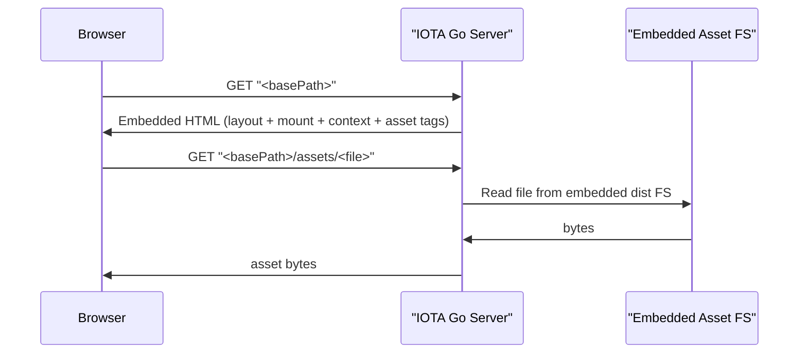
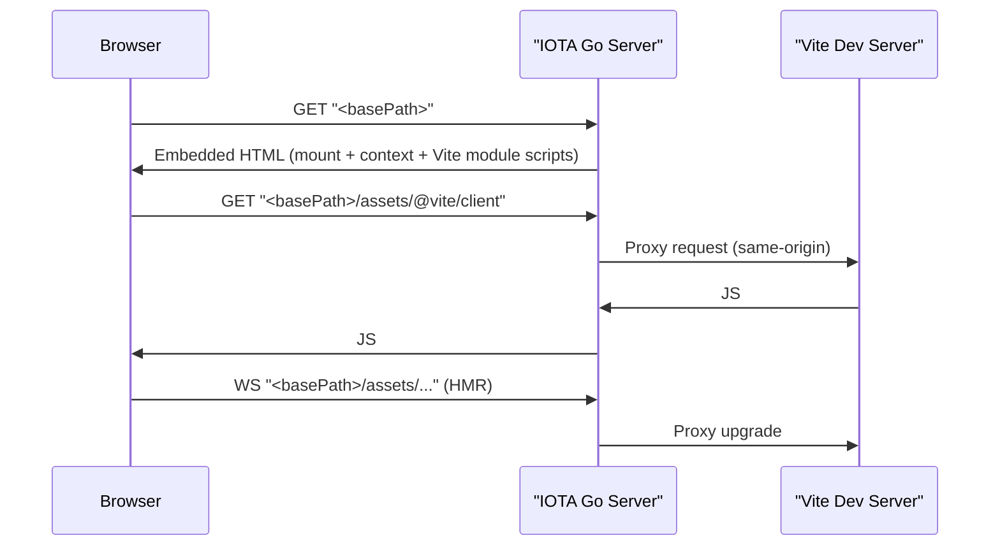
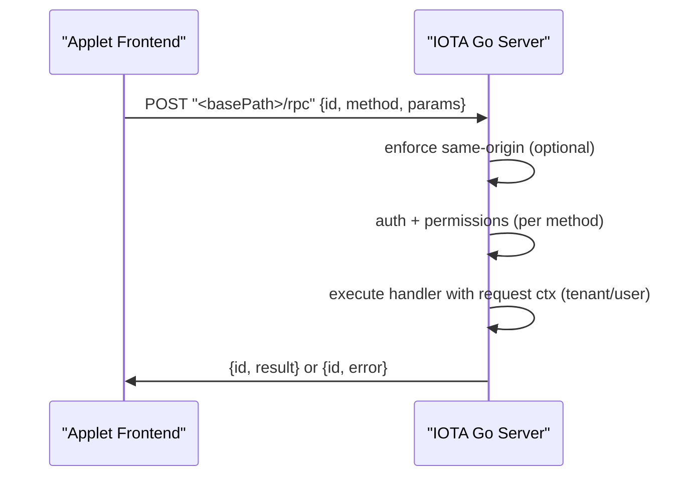

# Applets (Architecture)

Applets are React (Vite) applications that run inside IOTA SDK, backed by a Go “applet runtime”. The runtime is designed to keep applets **tightly integrated** (auth, styling, navigation) while staying **loosely coupled** (explicit boundaries, small surface area).

## Components

### Go runtime

- **Registration**: each module provides an `applet.Applet` implementation (typically `modules/<name>/applet.go`).
- **Shell rendering**:
  - *Embedded*: the applet is rendered inside the authenticated IOTA layout.
  - *Standalone*: the applet is rendered as a standalone HTML page (useful for local dev / debugging).
- **Assets**:
  - *Production*: serve embedded build artifacts (Vite output + manifest) from an `fs.FS`.
  - *Development*: reverse-proxy `/<basePath>/assets/*` to the Vite dev server (same-origin HMR).
- **RPC bridge**:
  - HTTP endpoint under the applet (`/<basePath>/rpc`) for applet → Go capability calls.
  - Permission checks are enforced server-side.

### Frontend runtime (SDK)

- **Custom element host**: `defineReactAppletElement` mounts React into a shadow root and optionally syncs dark mode.
- **Context**: `AppletProvider` reads `InitialContext` from `window[WindowGlobal]`.
- **RPC client**: `createAppletRPCClient` calls the applet RPC endpoint and (optionally) emits dev events.
- **Devtools overlay**: opt-in overlay showing runtime config + route + RPC calls.

## Request flows

### Embedded (production)

### Embedded (development / HMR)

### RPC (applet → Go)

## Security & boundaries

- **No direct DB access from JS**: applets call Go capabilities (RPC/GraphQL/REST); Go owns tenant isolation and authorization.
- **Same-origin protection**: applet RPC defaults to blocking cross-origin browser requests (based on `Origin` vs `Host`).
- **Permission checks**: procedures can declare required permissions; enforcement happens server-side.
- **Translation payload**: applets can scope injected translations by key prefix to keep `InitialContext` small.

## Extension points (future)

The asset subsystem is structured so additional asset providers can be introduced later (e.g. Next.js SSR) without rewriting the controller. The current shipping default is Vite SPA (static + dev server).

## Related docs

- Developer guide: `/development/applets`
