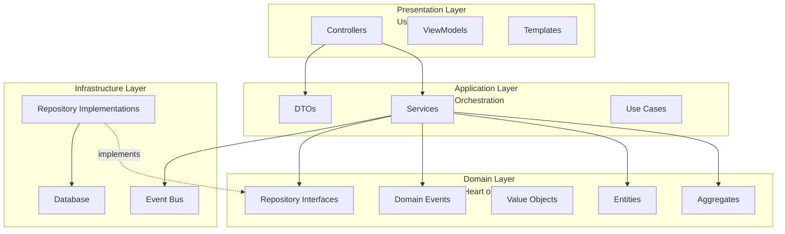
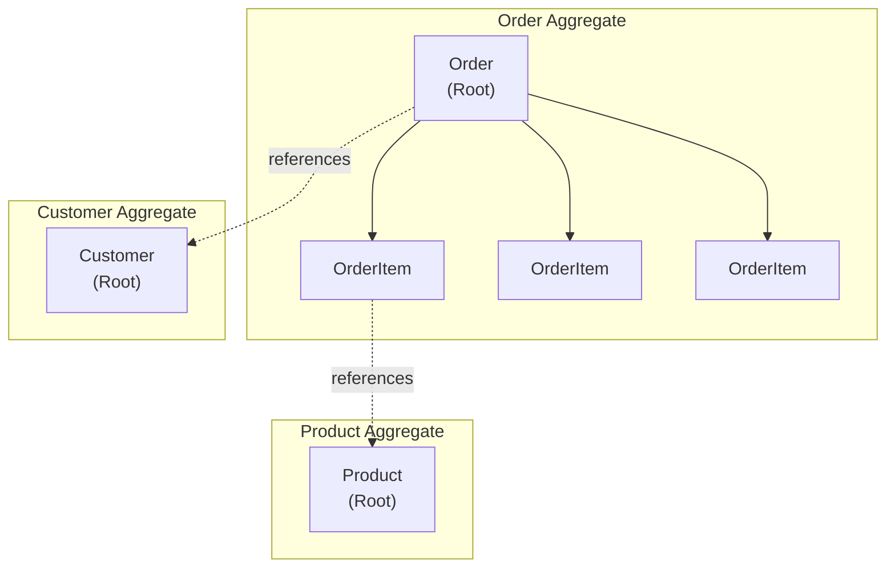
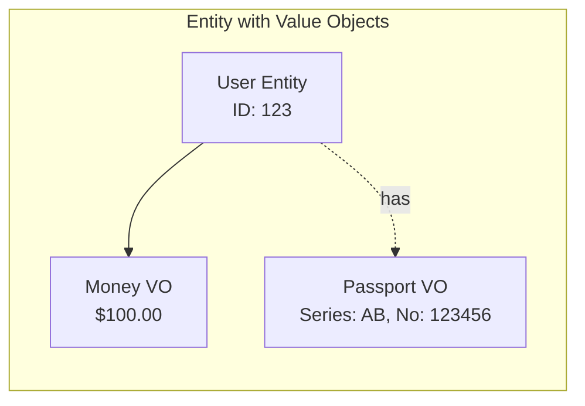
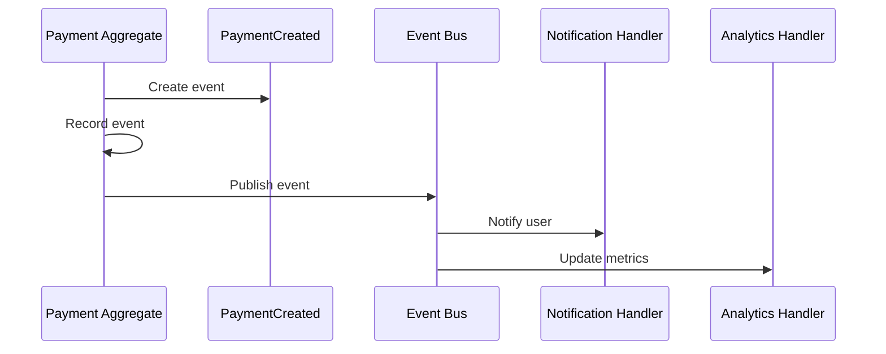
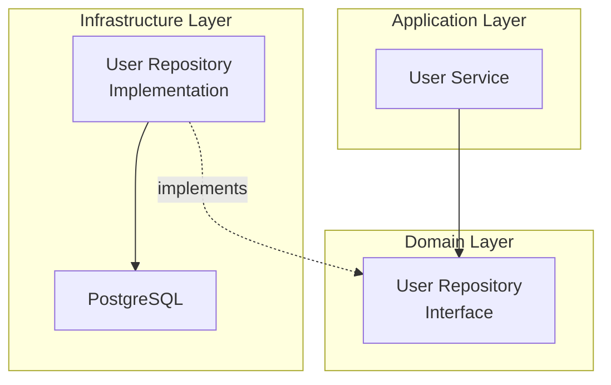
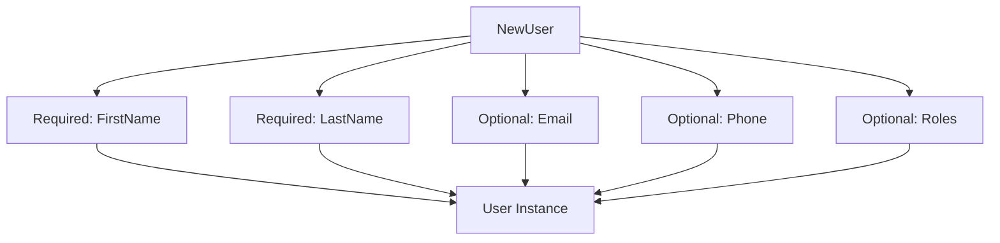
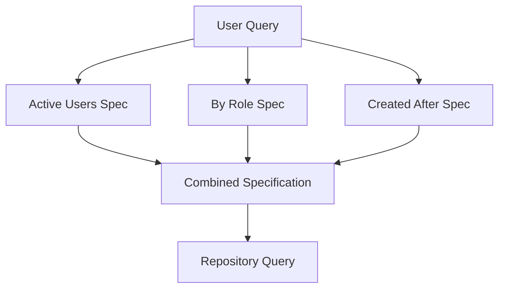
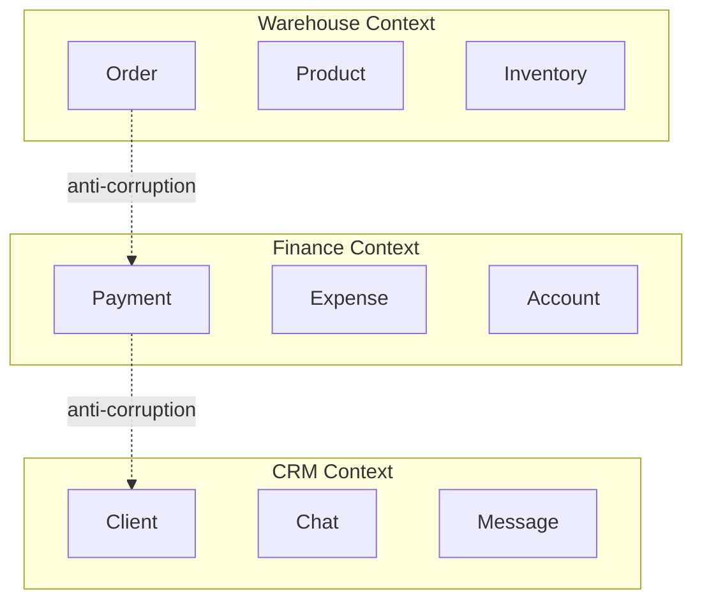

# Domain-Driven Design

IOTA SDK implements Domain-Driven Design (DDD) patterns to model complex business domains effectively.

## DDD Layers



## Core Concepts

### Aggregates

An **Aggregate** is a cluster of associated objects treated as a single unit for data changes. Each aggregate has:

- **Root Entity** - The main entity referenced externally
- **Boundary** - Objects inside can reference each other
- **Invariants** - Business rules maintained within the boundary



**Example:** In the Finance module, a `Payment` aggregate includes the payment entity and its attachments. You cannot modify an attachment directly; you must go through the Payment aggregate root.

### Entities

**Entities** are objects with a distinct identity that persists over time. They:

- Have a unique ID
- Maintain continuity through state changes
- Enforce business rules via methods

**Identity Patterns:**

| Pattern | Use Case | Example |
|---------|----------|---------|
| **Database ID** | Simple entities | `User` with auto-increment ID |
| **UUID** | Distributed systems | `Upload` with UUID for file references |
| **Natural Key** | Immutable identifiers | `Currency` using ISO code (USD, EUR) |

### Value Objects

**Value Objects** are immutable objects defined by their attributes, not identity:

- No conceptual identity
- Immutable (changes create new instances)
- Can be compared by value
- Often used within entities

**Examples in IOTA SDK:**

| Value Object | Attributes | Usage |
|--------------|-----------|-------|
| **Money** | Amount + Currency | Financial transactions |
| **Passport** | Series, Number, PIN | Employee/Client identification |
| **Address** | Street, City, Country | Location data |
| **DateRange** | Start, End | Project timelines |



### Domain Events

**Domain Events** capture occurrences within the domain that are relevant to other parts of the system:

- Named in past tense (UserCreated, PaymentProcessed)
- Contain relevant context data
- Enable loose coupling between modules
- Support eventual consistency



## Repository Pattern

### Definition

A **Repository** mediates between the domain and data mapping layers:

- Acts like an in-memory collection of aggregates
- Hides database complexity
- Enforces aggregate boundaries
- Interface defined in domain, implemented in infrastructure

### Structure



### Repository Methods

Standard CRUD operations:

- `GetByID(id)` - Fetch single aggregate
- `List(params)` - Query with filters, pagination
- `Save(aggregate)` - Insert or update
- `Delete(id)` - Remove aggregate

## Implementation Patterns

### Immutable Entities

Entities return new instances when modified, preserving the original:

```mermaid
graph LR
    A[User v1<br/>Name: "John"] -->|SetName("Jane")| B[User v2<br/>Name: "Jane"]
    A -.preserved.-> A
```

Benefits:
- Thread safety
- Audit trail capability
- Predictable state changes

### Options Pattern

Flexible entity construction with optional parameters:



### Specification Pattern

Encapsulate query criteria as objects:



## Bounded Contexts

Each module represents a **Bounded Context** - a boundary within which a domain model applies:



### Context Mapping

Modules integrate through:

- **Shared Kernel** - Common entities (User, Upload)
- **Customer-Supplier** - One module provides data to another
- **Anti-Corruption Layer** - Translation between contexts

## Domain Services

**Domain Services** encapsulate business logic that doesn't fit in entities:

- Cross-aggregate operations
- Complex calculations
- External integrations

Examples:

- **FinancialReportService** - Generate income statements across accounts
- **ChatService** - Route messages to multiple channels
- **BillingService** - Process payments through various providers

## Best Practices

1. **Keep Domain Pure** - No dependencies on infrastructure
2. **Rich Entities** - Put business logic in entities, not services
3. **Small Aggregates** - Prefer smaller boundaries for performance
4. **Event Sourcing Ready** - Design with events in mind
5. **Ubiquitous Language** - Use domain terms everywhere

## Next Steps

- **[Module System](/architecture/module-system)** - How modules implement DDD
- **[Multi-Tenancy](/architecture/multi-tenancy)** - Tenant boundaries in DDD
