# Frontend Stack

IOTA SDK uses a modern, lightweight frontend stack focused on server-rendered HTML with progressive enhancement.

## Stack Overview

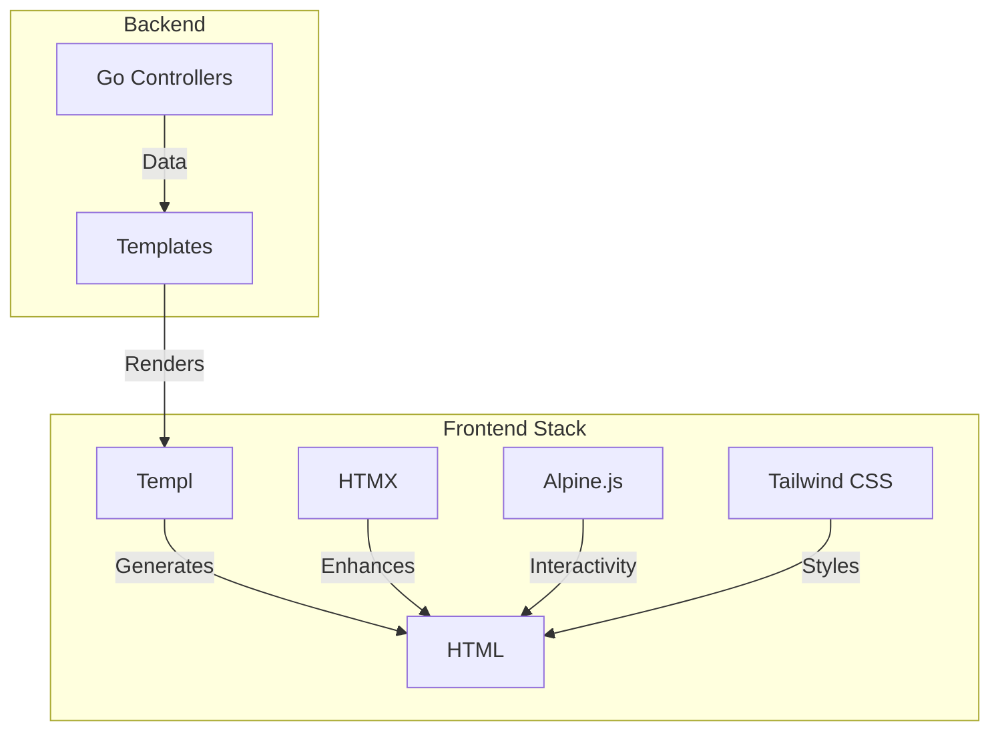

## Technology Choices

| Technology | Purpose | Why |
|-----------|---------|-----|
| **Templ** | HTML templating | Type-safe, Go-native |
| **HTMX** | AJAX via HTML | Minimal JS, progressive enhancement |
| **Alpine.js** | Reactivity | Lightweight, declarative |
| **Tailwind CSS** | Styling | Utility-first, rapid development |

## Request/Response Flow

### Standard Page Load

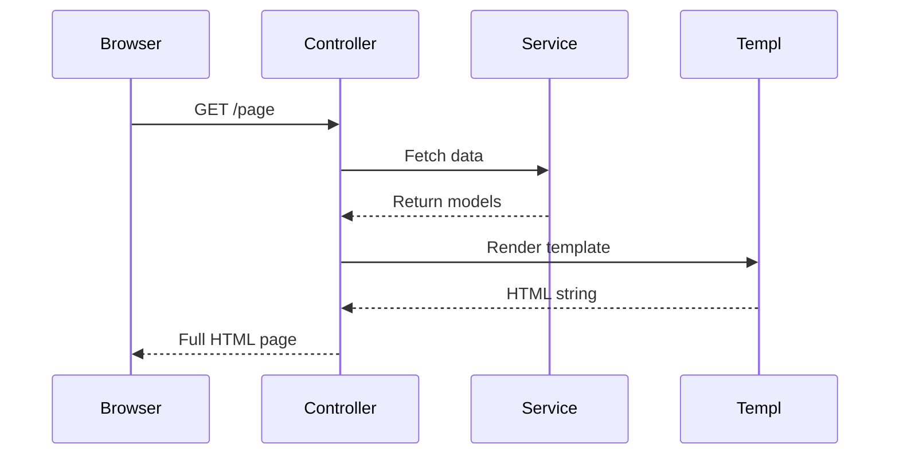

### HTMX Request

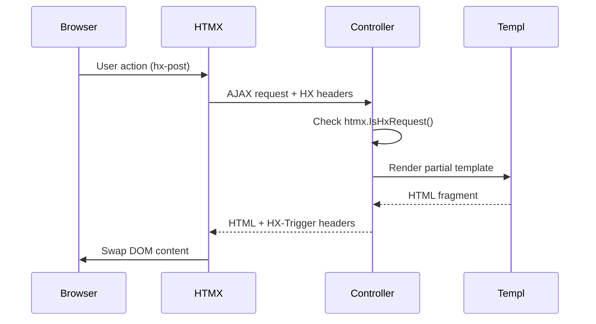

## Templ

### Type-Safe Templates

Templ provides compile-time type safety for HTML templates:

**Benefits:**
- Catch errors at compile time, not runtime
- IDE support and autocomplete
- No template parsing overhead
- Type-safe data passing

### Template Structure

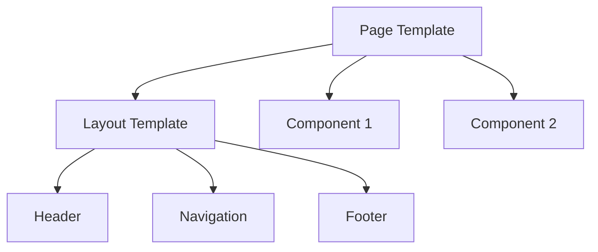

### Template Types

| Type | Extension | Purpose |
|------|-----------|---------|
| **Pages** | `*.templ` | Full page templates |
| **Components** | `*.templ` | Reusable UI components |
| **Layouts** | `*.templ` | Page wrappers |
| **Partials** | `*.templ` | HTMX fragments |

## HTMX

### Progressive Enhancement

HTMX adds AJAX functionality via HTML attributes:

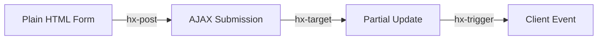

### Key Attributes

| Attribute | Purpose | Example |
|-----------|---------|---------|
| `hx-get` | AJAX GET request | Load content dynamically |
| `hx-post` | AJAX POST request | Submit forms |
| `hx-target` | Update target element | Swap specific DOM |
| `hx-swap` | Swap method | innerHTML, outerHTML, beforeend |
| `hx-trigger` | Event trigger | click, change, load |
| `hx-confirm` | Confirm dialog | User confirmation |

### Server-Side Handling

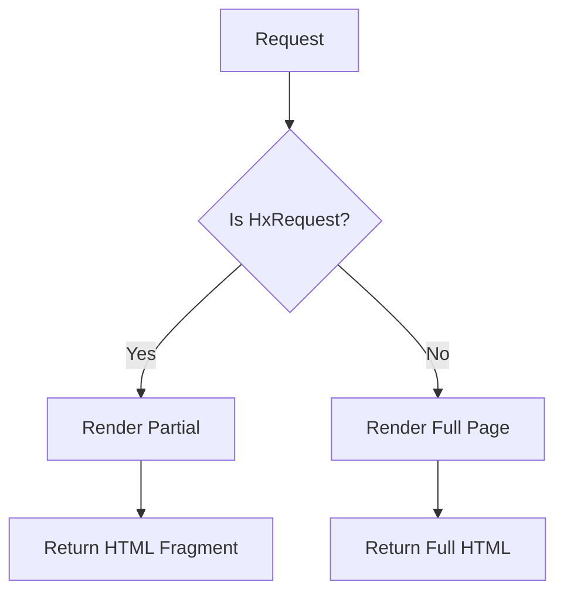

## Alpine.js

### Lightweight Reactivity

Alpine.js adds JavaScript interactivity declaratively:

**Use Cases:**
- Dropdown menus
- Modal dialogs
- Form validation feedback
- Toggle switches
- Tabs

### Integration with HTMX

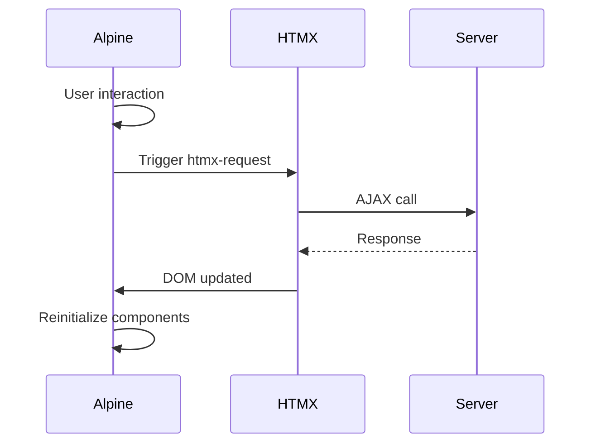

## Tailwind CSS

### Utility-First Styling

Compose designs from utility classes:

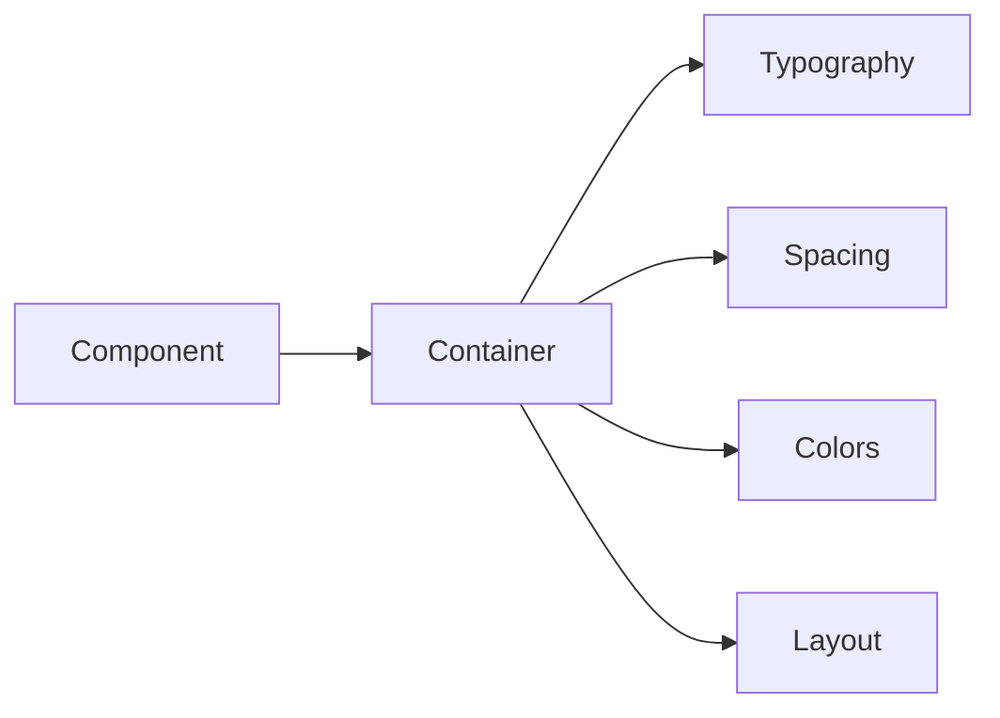

### Configuration

Tailwind is configured in `web/src/css/tailwind.config.js`:

- Custom colors for branding
- Extended spacing scale
- Plugin configurations

## Component Architecture

### Server Components

Pure server-rendered components:

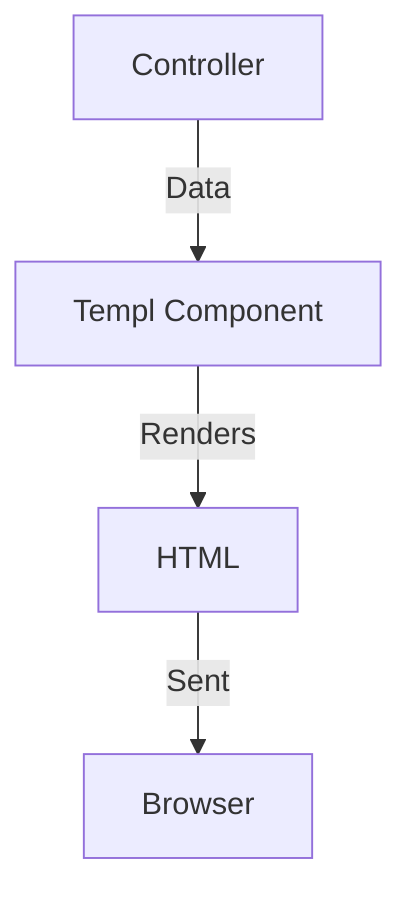

### Interactive Components

Components with Alpine.js interactivity:

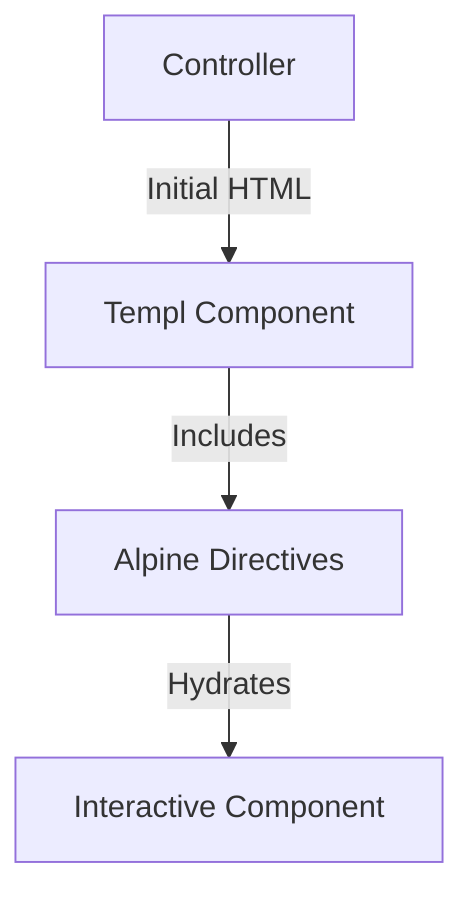

## State Management

### Server State

Primary state lives on the server:

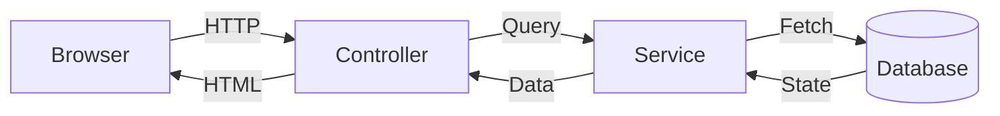

### Client State

Minimal state in Alpine.js:

- UI state (open/closed, selected tab)
- Form draft state
- Temporary user preferences

## Best Practices

### Progressive Enhancement

1. **Start with HTML** - Works without JavaScript
2. **Add HTMX** - Enhance with AJAX
3. **Add Alpine.js** - Add interactivity where needed

### Performance

1. **Minimize JS** - Server-render when possible
2. **Partial Updates** - HTMX for targeted updates
3. **Lazy Loading** - Load components on demand
4. **Bundle Size** - Alpine.js is ~15kb, minimal overhead

## Comparison with SPA Frameworks

| Aspect | IOTA SDK | React/Vue SPA |
|--------|----------|---------------|
| **Initial Load** | Fast (HTML) | Slower (JS bundle) |
| **Interactivity** | Progressive | Full client-side |
| **SEO** | Native | Requires SSR |
| **Complexity** | Lower | Higher |
| **State** | Server-first | Client-first |

## Next Steps

- **[Module System](/architecture/module-system)** - How modules register templates
- **[Core Module](/core)** - See template examples in action
