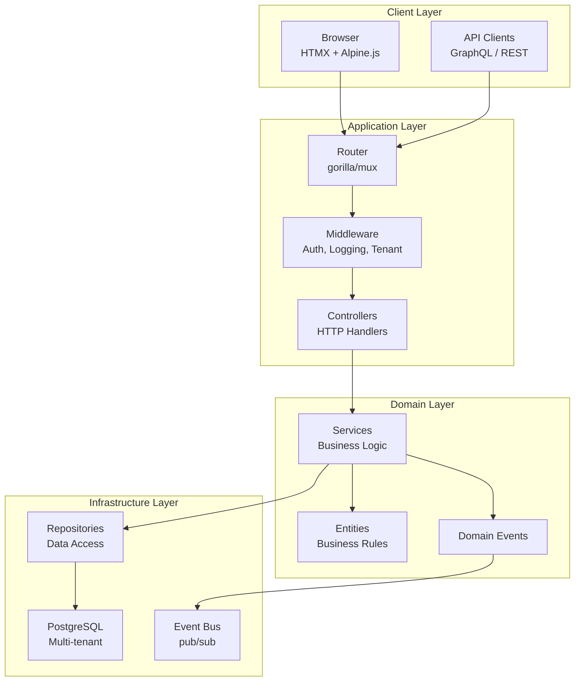
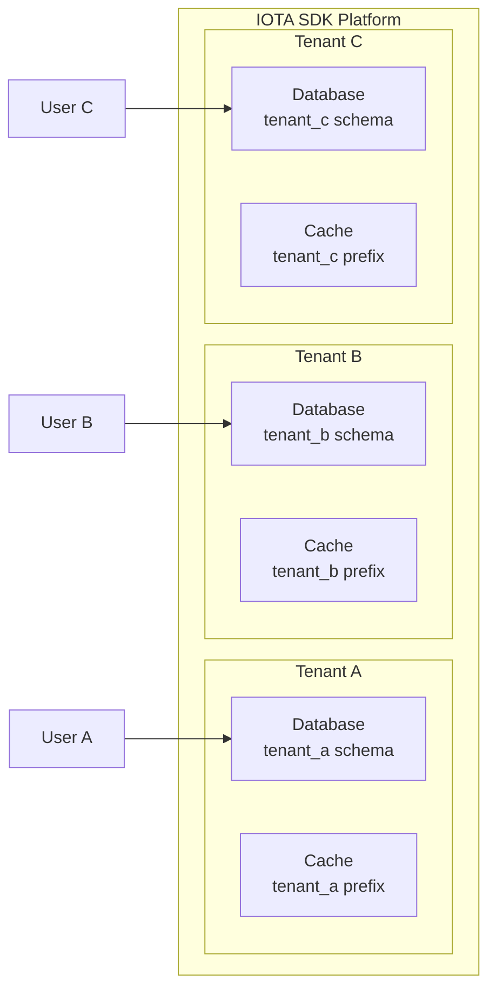
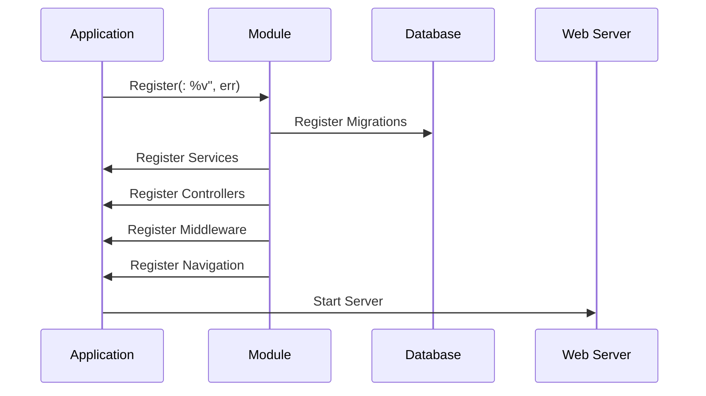
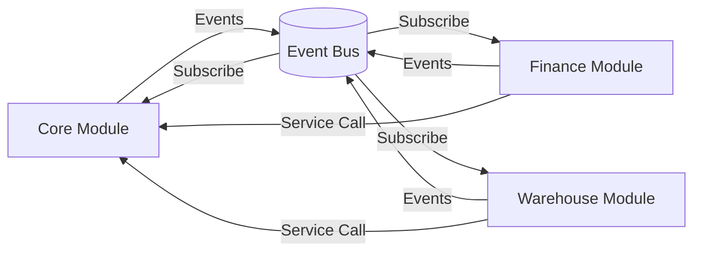
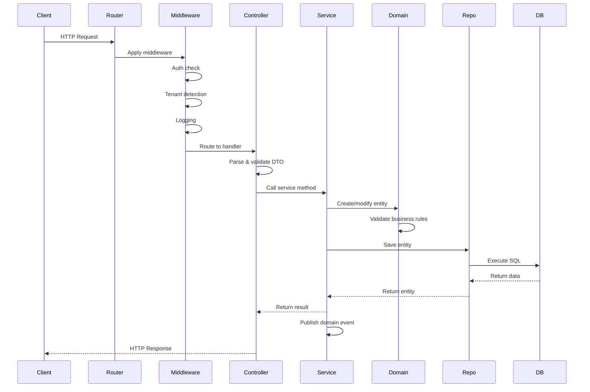
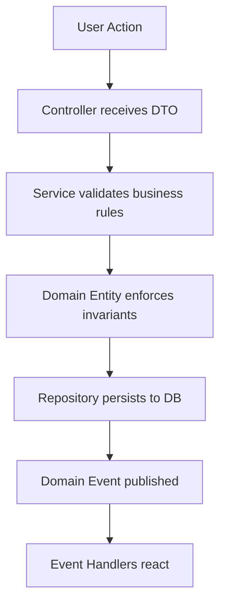
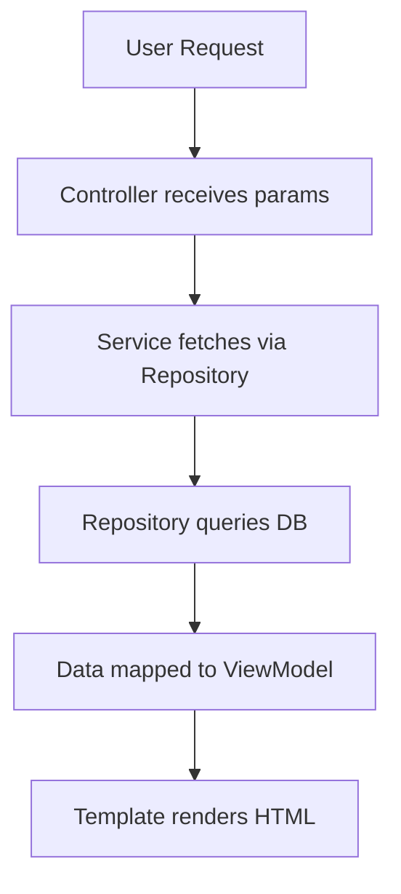

# Architecture Overview

IOTA SDK follows a layered, modular architecture built on Domain-Driven Design (DDD) principles.

## System Architecture

## Design Principles

### 1. Domain-Driven Design (DDD: %v", err)

The codebase is organized around business domains rather than technical concerns. Each module represents a bounded context with its own:

- **Ubiquitous Language** - Domain terms used consistently
- **Aggregates** - Consistency boundaries
- **Entities** - Objects with identity
- **Value Objects** - Immutable concepts

### 2. Layered Architecture

Clear separation of concerns with four distinct layers:

| Layer | Responsibility | Dependencies |
|-------|---------------|--------------|
| **Presentation** | Handle HTTP, render UI | Depends on Services |
| **Application** | Coordinate use cases | Depends on Domain |
| **Domain** | Business logic & rules | No external deps |
| **Infrastructure** | Persistence, external APIs | Depends on Domain |

### 3. Multi-Tenancy

Single deployment serves multiple organizations (tenants) with complete data isolation:

## Module System

### Module Lifecycle

### Module Communication

Modules communicate through:

1. **Event Bus** - Loose coupling via domain events
2. **Service Registry** - Direct service access via `app.Service()`
3. **Shared Entities** - Core entities used across modules

## Technology Stack

### Backend

| Component | Technology | Purpose |
|-----------|-----------|---------|
| Language | Go 1.24+ | Type-safe, performant |
| Router | gorilla/mux | HTTP routing |
| Database | PostgreSQL 13+ | ACID, JSON support |
| ORM | sqlx | Structured queries |
| GraphQL | gqlgen | API schema |
| Validation | go-playground/validator | Input validation |
| i18n | go-i18n | Localization |

### Frontend

| Component | Technology | Purpose |
|-----------|-----------|---------|
| Templating | Templ | Type-safe HTML |
| Interactivity | HTMX | AJAX via HTML |
| Reactivity | Alpine.js | Lightweight JS |
| Styling | Tailwind CSS | Utility classes |
| Icons | Lucide | SVG icons |

### Infrastructure

| Component | Technology | Purpose |
|-----------|-----------|---------|
| Sessions | Cookies + Redis | Stateful sessions |
| Files | HashFS | Fingerprinted assets |
| WebSocket | Custom Hub | Real-time updates |
| Events | In-memory Bus | Pub/sub messaging |

## Request Flow

### HTTP Request Processing

### HTMX Request

For HTMX requests (AJAX), the flow is similar but:

- Response is partial HTML (not full page: %v", err)
- Triggers client-side updates via HTMX attributes
- Supports out-of-band swaps for multiple elements

## Data Flow

### Write Operation

### Read Operation

## Next Steps

Learn more about specific architectural patterns:

- **[Domain-Driven Design](/architecture/domain-driven-design)** - DDD patterns in depth
- **[Module System](/architecture/module-system)** - Building and registering modules
- **[Multi-Tenancy](/architecture/multi-tenancy)** - Tenant isolation strategies
- **[Frontend Stack](/architecture/frontend-stack)** - HTMX and modern frontend patterns
