# Module System

IOTA SDK's module system enables modular, composable architecture. Each module is self-contained and can be added or removed without affecting others.

## Module Lifecycle

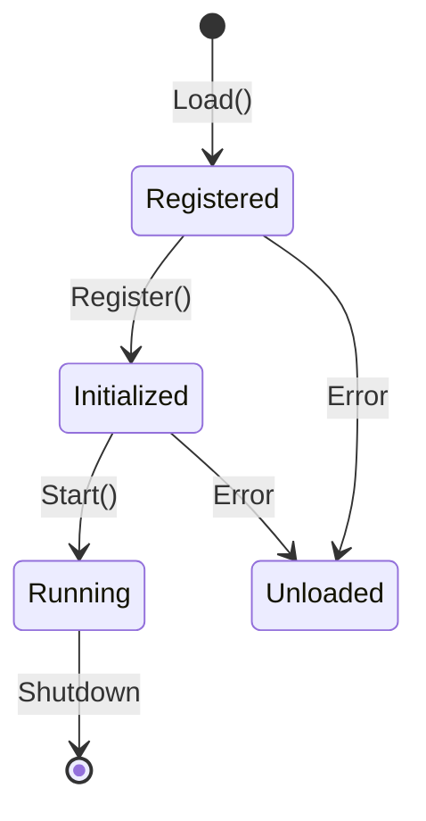

### 1. Registration Phase

During application startup, each module's `Register()` method is called:

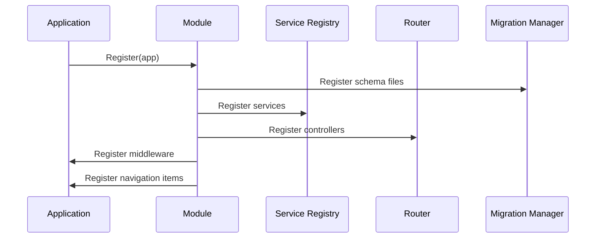

### 2. Initialization Phase

Services are wired together via dependency injection:

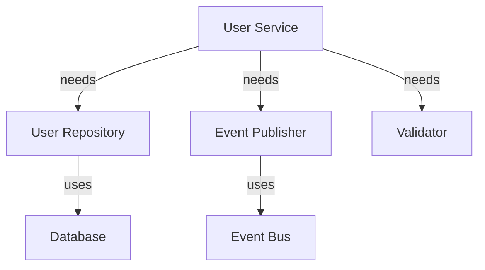

### 3. Running Phase

The application serves requests with all modules active:

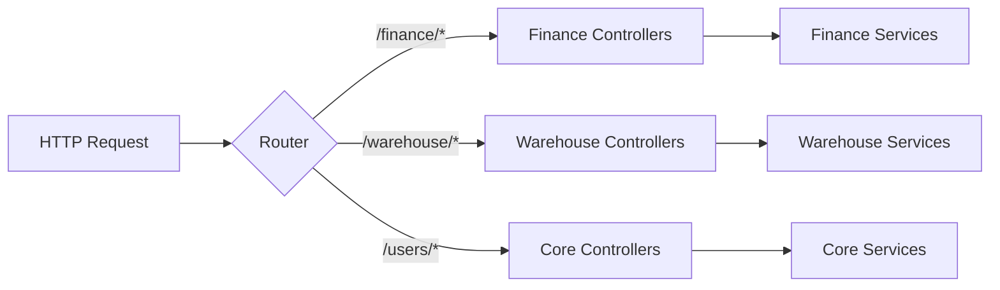

## Module Structure

### Required Files

```
modules/{module}/
├── module.go              # Module interface implementation
└── links.go               # Navigation definition
```

### Standard Structure

```
modules/{module}/
├── domain/                # Business logic
│   ├── aggregates/        # Aggregate roots
│   ├── entities/          # Domain entities
│   └── value_objects/     # Value objects
├── infrastructure/
│   └── persistence/       # Data access
│       ├── models/        # Database models
│       ├── schema/        # SQL migrations
│       └── *.go           # Repository implementations
├── services/              # Business services
├── presentation/
│   ├── controllers/       # HTTP handlers
│   └── templates/         # Templ files
├── module.go              # Module registration
└── links.go               # Navigation
```

## Module Interface

All modules implement the `application.Module` interface:

```mermaid
classDiagram
    class Module {
        +Register(app Application) error
    }
    
    class Application {
        +RegisterServices(services...)
        +RegisterControllers(controllers...)
        +RegisterMiddleware(middleware...)
        +Migrations() MigrationManager
        +EventPublisher() EventBus
        +Service(service) interface{}
    }
    
    Module ..> Application : uses
```

### Registration Methods

| Method | Purpose | Called In |
|--------|---------|-----------|
| `RegisterServices()` | Add business services | Services layer |
| `RegisterControllers()` | Add HTTP handlers | Presentation layer |
| `RegisterMiddleware()` | Add request middleware | Infrastructure |
| `Migrations().RegisterSchema()` | Database changes | Infrastructure |
| `RegisterLocaleFiles()` | Translations | Presentation |
| `RegisterHashFsAssets()` | Static assets | Presentation |
| `QuickLinks().Add()` | Spotlight search | Navigation |

## Service Registration

### Service Pattern

Services are registered as interfaces and retrieved by type:

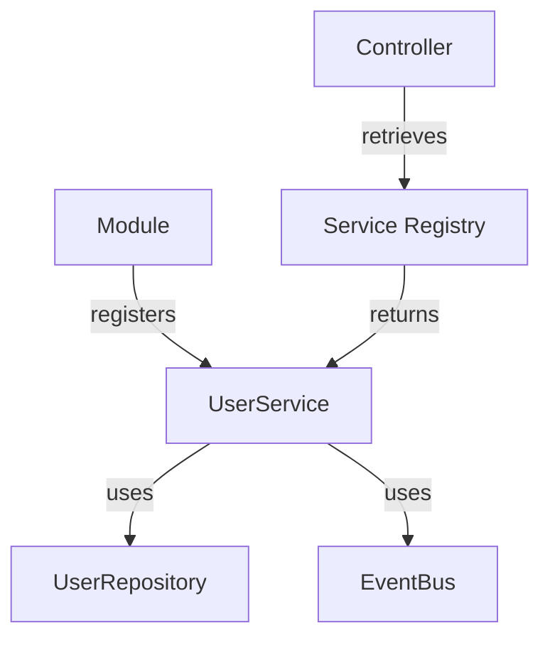

### Dependency Injection

Services declare dependencies explicitly:

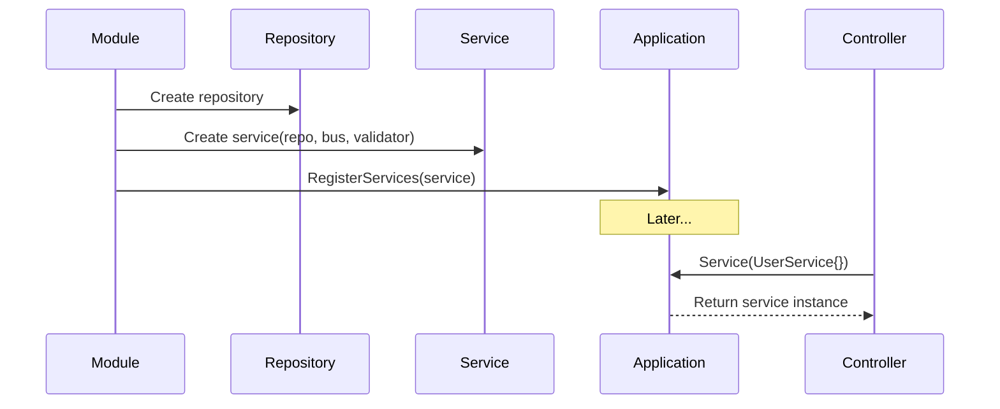

## Controller Registration

### Routing

Controllers define their base path during registration:

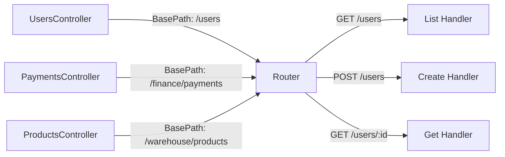

### Permission Integration

Controllers check permissions via middleware:

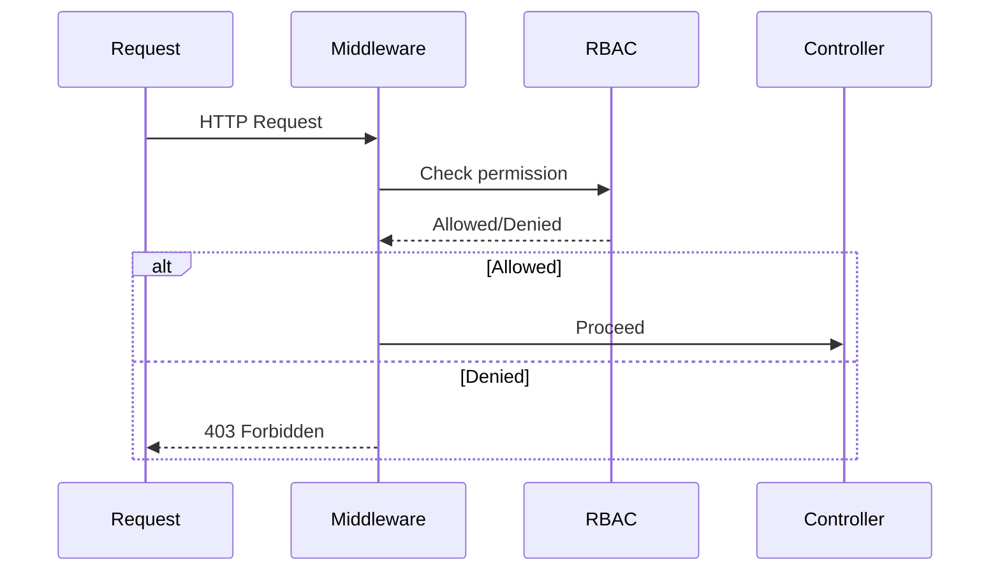

## Cross-Module Communication

### Service Access

Modules access other modules via the service registry:

```mermaid
graph TB
    subgraph "Finance Module"
        A[PaymentService]
        B[PaymentController]
    end
    
    subgraph "Core Module"
        C[UserService]
        D[UserRepository]
    end
    
    B -->|app.Service()| C
    A -.->|needs user info.-> C
```

### Event-Driven Communication

Loose coupling via domain events:

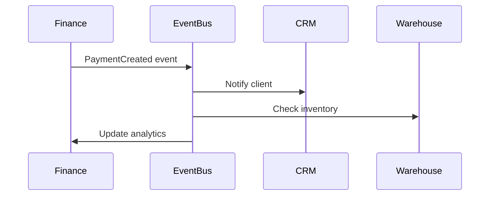

## Module Configuration

### Module Options

Modules accept configuration via options pattern:

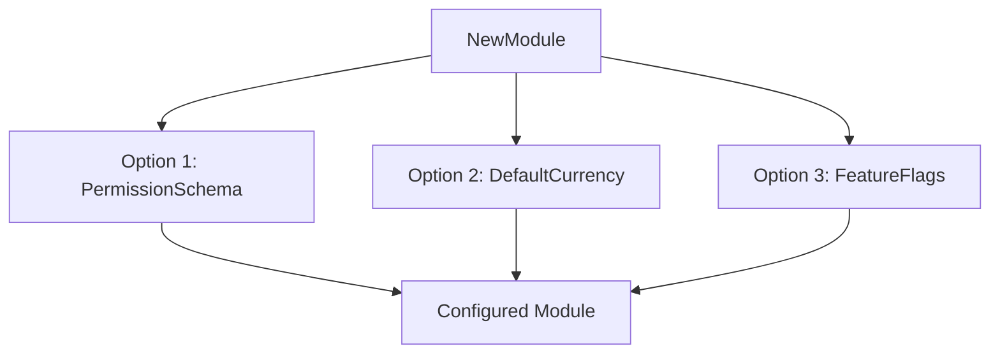

### Environment-Based Config

Configuration can vary by environment:

| Environment | Configuration | Purpose |
|-------------|---------------|---------|
| Development | Debug logging, test endpoints | Development |
| Staging | Production-like, limited data | Testing |
| Production | Optimized, no debug info | Production |

## Best Practices

1. **Single Responsibility** - Each module handles one business domain
2. **Explicit Dependencies** - Declare all required services
3. **No Circular Dependencies** - Module A shouldn't depend on B if B depends on A
4. **Event-Based Coupling** - Use events for loose coupling
5. **Interface Segregation** - Small, focused service interfaces

## Built-in Modules

Modules are loaded in `modules.BuiltInModules`:

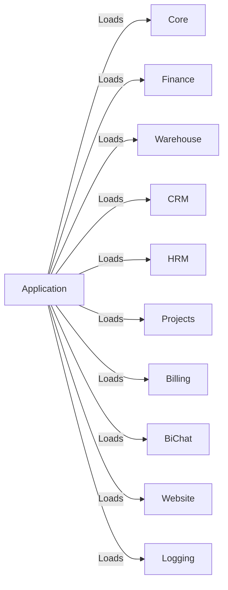

## Next Steps

- **[Multi-Tenancy](/architecture/multi-tenancy)** - How modules handle tenant isolation
- **[Domain-Driven Design](/architecture/domain-driven-design)** - DDD patterns in modules
- **[Core Module](/core)** - See a complete module implementation
