# Module System

IOTA SDK's module system enables modular, composable architecture. Each module is self-contained and can be added or removed without affecting others.

## Module Lifecycle

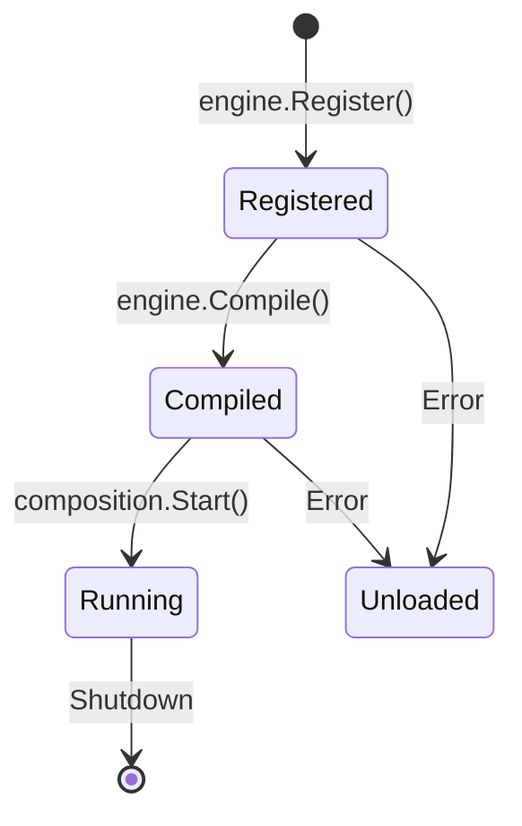
```mermaid
stateDiagram-v2
    [*] --> Registered: engine.Register()
    Registered --> Compiled: engine.Compile()
    Compiled --> Running: composition.Start()
    Running --> [*]: Shutdown

    Registered --> Unloaded: Error
    Compiled --> Unloaded: Error
```

### 1. Registration Phase

During application startup, each component contributes providers and runtime slices to the composition engine. The engine compiles a container for the active capabilities, attaches it to the application, and starts hooks when the process needs long-lived workers:

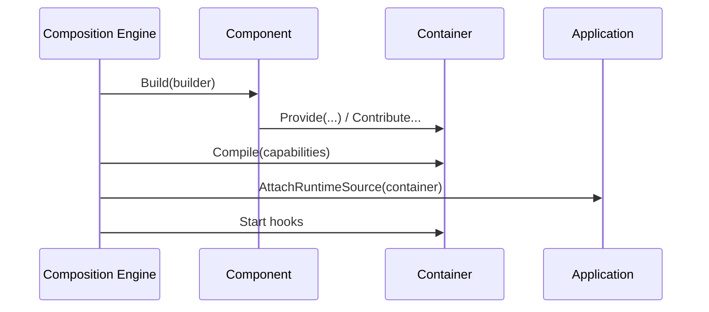
```mermaid
sequenceDiagram
    participant Engine as Composition Engine
    participant Comp as Component
    participant Container as Container
    participant App as Application

    Engine->>Comp: Build(builder)
    Comp->>Container: Provide(...) / Contribute...
    Engine->>Container: Compile(capabilities)
    Engine->>App: AttachRuntimeSource(container)
    Engine->>Container: Start hooks
```

Schema/migration files are typically embedded in modules; the application loads migrations from its configured migrations directory (e.g. `MigrationsDir`), not by modules calling a migration manager during registration.

### 2. Initialization Phase

Services are wired together via dependency injection:

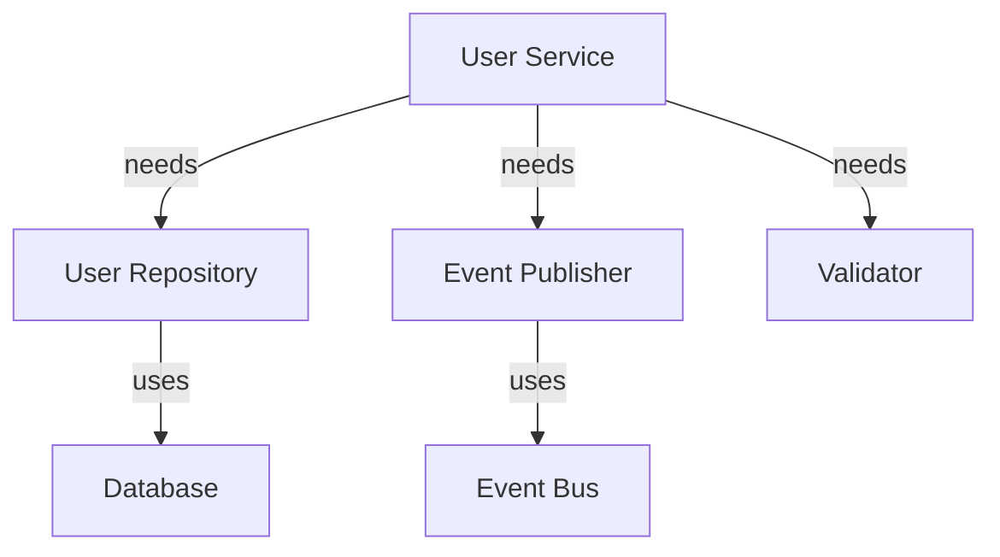
```mermaid
graph TB
    A[User Service] -->|needs| B[User Repository]
    A -->|needs| C[Event Publisher]
    A -->|needs| D[Validator]
    
    B -->|uses| E[Database]
    C -->|uses| F[Event Bus]
```

### 3. Running Phase

The application serves requests with all modules active:

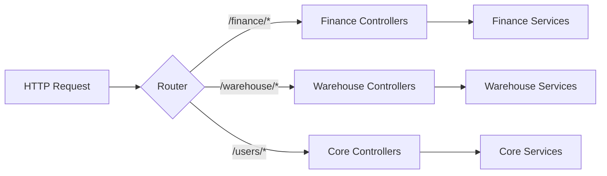
```mermaid
graph LR
    A[HTTP Request] --> B{Router}
    B -->|/finance/*| C[Finance Controllers]
    B -->|/warehouse/*| D[Warehouse Controllers]
    B -->|/users/*| E[Core Controllers]
    
    C --> F[Finance Services]
    D --> G[Warehouse Services]
    E --> H[Core Services]
```

## Module Structure

### Required Files

```
modules/{module}/
├── module.go              # Module interface implementation
└── links.go               # Navigation definition
```

### Standard Structure

```
modules/{module}/
├── domain/                # Business logic
│   ├── aggregates/        # Aggregate roots
│   ├── entities/          # Domain entities
│   └── value_objects/     # Value objects
├── infrastructure/
│   └── persistence/       # Data access
│       ├── models/        # Database models
│       ├── schema/        # SQL migrations
│       └── *.go           # Repository implementations
├── services/              # Business services
├── presentation/
│   ├── controllers/       # HTTP handlers
│   └── templates/         # Templ files
├── module.go              # Module registration
└── links.go               # Navigation
```

## Module Interface

Runtime composition is built from `composition.Component` implementations:

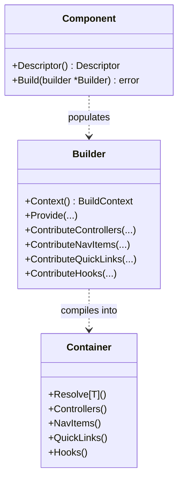
```mermaid
classDiagram
    class Component {
        +Descriptor() Descriptor
        +Build(builder *Builder) error
    }

    class Builder {
        +Context() BuildContext
        +Provide(...)
        +ContributeControllers(...)
        +ContributeNavItems(...)
        +ContributeQuickLinks(...)
        +ContributeHooks(...)
    }

    class Container {
        +Resolve[T]()
        +Controllers()
        +NavItems()
        +QuickLinks()
        +Hooks()
    }

    Component ..> Builder : populates
    Builder ..> Container : compiles into
```

### Registration Methods

| Method | Purpose | Called In |
|--------|---------|-----------|
| `composition.Provide(...)` | Add repositories and services | Services layer |
| `composition.ContributeControllers(...)` | Add HTTP handlers | Presentation layer |
| `composition.ContributeMiddleware(...)` | Add request middleware | Infrastructure |
| `composition.ContributeLocales(...)` | Translations | Presentation |
| `composition.ContributeHashFS(...)` | Static assets | Presentation |
| `composition.ContributeQuickLinks(...)` | Spotlight quick links | Navigation / actions |

## Service Registration

### Service Pattern

Services are registered with composition and resolved by type:

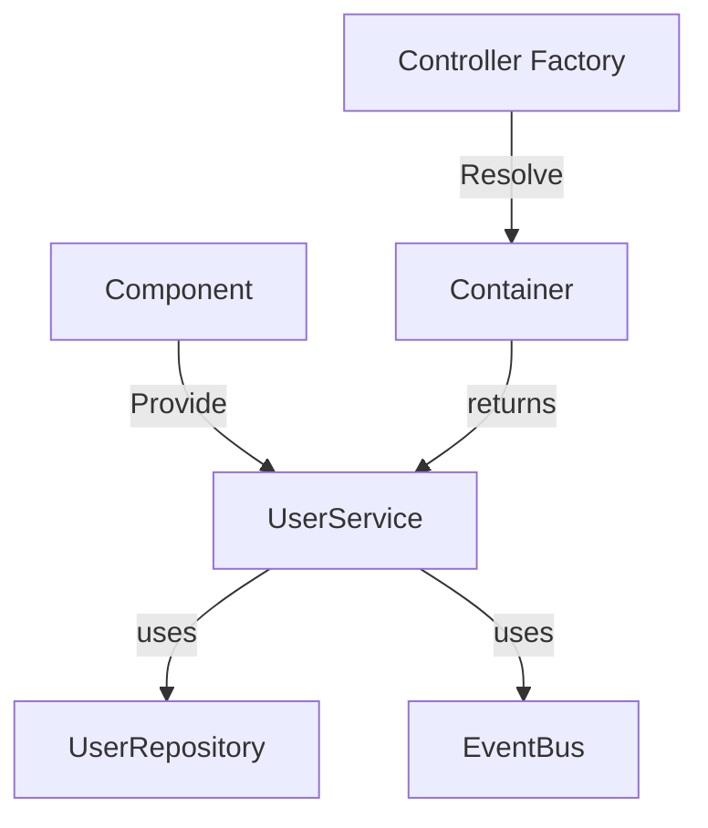
```mermaid
graph TB
    A[Component] -->|Provide| B[UserService]
    C[Controller Factory] -->|Resolve| D[Container]
    D -->|returns| B
    
    B -->|uses| E[UserRepository]
    B -->|uses| F[EventBus]
```

### Dependency Injection

Services declare dependencies explicitly and resolve them inside provider factories:

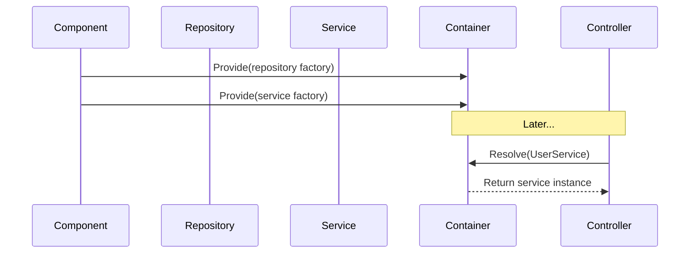
```mermaid
sequenceDiagram
    participant Comp as Component
    participant Repo as Repository
    participant Service as Service
    participant Container as Container
    participant Controller as Controller
    
    Comp->>Container: Provide(repository factory)
    Comp->>Container: Provide(service factory)
    
    Note over Container,Controller: Later...
    Controller->>Container: Resolve(UserService)
    Container-->>Controller: Return service instance
```

### Migrating From Module To Component

When migrating old code:

1. Replace the old module constructor with `NewComponent() composition.Component`.
2. Move the old wiring phase into `Build(builder)` using `composition.Provide(...)` and `composition.Contribute...(...)`.
3. Move the old transport phase into `composition.ContributeControllers(...)`, `composition.ContributeSchemas(...)`, or `composition.ContributeMiddleware(...)`.
4. Replace direct application service lookups with `composition.Use[T]()` handles plus `Resolve(container)`.

## Controller Registration

### Routing

Controllers define their base path during registration:

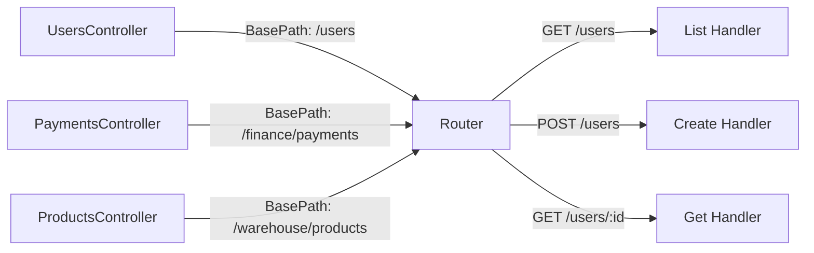
```mermaid
graph LR
    A[UsersController] -->|BasePath: /users| B[Router]
    C[PaymentsController] -->|BasePath: /finance/payments| B
    D[ProductsController] -->|BasePath: /warehouse/products| B
    
    B -->|GET /users| E[List Handler]
    B -->|POST /users| F[Create Handler]
    B -->|GET /users/:id| G[Get Handler]
```

### Permission Integration

Controllers check permissions via middleware:

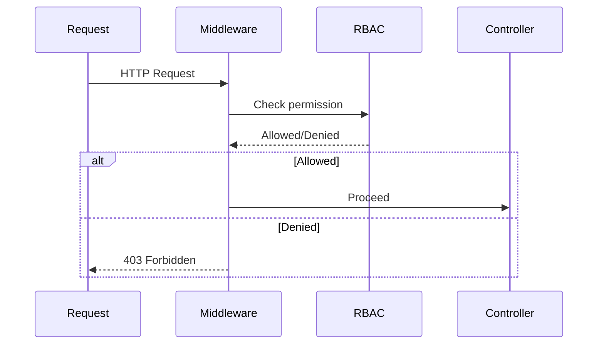
```mermaid
sequenceDiagram
    participant Request
    participant Middleware
    participant RBAC
    participant Controller
    
    Request->>Middleware: HTTP Request
    Middleware->>RBAC: Check permission
    RBAC-->>Middleware: Allowed/Denied
    alt Allowed
        Middleware->>Controller: Proceed
    else Denied
        Middleware-->>Request: 403 Forbidden
    end
```

## Cross-Module Communication

### Service Access

Modules access other modules via typed container lookups:

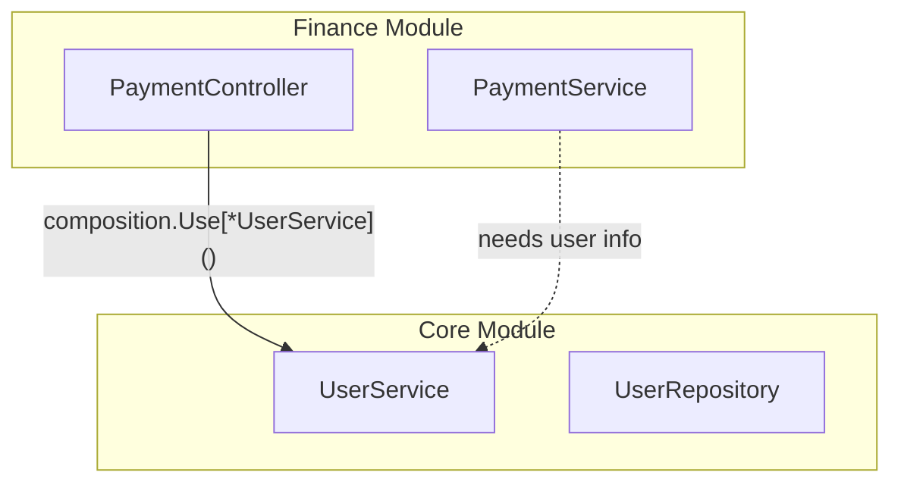
```mermaid
graph TB
    subgraph "Finance Module"
        A[PaymentService]
        B[PaymentController]
    end
    
    subgraph "Core Module"
        C[UserService]
        D[UserRepository]
    end
    
    B -->|"composition.Use[*UserService]()"| C
    A -.->|"needs user info"| C
```

### Event-Driven Communication

Loose coupling via domain events:

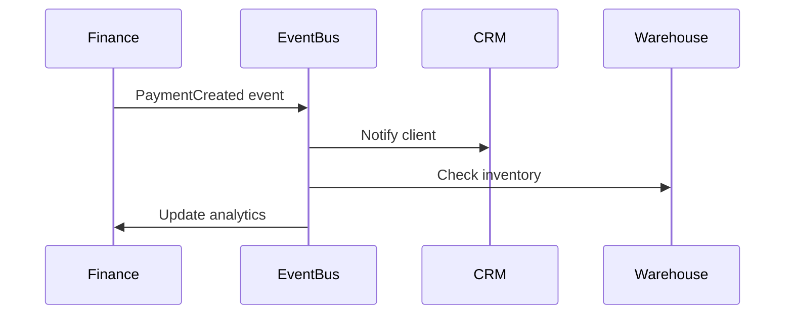
```mermaid
sequenceDiagram
    participant Finance
    participant EventBus
    participant CRM
    participant Warehouse
    
    Finance->>EventBus: PaymentCreated event
    EventBus->>CRM: Notify client
    EventBus->>Warehouse: Check inventory
    EventBus->>Finance: Update analytics
```

## Module Configuration

### Module Options

Components accept configuration via options pattern:

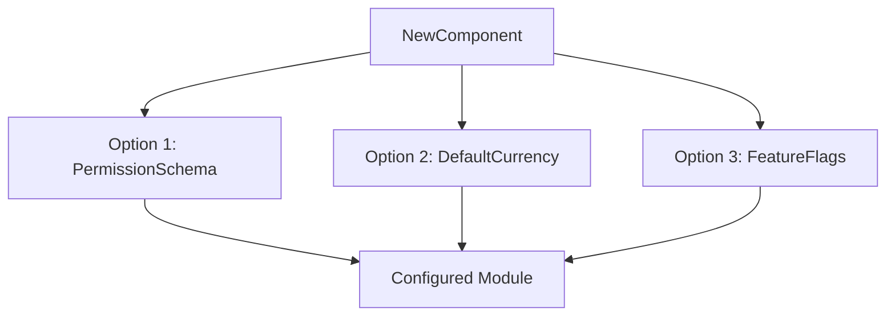
```mermaid
graph TD
    A[NewComponent] --> B[Option 1: PermissionSchema]
    A --> C[Option 2: DefaultCurrency]
    A --> D[Option 3: FeatureFlags]
    
    B --> E[Configured Module]
    C --> E
    D --> E
```

### Environment-Based Config

Configuration can vary by environment:

| Environment | Configuration | Purpose |
|-------------|---------------|---------|
| Development | Debug logging, test endpoints | Development |
| Staging | Production-like, limited data | Testing |
| Production | Optimized, no debug info | Production |

## Best Practices

1. **Single Responsibility** - Each module handles one business domain
2. **Explicit Dependencies** - Declare all required services
3. **No Circular Dependencies** - Module A shouldn't depend on B if B depends on A
4. **Event-Based Coupling** - Use events for loose coupling
5. **Interface Segregation** - Small, focused service interfaces

## Built-in Modules

Built-in components are loaded from `modules.Components()` (see `modules/load.go`): **core**, **hrm**, **finance**, **projects**, **logging**, **warehouse**, **crm**, **website**, **billing**, **oidc**, and **testkit**. BiChat and Superadmin are registered separately by the command roots that need them.

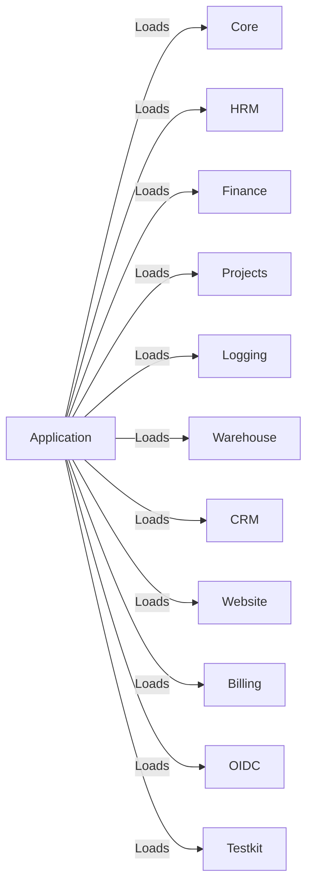
```mermaid
graph LR
    A[Application] -->|Loads| B[Core]
    A -->|Loads| C[HRM]
    A -->|Loads| D[Finance]
    A -->|Loads| E[Projects]
    A -->|Loads| F[Logging]
    A -->|Loads| G[Warehouse]
    A -->|Loads| H[CRM]
    A -->|Loads| I[Website]
    A -->|Loads| J[Billing]
    A -->|Loads| K[OIDC]
    A -->|Loads| L[Testkit]
```

## Next Steps

- **[Multi-Tenancy](/architecture/multi-tenancy)** - How modules handle tenant isolation
- **[Domain-Driven Design](/architecture/domain-driven-design)** - DDD patterns in modules
- **[Core Module](/core)** - See a complete module implementation
