# Multi-Tenancy

IOTA SDK implements multi-tenancy to serve multiple organizations (tenants) from a single deployment while maintaining complete data isolation.

## Architecture Overview

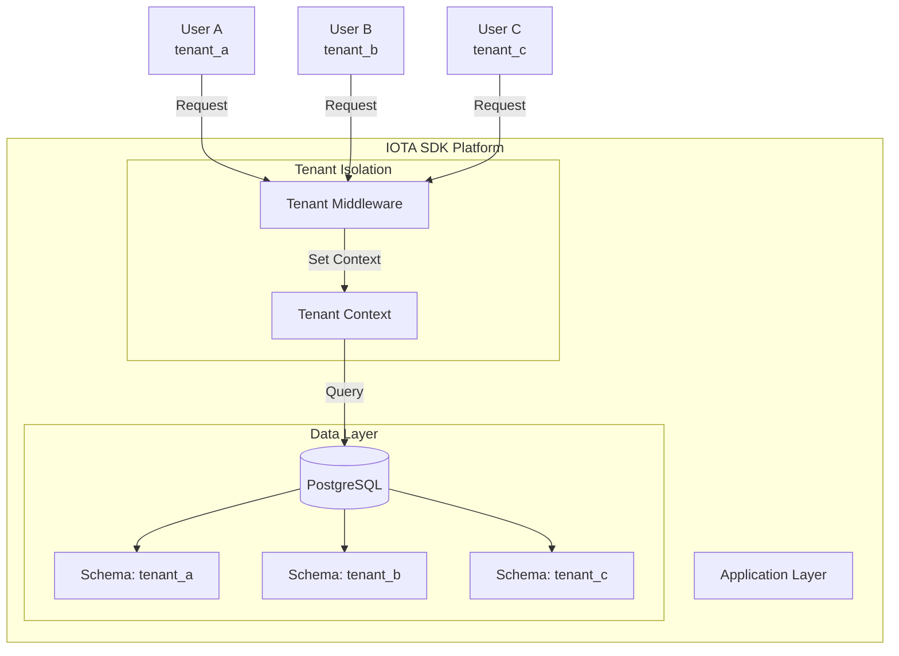

## Tenant Identification

### Subdomain-Based Routing

Tenants are identified by subdomain:

```
tenant-a.iota-sdk.com → Tenant A
tenant-b.iota-sdk.com → Tenant B
tenant-c.iota-sdk.com → Tenant C
```

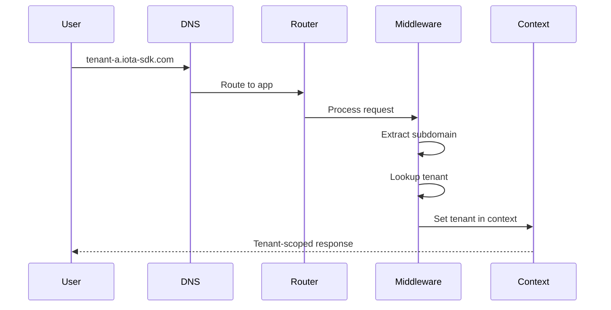

### Tenant Resolution Flow

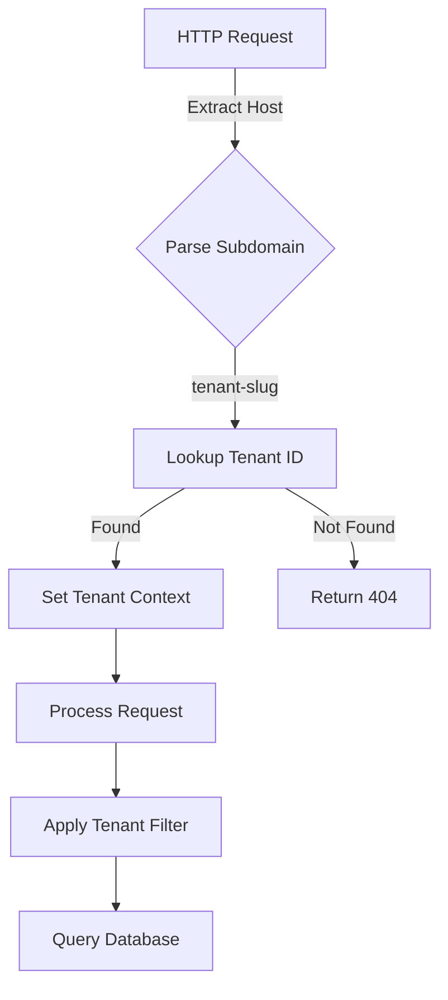

## Data Isolation

### Schema-Based Isolation

Each tenant has a separate database schema:

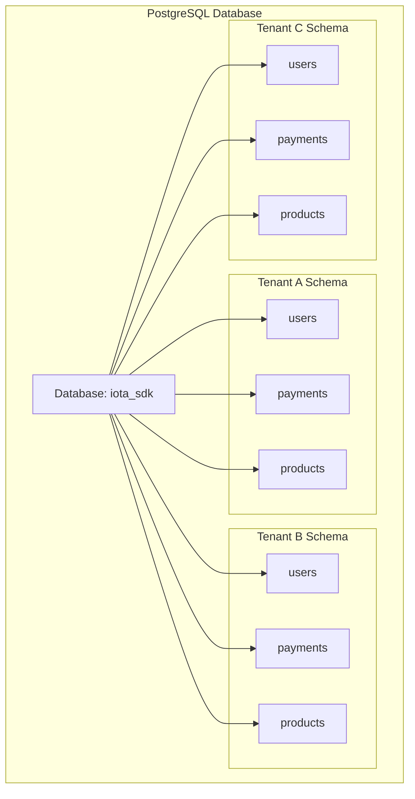

### Automatic Query Filtering

All database queries automatically include tenant filters:

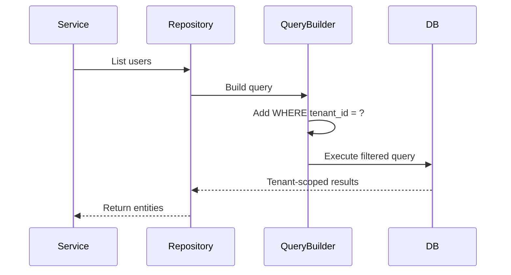

## Tenant Context

### Context Propagation

Tenant ID flows through the request context:

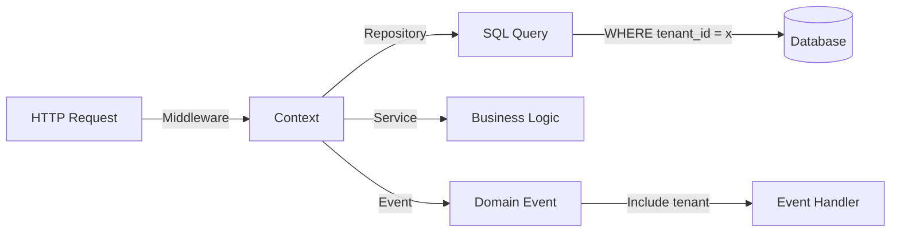

### Context Safety

Tenant context is:
- Set once per request
- Immutable after setting
- Passed to all layers
- Used in all queries

## Shared Resources

### Cross-Tenant Services

Some services operate across tenants:

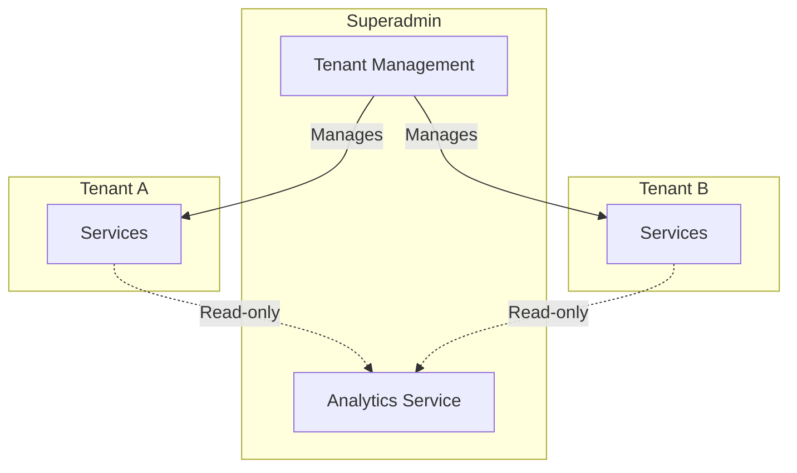

### Shared Entities

Certain entities are shared across tenants:

| Entity | Sharing | Purpose |
|--------|---------|---------|
| **Currency** | Global | ISO standard codes |
| **Settings Schema** | Template | Default settings structure |
| **Permissions** | Template | RBAC definitions |

## Tenant Lifecycle

### Creating a Tenant

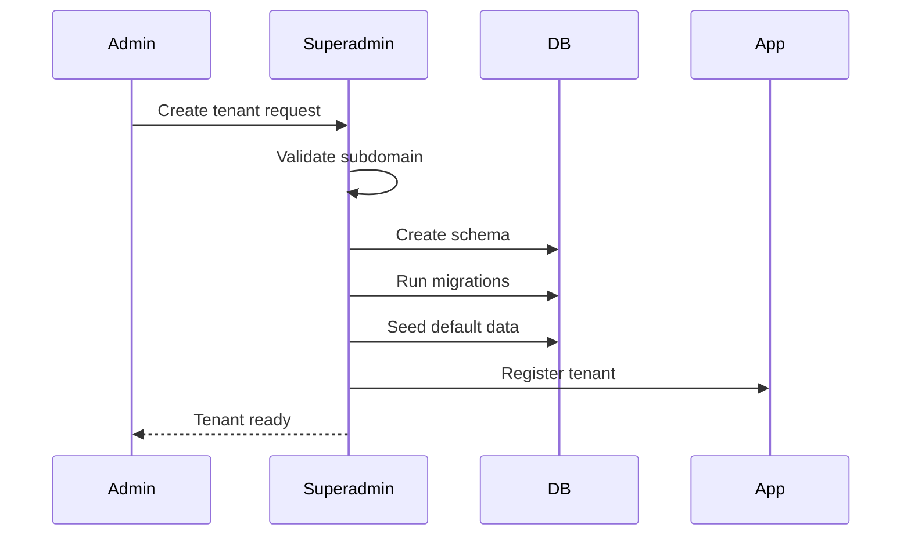

### Tenant Operations

| Operation | Effect | Access |
|-----------|--------|--------|
| **Create** | New schema, migrations applied | Superadmin only |
| **Suspend** | Block all access | Superadmin only |
| **Delete** | Remove schema and data | Superadmin only |
| **Backup** | Export tenant data | Superadmin only |
| **Settings** | Configure tenant | Tenant admin |

## Security Considerations

### Data Leakage Prevention

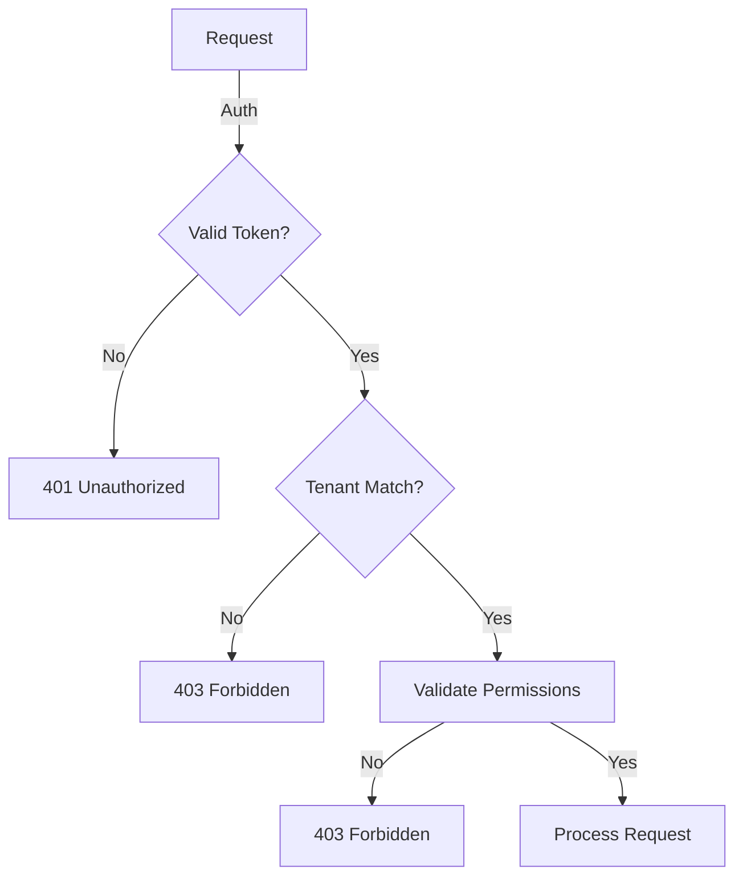

### Security Layers

1. **Authentication** - Valid session/token required
2. **Tenant Assignment** - User belongs to tenant
3. **Permission Check** - User has required permission
4. **Query Filtering** - All queries scoped to tenant

## Tenant-Aware Features

### Localization

Each tenant can have different defaults:

| Setting | Scope | Example |
|---------|-------|---------|
| **Language** | Tenant | English, Russian, Uzbek |
| **Currency** | Tenant | USD, UZS, EUR |
| **Timezone** | Tenant | UTC+5, UTC+3 |

### Customization

Tenants can customize:

- Branding (logos, colors)
- Feature flags (enable/disable modules)
- Default settings (date formats, number formats)
- Custom fields (extend entities)

## Implementation Details

### Database Connection

Single connection pool with schema switching:

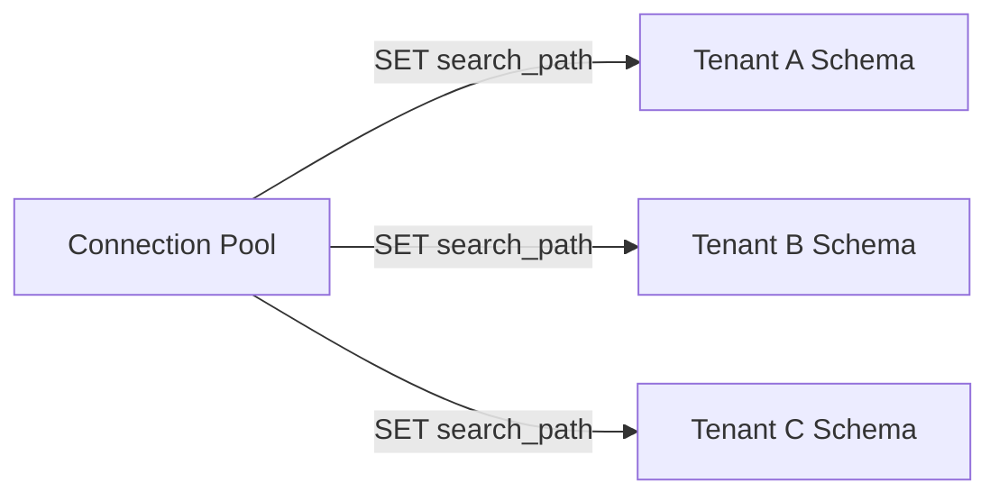

### Migration Strategy

Migrations run per-tenant:

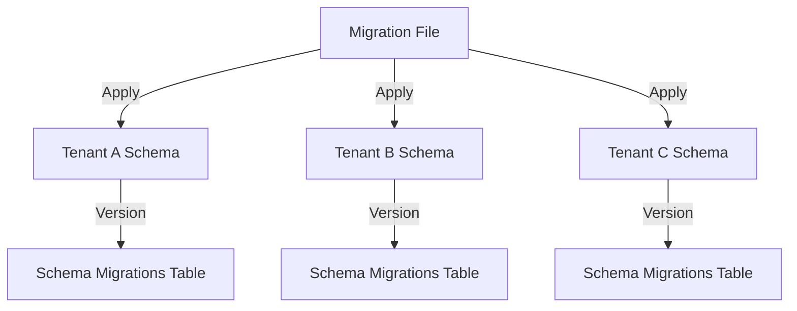

## Performance Considerations

### Connection Pooling

- Shared pool across all tenants
- Schema context set per query
- No connection per tenant overhead

### Query Optimization

- Tenant ID in all indexes
- Partitioning by tenant for large tables
- Query plan caching per schema

## Best Practices

1. **Never Bypass Tenant Context** - Always use middleware
2. **Test with Multiple Tenants** - Ensure isolation in tests
3. **Monitor Per-Tenant** - Track usage and performance per tenant
4. **Backup Individually** - Tenant-level backup/restore
5. **Schema Migrations** - Test on all tenant schemas

## Next Steps

- **[Domain-Driven Design](/architecture/domain-driven-design)** - How DDD works with multi-tenancy
- **[Module System](/architecture/module-system)** - Module registration in multi-tenant setup
