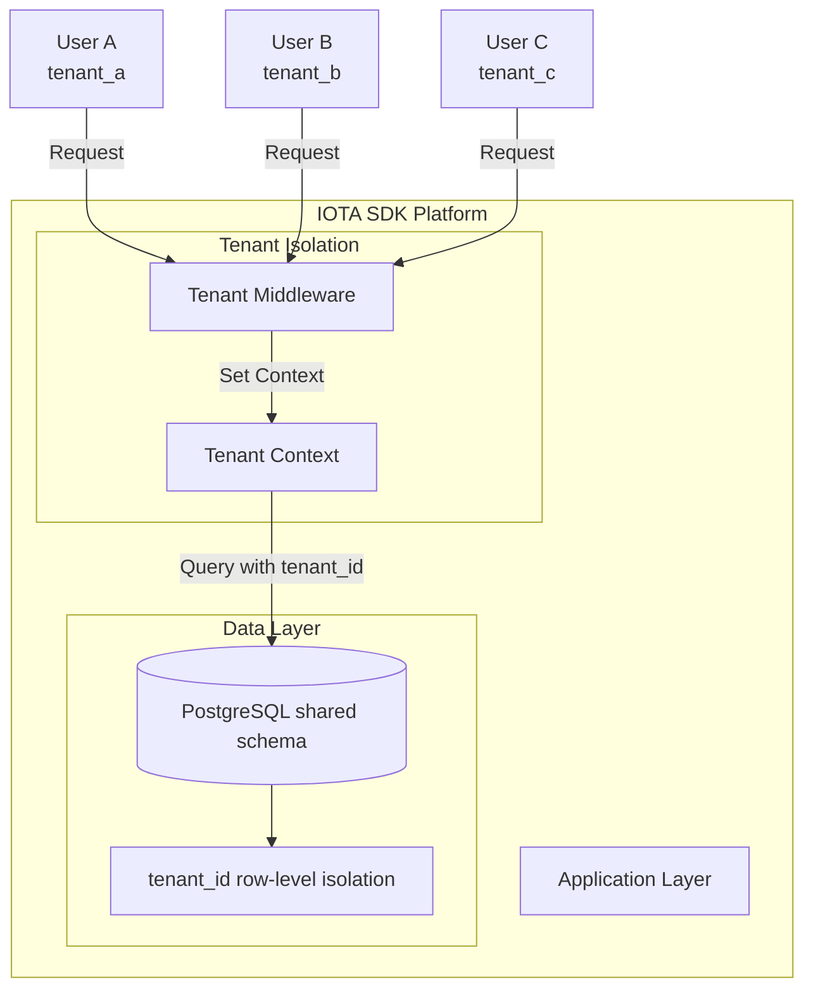
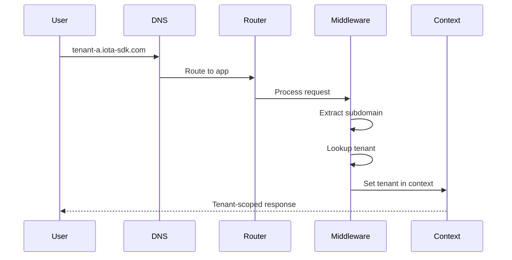
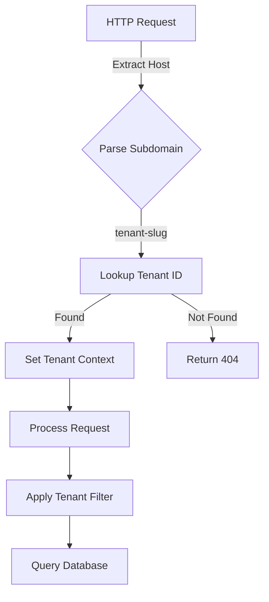
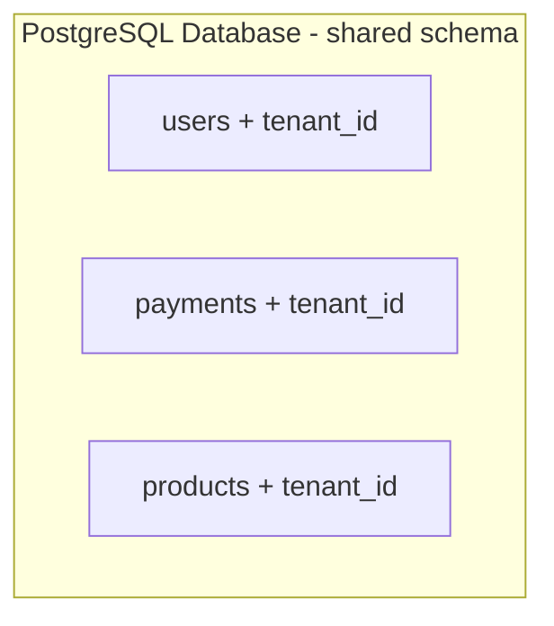
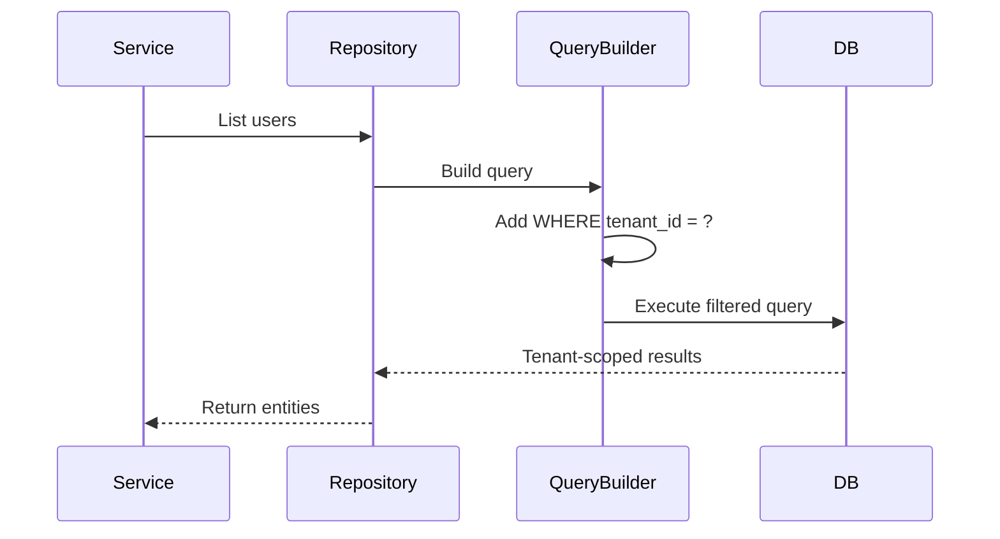
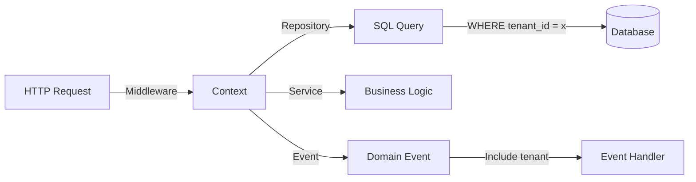
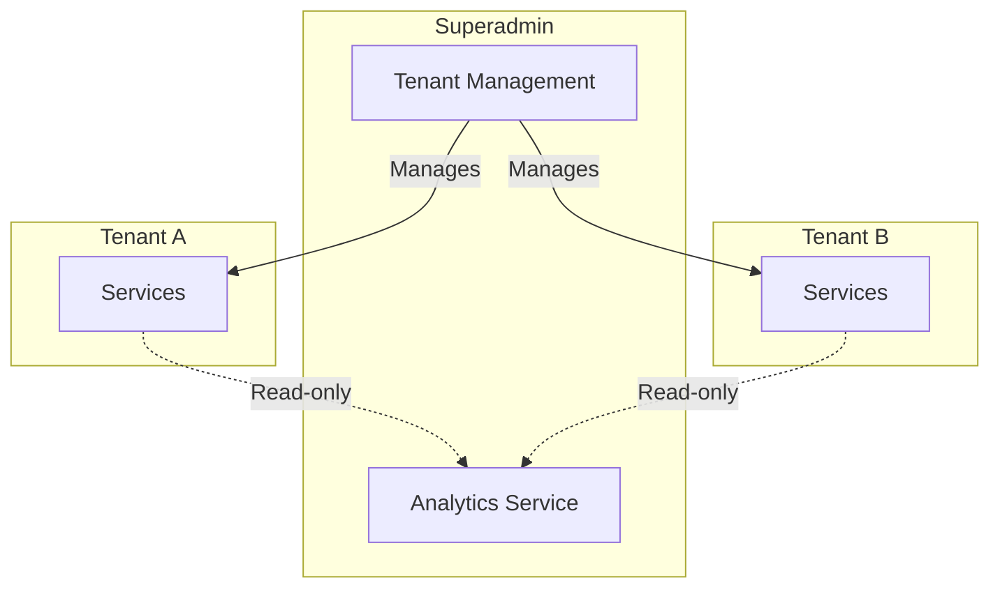
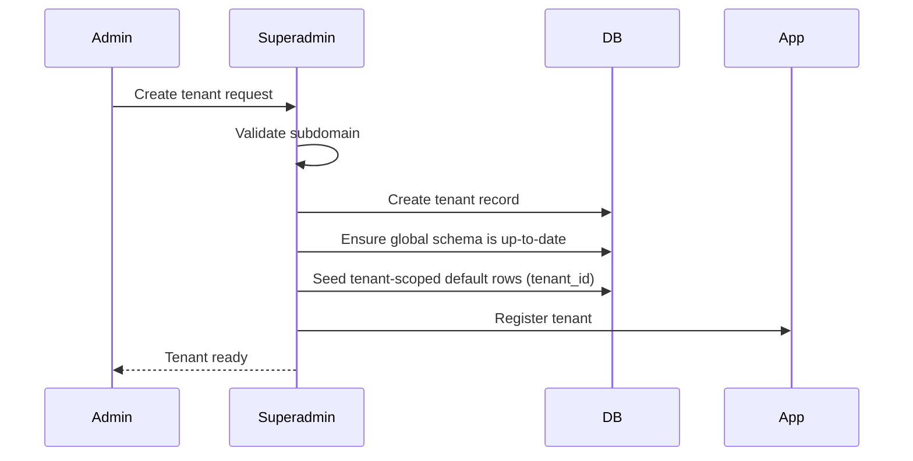
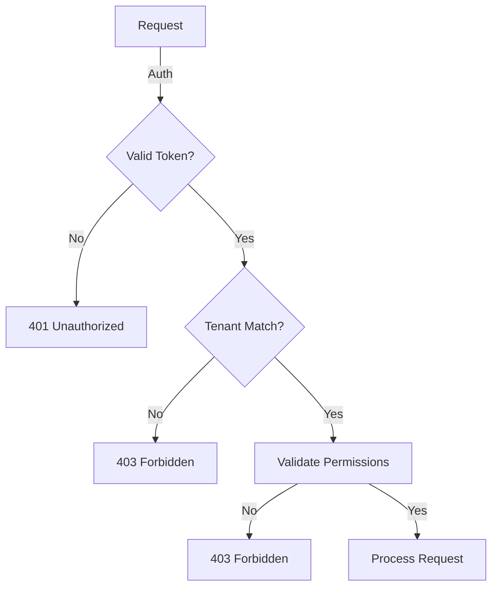
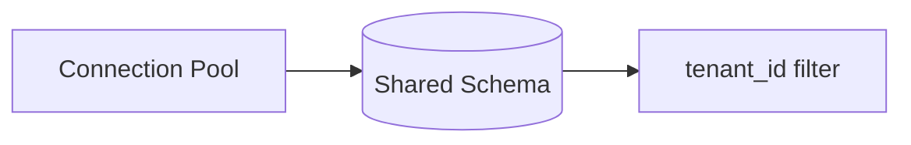

# Multi-Tenancy

IOTA SDK implements multi-tenancy to serve multiple organizations (tenants) from a single deployment while maintaining complete data isolation.

## Architecture Overview


```mermaid
graph TB
    subgraph "IOTA SDK Platform"
        App[Application Layer]
        
        subgraph "Tenant Isolation"
            Middleware[Tenant Middleware]
            Context[Tenant Context]
        end
        
        subgraph "Data Layer"
            DB[(PostgreSQL shared schema)]
            TID[tenant_id row-level isolation]
        end
        DB --> TID
    end
    
    UserA["User A<br/>tenant_a"] -->|Request| Middleware
    UserB["User B<br/>tenant_b"] -->|Request| Middleware
    UserC["User C<br/>tenant_c"] -->|Request| Middleware
    
    Middleware -->|Set Context| Context
    Context -->|Query with tenant_id| DB
```

## Tenant Identification

### Subdomain-Based Routing

Tenants are identified by subdomain:

```
tenant-a.iota-sdk.com → Tenant A
tenant-b.iota-sdk.com → Tenant B
tenant-c.iota-sdk.com → Tenant C
```


```mermaid
sequenceDiagram
    participant User
    participant DNS
    participant Router
    participant Middleware
    participant Context
    
    User->>DNS: tenant-a.iota-sdk.com
    DNS->>Router: Route to app
    Router->>Middleware: Process request
    Middleware->>Middleware: Extract subdomain
    Middleware->>Middleware: Lookup tenant
    Middleware->>Context: Set tenant in context
    Context-->>User: Tenant-scoped response
```

### Tenant Resolution Flow


```mermaid
graph TD
    A[HTTP Request] -->|Extract Host| B{Parse Subdomain}
    B -->|tenant-slug| C[Lookup Tenant ID]
    C -->|Found| D[Set Tenant Context]
    C -->|Not Found| E[Return 404]
    D --> F[Process Request]
    F --> G[Apply Tenant Filter]
    G --> H[Query Database]
```

## Data Isolation

### Row-Level Isolation

The platform uses a **shared database schema** with **row-level isolation** via `tenant_id`. All tenant-scoped tables include a `tenant_id` column, and queries add `WHERE tenant_id = ?` so each tenant only sees their own data. There are no per-tenant PostgreSQL schemas or `SET search_path` switching.


```mermaid
graph TB
    subgraph "PostgreSQL Database - shared schema"
        T1[users + tenant_id]
        T2[payments + tenant_id]
        T3[products + tenant_id]
    end
```

### Automatic Query Filtering

All database queries automatically include tenant filters:


```mermaid
sequenceDiagram
    participant Service
    participant Repository
    participant QueryBuilder
    participant DB
    
    Service->>Repository: List users
    Repository->>QueryBuilder: Build query
    QueryBuilder->>QueryBuilder: Add WHERE tenant_id = ?
    QueryBuilder->>DB: Execute filtered query
    DB-->>Repository: Tenant-scoped results
    Repository-->>Service: Return entities
```

## Tenant Context

### Context Propagation

Tenant ID flows through the request context:


```mermaid
graph LR
    A[HTTP Request] -->|Middleware| B[Context]
    B -->|Repository| C[SQL Query]
    B -->|Service| D[Business Logic]
    B -->|Event| E[Domain Event]
    
    C -->|WHERE tenant_id = x| F[(Database)]
    E -->|Include tenant| G[Event Handler]
```

### Context Safety

Tenant context is:
- Set once per request
- Immutable after setting
- Passed to all layers
- Used in all queries

## Shared Resources

### Cross-Tenant Services

Some services operate across tenants:


```mermaid
graph TB
    subgraph "Tenant A"
        A[Services]
    end
    
    subgraph "Tenant B"
        B[Services]
    end
    
    subgraph "Superadmin"
        C[Analytics Service]
        D[Tenant Management]
    end
    
    A -.->|Read-only| C
    B -.->|Read-only| C
    D -->|Manages| A
    D -->|Manages| B
```

### Shared Entities

Certain entities are shared across tenants:

| Entity | Sharing | Purpose |
|--------|---------|---------|
| **Currency** | Global | ISO standard codes |
| **Settings Schema** | Template | Default settings structure |
| **Permissions** | Template | RBAC definitions |

## Tenant Lifecycle

### Creating a Tenant


```mermaid
sequenceDiagram
    participant Admin
    participant Superadmin
    participant DB
    participant App
    
    Admin->>Superadmin: Create tenant request
    Superadmin->>Superadmin: Validate subdomain
    Superadmin->>DB: Create tenant record
    Superadmin->>DB: Ensure global schema is up-to-date
    Superadmin->>DB: Seed tenant-scoped default rows (tenant_id)
    Superadmin->>App: Register tenant
    Superadmin-->>Admin: Tenant ready
```

### Tenant Operations

| Operation | Effect | Access |
|-----------|--------|--------|
| **Create** | New tenant record, data isolation via tenant_id | Superadmin only |
| **Suspend** | Block all access | Superadmin only |
| **Delete** | Remove tenant data (row-level) | Superadmin only |
| **Backup** | Export tenant data | Superadmin only |
| **Settings** | Configure tenant | Tenant admin |

## Security Considerations

### Data Leakage Prevention


```mermaid
graph TD
    A[Request] -->|Auth| B{Valid Token?}
    B -->|No| C[401 Unauthorized]
    B -->|Yes| D{Tenant Match?}
    D -->|No| E[403 Forbidden]
    D -->|Yes| F[Validate Permissions]
    F -->|No| G[403 Forbidden]
    F -->|Yes| H[Process Request]
```

### Security Layers

1. **Authentication** - Valid session/token required
2. **Tenant Assignment** - User belongs to tenant
3. **Permission Check** - User has required permission
4. **Query Filtering** - All queries scoped to tenant

## Tenant-Aware Features

### Localization

Each tenant can have different defaults:

| Setting | Scope | Example |
|---------|-------|---------|
| **Language** | Tenant | English, Russian, Uzbek |
| **Currency** | Tenant | USD, UZS, EUR |
| **Timezone** | Tenant | UTC+5, UTC+3 |

### Customization

Tenants can customize:

- Branding (logos, colors)
- Feature flags (enable/disable modules)
- Default settings (date formats, number formats)
- Custom fields (extend entities)

## Implementation Details

### Database and Migrations

The implementation uses a **single shared schema** and one connection pool. Isolation is **row-level only** (all tenant-scoped tables have `tenant_id`; queries use `WHERE tenant_id = ?`). There is no per-tenant schema switching or `SET search_path`. Migrations are applied once to the shared schema; a single migration history table tracks applied versions.


```mermaid
graph LR
    A[Connection Pool] --> B[(Shared Schema)]
    B --> C[tenant_id filter]
```

## Performance Considerations

### Connection Pooling

- Single shared pool across all tenants
- No per-tenant connection or schema context

### Query Optimization

- Include `tenant_id` in indexes for tenant-scoped tables
- Consider partitioning by `tenant_id` for tables that exceed measurable thresholds (for example, more than 100 million rows or 100GB) or when per-tenant query/maintenance latency degrades beyond acceptable limits

## Best Practices

1. **Never Bypass Tenant Context** - Always use middleware and include `tenant_id` in WHERE clauses
2. **Test with Multiple Tenants** - Ensure isolation in tests
3. **Monitor Per-Tenant** - Track usage and performance per tenant where needed

## Next Steps

- **[Domain-Driven Design](/architecture/domain-driven-design)** - How DDD works with multi-tenancy
- **[Module System](/architecture/module-system)** - Module registration in multi-tenant setup
