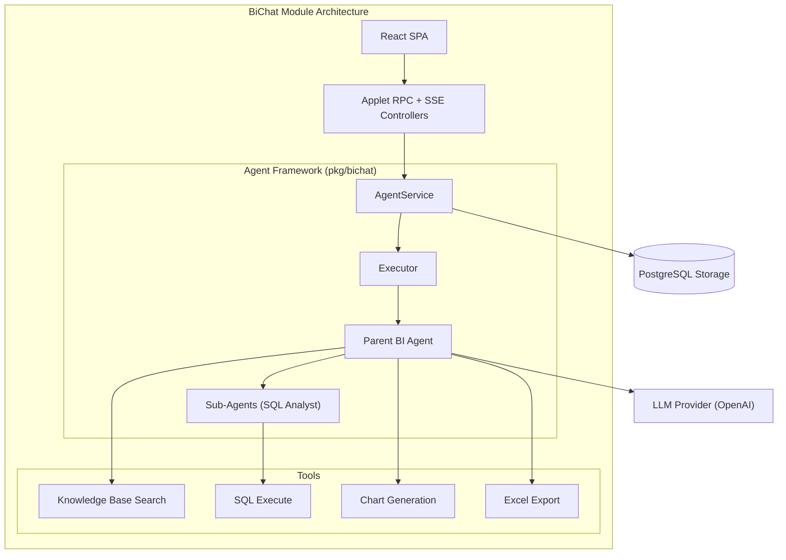

# BiChat Module

The BiChat (Business Intelligence Chat) module provides an agent-powered conversational interface for querying business data and gaining insights. Built on the `pkg/bichat` foundation, it uses a multi-agent orchestration system to handle complex data analysis tasks.

## Purpose

This module enables:
- **Natural Language Data Queries**: Ask questions about your business data in plain English.
- **Multi-Agent Analysis**: A parent BI agent coordinates with specialized sub-agents (like the SQL Analyst) to solve complex tasks.
- **Real-time Data Exploration**: Live execution of SQL queries against your business database.
- **HITL (Human-in-the-Loop)**: Agents can pause execution to ask the user for clarification or missing information.
- **Data Export**: Export query results directly to Excel.

## Key Concepts

### Agents

The system uses an orchestration pattern:
- **BI Agent (Parent)**: The primary interface that understands user intent and coordinates the workflow.
- **SQL Analyst (Sub-agent)**: Specialized in understanding database schema and generating precise SQL queries.
- **Delegation Tool**: Allows agents to hand off tasks to specialized sub-agents when needed.

### Sessions & Messages

- **Session**: A continuous conversation context tied to a user and tenant.
- **Message**: Individual exchanges between the user and agents, supporting text and file attachments.
- **Context Management**: Content-addressed context building that intelligently summarizes history to fit LLM token windows.

### HITL (Human-in-the-Loop)

When an agent needs more information (e.g., "Which warehouse should I check?"), it uses the `ask_user_question` tool. This triggers an interrupt, saves the agent's state as a **Checkpoint**, and waits for a user answer before resuming.

## Architecture



## API Reference

### REST/SSE Endpoints

| Endpoint | Method | Purpose |
|----------|--------|---------|
| `/bi-chat` | GET | Serves the React SPA |
| `/bi-chat/stream` | POST | SSE streaming endpoint for agent responses |
| `/bi-chat/rpc` | POST | Applet RPC API for session management |

### RPC Procedures

**Session:**
- `bichat.session.list`: List user's chat sessions
- `bichat.session.get`: Get session state (session + turns)
- `bichat.session.create`: Create a new session
- `bichat.session.updateTitle`: Rename a session
- `bichat.session.pin` / `bichat.session.unpin`: Toggle pinned
- `bichat.session.delete`: Delete a session

**Artifacts:**
- `bichat.session.artifacts`: List artifacts for a session

## Permissions

| Permission | Resource | Description |
|------------|----------|-------------|
| `BiChat.Access` | `bichat` | Access the BI Chat interface and their own sessions |
| `BiChat.ReadAll` | `bichat` | View chat sessions from all users in the tenant |
| `BiChat.Export` | `bichat` | Use data export tools within the chat |

## Data Sources

The **SQL Analyst** agent has read-only access to the `analytics` schema in the database. Developers should create tenant-isolated views in this schema to expose data to BiChat:

```sql
CREATE VIEW analytics.tenant_sales AS
SELECT * FROM sales 
WHERE tenant_id = current_setting('app.tenant_id', true)::UUID;
```

## Configuration

The module is configured via `ModuleConfig` in Go:

```go
cfg := bichat.NewModuleConfig(
    composables.UseTenantID,
    composables.UseUserID,
    chatRepo,
    llmModel,
    bichat.DefaultContextPolicy(),
    parentAgent,
    bichat.WithAttachmentStorage("/var/lib/bichat/attachments", "https://example.com/bichat/attachments"),
    bichat.WithQueryExecutor(executor),
    bichat.WithVision(true),
    bichat.WithMultiAgent(true),
)
```

### StreamController permission overrides

By default, the module registers the SSE streaming endpoint at `/bi-chat/stream` using BiChat’s built-in permissions.
If your application defines **its own** permission constants (e.g. `AIChat.Access`, `AIChat.ReadAll`), you can override what the StreamController enforces:

```go
cfg := bichat.NewModuleConfig(
    composables.UseTenantID,
    composables.UseUserID,
    chatRepo,
    llmModel,
    bichat.DefaultContextPolicy(),
    parentAgent,
    bichat.WithStreamRequireAccessPermission(apppermissions.AIChatAccess),
    bichat.WithStreamReadAllPermission(apppermissions.AIChatReadAll),
)
```

Alternatively, if you prefer full control, you can **skip the module’s StreamController** and register your own instance via
`controllers.NewStreamController(..., controllers.WithRequireAccessPermission(...), controllers.WithReadAllPermission(...))`
in setups where you wire BiChat controllers manually (instead of relying on module registration).

### Serving attachments & artifacts (exports)

`WithAttachmentStorage(baseDir, baseURL)` controls where BiChat stores files (exports, artifacts, and attachments) and what URL is written into artifact records.
Your application must ensure that `baseURL` is **reachable**.

Two common setups:

- **Reverse proxy / CDN**: point `baseURL` at whatever serves `baseDir` (Nginx, S3, etc.).
- **Built-in controller**: serve `baseDir` from the app with auth:

```go
// Store files on disk and expose them under /bi-chat/uploads/<uuid>.<ext>
cfg := bichat.NewModuleConfig(
    composables.UseTenantID,
    composables.UseUserID,
    chatRepo,
    llmModel,
    bichat.DefaultContextPolicy(),
    parentAgent,
    bichat.WithAttachmentStorage("/var/lib/bichat/uploads", "/bi-chat/uploads"),
)

// Register an authenticated file server for the baseDir.
app.RegisterControllers(
    controllers.NewUploadsController(
        app,
        "/var/lib/bichat/uploads",
        controllers.WithBasePath("/bi-chat"),
        controllers.WithRequireAccessPermission(apppermissions.AIChatAccess), // or BiChat.Access
    ),
)
```

### Repository-Scoped Prompt Extensions

BiChat always keeps the SDK vendor system prompt as the base.  
Downstream repositories can append project/domain guidance without replacing it.

Static extension:

```go
cfg := bichat.NewModuleConfig(
    composables.UseTenantID,
    composables.UseUserID,
    chatRepo,
    llmModel,
    bichat.DefaultContextPolicy(),
    parentAgent,
    bichat.WithAttachmentStorage("/var/lib/bichat/attachments", "https://example.com/bichat/attachments"),
    bichat.WithProjectPromptExtension(`
You are operating in insurance BI domain.
Prioritize policy lifecycle, claims fraud signals, reserve adequacy, and underwriting KPIs.
Use domain terms: policy, endorsement, claim, loss ratio, combined ratio, IBNR.
`),
)
```

Provider extension (resolved once during `BuildServices()`):

```go
cfg := bichat.NewModuleConfig(
    composables.UseTenantID,
    composables.UseUserID,
    chatRepo,
    llmModel,
    bichat.DefaultContextPolicy(),
    parentAgent,
    bichat.WithAttachmentStorage("/var/lib/bichat/attachments", "https://example.com/bichat/attachments"),
    bichat.WithProjectPromptExtensionProvider(
        prompts.ProjectPromptExtensionProviderFunc(func() (string, error) {
            return loadProjectPrompt(), nil
        }),
    ),
)
```

Behavior:
- Extension scope is project/repository level (not tenant level).
- Provider output wins when non-empty; otherwise static extension is used.
- Provider errors fail service startup (`BuildServices()`).
- Extension is applied in parent flow (`AgentService.ProcessMessage`) before debug augmentation.

## Environment Variables

| Variable | Required | Description |
|----------|----------|-------------|
| `OPENAI_API_KEY` | Yes | API key for OpenAI |
| `OPENAI_MODEL` | No | Default model (defaults to `gpt-4o`) |
| `BICHAT_CONTEXT_WINDOW` | No | Max tokens for context (default: 200k) |
| `BICHAT_KNOWLEDGE_DIR` | No | Path to static knowledge root (`tables/`, `queries/`, `business/`) |
| `BICHAT_KB_INDEX_PATH` | No | Bleve index path for `kb_search` |
| `BICHAT_SCHEMA_METADATA_DIR` | No | Directory containing table metadata JSON files |

## Knowledge Bootstrap

Use the CLI to load curated BI knowledge into validated query storage and optional KB index:

```bash
command knowledge load \
  --tenant-id <tenant-uuid> \
  --dir /path/to/knowledge
```

Rebuild mode clears tenant-scoped validated query patterns first and recreates KB index contents:

```bash
command knowledge rebuild \
  --tenant-id <tenant-uuid> \
  --dir /path/to/knowledge
```

Directory contract (Dash-compatible):
- `tables/*.json`: table metadata and usage notes
- `queries/*.sql`: validated query patterns (`<query name>`, `<query description>`, `<query>`)
- `business/*.json`: business rules and definitions
