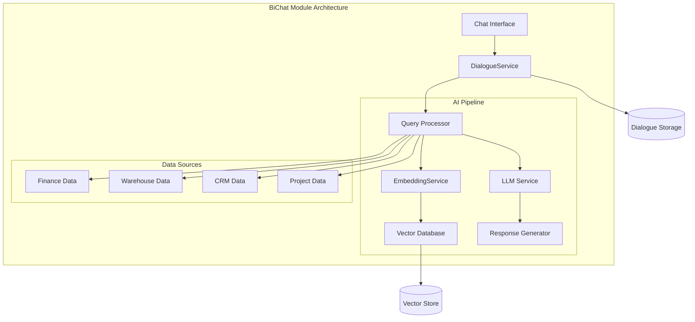
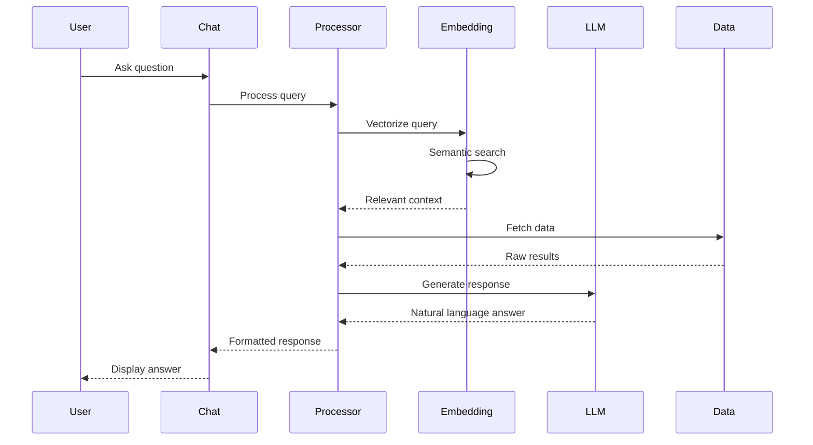

# BiChat Module

The BiChat (Business Intelligence Chat) module provides AI-powered conversational interface for querying business data and gaining insights.

## Purpose

This module enables:
- Natural language data queries
- AI-powered business insights
- Conversational analytics
- Report generation via chat
- Data exploration through dialogue

## Key Concepts

### Dialogue

Chat conversation entity:
- **Messages** - User and AI exchanges
- **Context** - Conversation history
- **Session** - User session association
- **Status** - Active, Archived

### Embedding

AI vector representations:
- **Data embeddings** - Vector representations of business data
- **Query embeddings** - User query vectorization
- **Semantic search** - Find relevant data by meaning
- **Similarity matching** - Compare data points

### AI Integration

Artificial intelligence services:
- **Natural language processing** - Understand user queries
- **Data analysis** - Process and analyze data
- **Response generation** - Create human-readable answers
- **Context awareness** - Maintain conversation context

## Architecture

## Data Flow

### Chat Query Processing

## Components

### Chat Interface

User interaction layer:
- **Chat UI** - Message input and display
- **History** - Previous conversations
- **Suggestions** - Query suggestions
- **Export** - Save chat transcripts

### Query Processing

Natural language understanding:
- **Intent recognition** - What user wants
- **Entity extraction** - Identify data entities
- **Query building** - Convert to data queries
- **Context management** - Maintain conversation flow

### Embedding Service

Vector representation:
- **Data indexing** - Convert data to vectors
- **Query embedding** - Vectorize user queries
- **Similarity search** - Find related data
- **Context retrieval** - Relevant information

### LLM Integration

AI response generation:
- **Query interpretation** - Understand questions
- **Data synthesis** - Combine multiple data points
- **Insight generation** - Identify patterns
- **Response formatting** - Human-readable answers

## API Reference

### REST Endpoints

| Endpoint | Method | Purpose |
|----------|--------|---------|
| `/bichat/dialogues` | GET | List conversations |
| `/bichat/dialogues` | POST | Start new chat |
| `/bichat/dialogues/:id` | GET | Get conversation |
| `/bichat/dialogues/:id/messages` | POST | Send message |
| `/bichat/embeddings/sync` | POST | Sync data embeddings |

### WebSocket

Real-time chat via WebSocket:
- `ws://host/bichat/stream` - Live message streaming
- Bi-directional communication
- Typing indicators
- Message delivery confirmation

## Permissions

| Permission | Description |
|------------|-------------|
| `bichat.use` | Access chat interface |
| `bichat.history.view` | View chat history |
| `bichat.history.delete` | Delete conversations |
| `bichat.embeddings.manage` | Manage data embeddings |
| `bichat.ai.configure` | Configure AI settings |

## Data Sources

### Available Data

BiChat can query across modules:

| Module | Data Access |
|--------|-------------|
| **Finance** | Transactions, accounts, reports |
| **Warehouse** | Inventory, orders, products |
| **CRM** | Clients, chats, communications |
| **Projects** | Projects, stages, payments |
| **HRM** | Employees, positions |

### Query Examples

Natural language queries:
- "What were sales last month?"
- "Show me top 10 products by revenue"
- "How many new clients this quarter?"
- "Compare this month vs last month expenses"
- "Which projects are overdue?"

## Integration

### AI Provider

Configurable AI backends:
- **OpenAI** - GPT models
- **Anthropic** - Claude models
- **Local models** - Self-hosted LLMs
- **Custom providers** - BYO AI service

### Embedding Store

Vector database options:
- **Pinecone** - Managed vector DB
- **Weaviate** - Open source vector search
- **PostgreSQL pgvector** - Extension-based
- **Redis** - In-memory vectors

### Events

| Event | Description |
|-------|-------------|
| `DialogueCreated` | New chat started |
| `MessageSent` | User sent message |
| `ResponseGenerated` | AI responded |
| `EmbeddingSynced` | Data re-indexed |
| `QueryProcessed` | Query analyzed |

## Configuration

### AI Settings

Configuration options:
- **Model selection** - Choose LLM provider
- **Temperature** - Response creativity
- **Max tokens** - Response length limit
- **Context window** - Conversation memory

### Data Sync

Embedding synchronization:
- **Sync schedule** - Automatic re-indexing
- **Data scope** - Which modules to include
- **Batch size** - Processing chunks
- **Incremental updates** - Delta changes only

## Best Practices

1. **Data privacy** - Don't expose sensitive data
2. **Query limits** - Rate limiting for cost control
3. **Context limits** - Manage conversation length
4. **Feedback loop** - Improve based on ratings
5. **Monitoring** - Track query success rates
6. **Caching** - Cache frequent queries

## Security Considerations

### Data Access

BiChat respects permissions:
- Only query data user can access
- Respect RBAC permissions
- Filter by tenant
- Audit all queries

### AI Safety

Content filtering:
- Input validation
- Output filtering
- Sensitive data detection
- Prompt injection protection
