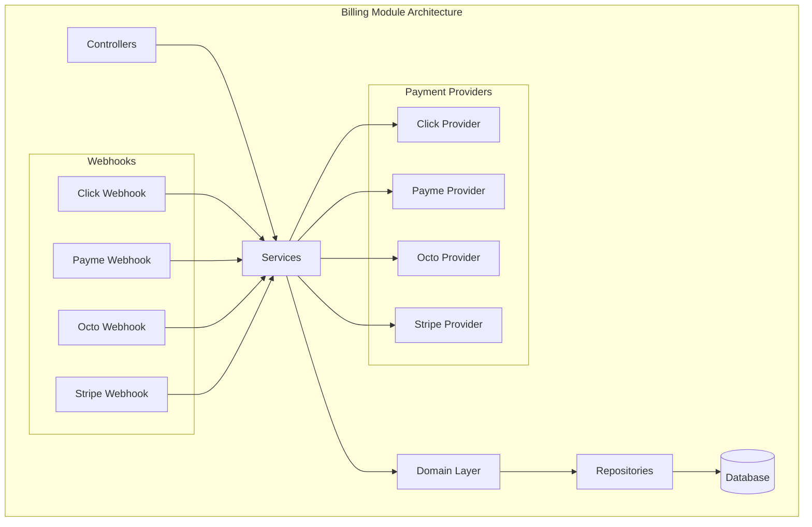
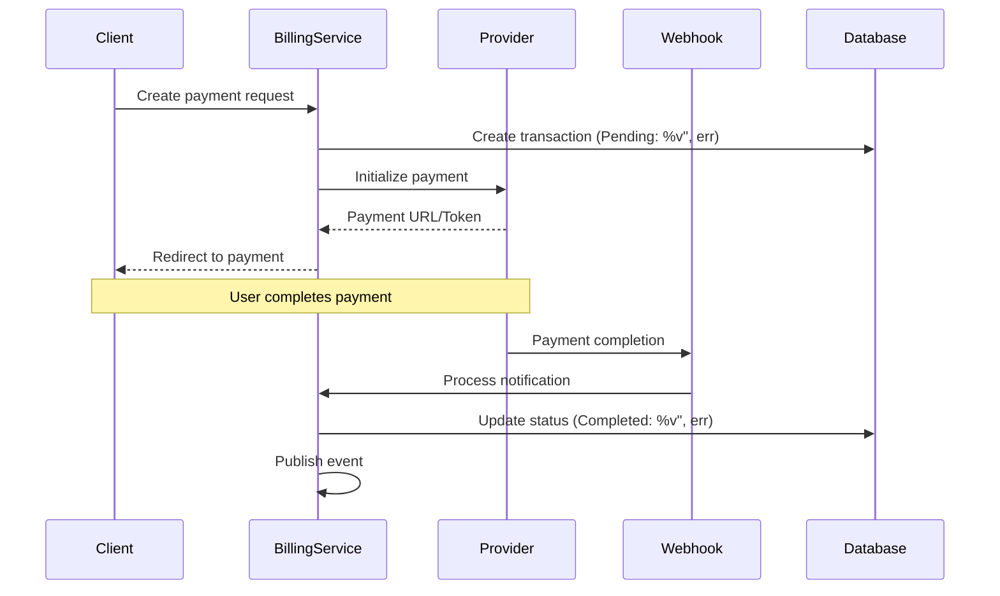

# Billing Module

The Billing module provides payment processing capabilities with support for multiple payment providers and webhook integration.

## Purpose

This module handles:
- Payment transaction processing
- Multiple payment provider integration
- Webhook handling for payment notifications
- Transaction status tracking
- Payment reconciliation

## Key Concepts

### BillingTransaction

Payment transaction entity:
- **Provider** - Payment provider used
- **Amount** - Transaction amount
- **Currency** - Transaction currency
- **Status** - Pending, Completed, Failed, Refunded
- **External ID** - Provider's transaction reference
- **Metadata** - Provider-specific data

### Payment Providers

Supported payment gateways:

| Provider | Region | Type |
|----------|--------|------|
| **Click** | Regional | Local payment system |
| **Payme** | Regional | Local payment system |
| **Octo** | International | Payment aggregator |
| **Stripe** | International | Credit cards, global |

### Webhooks

Provider notification system:
- **Payment completion** - Success notifications
- **Payment failure** - Error notifications
- **Refunds** - Refund confirmations
- **Signature verification** - Security validation

## Architecture

## Payment Flow

### Initiating Payment

## Components

### Transactions

Transaction management:
- Create payment requests
- Track transaction status
- Handle refunds
- Reconcile with providers

### Provider Integration

Provider-specific handling:
- **Click** - Regional payment system
- **Payme** - Regional payment provider
- **Octo** - Aggregator with multiple methods
- **Stripe** - International credit cards

### Webhook Controllers

Secure webhook endpoints:
- Signature verification
- Idempotency handling
- Event processing
- Error recovery

### Reconciliation

Payment matching:
- Compare transactions with provider reports
- Identify discrepancies
- Handle missing notifications

## API Reference

### REST Endpoints

| Endpoint | Method | Purpose |
|----------|--------|---------|
| `/billing/transactions` | GET | List transactions |
| `/billing/transactions` | POST | Create transaction |
| `/billing/webhooks/click` | POST | Click webhook |
| `/billing/webhooks/payme` | POST | Payme webhook |
| `/billing/webhooks/octo` | POST | Octo webhook |
| `/billing/webhooks/stripe` | POST | Stripe webhook |

### Provider APIs

Each provider has specific integration endpoints for:
- Payment initialization
- Status checking
- Refund processing
- webhook configuration

## Permissions

| Permission | Description |
|------------|-------------|
| `billing.transactions.view` | View transactions |
| `billing.transactions.create` | Create payments |
| `billing.transactions.refund` | Process refunds |
| `billing.providers.manage` | Configure providers |
| `billing.webhooks.receive` | Webhook access |

## Integration

### Finance Module
- Payment recording
- Account balance updates
- Transaction reconciliation

### Events

| Event | Description |
|-------|-------------|
| `PaymentInitiated` | Payment started |
| `PaymentCompleted` | Payment successful |
| `PaymentFailed` | Payment error |
| `PaymentRefunded` | Refund processed |
| `WebhookReceived` | Provider notification |

## Configuration

### Provider Settings

Each provider requires:
- **API credentials** - Keys and secrets
- **Webhook URL** - Endpoint configuration
- **Environment** - Sandbox or production
- **Supported currencies** - Currency restrictions

### Security

Webhook security measures:
- **Signature verification** - HMAC validation
- **IP whitelisting** - Provider IP restrictions
- **Replay protection** - Idempotency keys
- **TLS encryption** - HTTPS only

## Best Practices

1. **Idempotency** - Handle duplicate webhooks gracefully
2. **Logging** - Log all provider interactions
3. **Reconciliation** - Regular transaction matching
4. **Error handling** - Retry failed webhooks
5. **Testing** - Use sandbox environments
6. **Monitoring** - Track payment success rates
