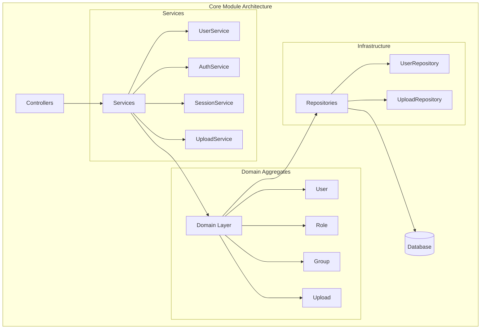
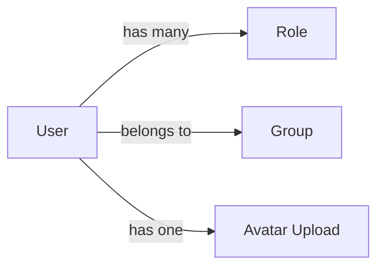
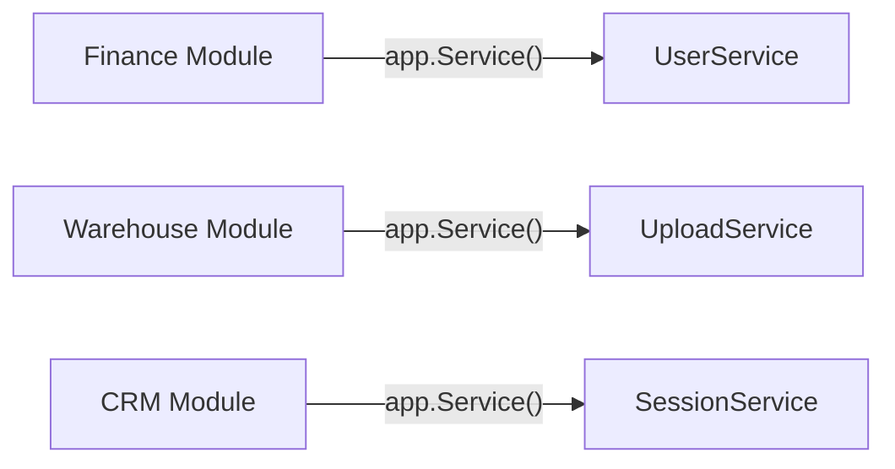

# Core Module

The Core module provides foundational functionality for IOTA SDK platform. Every application built on the SDK requires this module.

## Purpose

The Core module handles:
- User authentication and authorization
- Role-based access control (RBAC)
- File uploads and management
- Session management
- Currency definitions
- Tenant management (in multi-tenant mode)

## Key Concepts

### User

Central entity representing platform users. Users can:
- Authenticate via username/password
- Have multiple roles assigned
- Belong to groups for organization
- Upload avatars and files
- Be blocked/deactivated

### Role

Defines a set of permissions. The RBAC system allows:
- Granular permission control
- Role inheritance
- Dynamic permission checks
- Module-specific permissions

### Session

Cookie-based session management:
- Secure session storage
- Automatic expiration
- Multi-device support
- Session invalidation

### Upload

File upload handling with:
- Hash-based storage (deduplication)
- Size and type validation
- Multiple upload support
- Secure file serving

## Architecture

```mermaid
graph TB
    subgraph "Core Module Architecture"
        A[Controllers] --> B[Services]
        B --> C[Domain Layer]
        C --> D[Repositories]
        D --> E[(Database)]
        
        subgraph "Domain Aggregates"
            C --> F[User]
            C --> G[Role]
            C --> H[Group]
            C --> I[Upload]
        end
        
        subgraph "Services"
            B --> J[UserService]
            B --> K[AuthService]
            B --> L[SessionService]
            B --> M[UploadService]
        end
        
        subgraph "Infrastructure"
            D --> N[UserRepository]
            D --> O[UploadRepository]
        end
    end
```

## Components

### Users

User management including:
- Profile management
- Password management (bcrypt hashed)
- Avatar uploads
- Account blocking
- UI language preferences

**Relationships:**

```mermaid
graph LR
    User -->|has many| Role
    User -->|belongs to| Group
    User -->|has one| Upload[Avatar Upload]
```

### Roles

Role management with:
- Permission assignments
- User role assignment
- System and custom roles

### Groups

User grouping for:
- Organizational structure
- Bulk operations
- Reporting hierarchies

### Settings

System configuration:
- Application settings
- Tenant-specific overrides
- Localization defaults

### Dashboard

Main dashboard view with:
- Quick actions
- Recent activity
- Navigation shortcuts

### Account

User self-service:
- Profile editing
- Password changes
- Language selection

## API Reference

### GraphQL Schema

The Core module exposes GraphQL endpoints:

| Type | Queries | Mutations |
|------|---------|-----------|
| **User** | user, users | createUser, updateUser |
| **Upload** | upload, uploads | createUpload |
| **Auth** | me | login, logout |
| **Session** | — | deleteSession(token: String!) |

See [API Reference](/api/core) for detailed schema documentation.

### REST Endpoints

Standard REST endpoints for form submissions:

| Endpoint | Method | Purpose |
|----------|--------|---------|
| `/users` | GET | List users |
| `/users` | POST | Create user |
| `/users/:id` | GET | View user |
| `/users/:id` | PUT | Update user |
| `/users/:id` | DELETE | Delete user |
| `/login` | POST | Authenticate |
| `/logout` | GET | End session |

## Permissions

### Available Permissions

| Permission | Description |
|------------|-------------|
| `User.Read` | View user list and details |
| `User.Create` | Create new users |
| `User.Update` | Modify existing users |
| `User.Delete` | Remove users |
| `Role.Read` | View roles |
| `Role.Create` | Create roles |
| `Role.Update` | Modify roles |
| `Role.Delete` | Delete roles |
| `Upload.Read` | View uploads |
| `Upload.Create` | Upload files |
| `Upload.Delete` | Delete uploads |
| `Setting.Read` | View settings |
| `Setting.Update` | Modify settings |

### Default Roles

| Role | Permissions |
|------|-------------|
| **Superadmin** | All permissions |
| **Admin** | Users, roles, settings management |
| **Manager** | View users, limited edit |
| **User** | View own profile only |

## Integration with Other Modules

### Service Access

Other modules access Core services via the registry:

```mermaid
graph LR
    A[Finance Module] -->|"app.Service()"| B[UserService]
    C[Warehouse Module] -->|"app.Service()"| D[UploadService]
    E[CRM Module] -->|"app.Service()"| F[SessionService]
```

### Shared Entities

Core entities used across modules:

| Entity | Usage |
|--------|-------|
| **User** | Created by, assigned to, approved by |
| **Upload** | Attachments, avatars, documents |
| **Currency** | Financial transactions |
| **Role** | Permission checks |

### Events

The Core module publishes domain events:

| Event | Description |
|-------|-------------|
| `UserCreated` | New user registered |
| `UserUpdated` | User profile changed |
| `UserPasswordChanged` | Password updated |
| `UserBlocked` | User deactivated |
| `RoleAssigned` | Role given to user |
| `UploadCreated` | File uploaded |

## Configuration

### Module Options

Configure during registration:

- **Permission Schema** - Define available permissions
- **Default Roles** - Initial roles to create
- **Upload Limits** - Max file size, allowed types
- **Session Settings** - Timeout, cookie settings

### Environment Variables

| Variable | Purpose |
|----------|---------|
| `SESSION_DURATION` | Session duration |
| `MAX_UPLOAD_SIZE` | File upload limit |
| `UPLOADS_PATH` | File storage directory |

## Usage

The Core module is included in `BuiltInModules` and registered via `modules.Load(app, modules.BuiltInModules...)`. Do not call a separate register function; use `app.RegisterModule(module)` only when adding custom modules.

## Best Practices

1. **Always check permissions** - Use middleware for route protection
2. **Validate uploads** - Check file types and sizes
3. **Hash passwords** - Never store plain text passwords
4. **Use events** - Subscribe to user events for integrations
5. **Session security** - Rotate session IDs on privilege change

## Next Steps

- [Finance Module](/finance) - Financial management
- [Architecture](/architecture) - Understanding DDD patterns
