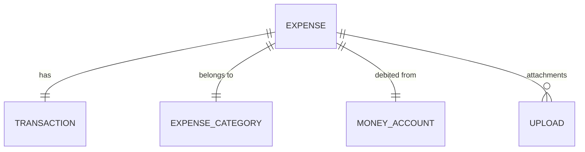

# Complex Features Tutorial

This tutorial teaches you how to build complex features in IOTA SDK with multiple entity relationships, validations, and business rules. We'll use the **Expense** feature from the Finance module as a real-world example.

## What You'll Learn

- Building entities with foreign key relationships
- Creating complex repositories with JOINs
- Handling multi-entity transactions
- Implementing file attachments
- Complex validation patterns
- Business rule enforcement

## Feature Overview

The Expense feature demonstrates:

- **Multiple Relationships**: Links to ExpenseCategory, MoneyAccount, and Transaction
- **Business Rules**: Validates sufficient account balance
- **File Attachments**: Associates uploads with expenses
- **Multi-Entity Operations**: Creates expense and transaction atomically
- **Complex Queries**: Searches across multiple tables



## Step 1: Domain Entities with Relationships

### 1.1 Expense Entity Interface

The expense entity maintains references to multiple other entities:

```go
// modules/finance/domain/aggregates/expense/expense.go

type Expense interface {
	ID() uuid.UUID
	Amount() *money.Money
	Account() moneyaccount.Account        // Relationship 1
	Category() category.ExpenseCategory   // Relationship 2
	Comment() string
	TransactionID() uuid.UUID             // Relationship 3
	AccountingPeriod() time.Time
	Date() time.Time
	CreatedAt() time.Time
	UpdatedAt() time.Time
	
	// Setters
	SetAccount(account moneyaccount.Account) Expense
	SetCategory(category category.ExpenseCategory) Expense
	SetComment(comment string) Expense
	SetAmount(amount *money.Money) Expense
	
	// Attachment methods
	GetAttachments() []uint
	HasAttachment(uploadID uint) bool
	AttachFile(uploadID uint) (Expense, error)
	DetachFile(uploadID uint) (Expense, error)
}
```

### 1.2 Entity Implementation with Validation

```go
// modules/finance/domain/aggregates/expense/expense_impl.go

type expense struct {
	id               uuid.UUID
	amount           *money.Money
	account          moneyaccount.Account
	category         category.ExpenseCategory
	comment          string
	transactionID    uuid.UUID
	accountingPeriod time.Time
	date             time.Time
	createdAt        time.Time
	updatedAt        time.Time
	attachments      []uint
}

// New creates an expense with validation
func New(amount *money.Money, account moneyaccount.Account, 
         category category.ExpenseCategory, date time.Time, 
         opts ...Option) Expense {
	// Validation: amount must not be nil and must be positive
	if amount == nil {
		panic("expense amount is required")
	}
	if amount.Amount() <= 0 {
		panic("expense amount must be positive")
	}
	
	e := &expense{
		id:               uuid.New(),
		amount:           amount,
		account:          account,
		category:         category,
		date:             date,
		createdAt:        time.Now(),
		updatedAt:        time.Now(),
		attachments:      []uint{},
	}
	
	for _, opt := range opts {
		opt(e)
	}
	
	return e
}

// Business rule: Attach file with validation
func (e *expense) AttachFile(uploadID uint) (Expense, error) {
	if uploadID == 0 {
		return nil, fmt.Errorf("upload ID cannot be zero")
	}
	
	if e.HasAttachment(uploadID) {
		return nil, fmt.Errorf("file already attached")
	}
	
	result := *e
	result.attachments = append(result.attachments, uploadID)
	result.updatedAt = time.Now()
	return &result, nil
}
```

## Step 2: Complex Repository with JOINs

### 2.1 Multi-Table Query Pattern

The expense repository queries across three tables:

```go
// modules/finance/infrastructure/persistence/expense_repository.go

const expenseFindQuery = `
	SELECT ex.id, ex.transaction_id, ex.category_id, ex.tenant_id, 
	       ex.created_at, ex.updated_at,
	       tr.amount, tr.transaction_date, tr.accounting_period, 
	       tr.transaction_type, tr.comment,
	       tr.origin_account_id, tr.destination_account_id
	FROM expenses ex 
	LEFT JOIN transactions tr ON tr.id = ex.transaction_id
`

type GormExpenseRepository struct {
	categoryRepo    category.Repository
	transactionRepo transaction.Repository
	fieldMap        map[expense.Field]string
}

func NewExpenseRepository(
	categoryRepo category.Repository,
	transactionRepo transaction.Repository,
) expense.Repository {
	return &GormExpenseRepository{
		categoryRepo:    categoryRepo,
		transactionRepo: transactionRepo,
		fieldMap: map[expense.Field]string{
			expense.ID:            "ex.id",
			expense.TransactionID: "ex.transaction_id",
			expense.CategoryID:    "ex.category_id",
			expense.CreatedAt:     "ex.created_at",
			expense.UpdatedAt:     "ex.updated_at",
		},
	}
}
```

### 2.2 Building Complex Filters

```go
func (g *GormExpenseRepository) buildExpenseFilters(
	ctx context.Context, 
	params *expense.FindParams,
) ([]string, []interface{}, error) {
	tenantID, err := composables.UseTenantID(ctx)
	if err != nil {
		return nil, nil, errors.Wrap(err, "failed to get tenant")
	}

	where := []string{"ex.tenant_id = $1"}
	args := []interface{}{tenantID}

	// Apply field filters
	for _, filter := range params.Filters {
		column, ok := g.fieldMap[filter.Column]
		if !ok {
			return nil, nil, fmt.Errorf("unknown filter field: %v", filter.Column)
		}
		where = append(where, filter.Filter.String(column, len(args)+1))
		args = append(args, filter.Filter.Value()...)
	}

	// Search across multiple columns
	if params.Search != "" {
		index := len(args) + 1
		where = append(where, 
			fmt.Sprintf("(tr.comment ILIKE $%d)", index))
		args = append(args, "%"+params.Search+"%")
	}

	return where, args, nil
}
```

### 2.3 Query with Relationship Loading

```go
func (g *GormExpenseRepository) queryExpenses(
	ctx context.Context, 
	query string, 
	args ...interface{},
) ([]expense.Expense, error) {
	tx, err := composables.UseTx(ctx)
	if err != nil {
		return nil, errors.Wrap(err, "failed to get transaction")
	}

	rows, err := tx.Query(ctx, query, args...)
	if err != nil {
		return nil, errors.Wrap(err, "failed to execute query")
	}
	defer rows.Close()

	// First pass: collect raw data
	type expenseData struct {
		dbExpense     models.Expense
		dbTransaction models.Transaction
	}
	var data []expenseData
	
	for rows.Next() {
		var d expenseData
		if err := rows.Scan(
			&d.dbExpense.ID, &d.dbExpense.TransactionID, &d.dbExpense.CategoryID,
			&d.dbExpense.TenantID, &d.dbExpense.CreatedAt, &d.dbExpense.UpdatedAt,
			&d.dbTransaction.Amount, &d.dbTransaction.TransactionDate,
			&d.dbTransaction.AccountingPeriod, &d.dbTransaction.TransactionType,
			&d.dbTransaction.Comment,
			&d.dbTransaction.OriginAccountID, &d.dbTransaction.DestinationAccountID,
		); err != nil {
			return nil, errors.Wrap(err, "failed to scan row")
		}
		data = append(data, d)
	}

	// Second pass: load relationships
	var expenses []expense.Expense
	for _, d := range data {
		// Load category (N+1 pattern - consider batch loading for performance)
		domainCategory, err := g.categoryRepo.GetByID(ctx, 
			uuid.MustParse(d.dbExpense.CategoryID))
		if err != nil {
			return nil, errors.Wrap(err, "failed to load category")
		}

		// Build domain entity
		opts := []expense.Option{
			expense.WithID(d.dbExpense.ID),
			expense.WithTransactionID(d.dbExpense.TransactionID),
			expense.WithAccountingPeriod(d.dbTransaction.AccountingPeriod),
			expense.WithComment(d.dbTransaction.Comment),
			expense.WithCreatedAt(d.dbExpense.CreatedAt),
			expense.WithUpdatedAt(d.dbExpense.UpdatedAt),
		}

		exp := expense.New(
			money.New(d.dbTransaction.Amount, "USD"),
			nil, // Account loaded separately
			domainCategory,
			d.dbTransaction.TransactionDate,
			opts...,
		)
		expenses = append(expenses, exp)
	}

	return expenses, nil
}
```

## Step 3: Multi-Entity Transactions

### 3.1 Service Layer with Transaction Management

The service creates both an expense and a transaction atomically:

```go
// modules/finance/services/expense_service.go

func (s *ExpenseService) Create(ctx context.Context, entity expense.Expense) (expense.Expense, error) {
	if err := composables.CanUser(ctx, permissions.ExpenseCreate); err != nil {
		return nil, err
	}

	// Create domain event before transaction
	createdEvent, err := expense.NewCreatedEvent(ctx, entity)
	if err != nil {
		return nil, err
	}

	// Execute in transaction
	var created expense.Expense
	err = composables.InTx(ctx, func(txCtx context.Context) error {
		// Step 1: Create expense (which also creates transaction)
		created, err = s.repo.Create(txCtx, entity)
		if err != nil {
			return err
		}
		
		// Step 2: Recalculate account balance
		if err := s.accountService.RecalculateBalance(
			txCtx, entity.Account().ID()); err != nil {
			return err
		}
		
		return nil
	})
	
	if err != nil {
		return nil, err
	}

	// Publish event after successful transaction
	s.publisher.Publish(createdEvent)
	return created, nil
}
```

### 3.2 Repository Transaction Handling

```go
func (g *GormExpenseRepository) Create(
	ctx context.Context, 
	data expense.Expense,
) (expense.Expense, error) {
	tx, err := composables.UseTx(ctx)
	if err != nil {
		return nil, errors.Wrap(err, "failed to get transaction")
	}

	// Step 1: Create the transaction first
	expenseRow, transactionRow := ToDBExpense(data)
	createdTransaction, err := g.transactionRepo.Create(ctx, transactionRow)
	if err != nil {
		return nil, errors.Wrap(err, "failed to create transaction")
	}

	// Step 2: Create the expense with transaction reference
	var id uuid.UUID
	if err := tx.QueryRow(
		ctx,
		expenseInsertQuery,
		expenseRow.ID,
		createdTransaction.ID(), // Foreign key
		expenseRow.CategoryID,
		expenseRow.TenantID,
	).Scan(&id); err != nil {
		return nil, errors.Wrap(err, "failed to create expense")
	}

	return g.GetByID(ctx, id)
}
```

## Step 4: File Attachments

### 4.1 Many-to-Many Relationship Pattern

```sql
-- Attachment junction table
CREATE TABLE expense_attachments (
    expense_id uuid NOT NULL REFERENCES expenses (id) ON DELETE CASCADE,
    upload_id int NOT NULL REFERENCES uploads (id) ON DELETE CASCADE,
    attached_at timestamp with time zone DEFAULT now(),
    PRIMARY KEY (expense_id, upload_id)
);
```

### 4.2 Repository Attachment Methods

```go
const (
	expenseAttachmentsQuery = `SELECT upload_id FROM expense_attachments WHERE expense_id = $1`
	expenseAttachFileQuery  = `
		INSERT INTO expense_attachments (expense_id, upload_id, attached_at) 
		VALUES ($1, $2, NOW()) 
		ON CONFLICT (expense_id, upload_id) DO NOTHING`
	expenseDetachFileQuery  = `DELETE FROM expense_attachments WHERE expense_id = $1 AND upload_id = $2`
)

func (g *GormExpenseRepository) GetAttachments(
	ctx context.Context, 
	expenseID uuid.UUID,
) ([]uint, error) {
	tx, err := composables.UseTx(ctx)
	if err != nil {
		return nil, err
	}

	rows, err := tx.Query(ctx, expenseAttachmentsQuery, expenseID)
	if err != nil {
		return nil, errors.Wrap(err, "failed to query attachments")
	}
	defer rows.Close()

	var attachments []uint
	for rows.Next() {
		var uploadID uint
		if err := rows.Scan(&uploadID); err != nil {
			return nil, errors.Wrap(err, "failed to scan upload ID")
		}
		attachments = append(attachments, uploadID)
	}

	return attachments, nil
}

func (g *GormExpenseRepository) AttachFile(
	ctx context.Context, 
	expenseID uuid.UUID, 
	uploadID uint,
) error {
	tx, err := composables.UseTx(ctx)
	if err != nil {
		return err
	}

	_, err = tx.Exec(ctx, expenseAttachFileQuery, expenseID, uploadID)
	if err != nil {
		return errors.Wrap(err, "failed to attach file")
	}
	return nil
}
```

### 4.3 Service Layer with Validation

```go
func (s *ExpenseService) AttachFileToExpense(
	ctx context.Context, 
	expenseID uuid.UUID, 
	uploadID uint,
) error {
	if err := composables.CanUser(ctx, permissions.ExpenseUpdate); err != nil {
		return err
	}

	// Validate expense exists
	_, err := s.repo.GetByID(ctx, expenseID)
	if err != nil {
		return fmt.Errorf("failed to find expense: %w", err)
	}

	// Validate upload exists and belongs to same tenant
	upload, err := s.uploadRepo.GetByID(ctx, uploadID)
	if err != nil {
		return fmt.Errorf("failed to find upload: %w", err)
	}

	// Check tenant isolation
	tenantID, err := composables.UseTenantID(ctx)
	if err != nil {
		return fmt.Errorf("failed to get tenant: %w", err)
	}
	if upload.TenantID() != tenantID {
		return serrors.NewError("TENANT_MISMATCH", 
			"upload does not belong to this tenant")
	}

	return composables.InTx(ctx, func(txCtx context.Context) error {
		return s.repo.AttachFile(txCtx, expenseID, uploadID)
	})
}
```

## Step 5: Complex DTOs and Validation

### 5.1 DTO with Multiple References

```go
// modules/finance/presentation/controllers/dtos/expense_dto.go

type ExpenseCreateDTO struct {
	Amount           float64         `validate:"required,gt=0"`
	AccountID        string          `validate:"required,uuid"`
	CategoryID       string          `validate:"required,uuid"`
	Comment          string
	AccountingPeriod shared.DateOnly `validate:"required"`
	Date             shared.DateOnly `validate:"required"`
	Attachments      []uint          // Upload IDs to attach
}

func (d *ExpenseCreateDTO) ToEntityWithReferences(
	tenantID uuid.UUID,
	account moneyAccount.Account,
	cat category.ExpenseCategory,
) (expense.Expense, error) {
	amount := money.NewFromFloat(d.Amount, "USD")

	return expense.New(
		amount,
		account,
		cat,
		time.Time(d.Date),
		expense.WithComment(d.Comment),
		expense.WithAccountingPeriod(time.Time(d.AccountingPeriod)),
		expense.WithTenantID(tenantID),
	), nil
}
```

### 5.2 Validation with Localization

```go
func (d *ExpenseCreateDTO) Ok(ctx context.Context) (map[string]string, bool) {
	l, ok := intl.UseLocalizer(ctx)
	if !ok {
		panic(intl.ErrNoLocalizer)
	}

	errors := map[string]string{}
	validationErrors := constants.Validate.Struct(d)
	
	if validationErrors != nil {
		for _, err := range validationErrors.(validator.ValidationErrors) {
			translatedField := l.MustLocalize(&i18n.LocalizeConfig{
				MessageID: fmt.Sprintf("Expenses.Single.%s", err.Field()),
			})
			errors[err.Field()] = l.MustLocalize(&i18n.LocalizeConfig{
				MessageID: fmt.Sprintf("ValidationErrors.%s", err.Tag()),
				TemplateData: map[string]string{
					"Field": translatedField,
				},
			})
		}
	}
	
	return errors, len(errors) == 0
}
```

## Step 6: Controller Implementation

### 6.1 Handling Complex Form Submissions

```go
func (c *ExpenseController) Create(
	r *http.Request,
	w http.ResponseWriter,
	logger *logrus.Entry,
	expenseService *services.ExpenseService,
	moneyAccountService *services.MoneyAccountService,
	expenseCategoryService *services.ExpenseCategoryService,
) {
	// Parse and validate DTO
	dto, err := composables.UseForm(&dtos.ExpenseCreateDTO{}, r)
	if err != nil {
		logger.Errorf("Error parsing form: %v", err)
		http.Error(w, err.Error(), http.StatusBadRequest)
		return
	}

	// Get tenant
	tenantID, err := composables.UseTenantID(r.Context())
	if err != nil {
		logger.Errorf("Error getting tenant: %v", err)
		http.Error(w, "Internal error", http.StatusInternalServerError)
		return
	}

	// Load related entities
	accountID, err := uuid.Parse(dto.AccountID)
	if err != nil {
		logger.Errorf("Invalid account ID: %v", err)
		http.Error(w, "Invalid account", http.StatusBadRequest)
		return
	}
	categoryID, err := uuid.Parse(dto.CategoryID)
	if err != nil {
		logger.Errorf("Invalid category ID: %v", err)
		http.Error(w, "Invalid category", http.StatusBadRequest)
		return
	}
	
	account, err := moneyAccountService.GetByID(r.Context(), accountID)
	if err != nil {
		logger.Errorf("Error loading account: %v", err)
		http.Error(w, "Invalid account", http.StatusBadRequest)
		return
	}
	
	cat, err := expenseCategoryService.GetByID(r.Context(), categoryID)
	if err != nil {
		logger.Errorf("Error loading category: %v", err)
		http.Error(w, "Invalid category", http.StatusBadRequest)
		return
	}

	// Validate DTO fields
	if errorsMap, ok := dto.Ok(r.Context()); !ok {
		// Return form with errors
		entity, _ := dto.ToEntityWithReferences(tenantID, account, cat)
		props := &expensesui.CreatePageProps{
			Errors:  errorsMap,
			Expense: mappers.ExpenseToViewModel(entity),
		}
		templ.Handler(expensesui.CreateForm(props)).ServeHTTP(w, r)
		return
	}

	// Create entity
	entity, err := dto.ToEntityWithReferences(tenantID, account, cat)
	if err != nil {
		logger.Errorf("Error creating entity: %v", err)
		http.Error(w, err.Error(), http.StatusInternalServerError)
		return
	}

	// Save to database
	createdEntity, err := expenseService.Create(r.Context(), entity)
	if err != nil {
		logger.Errorf("Error saving expense: %v", err)
		http.Error(w, err.Error(), http.StatusInternalServerError)
		return
	}

	// Handle file attachments
	for _, uploadID := range dto.Attachments {
		if uploadID > 0 {
			if err := expenseService.AttachFileToExpense(
				r.Context(), createdEntity.ID(), uploadID); err != nil {
				logger.Errorf("Error attaching file: %v", err)
				// Don't fail the whole operation
			}
		}
	}

	// Redirect to list
	shared.Redirect(w, r, c.basePath)
}
```

## Best Practices Summary

### Handling Relationships

1. **Lazy Loading**: Load related entities in the repository layer
2. **N+1 Prevention**: Consider batch loading for lists
3. **Transaction Boundaries**: Wrap multi-entity operations in transactions
4. **Validation**: Validate all foreign keys exist before creating

### Complex Queries

1. **Use JOINs**: Query related data in single query when possible
2. **Filter by Tenant**: Always include tenant_id in WHERE clauses
3. **Build Filters**: Use field maps for dynamic filtering
4. **Search Strategy**: Use ILIKE for case-insensitive search

### Business Rules

1. **Domain Validation**: Validate in entity constructor
2. **Service Orchestration**: Enforce rules across multiple entities
3. **Error Context**: Wrap errors with context using fmt.Errorf
4. **Transactions**: Use composables.InTx for atomic operations

### File Attachments

1. **Junction Tables**: Use many-to-many tables for attachments
2. **Tenant Isolation**: Verify uploads belong to same tenant
3. **Soft Handling**: Don't fail main operation on attachment errors
4. **Lazy Loading**: Load attachments separately when needed

## Common Patterns Checklist

When building complex features:

- [ ] Define all entity relationships clearly
- [ ] Create junction tables for many-to-many relationships
- [ ] Implement multi-table queries with JOINs
- [ ] Use transactions for multi-entity operations
- [ ] Validate all foreign key references
- [ ] Handle file uploads with proper validation
- [ ] Build flexible filtering with field maps
- [ ] Search across multiple columns
- [ ] Localize all validation errors
- [ ] Test with multiple tenants

## Next Steps

- Learn [Repository Patterns](/patterns/repositories) in depth
- Master [Service Layer](/patterns/services) patterns
- Build reactive UIs with [Controllers and HTMX](/patterns/controllers)
