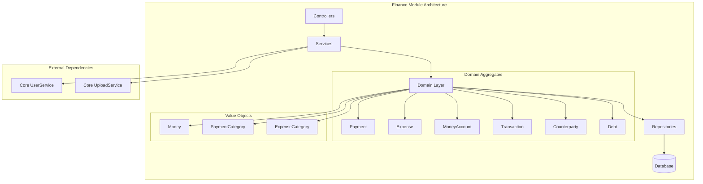
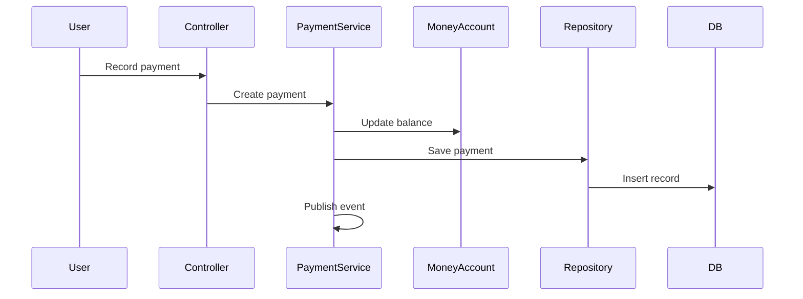
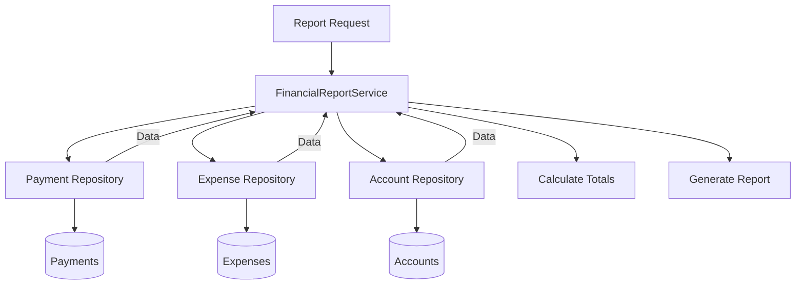

# Finance Module

The Finance module provides comprehensive financial management capabilities including income tracking, expense management, multi-currency accounts, and financial reporting.

## Purpose

This module handles:
- Income and expense tracking
- Multi-currency money accounts
- Financial transaction recording
- Counterparty (client/supplier) management
- Debt tracking (receivables and payables)
- Financial reporting (Income Statement, Cashflow)

## Key Concepts

### MoneyAccount

Financial accounts that hold funds:
- **Cash** - Physical cash accounts
- **Bank** - Bank accounts with optional integration
- **Multi-currency** - Each account has a primary currency
- **Balance tracking** - Real-time balance calculations

### Payment

Income transactions representing money coming in:
- Categorized by PaymentCategory
- Linked to MoneyAccount
- Can have attachments (documents, receipts)
- Associated with Counterparty

### Expense

Outgoing transactions representing money going out:
- Categorized by ExpenseCategory
- Linked to MoneyAccount
- Can have attachments
- Associated with Counterparty

### Transaction

Internal transfers between MoneyAccounts:
- Records movement between accounts
- Maintains audit trail
- Supports currency conversion

### Counterparty

External entities in financial transactions:
- **Clients** - Customers who pay you
- **Suppliers** - Vendors you pay
- **Partners** - Business partners
- **Other** - Miscellaneous entities

### Debt

Tracking of receivables and payables:
- **Receivable** - Money owed to you
- **Payable** - Money you owe
- **Status tracking** - Pending, Partial, Paid, Overdue
- **Payment linking** - Link payments/expenses to debts

## Architecture

## Data Flow

### Payment Recording

### Financial Reporting

## Components

### Money Accounts

Account management features:
- Create/edit/delete accounts
- Multi-currency support
- Opening/closing balances
- Account archiving

### Payments

Income tracking:
- Record incoming payments
- Categorize by type
- Link to counterparties
- Attach supporting documents
- Associate with debts

### Expenses

Outgoing transaction tracking:
- Record expenses
- Categorize spending
- Track by counterparty
- Attach receipts
- Link to payables

### Categories

Hierarchical categorization:
- **Payment Categories** - Income types (Sales, Services, etc.)
- **Expense Categories** - Spending types (Rent, Salaries, etc.)
- Nested categories supported

### Transactions

Account-to-account transfers:
- Internal movements
- Currency conversion
- Transaction fees
- Audit trail

### Counterparties

External entity management:
- Client database
- Supplier tracking
- Contact information
- Transaction history per entity

### Debts

Receivables and payables:
- Track outstanding amounts
- Payment reminders
- Partial payment tracking
- Overdue alerts

### Inventory

Basic inventory tracking:
- Product stock levels
- Valuation
- Movement tracking

## Financial Reports

### Income Statement

Profit/Loss report showing:
- Total income by category
- Total expenses by category
- Net profit/loss
- Period comparison

### Cashflow Statement

Cash movement analysis:
- Operating activities
- Opening/closing balances
- Net cash change
- Cash position

### Account Balance

Individual account reports:
- Transaction history
- Balance over time
- Income/expense breakdown

## API Reference

### GraphQL Schema

The Finance module exposes GraphQL endpoints for:

| Entity | Queries | Mutations |
|--------|---------|-----------|
| **MoneyAccount** | account, accounts | createAccount, updateAccount |
| **Payment** | payment, payments | createPayment, updatePayment |
| **Expense** | expense, expenses | createExpense, updateExpense |
| **Transaction** | transaction, transactions | createTransaction |
| **Counterparty** | counterparty, counterparties | createCounterparty |
| **Debt** | debt, debts | createDebt, updateDebt |

See [API Reference](/api) for detailed schema.

## Permissions

### Available Permissions

| Permission | Description |
|------------|-------------|
| `money_accounts.view` | View accounts |
| `money_accounts.create` | Create accounts |
| `money_accounts.edit` | Modify accounts |
| `money_accounts.delete` | Delete accounts |
| `payments.view` | View payments |
| `payments.create` | Record payments |
| `payments.edit` | Modify payments |
| `payments.delete` | Delete payments |
| `expenses.view` | View expenses |
| `expenses.create` | Record expenses |
| `expenses.edit` | Modify expenses |
| `expenses.delete` | Delete expenses |
| `debts.view` | View debts |
| `debts.create` | Create debts |
| `debts.edit` | Modify debts |
| `reports.view` | Generate reports |

## Integration with Other Modules

### Core Module

Uses Core services:
- **UserService** - Track who created/modified records
- **UploadService** - Handle attachments
- **Currency** - Multi-currency support

### Warehouse Module

Integration points:
- Inventory valuation
- Stock movement costs
- Order financial tracking

### CRM Module

Integration points:
- Client payment history
- Counterparty linking
- Automated invoicing

### Events

Published domain events:

| Event | Description |
|-------|-------------|
| `PaymentCreated` | New payment recorded |
| `PaymentUpdated` | Payment modified |
| `ExpenseCreated` | New expense recorded |
| `ExpenseUpdated` | Expense modified |
| `TransactionCreated` | Transfer completed |
| `DebtCreated` | New debt recorded |
| `DebtPaid` | Debt fully paid |
| `AccountBalanceChanged` | Account balance updated |

## Best Practices

1. **Reconcile regularly** - Match transactions with bank statements
2. **Categorize consistently** - Use standardized categories
3. **Attach documents** - Keep receipts and invoices
4. **Track debts promptly** - Record receivables/payables immediately
5. **Review reports** - Regular financial analysis
6. **Multi-currency care** - Track exchange rates for conversions

## Next Steps

- [Warehouse Module](/warehouse) - Inventory management
- [Billing Module](/billing) - Payment processing integration
