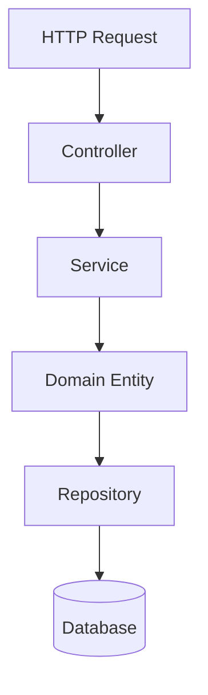
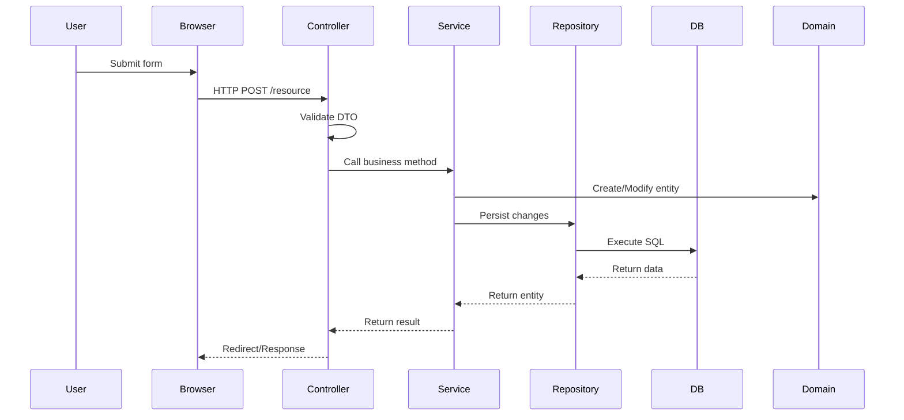

# Quick Start

This guide introduces you to IOTA SDK's core concepts and shows you how to build your first feature.

## Core Concepts

### Modules

IOTA SDK is organized into **modules**. Each module represents a business domain:

- **Core** - Users, authentication, roles
- **Finance** - Accounts, transactions, expenses
- **Warehouse** - Inventory, products, orders
- **CRM** - Customers, chats, relationships
- **HRM** - Employees, positions

### Domain-Driven Design (DDD)

The SDK follows DDD principles with clear layer separation:



**Layer Responsibilities:**

| Layer | Purpose | Contains |
|-------|---------|----------|
| **Presentation** | Handle HTTP requests | Controllers, DTOs, Templates |
| **Service** | Orchestrate business logic | Services, Workflows |
| **Domain** | Define business rules | Entities, Aggregates, Value Objects |
| **Infrastructure** | External concerns | Repositories, Database models |

### Multi-Tenancy

Every piece of data belongs to a **tenant** (organization). The SDK automatically:

- Isolates data between tenants
- Applies tenant filters to all queries
- Manages tenant-specific settings

## Your First Module

### Module Structure

A minimal module contains:

```
modules/mymodule/
├── module.go          # Module registration
├── links.go           # Navigation items
├── domain/            # Business entities
├── services/          # Business logic
├── presentation/      # Controllers & templates
└── permissions/       # RBAC constants
```

### Module Registration

Modules register themselves with the application during startup:

1. **Define the Module** - Implement the `application.Module` interface
2. **Register Components** - Services, controllers, migrations
3. **Load Module** - Add to `BuiltInModules` list

### Key Registration Steps

When building a module, you'll:

- **Register Services** - Business logic accessible via `app.Service()`
- **Register Controllers** - HTTP handlers for routes
- **Register Migrations** - Database schema changes
- **Register Permissions** - RBAC for access control
- **Register Navigation** - Menu items for the UI

## Understanding the Flow

### Request Lifecycle



### Data Flow

1. **User** interacts with UI (HTMX-enhanced forms)
2. **Controller** receives request, validates input
3. **Service** orchestrates business operations
4. **Domain** entities enforce business rules
5. **Repository** persists to database
6. **Response** returns to user (HTML or JSON)

## Next Steps

Now that you understand the basics:

1. Explore the [Project Structure](/getting-started/project-structure) to see how the codebase is organized
2. Read about [Architecture](/architecture) for deeper understanding of patterns
3. Review the [Core Module](/core) to see a complete implementation

The SDK is designed to be intuitive once you understand the DDD layer separation. Every feature follows the same pattern, making it easy to extend and maintain.
