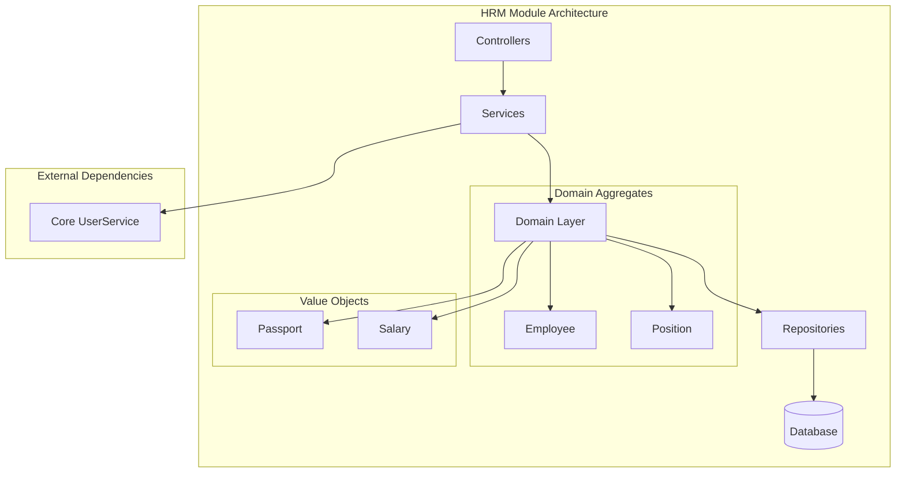
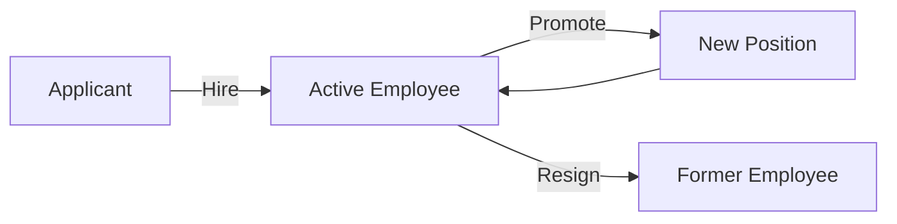

# HRM Module

The HRM (Human Resources Management) module provides employee tracking, position management, and organizational structure capabilities.

## Purpose

This module handles:
- Employee record management
- Job position definitions
- Salary information tracking
- Passport and identification data
- Hire and resignation dates

## Key Concepts

### Employee

Central entity for HR tracking:
- **Personal info** - Name, contact details
- **Salary data** - Compensation information
- **Passport** - Identification documents
- **Position** - Job role assignment
- **Dates** - Hire date, resignation date
- **PIN** - Tax identification number

### Position

Job role definitions:
- **Title** - Position name
- **Department** - Organizational unit
- **Salary range** - Compensation band
- **Reports to** - Management hierarchy

## Architecture

## Data Flow

### Employee Lifecycle

## Components

### Employees

Employee management:
- Create/edit employee records
- Track personal information
- Manage salary data
- Store passport/ID documents
- Record hire/resignation dates

### Positions

Job role management:
- Define position titles
- Set department assignments
- Establish reporting hierarchies
- Manage salary ranges

### Organizational Structure

Hierarchy visualization:
- Department tree view
- Reporting relationships
- Position distribution
- Headcount by department

## API Reference

### REST Endpoints

| Endpoint | Method | Purpose |
|----------|--------|---------|
| `/hrm/employees` | GET | List employees |
| `/hrm/employees` | POST | Create employee |
| `/hrm/employees/:id` | GET | View employee |
| `/hrm/employees/:id` | PUT | Update employee |
| `/hrm/positions` | GET | List positions |
| `/hrm/positions` | POST | Create position |

## Permissions

| Permission | Description |
|------------|-------------|
| `hrm.employees.view` | View employee records |
| `hrm.employees.create` | Add employees |
| `hrm.employees.edit` | Modify employees |
| `hrm.employees.delete` | Remove employees |
| `hrm.positions.view` | View positions |
| `hrm.positions.manage` | Manage positions |
| `hrm.salary.view` | View salary data |
| `hrm.salary.manage` | Manage salaries |

## Integration

### Finance Module
- Salary expense tracking
- Payroll integration

### Core Module
- User account linking
- Access control

### Events

| Event | Description |
|-------|-------------|
| `EmployeeHired` | New employee added |
| `EmployeeUpdated` | Employee info changed |
| `EmployeeResigned` | Employee departure |
| `PositionCreated` | New position defined |

## Best Practices

1. **Data privacy** - Protect sensitive employee data
2. **Regular updates** - Keep records current
3. **Access control** - Limit salary data visibility
4. **Audit trail** - Track all changes
5. **Compliance** - Follow labor regulations
