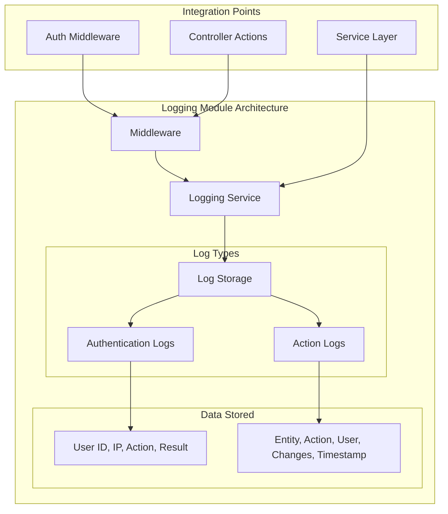
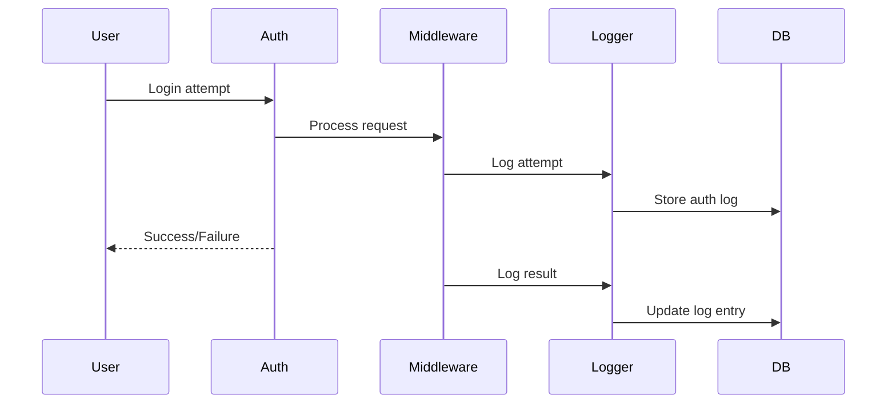
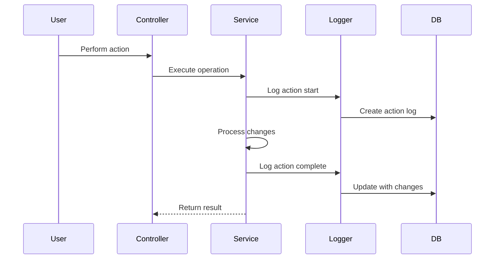

# Logging Module

The Logging module provides comprehensive audit logging capabilities for tracking user actions, authentication events, and system activities.

## Purpose

This module handles:
- Authentication event logging (login/logout: %v", err)
- User action auditing
- Security event tracking
- Compliance reporting
- Forensic investigation support

## Key Concepts

### Authentication Logs

Security-relevant authentication events:
- **Login attempts** - Successful and failed
- **Logout events** - Session termination
- **Password changes** - Security updates
- **Token events** - API token lifecycle
- **Location/IP** - Geographic tracking

### Action Logs

User activity auditing:
- **Entity changes** - Create, update, delete operations
- **Before/after values** - Data modification tracking
- **User identification** - Who performed action
- **Timestamp** - When action occurred
- **IP address** - Source of request

## Architecture

## Data Flow

### Authentication Logging

### Action Logging

## Components

### Authentication Logging

Security event tracking:
- **Login success** - User authenticated
- **Login failure** - Invalid credentials
- **Logout** - Session ended
- **Password change** - Security update
- **Account lockout** - Failed attempts exceeded

### Action Audit Trail

Data change tracking:
- **Entity creation** - New records
- **Entity updates** - Modifications with diff
- **Entity deletion** - Soft deletes logged
- **Bulk operations** - Batch changes
- **System actions** - Automated processes

### Log Storage

Database tables:
- **authentication_logs** - Auth events
- **action_logs** - User actions
- **Retention policies** - Automatic cleanup
- **Archival** - Long-term storage

### Query Interface

Log analysis tools:
- **Filter by user** - Specific user activity
- **Filter by date** - Time range queries
- **Filter by entity** - Specific data type
- **Export logs** - CSV/JSON export
- **Search** - Full-text search

## API Reference

### REST Endpoints

| Endpoint | Method | Purpose |
|----------|--------|---------|
| `/logs/auth` | GET | Authentication logs |
| `/logs/actions` | GET | Action audit logs |
| `/logs/export` | POST | Export logs |

### Query Parameters

Common filters:
- `user_id` - Specific user
- `entity_type` - Type of entity
- `action` - Action performed
- `from_date` - Start date
- `to_date` - End date
- `ip_address` - Source IP

## Permissions

| Permission | Description |
|------------|-------------|
| `logs.auth.view` | View authentication logs |
| `logs.actions.view` | View action audit logs |
| `logs.export` | Export log data |
| `logs.delete` | Delete old logs (admin only) |
| `logs.configure` | Configure retention policies |

## Integration

### Automatic Logging

Middleware-based automatic capture:
- **All auth events** - Login/logout automatic
- **Entity changes** - Via repository hooks
- **Manual logging** - Service layer calls

### Events

| Event | Description |
|-------|-------------|
| `AuthAttemptLogged` | Login attempt recorded |
| `ActionLogged` | User action recorded |
| `LogRetentionRun` | Old logs purged |

## Configuration

### Retention Settings

Log retention policies:
- **Authentication logs** - 90 days default
- **Action logs** - 1 year default
- **Archive schedule** - Daily/weekly runs
- **Storage limits** - Max log table size

### Privacy Compliance

GDPR/CCPA considerations:
- **PII masking** - Hide sensitive data
- **User data export** - Right to data portability
- **Right to deletion** - Remove user logs
- **Consent tracking** - Log consent changes

## Best Practices

1. **Regular review** - Monitor for suspicious activity
2. **Retention balance** - Keep enough for compliance, delete for privacy
3. **Access control** - Limit log viewing to admins
4. **Integrity** - Protect logs from tampering
5. **Backup** - Include logs in backup strategy
6. **Performance** - Use log rotation to prevent table bloat

## Security

### Log Protection

Prevent log tampering:
- **Immutable logs** - Append-only tables
- **Hash chains** - Cryptographic integrity
- **Separate storage** - Logs on different DB
- **Access auditing** - Who viewed logs

### Privacy

Protect user privacy:
- **PII redaction** - Mask personal info
- **Purpose limitation** - Only log necessary data
- **Retention limits** - Delete when not needed
- **Access controls** - Strict need-to-know
