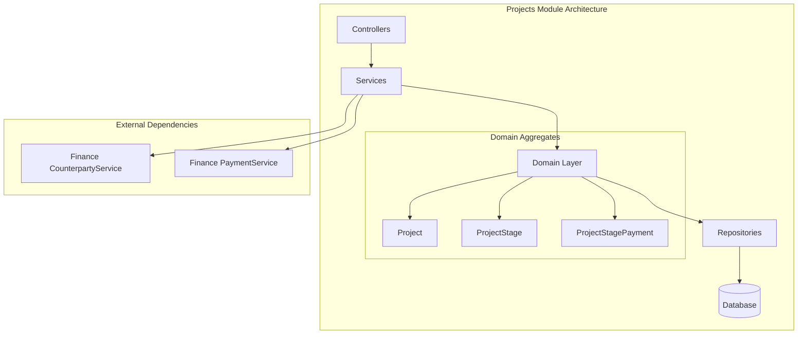
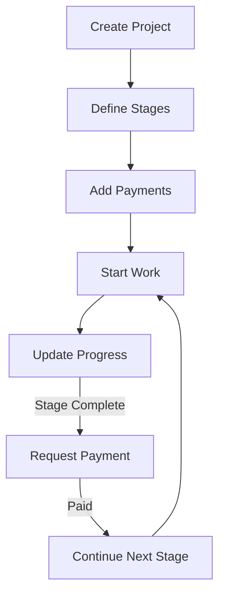

# Projects Module

The Projects module provides project management capabilities with stage-based tracking and milestone payments.

## Purpose

This module handles:
- Project creation and tracking
- Stage-based project breakdown
- Milestone payment management
- Progress monitoring
- Timeline tracking

## Key Concepts

### Project

Main project entity:
- **Basic info** - Name, description
- **Timeline** - Start date, end date
- **Status** - Active, Completed, On Hold, Cancelled
- **Client** - Associated counterparty

### ProjectStage

Project breakdown:
- **Name** - Stage identifier
- **Description** - What this stage covers
- **Completion** - Percentage complete
- **Order** - Sequence in project
- **Due date** - Stage deadline

### ProjectStagePayment

Milestone payments:
- **Amount** - Payment value
- **Currency** - Money currency
- **Status** - Pending, Paid, Overdue
- **Stage link** - Associated project stage

## Architecture

## Data Flow

### Project Workflow

## Components

### Projects

Project management:
- Create project definitions
- Set timelines and deadlines
- Assign clients
- Track overall status

### Stages

Project breakdown:
- Define work phases
- Set completion percentages
- Track stage status
- Manage dependencies

### Payments

Milestone billing:
- Link payments to stages
- Track payment status
- Generate invoices
- Record received payments

### Progress Tracking

Visual progress:
- Overall completion percentage
- Stage-by-stage status
- Timeline visualization
- Payment status overview

## API Reference

### REST Endpoints

| Endpoint | Method | Purpose |
|----------|--------|---------|
| `/projects` | GET | List projects |
| `/projects` | POST | Create project |
| `/projects/:id` | GET | View project |
| `/projects/:id/stages` | GET | List stages |
| `/projects/:id/stages` | POST | Add stage |
| `/projects/:id/payments` | GET | List payments |
| `/projects/:id/payments` | POST | Add payment |

## Permissions

| Permission | Description |
|------------|-------------|
| `projects.view` | View projects |
| `projects.create` | Create projects |
| `projects.edit` | Modify projects |
| `projects.delete` | Delete projects |
| `project_stages.view` | View stages |
| `project_stages.manage` | Manage stages |
| `project_payments.view` | View payments |
| `project_payments.manage` | Manage payments |

## Integration

### Finance Module
- Payment recording
- Client counterparty linking
- Expense tracking

### CRM Module
- Client project history
- Communication tracking

### Events

| Event | Description |
|-------|-------------|
| `ProjectCreated` | New project started |
| `ProjectStatusChanged` | Status updated |
| `StageCompleted` | Milestone reached |
| `PaymentRequested` | Invoice generated |
| `PaymentReceived` | Milestone paid |

## Best Practices

1. **Clear stages** - Well-defined milestones
2. **Realistic timelines** - Accurate deadline estimation
3. **Payment alignment** - Link payments to deliverables
4. **Progress updates** - Regular status updates
5. **Client communication** - Keep clients informed
