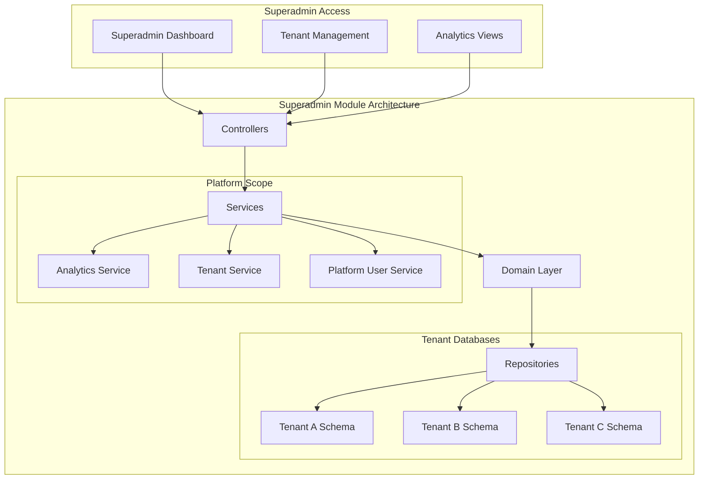
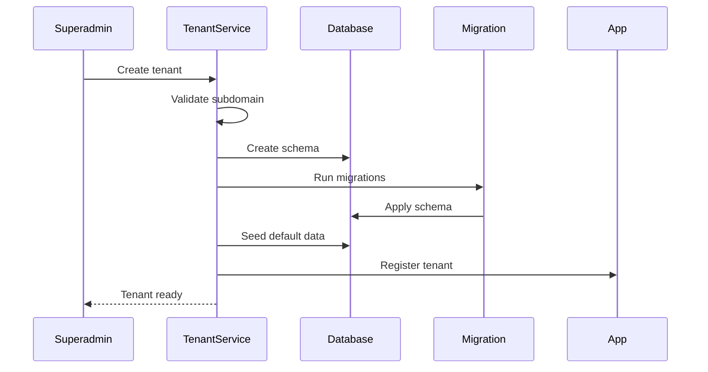
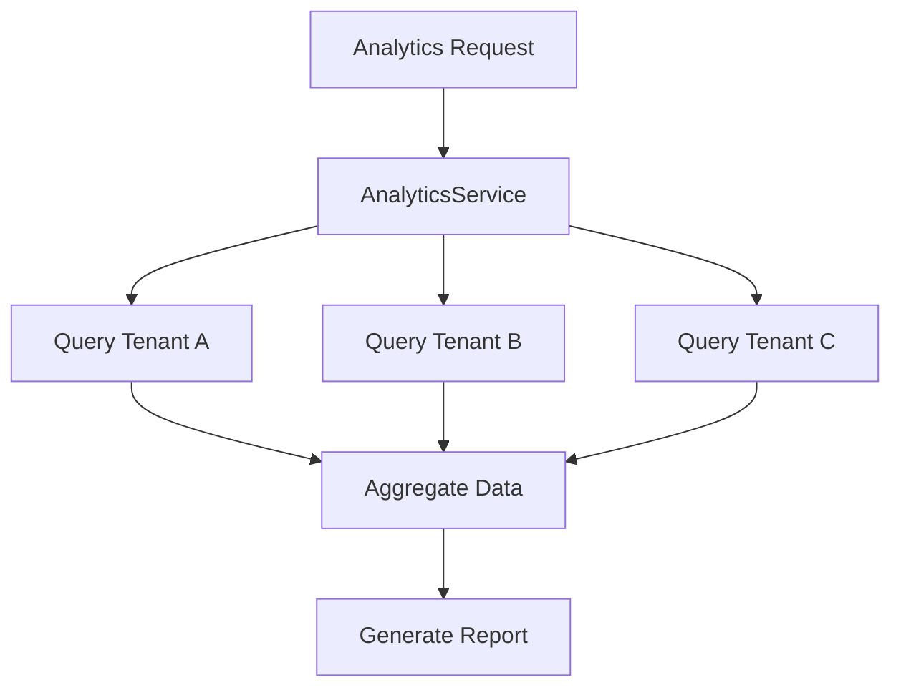

# SuperAdmin Module

The SuperAdmin module provides platform-wide administration capabilities for managing multiple tenants and viewing cross-tenant analytics. This module is deployed on port 4000 (cmd/superadmin/main.go) and is restricted to superadmin users only. All SuperAdmin routes must be protected with RequireSuperAdmin() middleware.

## Purpose

This module handles:
- Multi-tenant platform management
- Tenant lifecycle (create, suspend, delete: %v", err)
- Cross-tenant analytics and reporting
- Platform-wide user management
- System health monitoring

## Key Concepts

### Tenant Management

Platform tenant administration:
- **Tenant creation** - New organization onboarding
- **Tenant suspension** - Temporary access blocking
- **Tenant deletion** - Complete data removal
- **Schema management** - Database schema per tenant
- **Resource allocation** - Storage and compute limits

### Cross-Tenant Analytics

Platform-wide insights:
- **Usage statistics** - Active users, transactions
- **Growth metrics** - Tenant growth over time
- **Revenue tracking** - Platform-wide billing
- **Performance metrics** - Response times, errors

### Platform Users

Superadmin user management:
- **Superadmin roles** - Platform-wide permissions
- **Cross-tenant access** - Access multiple tenants
- **Audit logging** - Track all superadmin actions

## Architecture

## Data Flow

### Tenant Creation

### Analytics Aggregation

## Components

### Dashboard

Superadmin overview:
- Total tenants count
- Active users across platform
- System health status
- Recent tenant activity
- Platform revenue

### Tenant Management

Tenant lifecycle:
- List all tenants
- Create new tenants
- Edit tenant settings
- Suspend/activate tenants
- Delete tenants
- View tenant details

### Analytics

Platform insights:
- Tenant growth charts
- Usage statistics
- Revenue reports
- Performance metrics
- Error rates

### User Management

Cross-tenant users:
- List platform users
- Manage superadmin access
- View user activity
- Handle access requests

## API Reference

### REST Endpoints

| Endpoint | Method | Purpose |
|----------|--------|---------|
| `/superadmin/dashboard` | GET | Platform overview |
| `/superadmin/tenants` | GET | List tenants |
| `/superadmin/tenants` | POST | Create tenant |
| `/superadmin/tenants/:id` | GET | Tenant details |
| `/superadmin/tenants/:id` | PUT | Update tenant |
| `/superadmin/tenants/:id/suspend` | POST | Suspend tenant |
| `/superadmin/analytics` | GET | Platform analytics |
| `/superadmin/users` | GET | Cross-tenant users |

## Permissions

Superadmin permissions are hardcoded and managed separately from tenant RBAC:

| Permission | Description |
|------------|-------------|
| `superadmin.full` | Full platform access |
| `superadmin.tenants.view` | View all tenants |
| `superadmin.tenants.manage` | Create/edit/delete tenants |
| `superadmin.analytics.view` | View platform analytics |
| `superadmin.users.view` | View cross-tenant users |
| `superadmin.support` | Support access to tenants |

## Security

### Access Control

Superadmin access requires:
- **Superadmin role** - Explicit assignment
- **Separate authentication** - Different login flow
- **Audit logging** - All actions logged
- **IP restrictions** - Optional IP whitelist
- **2FA** - Two-factor authentication support

### Data Isolation

Even superadmins respect tenant boundaries:
- **Read-only cross-tenant** - No modification of tenant data
- **Audit trail** - All cross-tenant queries logged
- **Purpose limitation** - Access only for support/admin tasks

## Integration

### All Modules

Superadmin can access (read-only):
- Core user counts per tenant
- Finance transaction volumes
- Warehouse inventory totals
- Project counts and values

### Events

| Event | Description |
|-------|-------------|
| `TenantCreated` | New tenant onboarded |
| `TenantSuspended` | Tenant access blocked |
| `TenantActivated` | Tenant reactivated |
| `TenantDeleted` | Tenant removed |
| `SuperadminAction` | Admin action performed |

## Best Practices

1. **Least privilege** - Grant minimal necessary access
2. **Audit everything** - Log all superadmin actions
3. **Regular review** - Audit superadmin list periodically
4. **Testing tenants** - Use separate test tenants
5. **Backup strategy** - Tenant-level backup/restore
6. **Communication** - Notify tenants of platform changes

## Multi-tenancy Considerations

### Tenant Isolation

Superadmin respects tenant boundaries:
- Cannot modify tenant data directly
- Cannot bypass tenant permissions
- All access is audited
- Read-only for analytics only

### Scaling

Platform scaling management:
- Monitor tenant resource usage
- Identify high-usage tenants
- Plan capacity upgrades
- Optimize query performance
