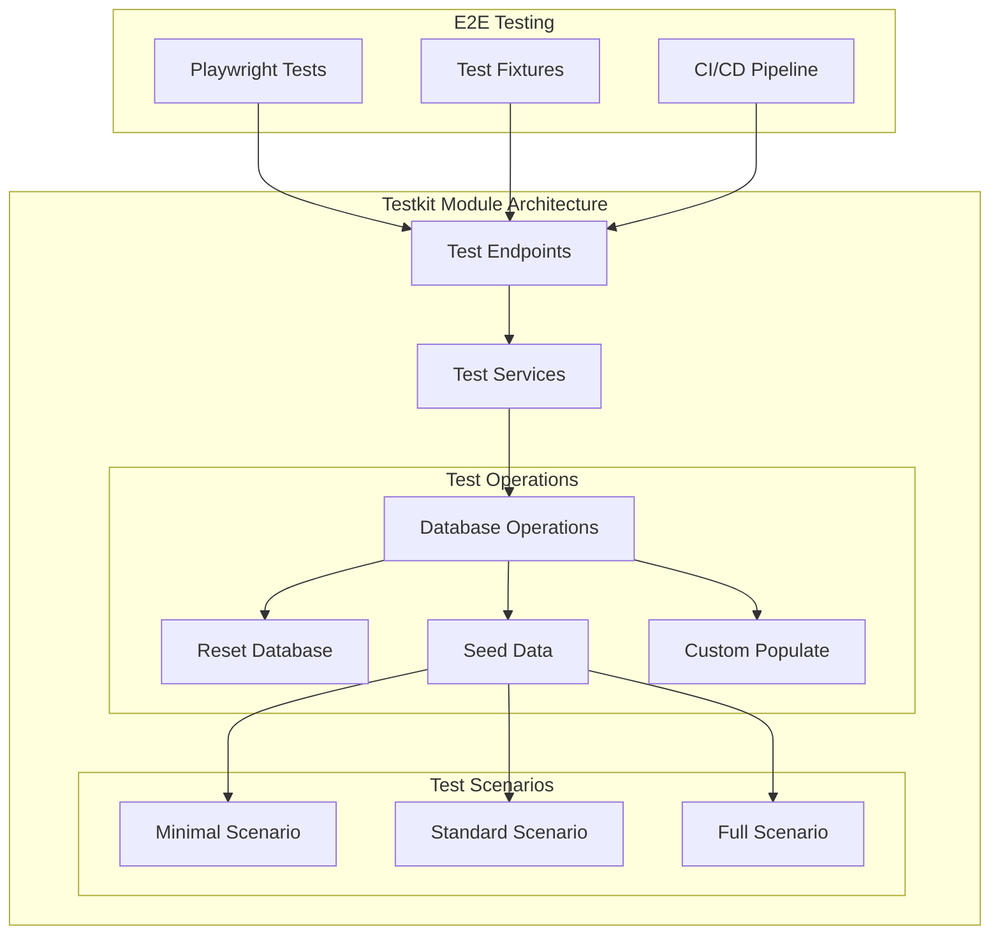
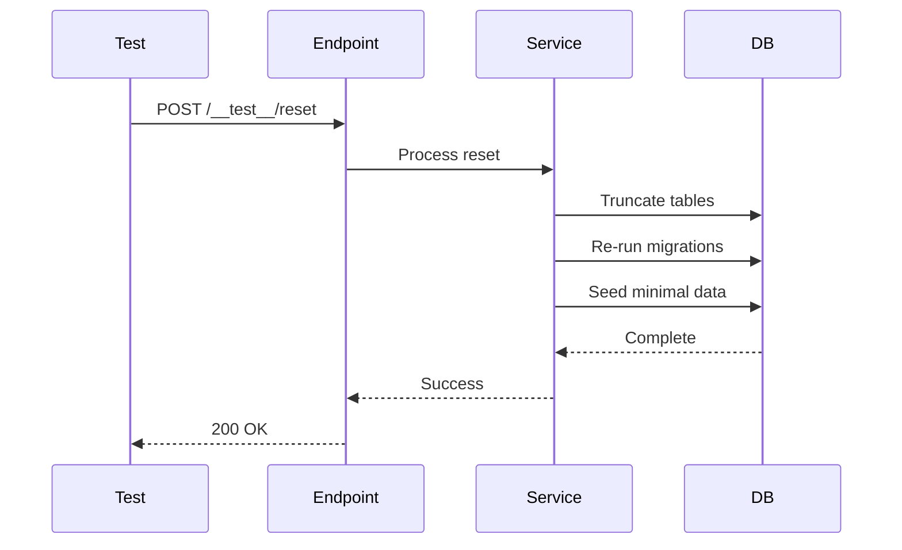
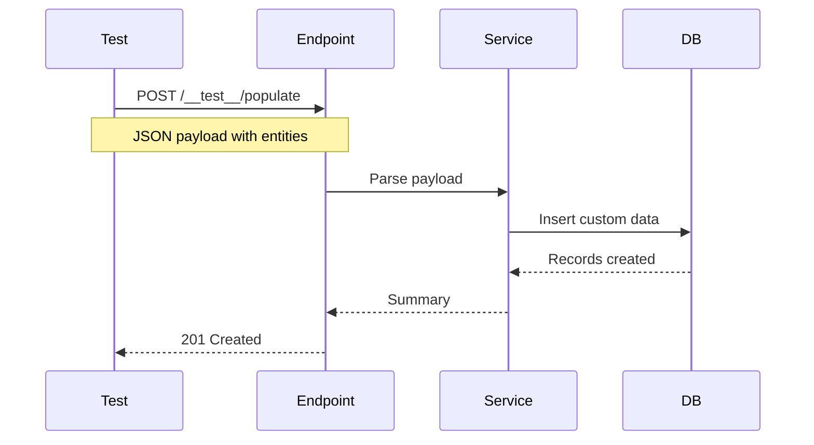

# Testkit Module

The Testkit module provides testing infrastructure and secure endpoints for end-to-end (E2E) testing of the IOTA SDK platform.

## Purpose

This module enables:
- Automated E2E testing
- Test data management
- Database state reset
- Test scenario seeding
- Health check endpoints

## Key Concepts

### Test Endpoints

Secure API endpoints for testing:
- **Database reset** - Clean slate for tests
- **Data seeding** - Populate with test data
- **Custom population** - Specific test scenarios
- **Health checks** - Verify system status

### E2E Testing

End-to-end test support:
- **Playwright integration** - Browser automation
- **Test fixtures** - Reusable test data
- **State management** - Reset between tests
- **Parallel testing** - Multiple test runners

### Test Scenarios

Predefined test data sets:
- **Minimal** - Basic data for smoke tests
- **Standard** - Typical business scenario
- **Full** - Comprehensive dataset
- **Custom** - User-defined scenarios

## Architecture



## Data Flow

### Test Reset Flow



### Custom Population Flow



## Components

### Test Endpoints

Secure testing API:

| Endpoint | Method | Purpose |
|----------|--------|---------|
| `/__test__/reset` | POST | Reset database |
| `/__test__/populate` | POST | Custom data population |
| `/__test__/seed` | POST | Predefined scenarios |
| `/__test__/health` | GET | Health check |

### Database Reset

Clean state for testing:
- **Truncate all tables** - Remove all data
- **Apply migrations** - Ensure schema current
- **Seed minimal data** - Basic required entities
- **Reset sequences** - ID counters to start

### Data Seeding

Predefined test scenarios:
- **Minimal** - Just enough to start
- **Standard** - Typical business data
- **Full** - Comprehensive dataset
- **Custom** - Your own scenario

### Custom Population

Flexible data insertion:
- **JSON payload** - Define entities in JSON
- **Relationships** - Handle foreign keys
- **Validation** - Ensure data integrity
- **Batch operations** - Efficient inserts

## API Reference

### POST /__test__/reset

Reset database to clean state:

**Query Parameters:**
- `reseedMinimal` (boolean) - Seed minimal data after reset

**Response:**
```json
{
  "status": "success",
  "tables_truncated": 45,
  "migrations_applied": 12
}
```

### POST /__test__/populate

Populate with custom data:

**Request Body:**
```json
{
  "users": [
    {
      "firstName": "Test",
      "lastName": "User",
      "email": "test@example.com"
    }
  ],
  "tenants": [
    {
      "name": "Test Company",
      "subdomain": "test"
    }
  ]
}
```

**Response:**
```json
{
  "status": "success",
  "entities_created": {
    "users": 1,
    "tenants": 1
  }
}
```

### POST /__test__/seed

Apply predefined scenario:

**Query Parameters:**
- `scenario` (string) - `minimal`, `standard`, or `full`

**Response:**
```json
{
  "status": "success",
  "scenario": "standard",
  "records_created": 150
}
```

### GET /__test__/health

System health check:

**Response:**
```json
{
  "status": "healthy",
  "database": "connected",
  "timestamp": "2026-01-31T12:00:00Z"
}
```

## Configuration

### Enable Test Endpoints

Test endpoints are disabled by default. Enable with environment variable:

```bash
ENABLE_TEST_ENDPOINTS=true
```

⚠️ **Security Warning:** Never enable in production!

### IP Whitelist

Restrict access to specific IPs:

```bash
TEST_ENDPOINTS_ALLOWED_IPS=127.0.0.1,10.0.0.0/8
```

### Test Database

Use separate database for testing:

```bash
TEST_DATABASE_URL=postgres://.../iota_sdk_test
```

## E2E Testing Integration

### Playwright Setup

The SDK includes Playwright E2E tests in `/e2e/`:

```typescript
// Reset before each test
test.beforeEach(async ({ request }) => {
  await resetTestDatabase(request, { reseedMinimal: true });
});

// Run scenarios
test('user workflow', async ({ page }) => {
  await seedDatabase(request, 'standard');
  // ... test steps
});
```

### Test Fixtures

Reusable test utilities:

- **Auth fixtures** - Login helpers
- **Database fixtures** - Reset/seed helpers
- **Data fixtures** - Test data generators
- **File fixtures** - Upload test helpers

### CI/CD Integration

Test in continuous integration:

```yaml
# GitHub Actions example
- name: Run E2E tests
  run: |
    just e2e ci
  env:
    ENABLE_TEST_ENDPOINTS: true
    DATABASE_URL: postgres://localhost/iota_sdk_test
```

## Security

### Endpoint Protection

Multiple layers of protection:

1. **Environment flag** - Must be explicitly enabled
2. **IP whitelisting** - Restrict source IPs
3. **No production** - Detect and block production mode
4. **Authentication** - Require valid session
5. **Rate limiting** - Prevent abuse

### Safety Measures

Prevent accidental damage:
- **Non-production detection** - Check APP_ENV
- **Database name check** - Ensure test DB suffix
- **Warning headers** - Response warnings
- **Audit logging** - Log all test endpoint access

## Best Practices

1. **Never in production** - Only enable in dev/test
2. **Use separate DB** - Don't test against production data
3. **Clean up** - Reset after test completion
4. **Parallel safe** - Handle concurrent test runs
5. **Minimal data** - Start with minimal seed, add as needed
6. **Version control** - Commit test scenarios with code

## Test Scenarios

### Minimal Scenario

Basic data for smoke tests:
- 1 admin user
- 1 tenant
- Basic roles/permissions

### Standard Scenario

Typical business setup:
- Multiple users with roles
- Sample clients/suppliers
- Some transactions
- Basic inventory

### Full Scenario

Comprehensive dataset:
- Many users across roles
- Extensive transaction history
- Full inventory catalog
- Multiple projects
- Complete organizational structure

## Next Steps

- See `e2e/README.md` for detailed E2E testing guide
- Review Playwright test examples in `e2e/tests/`
- Check test fixtures in `e2e/fixtures/`
