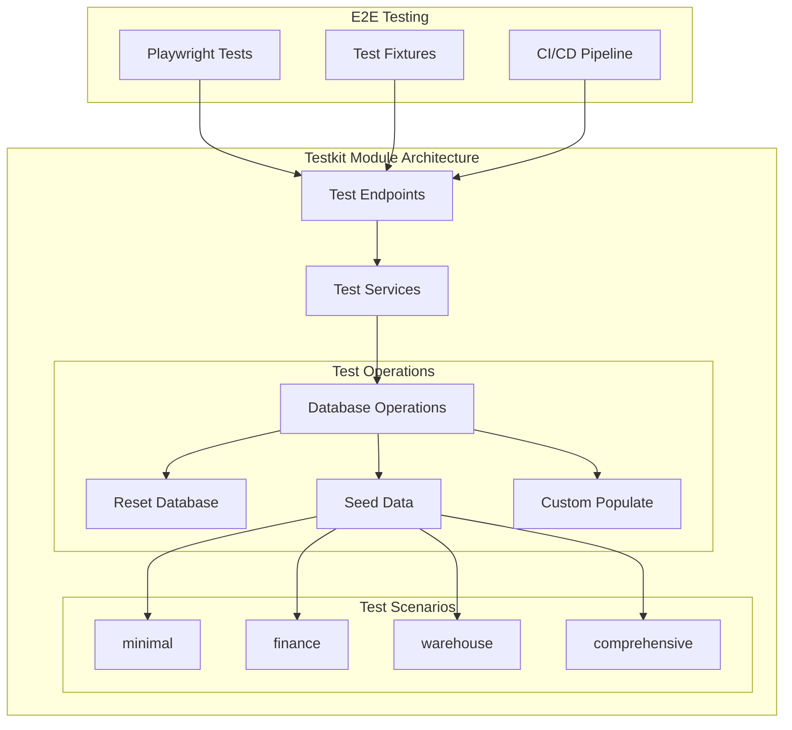
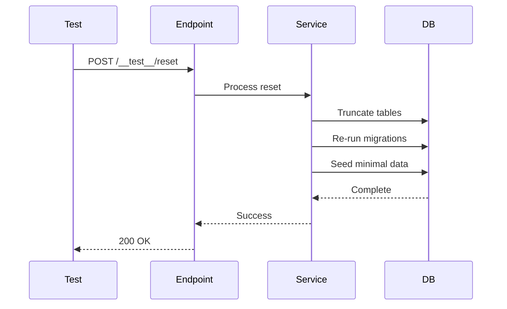
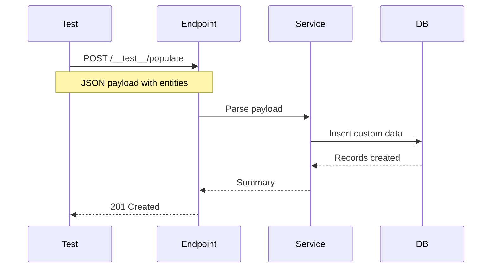

# Testkit Module

The Testkit module provides testing infrastructure and secure endpoints for end-to-end (E2E) testing of the IOTA SDK platform.

## Purpose

This module enables:
- Automated E2E testing
- Test data management
- Database state reset
- Test scenario seeding
- Health check endpoints

## Key Concepts

### Test Endpoints

Secure API endpoints for testing:
- **Database reset** - Clean slate for tests
- **Data seeding** - Populate with test data
- **Custom population** - Specific test scenarios
- **Health checks** - Verify system status

### E2E Testing

End-to-end test support:
- **Playwright integration** - Browser automation
- **Test fixtures** - Reusable test data
- **State management** - Reset between tests
- **Parallel testing** - Multiple test runners

### Test Scenarios

Predefined test data sets (from `GetAvailableScenarios()`):
- **minimal** - Basic setup with default tenant and test user
- **finance** - Finance module focused setup with accounts, categories, and sample transactions
- **warehouse** - Warehouse module setup with units, products, and inventory
- **comprehensive** - Full setup with data across all modules

## Architecture


```mermaid
graph TB
    subgraph "Testkit Module Architecture"
        A[Test Endpoints] --> B[Test Services]
        B --> C[Database Operations]
        
        subgraph "Test Operations"
            C --> D[Reset Database]
            C --> E[Seed Data]
            C --> F[Custom Populate]
        end
        
        subgraph "Test Scenarios"
            E --> G[minimal]
            E --> H[finance]
            E --> I[warehouse]
            E --> J1[comprehensive]
        end
    end
    
    subgraph "E2E Testing"
        J2[Playwright Tests]
        K[Test Fixtures]
        L[CI/CD Pipeline]
    end
    
    J2 --> A
    K --> A
    L --> A
```

## Data Flow

### Test Reset Flow


```mermaid
sequenceDiagram
    participant Test
    participant Endpoint
    participant Service
    participant DB
    
    Test->>Endpoint: POST /__test__/reset
    Endpoint->>Service: Process reset
    Service->>DB: Truncate tables
    Service->>DB: Re-run migrations
    Service->>DB: Seed minimal data
    DB-->>Service: Complete
    Service-->>Endpoint: Success
    Endpoint-->>Test: 200 OK
```

### Custom Population Flow


```mermaid
sequenceDiagram
    participant Test
    participant Endpoint
    participant Service
    participant DB
    
    Test->>Endpoint: POST /__test__/populate
    Note over Test,Endpoint: JSON payload with entities
    Endpoint->>Service: Parse payload
    Service->>DB: Insert custom data
    DB-->>Service: Records created
    Service-->>Endpoint: Summary
    Endpoint-->>Test: 201 Created
```

## Components

### Test Endpoints

Secure testing API:

| Endpoint | Method | Purpose |
|----------|--------|---------|
| `/__test__/reset` | POST | Reset database |
| `/__test__/populate` | POST | Custom data population |
| `/__test__/seed` | POST | Apply predefined scenario |
| `/__test__/seed` | GET | List available seed scenarios |
| `/__test__/otp/{'{userID}'}` | POST | Generate OTP for user |
| `/__test__/otp/{'{userID}'}` | GET | Get OTP for user |
| `/__test__/otp` | GET | Get OTP by identifier |
| `/__test__/health` | GET | Health check |

### Database Reset

Clean state for testing:
- **Truncate all tables** - Remove all data
- **Apply migrations** - Ensure schema current
- **Seed minimal data** - Basic required entities
- **Reset sequences** - ID counters to start

### Data Seeding

Predefined test scenarios (POST `/__test__/seed` with JSON body `{ "scenario": "minimal" }`):
- **minimal** - Basic setup with default tenant and test user
- **finance** - Finance-focused data
- **warehouse** - Warehouse-focused data
- **comprehensive** - Data across all modules

### Custom Population

Flexible data insertion:
- **JSON payload** - Define entities in JSON
- **Relationships** - Handle foreign keys
- **Validation** - Ensure data integrity
- **Batch operations** - Efficient inserts

## API Reference

### POST /__test__/reset

Reset database to clean state.

**Request body (JSON):**
- `reseedMinimal` (boolean, optional) - If true, seed minimal data after reset

**Response:**
```json
{
  "success": true,
  "message": "Database reset successfully",
  "reseedMinimal": true
}
```

### POST /__test__/populate

Populate with custom data:

**Request Body:**
```json
{
  "users": [
    {
      "firstName": "Test",
      "lastName": "User",
      "email": "test@example.com"
    }
  ],
  "tenants": [
    {
      "name": "Test Company",
      "subdomain": "test"
    }
  ]
}
```

**Response:**
```json
{
  "status": "success",
  "entities_created": {
    "users": 1,
    "tenants": 1
  }
}
```

### POST /__test__/seed

Apply a predefined scenario.

**Request body (JSON):**
- `scenario` (string, optional) - One of: `minimal`, `finance`, `warehouse`, `comprehensive`. Default: `minimal`.

**Response:**
```json
{
  "success": true,
  "message": "Scenario seeded successfully",
  "scenario": "minimal"
}
```

### GET /__test__/seed

List available predefined seed scenarios.

**Response:**
```json
{
  "success": true,
  "scenarios": [
    { "name": "minimal", "description": "Basic setup with default tenant and test user" },
    { "name": "finance", "description": "Finance module focused setup with accounts, categories, and sample transactions" },
    { "name": "warehouse", "description": "Warehouse module setup with units, products, and inventory" },
    { "name": "comprehensive", "description": "Full setup with data across all modules" }
  ]
}
```

### POST /__test__/otp/{'{userID}'}

Generate a one-time password for a specific user.

**Path parameters:**

- `userID` (UUID or email identifier)

**Request body (JSON):**

```json
{
  "email": "user@example.com"
}
```

**Response:**

```json
{
  "status": "success",
  "otp": "123456",
  "userID": "user-id"
}
```

### GET /__test__/otp/{'{userID}'}

Retrieve the current OTP for a specific user.

**Path parameters:**

- `userID` (UUID or email identifier)

**Response:**

```json
{
  "status": "success",
  "otp": "123456",
  "userID": "user-id"
}
```

### GET /__test__/otp

Get OTP by identifier.

**Query parameters (one of):**

- `userID` (UUID)
- `email` (string)
- `phone` (string)

**Response:**

```json
{
  "status": "success",
  "otp": "123456"
}
```

### GET /__test__/health

Health check for test infrastructure.

**Response:**
```json
{
  "success": true,
  "message": "Test endpoints are healthy",
  "config": {
    "enableTestEndpoints": true,
    "environment": "development"
  }
}
```

## Configuration

### Enable Test Endpoints

Test endpoints are disabled by default. Enable with environment variable:

```bash
ENABLE_TEST_ENDPOINTS=true
```

⚠️ **Security Warning:** Never enable in production!

The only required central configuration variable for Testkit endpoint exposure is **`ENABLE_TEST_ENDPOINTS`**. Additional controls (e.g. IP allowlists or dedicated test DB routing via variables like `TEST_ENDPOINTS_ALLOWED_IPS` or `TEST_DATABASE_URL`) are deployment- or test-harness-specific and may not be enforced by the core module.

## E2E Testing Integration

### Playwright Setup

The SDK includes Playwright E2E tests in `/e2e/`:

```typescript
// Reset before each test
test.beforeEach(async ({ request }) => {
  await resetTestDatabase(request, { reseedMinimal: true });
});

// Run scenarios
test('user workflow', async ({ page, request }) => {
  await seedDatabase(request, 'finance');
  // ... test steps
});
```

### Test Fixtures

Reusable test utilities:

- **Auth fixtures** - Login helpers
- **Database fixtures** - Reset/seed helpers
- **Data fixtures** - Test data generators
- **File fixtures** - Upload test helpers

### CI/CD Integration

Test in continuous integration:

```yaml
# GitHub Actions example
- name: Run E2E tests
  run: |
    just e2e ci
  env:
    ENABLE_TEST_ENDPOINTS: true
    # SDK server uses DB_NAME, DB_HOST, DB_PORT, DB_USER, DB_PASSWORD (not DATABASE_URL)
    DB_NAME: iota_sdk_test
    DB_HOST: localhost
    DB_PORT: 5432
```

## Security

### Endpoint Protection

Protection in place:
- **Environment flag** - Endpoints are only active when `ENABLE_TEST_ENDPOINTS=true`
- **No production** - Test endpoints are disabled when running in production (or when CI env is set)
- **Authentication** - Controllers may require a valid session depending on configuration

### Safety Measures

- **Non-production detection** - Check `GO_APP_ENV` (and CI env vars) before enabling test endpoints
- Use a dedicated test database; avoid pointing at production

## Best Practices

1. **Never in production** - Only enable in dev/test
2. **Use separate DB** - Don't test against production data
3. **Clean up** - Reset after test completion
4. **Parallel safe** - Handle concurrent test runs
5. **Minimal data** - Start with minimal seed, add as needed
6. **Version control** - Commit test scenarios with code

## Test Scenarios

### Minimal Scenario

Basic data for smoke tests:
- 1 admin user
- 1 tenant
- Basic roles/permissions

### Finance Scenario

Finance module focused setup:
- Accounts and categories
- Sample transactions
- Basic financial reports data

### Warehouse Scenario

Warehouse module setup:
- Units and products
- Inventory data
- Stock movements

### Comprehensive Scenario

Full setup with data across all modules:
- Many users across roles
- Extensive transaction history
- Full inventory catalog
- Multiple projects
- Complete organizational structure

## Next Steps

- See `e2e/README.md` for detailed E2E testing guide
- Review Playwright test examples in `e2e/tests/`
- Check test fixtures in `e2e/fixtures/`
