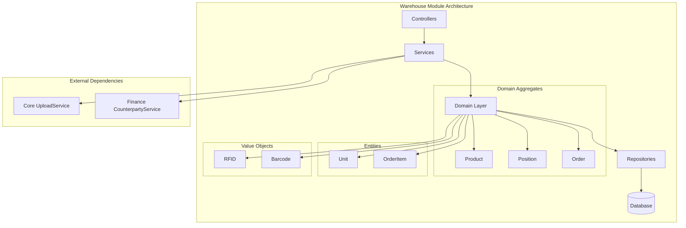
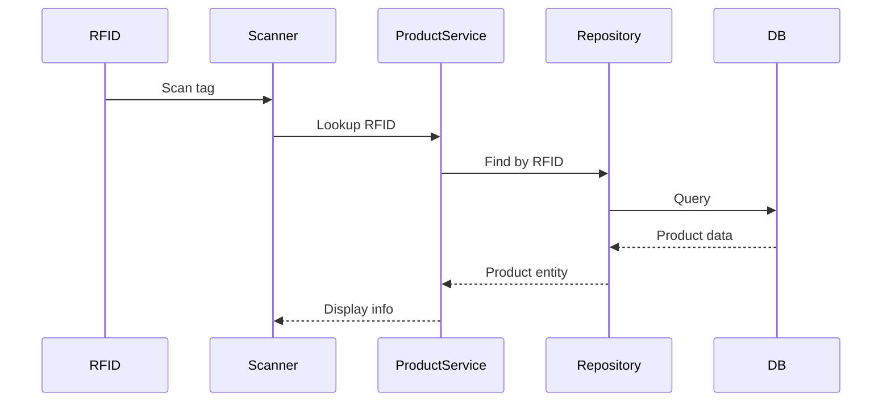
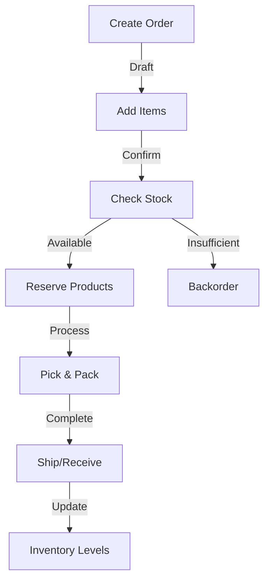
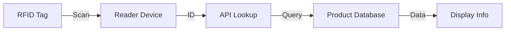

# Warehouse Module

The Warehouse module provides comprehensive inventory management capabilities including product tracking, stock control, and order management.

## Purpose

This module handles:
- Product and inventory tracking
- Warehouse order management
- Unit of measurement handling
- Stock level monitoring
- RFID-based product identification

## Key Concepts

### Position

Product definitions and types:
- **Product metadata** - Name, description, pricing
- **Barcode/RFID** - Unique identifiers
- **Units** - Default unit of measurement
- **Categories** - Product classification

### Product

Individual inventory items:
- **RFID tracking** - Unique identifier per item
- **Position reference** - Links to product type
- **Status** - Available, Reserved, Sold, etc.
- **Location** - Physical warehouse location

### Unit

Units of measurement:
- **Standard units** - Pieces, kilograms, liters, meters
- **Conversions** - Unit conversion factors
- **Symbol** - Display symbol (pcs, kg, L, m)

### Order

Warehouse operations:
- **Order items** - Products requested
- **Status workflow** - Draft → Confirmed → Processing → Completed
- **Types** - Inbound (receiving) or Outbound (shipping)
- **Counterparty** - Client or supplier

## Architecture

## Data Flow

### Inventory Tracking

### Order Processing

## Components

### Positions

Product catalog management:
- Create product definitions
- Set pricing information
- Assign barcodes
- Define units of measure
- Categorize products

### Products

Individual item tracking:
- RFID-based identification
- Status tracking
- Location management
- Movement history
- Quality control

### Units

Measurement management:
- Define units (pcs, kg, m, L)
- Set conversion rates
- Assign display symbols
- Link to positions

### Orders

Warehouse operations:
- **Inbound orders** - Receiving from suppliers
- **Outbound orders** - Shipping to clients
- **Internal transfers** - Warehouse movements
- **Status tracking** - Full workflow visibility

### Inventory

Stock level monitoring:
- Real-time quantity tracking
- Low stock alerts
- Inventory valuation
- Movement reporting

## API Reference

### GraphQL Schema

The Warehouse module exposes GraphQL endpoints:

| Entity | Queries | Mutations |
|--------|---------|-----------|
| **Position** | position, positions | createPosition, updatePosition |
| **Product** | product, products | createProduct, updateProduct |
| **Order** | order, orders | createOrder, updateOrder |
| **Unit** | unit, units | createUnit, updateUnit |
| **Inventory** | inventory | - |

See [API Reference](/api/warehouse) for detailed schema documentation.

### REST Endpoints

| Endpoint | Method | Purpose |
|----------|--------|---------|
| `/warehouse/positions` | GET | List positions |
| `/warehouse/positions` | POST | Create position |
| `/warehouse/products` | GET | List products |
| `/warehouse/products` | POST | Create product |
| `/warehouse/orders` | GET | List orders |
| `/warehouse/orders` | POST | Create order |
| `/warehouse/units` | GET | List units |

## Permissions

### Available Permissions

| Permission | Description |
|------------|-------------|
| `warehouse.positions.view` | View product catalog |
| `warehouse.positions.create` | Create positions |
| `warehouse.positions.edit` | Modify positions |
| `warehouse.positions.delete` | Delete positions |
| `warehouse.products.view` | View inventory |
| `warehouse.products.create` | Add products |
| `warehouse.products.edit` | Modify products |
| `warehouse.products.delete` | Remove products |
| `warehouse.orders.view` | View orders |
| `warehouse.orders.create` | Create orders |
| `warehouse.orders.edit` | Modify orders |
| `warehouse.orders.process` | Process orders |
| `warehouse.units.view` | View units |
| `warehouse.units.manage` | Manage units |
| `warehouse.inventory.view` | View inventory levels |

## Integration with Other Modules

### Core Module

Uses Core services:
- **UploadService** - Product images
- **UserService** - Track operators

### Finance Module

Integration points:
- Inventory valuation
- Cost of goods sold
- Asset tracking

### CRM Module

Integration points:
- Client orders
- Counterparty linking
- Delivery tracking

### Events

Published domain events:

| Event | Description |
|-------|-------------|
| `ProductCreated` | New product added |
| `ProductMoved` | Product location changed |
| `OrderCreated` | New order placed |
| `OrderStatusChanged` | Order progressed |
| `StockLevelChanged` | Inventory quantity updated |
| `PositionCreated` | New product type defined |

## RFID Integration

### Scanning Workflow

### Use Cases

- **Quick check-in/check-out** - No manual entry
- **Inventory counts** - Rapid stocktaking
- **Location tracking** - Know where items are
- **Theft prevention** - Track item movement

## Best Practices

1. **Consistent labeling** - Use standardized barcodes/RFID
2. **Regular counts** - Physical inventory verification
3. **Status accuracy** - Keep product statuses current
4. **Order workflow** - Follow status transitions
5. **Location discipline** - Products in correct locations
6. **Unit consistency** - Standardize measurements

## Next Steps

- [Finance Module](/finance) - Financial tracking
- [CRM Module](/crm) - Customer integration
