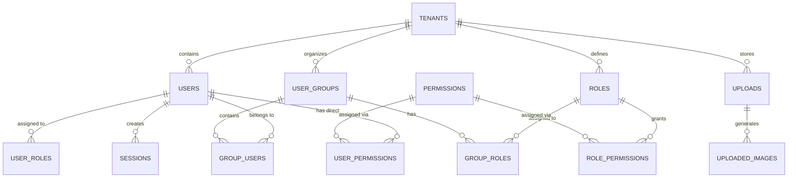

# Data Model: Core Module

## Entity Relationship Diagram



## Table Schemas

### tenants

Primary multi-tenant entity containing tenant information.

```sql
CREATE TABLE tenants (
    id uuid PRIMARY KEY DEFAULT gen_random_uuid(),
    name varchar(255) NOT NULL UNIQUE,
    domain varchar(255),
    phone varchar(255),
    email varchar(255),
    is_active boolean NOT NULL DEFAULT TRUE,
    logo_id int REFERENCES uploads(id) ON DELETE SET NULL,
    logo_compact_id int REFERENCES uploads(id) ON DELETE SET NULL,
    created_at timestamp with time zone DEFAULT now(),
    updated_at timestamp with time zone DEFAULT now()
);
```

| Column | Type | Constraint | Description |
|--------|------|-----------|-------------|
| `id` | UUID | PK | Unique tenant identifier |
| `name` | varchar(255) | UNIQUE NOT NULL | Tenant display name |
| `domain` | varchar(255) | | Tenant domain (optional) |
| `phone` | varchar(255) | | Tenant contact phone |
| `email` | varchar(255) | | Tenant contact email |
| `is_active` | boolean | DEFAULT TRUE | Tenant operational status |
| `logo_id` | int | FK → uploads | Logo file reference |
| `created_at` | timestamp | DEFAULT now() | Creation time |
| `updated_at` | timestamp | DEFAULT now() | Last modification |

### users

User accounts with authentication credentials.

```sql
CREATE TABLE users (
    id serial PRIMARY KEY,
    tenant_id uuid NOT NULL REFERENCES tenants(id) ON DELETE CASCADE,
    type varchar(50) NOT NULL CHECK (type IN ('system', 'user')),
    first_name varchar(255) NOT NULL,
    last_name varchar(255) NOT NULL,
    middle_name varchar(255),
    email varchar(255) NOT NULL,
    password VARCHAR(255),
    ui_language varchar(3) NOT NULL,
    phone varchar(255),
    avatar_id int REFERENCES uploads(id) ON DELETE SET NULL,
    last_login timestamp NULL,
    last_ip varchar(255) NULL,
    last_action timestamp with time zone NULL,
    created_at timestamp with time zone NOT NULL DEFAULT now(),
    updated_at timestamp with time zone NOT NULL DEFAULT now(),
    UNIQUE(tenant_id, email),
    UNIQUE(tenant_id, phone)
);

CREATE INDEX users_tenant_id_idx ON users(tenant_id);
CREATE INDEX users_first_name_idx ON users(first_name);
CREATE INDEX users_last_name_idx ON users(last_name);
```

| Column | Type | Constraint | Description |
|--------|------|-----------|-------------|
| `id` | serial | PK | User ID |
| `tenant_id` | uuid | FK | Tenant ownership |
| `type` | varchar(50) | CHECK | 'system' or 'user' type |
| `first_name` | varchar(255) | NOT NULL | User first name |
| `last_name` | varchar(255) | NOT NULL | User last name |
| `middle_name` | varchar(255) | | Middle name (optional) |
| `email` | varchar(255) | UNIQUE, NOT NULL | Email authentication |
| `password` | varchar(255) | | Hashed password (optional for system) |
| `ui_language` | varchar(3) | NOT NULL | Language code (en, ru, uz) |
| `phone` | varchar(255) | UNIQUE | Phone number (optional) |
| `avatar_id` | int | FK → uploads | Profile picture |
| `last_login` | timestamp | | Last login time |
| `last_ip` | varchar(255) | | Last login IP address |
| `last_action` | timestamp | | Last action timestamp |
| `created_at` | timestamp | | Account creation |
| `updated_at` | timestamp | | Last modification |

### roles

Role definitions for access control.

```sql
CREATE TABLE roles (
    id serial PRIMARY KEY,
    type varchar(50) NOT NULL CHECK (type IN ('system', 'user')),
    name varchar(255) NOT NULL UNIQUE,
    tenant_id uuid REFERENCES tenants(id) ON DELETE CASCADE,
    description text,
    created_at timestamp with time zone DEFAULT now(),
    updated_at timestamp with time zone DEFAULT now(),
    UNIQUE(tenant_id, name)
);

CREATE INDEX roles_tenant_id_idx ON roles(tenant_id);
```

| Column | Type | Constraint | Description |
|--------|------|-----------|-------------|
| `id` | serial | PK | Role ID |
| `type` | varchar(50) | CHECK | 'system' or 'user' type |
| `name` | varchar(255) | UNIQUE, NOT NULL | Role name |
| `tenant_id` | uuid | FK | Tenant ownership (NULL for system) |
| `description` | text | | Role description |
| `created_at` | timestamp | | Creation time |
| `updated_at` | timestamp | | Last modification |

### user_roles

Assignment of roles to users (many-to-many).

```sql
CREATE TABLE user_roles (
    user_id int NOT NULL REFERENCES users(id) ON DELETE CASCADE,
    role_id int NOT NULL REFERENCES roles(id) ON DELETE CASCADE,
    created_at timestamp with time zone DEFAULT now(),
    PRIMARY KEY(user_id, role_id)
);

CREATE INDEX user_roles_user_id_idx ON user_roles(user_id);
CREATE INDEX user_roles_role_id_idx ON user_roles(role_id);
```

| Column | Type | Constraint | Description |
|--------|------|-----------|-------------|
| `user_id` | int | PK, FK | User reference |
| `role_id` | int | PK, FK | Role reference |
| `created_at` | timestamp | | Assignment time |

### user_groups

User group definitions for organization.

```sql
CREATE TABLE user_groups (
    id uuid PRIMARY KEY DEFAULT gen_random_uuid(),
    type varchar(50) NOT NULL CHECK (type IN ('system', 'user')),
    name varchar(255) UNIQUE NOT NULL,
    tenant_id uuid REFERENCES tenants(id) ON DELETE CASCADE,
    description text,
    created_at timestamp DEFAULT now(),
    updated_at timestamp DEFAULT now(),
    UNIQUE(tenant_id, name)
);

CREATE INDEX user_groups_tenant_id_idx ON user_groups(tenant_id);
```

| Column | Type | Constraint | Description |
|--------|------|-----------|-------------|
| `id` | uuid | PK | Group ID |
| `type` | varchar(50) | CHECK | 'system' or 'user' type |
| `name` | varchar(255) | UNIQUE, NOT NULL | Group name |
| `tenant_id` | uuid | FK | Tenant ownership |
| `description` | text | | Group description |
| `created_at` | timestamp | | Creation time |
| `updated_at` | timestamp | | Last modification |

### group_users

User membership in groups (many-to-many).

```sql
CREATE TABLE group_users (
    group_id uuid NOT NULL REFERENCES user_groups(id) ON DELETE CASCADE,
    user_id integer NOT NULL REFERENCES users(id) ON DELETE CASCADE,
    created_at timestamp DEFAULT now(),
    PRIMARY KEY(group_id, user_id)
);

CREATE INDEX group_users_group_id_idx ON group_users(group_id);
CREATE INDEX group_users_user_id_idx ON group_users(user_id);
```

| Column | Type | Constraint | Description |
|--------|------|-----------|-------------|
| `group_id` | uuid | PK, FK | Group reference |
| `user_id` | int | PK, FK | User reference |
| `created_at` | timestamp | | Membership time |

### group_roles

Role assignment to groups (many-to-many).

```sql
CREATE TABLE group_roles (
    group_id uuid NOT NULL REFERENCES user_groups(id) ON DELETE CASCADE,
    role_id integer NOT NULL REFERENCES roles(id) ON DELETE CASCADE,
    created_at timestamp DEFAULT now(),
    PRIMARY KEY(group_id, role_id)
);

CREATE INDEX group_roles_group_id_idx ON group_roles(group_id);
CREATE INDEX group_roles_role_id_idx ON group_roles(role_id);
```

| Column | Type | Constraint | Description |
|--------|------|-----------|-------------|
| `group_id` | uuid | PK, FK | Group reference |
| `role_id` | int | PK, FK | Role reference |
| `created_at` | timestamp | | Assignment time |

### permissions

Permission definitions with resource-action-modifier pattern.

```sql
CREATE TABLE permissions (
    id uuid PRIMARY KEY DEFAULT gen_random_uuid() NOT NULL,
    name varchar(255) NOT NULL UNIQUE,
    resource varchar(255) NOT NULL,
    action varchar(255) NOT NULL,
    modifier varchar(255) NOT NULL,
    description text
);

CREATE INDEX permissions_resource_idx ON permissions(resource);
CREATE INDEX permissions_action_idx ON permissions(action);
```

| Column | Type | Constraint | Description |
|--------|------|-----------|-------------|
| `id` | uuid | PK | Permission ID |
| `name` | varchar(255) | UNIQUE, NOT NULL | Permission code (e.g., 'users:create:all') |
| `resource` | varchar(255) | NOT NULL | Resource name (users, roles, etc.) |
| `action` | varchar(255) | NOT NULL | Action type (create, read, update, delete) |
| `modifier` | varchar(255) | NOT NULL | Scope modifier ('all' or 'own') |
| `description` | text | | Human-readable description |

### role_permissions

Assignment of permissions to roles (many-to-many).

```sql
CREATE TABLE role_permissions (
    role_id int NOT NULL REFERENCES roles(id) ON DELETE CASCADE,
    permission_id uuid NOT NULL REFERENCES permissions(id) ON DELETE CASCADE,
    PRIMARY KEY(role_id, permission_id)
);

CREATE INDEX role_permissions_role_id_idx ON role_permissions(role_id);
CREATE INDEX role_permissions_permission_id_idx ON role_permissions(permission_id);
```

| Column | Type | Constraint | Description |
|--------|------|-----------|-------------|
| `role_id` | int | PK, FK | Role reference |
| `permission_id` | uuid | PK, FK | Permission reference |

### user_permissions

Direct permission assignment to users (many-to-many).

```sql
CREATE TABLE user_permissions (
    user_id int NOT NULL REFERENCES users(id) ON DELETE CASCADE,
    permission_id uuid NOT NULL REFERENCES permissions(id) ON DELETE CASCADE,
    PRIMARY KEY(user_id, permission_id)
);

CREATE INDEX user_permissions_user_id_idx ON user_permissions(user_id);
```

| Column | Type | Constraint | Description |
|--------|------|-----------|-------------|
| `user_id` | int | PK, FK | User reference |
| `permission_id` | uuid | PK, FK | Permission reference |

### sessions

User session management for authentication state.

```sql
CREATE TABLE sessions (
    token varchar(255) NOT NULL PRIMARY KEY,
    tenant_id uuid REFERENCES tenants(id) ON DELETE CASCADE,
    user_id integer NOT NULL REFERENCES users(id) ON DELETE CASCADE,
    expires_at timestamp with time zone NOT NULL,
    ip varchar(255) NOT NULL,
    user_agent varchar(255) NOT NULL,
    created_at timestamp with time zone NOT NULL DEFAULT now()
);

CREATE INDEX sessions_tenant_id_idx ON sessions(tenant_id);
CREATE INDEX sessions_user_id_idx ON sessions(user_id);
CREATE INDEX sessions_expires_at_idx ON sessions(expires_at);
```

| Column | Type | Constraint | Description |
|--------|------|-----------|-------------|
| `token` | varchar(255) | PK | Session token |
| `tenant_id` | uuid | FK | Tenant ownership |
| `user_id` | int | FK, NOT NULL | User reference |
| `expires_at` | timestamp | NOT NULL | Session expiration |
| `ip` | varchar(255) | NOT NULL | Login IP address |
| `user_agent` | varchar(255) | NOT NULL | Client user agent |
| `created_at` | timestamp | | Session creation |

### uploads

File upload tracking for avatars and documents.

```sql
CREATE TABLE uploads (
    id serial PRIMARY KEY,
    tenant_id uuid REFERENCES tenants(id) ON DELETE CASCADE,
    name varchar(255) NOT NULL,
    hash VARCHAR(255) NOT NULL,
    path varchar(1024) NOT NULL DEFAULT '',
    slug varchar(255) NOT NULL,
    size int NOT NULL DEFAULT 0,
    mimetype varchar(255) NOT NULL,
    type VARCHAR(255) NOT NULL,
    created_at timestamp with time zone DEFAULT now(),
    updated_at timestamp with time zone DEFAULT now(),
    UNIQUE(tenant_id, hash),
    UNIQUE(tenant_id, slug)
);

CREATE INDEX uploads_tenant_id_idx ON uploads(tenant_id);
```

| Column | Type | Constraint | Description |
|--------|------|-----------|-------------|
| `id` | serial | PK | Upload ID |
| `tenant_id` | uuid | FK | Tenant ownership |
| `name` | varchar(255) | NOT NULL | Original filename |
| `hash` | varchar(255) | UNIQUE | MD5 hash for deduplication |
| `path` | varchar(1024) | | File storage path |
| `slug` | varchar(255) | UNIQUE | URL-friendly identifier |
| `size` | int | | File size in bytes |
| `mimetype` | varchar(255) | | MIME type |
| `type` | varchar(255) | | File category (image, document, etc.) |
| `created_at` | timestamp | | Creation time |
| `updated_at` | timestamp | | Last modification |

## Query Patterns

### User Authentication

```sql
-- Get user by email with roles and permissions
SELECT u.*, r.*, p.*
FROM users u
LEFT JOIN user_roles ur ON u.id = ur.user_id
LEFT JOIN roles r ON ur.role_id = r.id
LEFT JOIN role_permissions rp ON r.id = rp.role_id
LEFT JOIN permissions p ON rp.permission_id = p.id
WHERE u.email = $1 AND u.tenant_id = $2;
```

### Permission Resolution

```sql
-- Check if user has permission (role → user → direct)
SELECT DISTINCT p.id
FROM permissions p
WHERE p.name = $1
  AND (
    -- Via role permissions
    p.id IN (
      SELECT rp.permission_id
      FROM role_permissions rp
      WHERE rp.role_id IN (
        SELECT ur.role_id FROM user_roles ur WHERE ur.user_id = $2
      )
    )
    -- Via direct user permissions
    OR p.id IN (
      SELECT up.permission_id FROM user_permissions up WHERE up.user_id = $2
    )
    -- Via group role permissions
    OR p.id IN (
      SELECT rp.permission_id
      FROM role_permissions rp
      WHERE rp.role_id IN (
        SELECT gr.role_id
        FROM group_roles gr
        WHERE gr.group_id IN (
          SELECT gu.group_id FROM group_users gu WHERE gu.user_id = $2
        )
      )
    )
  );
```

### User Listing with Pagination

```sql
-- Get paginated users with role count
SELECT u.*, COUNT(DISTINCT ur.role_id) as role_count
FROM users u
LEFT JOIN user_roles ur ON u.id = ur.user_id
WHERE u.tenant_id = $1
GROUP BY u.id
ORDER BY u.created_at DESC
LIMIT $2 OFFSET $3;
```

## Relationships Summary

| From | To | Type | Cardinality | Constraint |
|------|----|----|------------|-----------|
| users | tenants | Foreign Key | Many-to-One | ON DELETE CASCADE |
| users | uploads | Foreign Key | Many-to-One | ON DELETE SET NULL |
| user_roles | users | Foreign Key | Many-to-One | ON DELETE CASCADE |
| user_roles | roles | Foreign Key | Many-to-One | ON DELETE CASCADE |
| user_groups | tenants | Foreign Key | Many-to-One | ON DELETE CASCADE |
| group_users | user_groups | Foreign Key | Many-to-One | ON DELETE CASCADE |
| group_users | users | Foreign Key | Many-to-One | ON DELETE CASCADE |
| group_roles | user_groups | Foreign Key | Many-to-One | ON DELETE CASCADE |
| group_roles | roles | Foreign Key | Many-to-One | ON DELETE CASCADE |
| role_permissions | roles | Foreign Key | Many-to-One | ON DELETE CASCADE |
| role_permissions | permissions | Foreign Key | Many-to-One | ON DELETE CASCADE |
| user_permissions | users | Foreign Key | Many-to-One | ON DELETE CASCADE |
| user_permissions | permissions | Foreign Key | Many-to-One | ON DELETE CASCADE |
| sessions | tenants | Foreign Key | Many-to-One | ON DELETE CASCADE |
| sessions | users | Foreign Key | Many-to-One | ON DELETE CASCADE |
