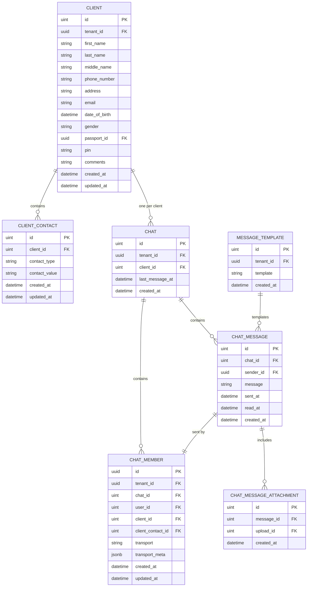

# CRM Module - Data Model

## Entity Relationship Diagram



## Table Schemas

### crm_clients

**Purpose**: Store client/customer master records

| Column | Type | Constraints | Description |
|--------|------|-----------|-------------|
| `id` | SERIAL | PRIMARY KEY | Unique client identifier |
| `tenant_id` | UUID | NOT NULL, FK | Multi-tenant isolation |
| `first_name` | VARCHAR(255) | NOT NULL | Client given name |
| `last_name` | VARCHAR(255) | NULLABLE | Client family name |
| `middle_name` | VARCHAR(255) | NULLABLE | Client middle name |
| `phone_number` | VARCHAR(20) | NULLABLE, UNIQUE(tenant_id) | Primary phone contact |
| `address` | TEXT | NULLABLE | Physical address |
| `email` | VARCHAR(255) | NULLABLE | Email address |
| `date_of_birth` | DATE | NULLABLE | Birth date |
| `gender` | VARCHAR(20) | NULLABLE | Gender (M/F/Other) |
| `passport_id` | UUID | NULLABLE, FK → core.passports | Passport reference |
| `pin` | VARCHAR(20) | NULLABLE, UNIQUE(tenant_id) | Tax identification number |
| `comments` | TEXT | NULLABLE | Notes and comments |
| `created_at` | TIMESTAMP | NOT NULL, DEFAULT NOW() | Creation timestamp |
| `updated_at` | TIMESTAMP | NOT NULL, DEFAULT NOW() | Last update timestamp |

**Indexes**:
```sql
CREATE INDEX idx_crm_clients_tenant_id ON crm_clients(tenant_id);
CREATE INDEX idx_crm_clients_phone ON crm_clients(tenant_id, phone_number);
CREATE INDEX idx_crm_clients_email ON crm_clients(tenant_id, email);
CREATE UNIQUE INDEX idx_crm_clients_phone_unique ON crm_clients(tenant_id, phone_number);
CREATE UNIQUE INDEX idx_crm_clients_pin_unique ON crm_clients(tenant_id, pin);
```

**Constraints**:
```sql
ALTER TABLE crm_clients
ADD CONSTRAINT fk_crm_clients_tenant_id FOREIGN KEY (tenant_id) REFERENCES public.tenants(id) ON DELETE CASCADE;
ALTER TABLE crm_clients
ADD CONSTRAINT fk_crm_clients_passport_id FOREIGN KEY (passport_id) REFERENCES core_passports(id) ON DELETE SET NULL;
```

### crm_client_contacts

**Purpose**: Store multiple contact methods per client

| Column | Type | Constraints | Description |
|--------|------|-----------|-------------|
| `id` | SERIAL | PRIMARY KEY | Contact identifier |
| `client_id` | INTEGER | NOT NULL, FK | Parent client |
| `contact_type` | VARCHAR(50) | NOT NULL | Type: email, phone, telegram, whatsapp, other |
| `contact_value` | VARCHAR(255) | NOT NULL | Actual contact (email/phone/username) |
| `created_at` | TIMESTAMP | NOT NULL, DEFAULT NOW() | Creation timestamp |
| `updated_at` | TIMESTAMP | NOT NULL, DEFAULT NOW() | Last update timestamp |

**Indexes**:
```sql
CREATE INDEX idx_crm_client_contacts_client_id ON crm_client_contacts(client_id);
CREATE INDEX idx_crm_client_contacts_type_value ON crm_client_contacts(contact_type, contact_value);
```

**Constraints**:
```sql
ALTER TABLE crm_client_contacts
ADD CONSTRAINT fk_crm_client_contacts_client_id FOREIGN KEY (client_id)
  REFERENCES crm_clients(id) ON DELETE CASCADE;
```

### crm_chats

**Purpose**: Store chat/conversation threads

| Column | Type | Constraints | Description |
|--------|------|-----------|-------------|
| `id` | SERIAL | PRIMARY KEY | Chat identifier |
| `tenant_id` | UUID | NOT NULL, FK | Multi-tenant isolation |
| `client_id` | INTEGER | NOT NULL, UNIQUE(tenant_id) | Associated client (one per client) |
| `last_message_at` | TIMESTAMP | NULLABLE | Timestamp of latest message |
| `created_at` | TIMESTAMP | NOT NULL, DEFAULT NOW() | Chat creation time |

**Indexes**:
```sql
CREATE INDEX idx_crm_chats_tenant_id ON crm_chats(tenant_id);
CREATE INDEX idx_crm_chats_client_id ON crm_chats(client_id);
CREATE UNIQUE INDEX idx_crm_chats_tenant_client_unique ON crm_chats(tenant_id, client_id);
```

**Constraints**:
```sql
ALTER TABLE crm_chats
ADD CONSTRAINT fk_crm_chats_tenant_id FOREIGN KEY (tenant_id) REFERENCES public.tenants(id) ON DELETE CASCADE;
ALTER TABLE crm_chats
ADD CONSTRAINT fk_crm_chats_client_id FOREIGN KEY (client_id) REFERENCES crm_clients(id) ON DELETE CASCADE;
```

### crm_chat_members

**Purpose**: Store chat participants

| Column | Type | Constraints | Description |
|--------|------|-----------|-------------|
| `id` | UUID | PRIMARY KEY | Member identifier |
| `tenant_id` | UUID | NOT NULL, FK | Multi-tenant isolation |
| `chat_id` | INTEGER | NOT NULL, FK | Parent chat |
| `user_id` | INTEGER | NULLABLE, FK | Internal user if member is user |
| `client_id` | INTEGER | NULLABLE, FK | External client ID |
| `client_contact_id` | INTEGER | NULLABLE, FK | Contact method used |
| `transport` | VARCHAR(50) | NOT NULL | Channel: telegram, whatsapp, sms, email, etc. |
| `transport_meta` | JSONB | NULLABLE | Provider-specific data (chatid, username, phone, etc.) |
| `created_at` | TIMESTAMP | NOT NULL, DEFAULT NOW() | Join timestamp |
| `updated_at` | TIMESTAMP | NOT NULL, DEFAULT NOW() | Last update timestamp |

**Indexes**:
```sql
CREATE INDEX idx_crm_chat_members_chat_id ON crm_chat_members(chat_id);
CREATE INDEX idx_crm_chat_members_tenant_id ON crm_chat_members(tenant_id);
CREATE INDEX idx_crm_chat_members_user_id ON crm_chat_members(user_id);
```

**Constraints**:
```sql
ALTER TABLE crm_chat_members
ADD CONSTRAINT fk_crm_chat_members_chat_id FOREIGN KEY (chat_id) REFERENCES crm_chats(id) ON DELETE CASCADE;
ALTER TABLE crm_chat_members
ADD CONSTRAINT fk_crm_chat_members_user_id FOREIGN KEY (user_id) REFERENCES core_users(id) ON DELETE SET NULL;
ALTER TABLE crm_chat_members
ADD CONSTRAINT fk_crm_chat_members_client_id FOREIGN KEY (client_id) REFERENCES crm_clients(id) ON DELETE SET NULL;
ALTER TABLE crm_chat_members
ADD CONSTRAINT fk_crm_chat_members_client_contact_id FOREIGN KEY (client_contact_id) REFERENCES crm_client_contacts(id) ON DELETE SET NULL;
```

### crm_chat_messages

**Purpose**: Store individual messages in chats

| Column | Type | Constraints | Description |
|--------|------|-----------|-------------|
| `id` | SERIAL | PRIMARY KEY | Message identifier |
| `chat_id` | INTEGER | NOT NULL, FK | Parent chat |
| `sender_id` | UUID | NOT NULL, FK | Member who sent (reference to crm_chat_members.id) |
| `message` | TEXT | NOT NULL | Message content |
| `sent_at` | TIMESTAMP | NULLABLE | When message was sent (set by provider) |
| `read_at` | TIMESTAMP | NULLABLE | When message was read (if applicable) |
| `created_at` | TIMESTAMP | NOT NULL, DEFAULT NOW() | When message was created in system |

**Indexes**:
```sql
CREATE INDEX idx_crm_chat_messages_chat_id ON crm_chat_messages(chat_id);
CREATE INDEX idx_crm_chat_messages_sender_id ON crm_chat_messages(sender_id);
CREATE INDEX idx_crm_chat_messages_created_at ON crm_chat_messages(created_at);
```

**Constraints**:
```sql
ALTER TABLE crm_chat_messages
ADD CONSTRAINT fk_crm_chat_messages_chat_id FOREIGN KEY (chat_id) REFERENCES crm_chats(id) ON DELETE CASCADE;
ALTER TABLE crm_chat_messages
ADD CONSTRAINT fk_crm_chat_messages_sender_id FOREIGN KEY (sender_id) REFERENCES crm_chat_members(id) ON DELETE RESTRICT;
```

### crm_chat_message_attachments

**Purpose**: Link files to messages

| Column | Type | Constraints | Description |
|--------|------|-----------|-------------|
| `id` | SERIAL | PRIMARY KEY | Attachment identifier |
| `message_id` | INTEGER | NOT NULL, FK | Parent message |
| `upload_id` | INTEGER | NOT NULL, FK | File reference in core_uploads |
| `created_at` | TIMESTAMP | NOT NULL, DEFAULT NOW() | Creation timestamp |

**Indexes**:
```sql
CREATE INDEX idx_crm_chat_message_attachments_message_id ON crm_chat_message_attachments(message_id);
CREATE INDEX idx_crm_chat_message_attachments_upload_id ON crm_chat_message_attachments(upload_id);
```

**Constraints**:
```sql
ALTER TABLE crm_chat_message_attachments
ADD CONSTRAINT fk_crm_chat_message_attachments_message_id FOREIGN KEY (message_id)
  REFERENCES crm_chat_messages(id) ON DELETE CASCADE;
ALTER TABLE crm_chat_message_attachments
ADD CONSTRAINT fk_crm_chat_message_attachments_upload_id FOREIGN KEY (upload_id)
  REFERENCES core_uploads(id) ON DELETE RESTRICT;
```

### crm_message_templates

**Purpose**: Store reusable message templates

| Column | Type | Constraints | Description |
|--------|------|-----------|-------------|
| `id` | SERIAL | PRIMARY KEY | Template identifier |
| `tenant_id` | UUID | NOT NULL, FK | Multi-tenant isolation |
| `template` | TEXT | NOT NULL | Message content template |
| `created_at` | TIMESTAMP | NOT NULL, DEFAULT NOW() | Creation timestamp |

**Indexes**:
```sql
CREATE INDEX idx_crm_message_templates_tenant_id ON crm_message_templates(tenant_id);
```

**Constraints**:
```sql
ALTER TABLE crm_message_templates
ADD CONSTRAINT fk_crm_message_templates_tenant_id FOREIGN KEY (tenant_id)
  REFERENCES public.tenants(id) ON DELETE CASCADE;
```

## Key Relationships

### One-to-Many Relationships

1. **Client → Contacts**: Client can have multiple contact methods
   - Cardinality: 1:N
   - Cascade: Delete contacts when client deleted
   - Use case: Client has email, phone, telegram, WhatsApp

2. **Client → Chats**: Each client has one chat
   - Cardinality: 1:1 (unique constraint)
   - Cascade: Delete chat when client deleted
   - Business rule: One chat per client

3. **Chat → Messages**: Chat contains many messages
   - Cardinality: 1:N
   - Cascade: Delete messages when chat deleted
   - Order: By created_at timestamp

4. **Chat → Members**: Chat has multiple members
   - Cardinality: 1:N
   - Cascade: Delete member when chat deleted
   - Use case: Users and clients participating in chat

5. **Message → Attachments**: Message can have file attachments
   - Cardinality: 1:N
   - Cascade: Delete attachments when message deleted
   - Reference: core_uploads table

### Many-to-One Relationships

1. **Member → User**: Multiple members can reference one user
   - When member is internal user
   - Optional (NULL for external members)

2. **Member → Client**: Multiple members reference same client
   - When member is external client contact
   - Identifies which client this member represents

3. **Member → Contact**: Identifies specific contact method
   - References crm_client_contacts
   - Indicates which phone/email/telegram used

## Tenant Isolation

All tables include `tenant_id` for strict multi-tenant isolation:

```sql
-- All queries include tenant filter:
SELECT * FROM crm_clients WHERE id = $1 AND tenant_id = $2;
SELECT * FROM crm_chats WHERE id = $1 AND tenant_id = $2;
SELECT * FROM crm_chat_members WHERE chat_id = $1 AND tenant_id = $2;
```

**Enforcement Points**:
- Repository automatically adds tenant_id filter via `composables.UseTenantID(ctx)`
- Database constraints ensure referential integrity within tenant
- Cascading deletes respect tenant boundaries
- Cross-tenant queries return no results

## Query Patterns

### Find Client with All Contacts
```sql
SELECT c.*, cc.*
FROM crm_clients c
LEFT JOIN crm_client_contacts cc ON c.id = cc.client_id
WHERE c.id = $1 AND c.tenant_id = $2
ORDER BY cc.created_at;
```

### Find Chat with Messages and Members
```sql
SELECT c.*, m.*, msg.*, s.id as sender_id
FROM crm_chats c
LEFT JOIN crm_chat_members m ON c.id = m.chat_id
LEFT JOIN crm_chat_messages msg ON c.id = msg.chat_id
WHERE c.id = $1 AND c.tenant_id = $2
ORDER BY msg.created_at DESC;
```

### Find Unread Messages
```sql
SELECT msg.*
FROM crm_chat_messages msg
WHERE msg.chat_id = $1 AND msg.read_at IS NULL
ORDER BY msg.created_at;
```

### Find Last Message Per Chat
```sql
SELECT DISTINCT ON (chat_id) *
FROM crm_chat_messages
WHERE chat_id = ANY($1)
ORDER BY chat_id, created_at DESC;
```

## Data Integrity Constraints

### Unique Constraints
- One chat per (tenant_id, client_id)
- One phone per (tenant_id, value)
- One PIN per (tenant_id, value)

### Foreign Key Constraints
- Client references tenant (CASCADE delete)
- Contacts reference client (CASCADE delete)
- Chat references client (CASCADE delete)
- Members reference chat (CASCADE delete)
- Messages reference chat (CASCADE delete)
- Attachments reference message (CASCADE delete)
- Templates reference tenant (CASCADE delete)

### Referential Integrity
- Message sender must be valid member
- Member must reference either user or client
- Attachment must reference existing upload
- Template must have content

## Performance Considerations

### Indexes for Common Queries
- Lookup by tenant_id (list operations)
- Lookup by tenant_id + client_id (specific client)
- Lookup by tenant_id + id (entity by ID)
- Lookup by created_at (ordering/pagination)
- Lookup by read_at (find unread messages)

### N+1 Prevention
- Use LEFT JOIN to fetch related data
- Repository implementations batch load related entities
- Service layer caches frequently accessed data

### Query Optimization
- Pagination on large result sets (clients, messages)
- Indexes on foreign key columns
- Partial indexes for NULL values (read_at, sent_at)
- DISTINCT ON for last message per chat
