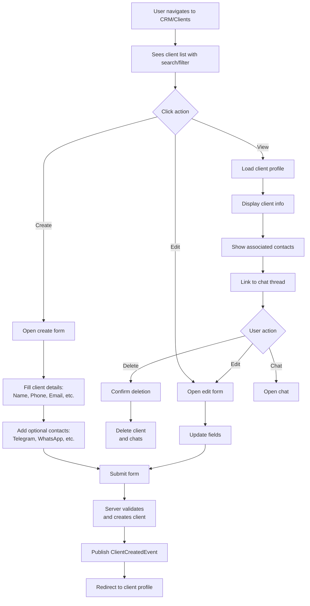
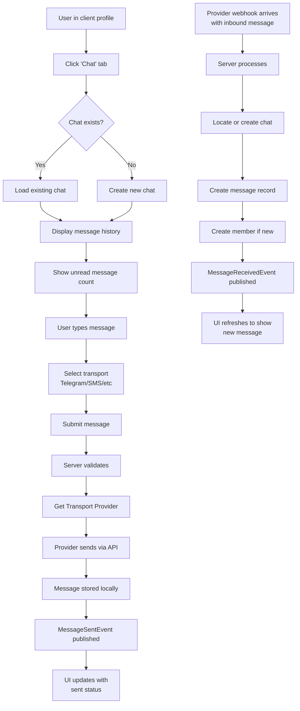
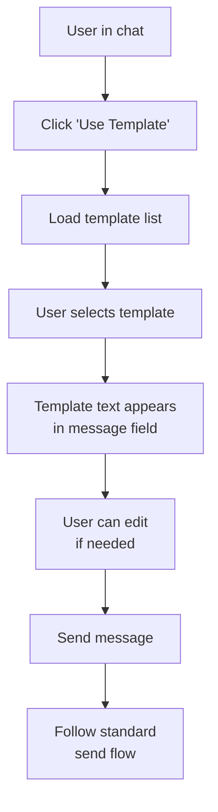
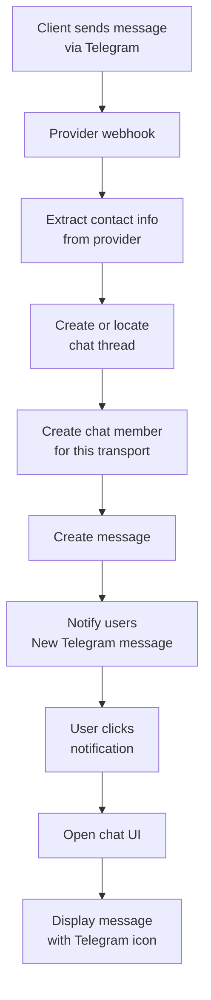

# CRM Module - User Experience

## User Flows

### Flow 1: Client Profile Creation and Management



### Flow 2: Chat and Messaging



### Flow 3: Message Template Usage



### Flow 4: Multi-Channel Contact



## Page Structure

### Clients List Page

**URL**: `/crm/clients`

**Components**:
- Search/Filter bar
  - Search by name, phone, email
  - Filter by creation date
  - Pagination controls

- Client list table
  - Client name (clickable)
  - Phone number
  - Email
  - Last contact date
  - Actions menu (View, Edit, Delete, Chat)

**Key HTMX Features**:
- Search triggers `hx-get` with debounce
- Pagination via `hx-get` with limit/offset
- Quick actions via `hx-swap` (delete confirmation modal)

```templ
templ ClientsList(ctx context.Context, clients []ClientVM, pagination PaginationVM) {
    <div class="clients-list">
        <div class="search-box">
            <input
                type="text"
                hx-get="/crm/clients"
                hx-target="#clients-table"
                hx-trigger="keyup changed delay:500ms"
                placeholder="Search clients..."
            />
        </div>

        <table id="clients-table">
            <thead>
                <tr>
                    <th>Name</th>
                    <th>Phone</th>
                    <th>Email</th>
                    <th>Last Contact</th>
                    <th>Actions</th>
                </tr>
            </thead>
            <tbody>
                for _, client := range clients {
                    <tr hx-target="this" hx-swap="outerHTML">
                        <td>
                            <a href={ templ.URL("/crm/clients/" + fmt.Sprint(client.ID)) }>
                                { client.FirstName } { client.LastName }
                            </a>
                        </td>
                        <td>{ client.Phone }</td>
                        <td>{ client.Email }</td>
                        <td>{ client.LastContact }</td>
                        <td>
                            <button hx-get={ "/crm/clients/" + fmt.Sprint(client.ID) + "/chat" }>
                                Chat
                            </button>
                            <button hx-get={ "/crm/clients/" + fmt.Sprint(client.ID) + "/edit" }>
                                Edit
                            </button>
                            <button
                                hx-delete={ "/crm/clients/" + fmt.Sprint(client.ID) }
                                hx-confirm="Delete this client?"
                            >
                                Delete
                            </button>
                        </td>
                    </tr>
                }
            </tbody>
        </table>

        @Pagination(pagination)
    </div>
}
```

### Client Detail Page

**URL**: `/crm/clients/:id`

**Components**:
- Tabs: Profile, Chat, Actions

**Profile Tab**:
- Client information (name, phone, email, address, etc.)
- Edit button
- Personal details (gender, DOB, passport, PIN)
- Multiple contacts list with ability to add/remove
- Delete client button

**Chat Tab**:
- Chat messages (scrollable, newest at bottom)
- Message compose area
- Transport selector (Telegram, SMS, Email, etc.)
- Message template quick-insert button
- Unread message indicator

**Actions Tab**:
- Available workflows
- Send message
- Create note
- Schedule follow-up
- Generate report

**HTMX Features**:
- Tab switching via `hx-get` with `hx-target="[content]"`
- Message auto-load via polling (`hx-trigger="every 2s"`)
- Message send via `hx-post` with form data
- Contact add via modal form

### Chat Interface

**URL**: `/crm/chats/:id`

**Components**:
- Chat header with client name
- Message list (auto-scrolling)
  - Messages grouped by sender
  - Read/unread status indicator
  - Timestamp for each message
  - Attachments preview

- Message compose area
  - Text input
  - Transport selector dropdown
  - Template quick-insert button
  - File attachment uploader
  - Send button

**Message Structure**:
```html
<div class="message-group" data-sender="user|client|system">
    <div class="sender-info">
        <span class="sender-name">John Doe</span>
        <span class="sender-type">Client via Telegram</span>
    </div>
    <div class="message-content">
        <p>Message text</p>
        <div class="attachments">
            <a href="/files/...">document.pdf</a>
        </div>
    </div>
    <div class="message-meta">
        <time>2024-12-12 14:30</time>
        <span class="status read">Read 14:45</span>
    </div>
</div>
```

**HTMX Patterns**:
```templ
templ ChatMessages(messages []MessageVM) {
    <div
        id="messages"
        hx-get="/crm/chats/:id/messages"
        hx-trigger="every 2s"
        hx-swap="beforeend"
        hx-select=".message-group:not(.loaded)"
    >
        for _, msg := range messages {
            @MessageItem(msg)
        }
    </div>
}

templ MessageCompose() {
    <form hx-post="/crm/chats/:id/messages" hx-swap="afterend">
        <textarea name="message" placeholder="Type message..."></textarea>
        <select name="transport">
            <option value="telegram">Telegram</option>
            <option value="sms">SMS</option>
            <option value="email">Email</option>
        </select>
        <button type="submit">Send</button>
    </form>
}
```

### Message Templates Page

**URL**: `/crm/instant-messages`

**Components**:
- Template list with search
- Create new template button
- Template preview
- Edit/delete actions
- Copy to clipboard button

**Template Editor**:
- Rich text editor (or plain text)
- Variable helper (shows available variables)
- Preview pane
- Character count

### Client Contact Management

**Embedded in Client Detail Page**

**Components**:
- Contacts table
  - Contact type (icon + label)
  - Contact value
  - Added date
  - Delete button

- Add contact form (modal or inline)
  - Contact type selector
  - Contact value input
  - Validation (email format, phone format, etc.)
  - Submit

**Validation Rules**:
- Email: Valid email format
- Phone: Valid phone number for country
- Telegram: Valid username or chat ID
- WhatsApp: Valid phone number
- Instagram: Valid username

## HTMX Patterns Used

### 1. Search with Debounce
```html
<input
    type="text"
    hx-get="/crm/clients"
    hx-target="#clients-table"
    hx-trigger="keyup changed delay:500ms"
/>
```

### 2. Pagination
```html
<button
    hx-get="/crm/clients?page=2"
    hx-target="#clients-table"
    hx-swap="outerHTML"
>
    Next Page
</button>
```

### 3. Modal Form
```html
<button hx-get="/crm/clients/:id/contacts/new">
    Add Contact
</button>

<!-- Renders modal in target element -->
<form hx-post="/crm/clients/:id/contacts">
    <!-- Form fields -->
</form>
```

### 4. Auto-Refresh Messages
```html
<div
    id="messages"
    hx-get="/crm/chats/:id/messages"
    hx-trigger="every 2s"
    hx-swap="beforeend"
>
    <!-- Messages -->
</div>
```

### 5. Delete Confirmation
```html
<button
    hx-delete="/crm/clients/:id"
    hx-confirm="Are you sure you want to delete this client?"
>
    Delete
</button>
```

### 6. Inline Edit
```html
<td hx-target="this" hx-swap="outerHTML">
    <span>John Doe</span>
    <button hx-get="/crm/clients/:id/edit-name">Edit</button>
</td>

<!-- Renders edit form inline -->
```

## Alpine.js Features

### Dropdown Menus
```html
<div x-data="{ open: false }">
    <button @click="open = !open">Actions</button>
    <div x-show="open" @click.away="open = false">
        <a href="/crm/clients/:id/edit">Edit</a>
        <a href="/crm/clients/:id/delete">Delete</a>
    </div>
</div>
```

### Tabs
```html
<div x-data="{ tab: 'profile' }">
    <button
        :class="{ active: tab === 'profile' }"
        @click="tab = 'profile'"
    >
        Profile
    </button>
    <button
        :class="{ active: tab === 'chat' }"
        @click="tab = 'chat'"
    >
        Chat
    </button>

    <div x-show="tab === 'profile'">
        <!-- Profile content -->
    </div>
    <div x-show="tab === 'chat'">
        <!-- Chat content -->
    </div>
</div>
```

### Unread Indicator
```html
<div x-data="{ unreadCount: 5 }">
    <span class="badge" x-text="unreadCount"></span>
    <button
        @click="markAllAsRead"
        x-show="unreadCount > 0"
    >
        Mark as read
    </button>
</div>
```

## Form Validation

### Client Create/Edit Form

**Client-side Validation** (HTML5):
```html
<input type="text" name="FirstName" required />
<input type="email" name="Email" />
<input type="tel" name="PhoneNumber" />
<input type="date" name="DateOfBirth" />
```

**Server-side Validation**:
```go
type CreateClientDTO struct {
    FirstName   string `form:"FirstName" validate:"required,max=255"`
    LastName    string `form:"LastName" validate:"max=255"`
    PhoneNumber string `form:"PhoneNumber" validate:"max=20"`
    Email       string `form:"Email" validate:"email"`
    DateOfBirth string `form:"DateOfBirth" validate:"datetime=2006-01-02"`
}
```

### Contact Validation
```go
type AddContactDTO struct {
    ContactType  string `form:"ContactType" validate:"required,oneof=email phone telegram whatsapp"`
    ContactValue string `form:"ContactValue" validate:"required"`
    // Type-specific validation in service layer
}
```

## Responsive Design

### Mobile Considerations

**Clients List Page**:
- Single-column layout on mobile
- Hide email column, show in detail
- Hamburger menu for actions
- Search prominent at top

**Chat Interface**:
- Full-screen on mobile
- Compose at bottom with fixed positioning
- Messages scroll up (newest at bottom)
- Keyboard consideration (iOS/Android)

**Client Profile**:
- Tab navigation horizontal scroll
- Collapsible sections
- Large touch targets (44x44px minimum)

### Tablet Considerations
- Two-column layout possible
- Sidebars collapsible
- Touch-friendly button sizes

## Accessibility Features

- ARIA labels on buttons and inputs
- Keyboard navigation (Tab, Enter, Escape)
- Focus indicators
- Color not sole differentiator (read status via icon)
- Semantic HTML (form, section, nav)
- Screen reader support for dynamic content (ARIA live regions)

## Real-time Features

### Message Updates
- Polling every 2 seconds for new messages
- HTMX `beforeend` swap to append new messages
- Auto-scroll to newest message
- Optional: WebSocket integration for real-time

### Unread Indicators
- Badge showing unread count
- Visual indicator on chat thumbnail
- Updates via polling or event push

### Typing Indicator
- Show "User is typing..." status
- Via HTMX swap or Alpine state
- Clear after message sent or timeout
