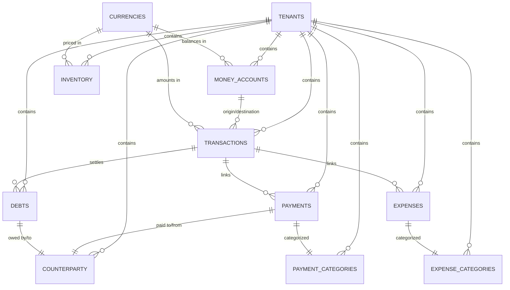

# Data Model: Finance Module

## Entity Relationship Diagram



## Table Schemas

### counterparty

Customer and vendor management.

```sql
CREATE TABLE counterparty (
    id uuid PRIMARY KEY DEFAULT gen_random_uuid(),
    tenant_id uuid NOT NULL REFERENCES tenants(id) ON DELETE CASCADE,
    tin varchar(20),
    name varchar(255) NOT NULL,
    type VARCHAR(255) NOT NULL,  -- customer, supplier, individual
    legal_type varchar(255) NOT NULL,  -- LLC, JSC, etc.
    legal_address varchar(255),
    created_at timestamp with time zone DEFAULT now(),
    updated_at timestamp with time zone DEFAULT now(),
    UNIQUE(tenant_id, tin)
);

CREATE INDEX counterparty_tenant_id_idx ON counterparty(tenant_id);
CREATE INDEX counterparty_tin_idx ON counterparty(tin);
```

| Column | Type | Constraint | Description |
|--------|------|-----------|-------------|
| `id` | uuid | PK | Counterparty ID |
| `tenant_id` | uuid | FK | Tenant ownership |
| `tin` | varchar(20) | UNIQUE | Tax ID Number |
| `name` | varchar(255) | NOT NULL | Legal entity name |
| `type` | varchar(255) | NOT NULL | customer, supplier, individual |
| `legal_type` | varchar(255) | | LLC, JSC, OOO, etc. |
| `legal_address` | varchar(255) | | Registered address |
| `created_at` | timestamp | | Creation time |
| `updated_at` | timestamp | | Last modification |

### counterparty_contacts

Contact information for counterparties.

```sql
CREATE TABLE counterparty_contacts (
    id uuid PRIMARY KEY DEFAULT gen_random_uuid(),
    counterparty_id uuid NOT NULL REFERENCES counterparty(id) ON DELETE CASCADE,
    first_name varchar(255) NOT NULL,
    last_name varchar(255) NOT NULL,
    middle_name varchar(255) NULL,
    email varchar(255),
    phone varchar(255),
    created_at timestamp with time zone DEFAULT now(),
    updated_at timestamp with time zone DEFAULT now()
);

CREATE INDEX counterparty_contacts_counterparty_id_idx
  ON counterparty_contacts(counterparty_id);
```

| Column | Type | Constraint | Description |
|--------|------|-----------|-------------|
| `id` | uuid | PK | Contact ID |
| `counterparty_id` | uuid | FK | Counterparty reference |
| `first_name` | varchar(255) | | Contact first name |
| `last_name` | varchar(255) | | Contact last name |
| `middle_name` | varchar(255) | | Middle name (optional) |
| `email` | varchar(255) | | Email address |
| `phone` | varchar(255) | | Phone number |
| `created_at` | timestamp | | Creation time |
| `updated_at` | timestamp | | Last modification |

### money_accounts

Bank accounts and financial accounts.

```sql
CREATE TABLE money_accounts (
    id uuid PRIMARY KEY DEFAULT gen_random_uuid(),
    tenant_id uuid NOT NULL REFERENCES tenants(id) ON DELETE CASCADE,
    name varchar(255) NOT NULL,
    account_number varchar(255) NOT NULL,
    description text,
    balance bigint NOT NULL,
    balance_currency_id varchar(3) NOT NULL REFERENCES currencies(code) ON DELETE CASCADE,
    created_at timestamp with time zone DEFAULT now(),
    updated_at timestamp with time zone DEFAULT now(),
    UNIQUE(tenant_id, account_number)
);

CREATE INDEX money_accounts_tenant_id_idx ON money_accounts(tenant_id);
```

| Column | Type | Constraint | Description |
|--------|------|-----------|-------------|
| `id` | uuid | PK | Account ID |
| `tenant_id` | uuid | FK | Tenant ownership |
| `name` | varchar(255) | NOT NULL | Account display name |
| `account_number` | varchar(255) | UNIQUE | Bank account number |
| `description` | text | | Account description |
| `balance` | bigint | NOT NULL | Current balance (in cents) |
| `balance_currency_id` | varchar(3) | FK | Account currency code |
| `created_at` | timestamp | | Creation time |
| `updated_at` | timestamp | | Last modification |

### transactions

Core financial transactions.

```sql
CREATE TABLE transactions (
    id uuid PRIMARY KEY DEFAULT gen_random_uuid(),
    tenant_id uuid NOT NULL REFERENCES tenants(id) ON DELETE CASCADE,
    amount bigint NOT NULL,
    origin_account_id uuid REFERENCES money_accounts(id) ON DELETE RESTRICT,
    destination_account_id uuid REFERENCES money_accounts(id) ON DELETE RESTRICT,
    transaction_date date NOT NULL DEFAULT now()::date,
    accounting_period date NOT NULL DEFAULT now()::date,
    transaction_type varchar(255) NOT NULL,  -- income, expense, transfer, exchange
    comment text,
    exchange_rate numeric(18, 8),  -- For exchange operations
    destination_amount bigint,  -- Amount in destination currency
    created_at timestamp with time zone DEFAULT now()
);

CREATE INDEX transactions_tenant_id_idx ON transactions(tenant_id);
CREATE INDEX transactions_origin_account_id_idx ON transactions(origin_account_id);
CREATE INDEX transactions_destination_account_id_idx ON transactions(destination_account_id);
CREATE INDEX transactions_date_idx ON transactions(transaction_date);
```

| Column | Type | Constraint | Description |
|--------|------|-----------|-------------|
| `id` | uuid | PK | Transaction ID |
| `tenant_id` | uuid | FK | Tenant ownership |
| `amount` | bigint | | Amount in origin currency (cents) |
| `origin_account_id` | uuid | FK | Source account |
| `destination_account_id` | uuid | FK | Target account |
| `transaction_date` | date | DEFAULT now() | Transaction date |
| `accounting_period` | date | DEFAULT now() | Accounting period |
| `transaction_type` | varchar(255) | | income, expense, transfer, exchange |
| `comment` | text | | Transaction description |
| `exchange_rate` | numeric(18,8) | | Exchange rate for conversions |
| `destination_amount` | bigint | | Amount in destination currency |
| `created_at` | timestamp | | Creation timestamp |

### expense_categories

Expense categorization.

```sql
CREATE TABLE expense_categories (
    id uuid PRIMARY KEY DEFAULT gen_random_uuid(),
    tenant_id uuid NOT NULL REFERENCES tenants(id) ON DELETE CASCADE,
    name varchar(255) NOT NULL,
    description text,
    created_at timestamp with time zone DEFAULT now(),
    updated_at timestamp with time zone DEFAULT now(),
    UNIQUE(tenant_id, name)
);

CREATE INDEX expense_categories_tenant_id_idx ON expense_categories(tenant_id);
```

| Column | Type | Constraint | Description |
|--------|------|-----------|-------------|
| `id` | uuid | PK | Category ID |
| `tenant_id` | uuid | FK | Tenant ownership |
| `name` | varchar(255) | UNIQUE | Category name |
| `description` | text | | Category description |
| `created_at` | timestamp | | Creation time |
| `updated_at` | timestamp | | Last modification |

### money_accounts

Money accounts with balance tracking.

```sql
CREATE TABLE money_accounts (
    id uuid PRIMARY KEY DEFAULT gen_random_uuid(),
    tenant_id uuid NOT NULL REFERENCES tenants(id) ON DELETE CASCADE,
    name varchar(255) NOT NULL,
    account_number varchar(255) NOT NULL,
    description text,
    balance bigint NOT NULL,
    balance_currency_id varchar(3) NOT NULL REFERENCES currencies(code) ON DELETE CASCADE,
    created_at timestamp with time zone DEFAULT now(),
    updated_at timestamp with time zone DEFAULT now(),
    UNIQUE(tenant_id, account_number)
);
```

| Column | Type | Constraint | Description |
|--------|------|-----------|-------------|
| `id` | uuid | PK | Account ID |
| `tenant_id` | uuid | FK | Tenant ownership |
| `name` | varchar(255) | | Account name |
| `account_number` | varchar(255) | UNIQUE | Account number |
| `balance` | bigint | | Current balance (cents) |
| `balance_currency_id` | varchar(3) | FK | Currency code |

### expenses

Expense records linked to transactions.

```sql
CREATE TABLE expenses (
    id uuid PRIMARY KEY DEFAULT gen_random_uuid(),
    tenant_id uuid NOT NULL REFERENCES tenants(id) ON DELETE CASCADE,
    transaction_id uuid NOT NULL REFERENCES transactions(id) ON DELETE CASCADE,
    category_id uuid NOT NULL REFERENCES expense_categories(id) ON DELETE CASCADE,
    created_at timestamp with time zone DEFAULT now(),
    updated_at timestamp with time zone DEFAULT now()
);

CREATE INDEX expenses_category_id_idx ON expenses(category_id);
CREATE INDEX expenses_transaction_id_idx ON expenses(transaction_id);
```

| Column | Type | Constraint | Description |
|--------|------|-----------|-------------|
| `id` | uuid | PK | Expense ID |
| `tenant_id` | uuid | FK | Tenant ownership |
| `transaction_id` | uuid | FK | Linked transaction |
| `category_id` | uuid | FK | Expense category |
| `created_at` | timestamp | | Creation time |
| `updated_at` | timestamp | | Last modification |

### payment_categories

Payment categorization.

```sql
CREATE TABLE payment_categories (
    id uuid PRIMARY KEY DEFAULT gen_random_uuid(),
    tenant_id uuid NOT NULL REFERENCES tenants(id) ON DELETE CASCADE,
    name varchar(255) NOT NULL,
    description text,
    created_at timestamp with time zone DEFAULT now(),
    updated_at timestamp with time zone DEFAULT now(),
    UNIQUE(tenant_id, name)
);

CREATE INDEX payment_categories_tenant_id_idx ON payment_categories(tenant_id);
```

| Column | Type | Constraint | Description |
|--------|------|-----------|-------------|
| `id` | uuid | PK | Category ID |
| `tenant_id` | uuid | FK | Tenant ownership |
| `name` | varchar(255) | UNIQUE | Category name |
| `description` | text | | Category description |
| `created_at` | timestamp | | Creation time |
| `updated_at` | timestamp | | Last modification |

### payments

Payment records.

```sql
CREATE TABLE payments (
    id uuid PRIMARY KEY DEFAULT gen_random_uuid(),
    tenant_id uuid NOT NULL REFERENCES tenants(id) ON DELETE CASCADE,
    transaction_id uuid NOT NULL REFERENCES transactions(id) ON DELETE RESTRICT,
    counterparty_id uuid NOT NULL REFERENCES counterparty(id) ON DELETE RESTRICT,
    payment_category_id uuid REFERENCES payment_categories(id) ON DELETE SET NULL,
    created_at timestamp with time zone DEFAULT now(),
    updated_at timestamp with time zone DEFAULT now()
);

CREATE INDEX payments_counterparty_id_idx ON payments(counterparty_id);
CREATE INDEX payments_transaction_id_idx ON payments(transaction_id);
CREATE INDEX payments_payment_category_id_idx ON payments(payment_category_id);
```

| Column | Type | Constraint | Description |
|--------|------|-----------|-------------|
| `id` | uuid | PK | Payment ID |
| `tenant_id` | uuid | FK | Tenant ownership |
| `transaction_id` | uuid | FK | Linked transaction |
| `counterparty_id` | uuid | FK | Customer/vendor |
| `payment_category_id` | uuid | FK | Payment category |
| `created_at` | timestamp | | Creation time |
| `updated_at` | timestamp | | Last modification |

### debts

Receivables and payables.

```sql
CREATE TABLE debts (
    id uuid PRIMARY KEY DEFAULT gen_random_uuid(),
    tenant_id uuid NOT NULL REFERENCES tenants(id) ON DELETE CASCADE,
    type varchar(20) NOT NULL CHECK (type IN ('RECEIVABLE', 'PAYABLE')),
    status varchar(20) NOT NULL DEFAULT 'PENDING' CHECK (status IN ('PENDING', 'SETTLED', 'PARTIAL', 'WRITTEN_OFF')),
    counterparty_id uuid NOT NULL REFERENCES counterparty(id) ON DELETE RESTRICT,
    original_amount bigint NOT NULL,
    original_amount_currency_id varchar(3) NOT NULL REFERENCES currencies(code) ON DELETE CASCADE,
    outstanding_amount bigint NOT NULL,
    outstanding_currency_id varchar(3) NOT NULL REFERENCES currencies(code) ON DELETE CASCADE,
    description text NOT NULL,
    due_date date,
    settlement_transaction_id uuid REFERENCES transactions(id) ON DELETE SET NULL,
    created_at timestamp with time zone DEFAULT now(),
    updated_at timestamp with time zone DEFAULT now()
);

CREATE INDEX debts_counterparty_id_idx ON debts(counterparty_id);
CREATE INDEX debts_due_date_idx ON debts(due_date);
CREATE INDEX debts_status_idx ON debts(status);
```

| Column | Type | Constraint | Description |
|--------|------|-----------|-------------|
| `id` | uuid | PK | Debt ID |
| `tenant_id` | uuid | FK | Tenant ownership |
| `type` | varchar(20) | CHECK | RECEIVABLE or PAYABLE |
| `status` | varchar(20) | CHECK | PENDING, SETTLED, PARTIAL, WRITTEN_OFF |
| `counterparty_id` | uuid | FK | Related counterparty |
| `original_amount` | bigint | | Initial debt amount (cents) |
| `original_amount_currency_id` | varchar(3) | FK | Original currency |
| `outstanding_amount` | bigint | | Remaining balance (cents) |
| `outstanding_currency_id` | varchar(3) | FK | Outstanding currency |
| `description` | text | | Debt reason/details |
| `due_date` | date | | Payment due date |
| `settlement_transaction_id` | uuid | FK | Settled via transaction |
| `created_at` | timestamp | | Creation time |
| `updated_at` | timestamp | | Last modification |

### inventory

Product and service inventory.

```sql
CREATE TABLE inventory (
    id uuid PRIMARY KEY DEFAULT gen_random_uuid(),
    tenant_id uuid NOT NULL REFERENCES tenants(id) ON DELETE CASCADE,
    name varchar(255) NOT NULL,
    description text,
    currency_id varchar(3) REFERENCES currencies(code) ON DELETE SET NULL,
    price bigint NOT NULL,
    quantity int NOT NULL,
    created_at timestamp with time zone DEFAULT now(),
    updated_at timestamp with time zone DEFAULT now(),
    UNIQUE(tenant_id, name)
);

CREATE INDEX inventory_tenant_id_idx ON inventory(tenant_id);
CREATE INDEX inventory_currency_id_idx ON inventory(currency_id);
```

| Column | Type | Constraint | Description |
|--------|------|-----------|-------------|
| `id` | uuid | PK | Inventory item ID |
| `tenant_id` | uuid | FK | Tenant ownership |
| `name` | varchar(255) | UNIQUE | Item name |
| `description` | text | | Item description |
| `currency_id` | varchar(3) | FK | Price currency |
| `price` | bigint | | Unit price (cents) |
| `quantity` | int | | Stock quantity |
| `created_at` | timestamp | | Creation time |
| `updated_at` | timestamp | | Last modification |

## Query Patterns

### Account Balance with Recent Transactions

```sql
SELECT
    ma.id,
    ma.name,
    ma.balance,
    c.code as currency,
    COUNT(t.id) as transaction_count,
    MAX(t.transaction_date) as last_transaction_date
FROM money_accounts ma
LEFT JOIN transactions t ON ma.id IN (t.origin_account_id, t.destination_account_id)
LEFT JOIN currencies c ON ma.balance_currency_id = c.code
WHERE ma.tenant_id = $1
GROUP BY ma.id, ma.name, ma.balance, c.code
ORDER BY ma.created_at DESC;
```

### Outstanding Debts by Counterparty

```sql
SELECT
    d.id,
    d.type,
    d.status,
    cp.name as counterparty_name,
    d.outstanding_amount,
    d.outstanding_currency_id,
    d.due_date,
    CASE
        WHEN d.due_date < CURRENT_DATE THEN 'OVERDUE'
        WHEN d.due_date < CURRENT_DATE + INTERVAL '7 days' THEN 'DUE_SOON'
        ELSE 'UPCOMING'
    END as urgency
FROM debts d
JOIN counterparty cp ON d.counterparty_id = cp.id
WHERE d.tenant_id = $1
    AND d.status IN ('PENDING', 'PARTIAL')
ORDER BY d.due_date ASC;
```

### Income Statement (P&L) by Period

```sql
SELECT
    COALESCE(income.total, 0) as total_income,
    COALESCE(expense.total, 0) as total_expense,
    COALESCE(income.total, 0) - COALESCE(expense.total, 0) as net_income,
    SUM(CASE WHEN t.transaction_type = 'income' THEN t.amount ELSE 0 END) as gross_revenue,
    SUM(CASE WHEN t.transaction_type = 'expense' THEN t.amount ELSE 0 END) as total_operating_expenses
FROM transactions t
LEFT JOIN (
    SELECT SUM(amount) as total
    FROM transactions
    WHERE tenant_id = $1
        AND transaction_type = 'income'
        AND transaction_date BETWEEN $2 AND $3
) income ON TRUE
LEFT JOIN (
    SELECT SUM(amount) as total
    FROM transactions
    WHERE tenant_id = $1
        AND transaction_type = 'expense'
        AND transaction_date BETWEEN $2 AND $3
) expense ON TRUE
WHERE t.tenant_id = $1
    AND t.transaction_date BETWEEN $2 AND $3
GROUP BY income.total, expense.total;
```

### Cash Flow Analysis

```sql
SELECT
    DATE_TRUNC('month', t.transaction_date) as period,
    t.transaction_type,
    SUM(t.amount) as total_amount,
    COUNT(t.id) as transaction_count
FROM transactions t
WHERE t.tenant_id = $1
    AND t.transaction_date BETWEEN $2 AND $3
GROUP BY DATE_TRUNC('month', t.transaction_date), t.transaction_type
ORDER BY period ASC, t.transaction_type;
```

## Relationships Summary

| From | To | Type | Cardinality | Constraint |
|------|----|----|------------|-----------|
| payments | transactions | Foreign Key | Many-to-One | ON DELETE RESTRICT |
| payments | counterparty | Foreign Key | Many-to-One | ON DELETE RESTRICT |
| expenses | transactions | Foreign Key | Many-to-One | ON DELETE CASCADE |
| expenses | expense_categories | Foreign Key | Many-to-One | ON DELETE CASCADE |
| debts | counterparty | Foreign Key | Many-to-One | ON DELETE RESTRICT |
| debts | transactions | Foreign Key | Many-to-One | ON DELETE SET NULL |
| transactions | money_accounts | Foreign Key | Many-to-One | ON DELETE RESTRICT |
| money_accounts | currencies | Foreign Key | Many-to-One | ON DELETE CASCADE |
| inventory | currencies | Foreign Key | Many-to-One | ON DELETE SET NULL |
