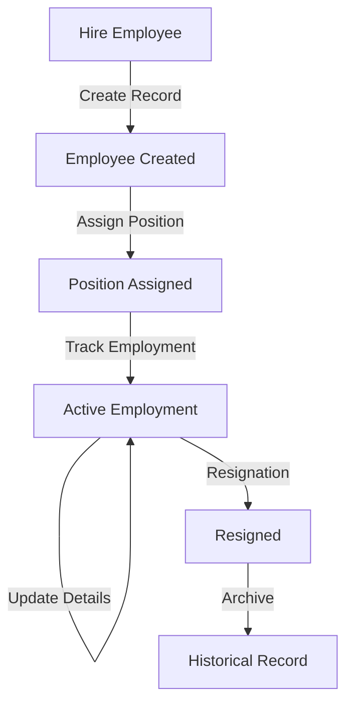
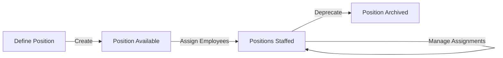
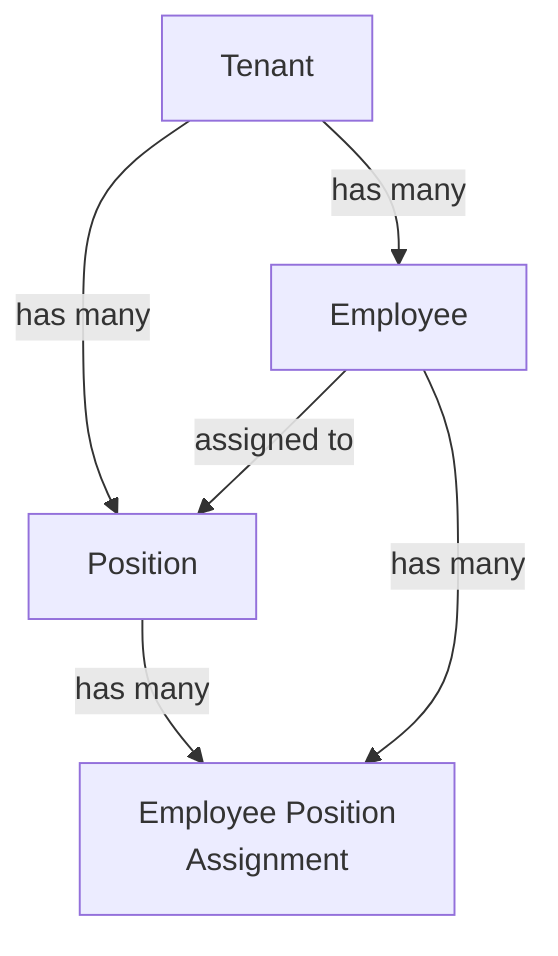

# Business Requirements

## Problem Statement

Organizations need to manage their workforce effectively. This includes:

- **Employee Information**: Storing comprehensive employee data (personal, professional, identification)
- **Organizational Structure**: Defining positions and roles within the organization
- **Employment Lifecycle**: Tracking hiring, assignments, and resignations
- **Compensation Management**: Managing salary and compensation information
- **Compliance**: Maintaining identification documents and tax information
- **Multi-language Support**: Supporting employees across different language regions

The HRM module serves as the central repository for employee data, supporting payroll, organizational reporting, and HR operations.

## Workflow

### Employee Lifecycle

### Position Management Workflow

## Business Rules

### Employee Rules

1. **Unique Email Per Tenant**: Employees' email addresses must be unique within a tenant
2. **Unique Phone Per Tenant**: Phone numbers must be unique within a tenant
3. **Required Information**:
   - First and last names required
   - Email address required
   - Hire date required
   - Tax identifiers (TIN, PIN) required for employment

4. **Employment Status**:
   - Active employees have no resignation date
   - Resigned employees have a resignation date set
   - Historical records preserved (soft delete or archive)

5. **Compensation**:
   - Salary stored in organizational currency
   - Can be NULL for contractors without fixed salary
   - Hourly rate and coefficient support flexible compensation models

6. **Identification**:
   - Passport information associated with employee
   - Tax identifiers maintained for compliance
   - Language preferences tracked for communication

### Position Rules

1. **Unique Naming**: Position names must be unique within a tenant
2. **No Orphan Positions**: Archived positions don't affect employee assignments
3. **Descriptive**: Descriptions help with role clarity

### Employee-Position Rules

1. **Flexible Assignment**: Employees can have multiple positions
2. **Historical Tracking**: Assignment history maintained (if tracked)
3. **No Required Positions**: Employees can exist without position assignment

## Data Consistency

### Hierarchical Relationships

### Referential Integrity

- **Tenant Isolation**: Employees and positions belong to specific tenants
- **Multi-tenant Constraints**: Email/phone unique per tenant, not globally
- **FK Constraints**: Ensure positions exist before assignment

## Business Scenarios

### Scenario 1: Tech Company Structure

**Employees**:
- Alice (Software Engineer, Hire: 2023-01-15)
- Bob (Software Engineer, Hire: 2023-02-01)
- Charlie (Engineering Manager, Hire: 2022-06-01)
- Diana (HR Manager, Hire: 2023-06-15)

**Positions**:
- Software Engineer
- Engineering Manager
- HR Manager
- DevOps Engineer

**Assignments**:
- Alice → Software Engineer
- Bob → Software Engineer, DevOps Engineer (dual role)
- Charlie → Engineering Manager
- Diana → HR Manager

### Scenario 2: Employee Resignation

**Initial State**:
- Employee: John Smith, Hire: 2020-01-01, Active (No resignation date)

**After Resignation**:
- Same record, with ResignationDate set to last working day
- Employee can be marked inactive
- Historical data preserved for reporting

### Scenario 3: International Workforce

**Employees with Language Preferences**:
- Russian/Uzbek bilingual employee
- English/Russian technical staff
- Uzbek/Russian administrative staff

**Business Impact**:
- Communication materials delivered in preferred language
- HR documents translated accordingly
- Internal communications in employee's primary language

## Reporting Requirements

### Employee Reports

1. **Headcount Report**:
   - Total employees by department
   - Active vs. resigned
   - Headcount trends over time

2. **Compensation Report**:
   - Average salary by position
   - Salary ranges
   - Compensation trends

3. **Turnover Report**:
   - Employee resignations by period
   - Tenure statistics
   - Resignation reasons

### Position Analysis

1. **Staffing Report**:
   - Positions with assigned employees
   - Vacancy report
   - Multiple assignments tracking

2. **Organization Chart**:
   - Hierarchical structure
   - Manager-employee relationships
   - Department organization

## Performance Considerations

### Query Patterns

**Frequent Queries**:
- Find all employees for tenant (paginated)
- Search by name, email, or phone
- Find employees by position
- List active employees

**Indexes**: Created on `tenant_id`, `email`, `phone`, `first_name`, `last_name`

### Data Volume

- **Expected Scale**: 100s to 10,000s of employees per large organization
- **Growth**: Primarily driven by organizational expansion
- **Archival**: Historical records preserved indefinitely

## Compliance & Legal

### Required Information

1. **Tax Compliance**:
   - TIN (Tax Identification Number) for each employee
   - PIN (Personal ID Number) for identities
   - Passport information for verification

2. **Employment Documentation**:
   - Hire date documented
   - Resignation date tracked
   - Employment status auditable

3. **Personal Data**:
   - GDPR-compliant data handling
   - Secure storage of sensitive information
   - Right to be forgotten considerations

### Audit Trail

- All employee information changes logged
- Timestamp tracking for compliance
- User attribution for changes
- Historical data preservation

## Permission Model

### Employee Permissions

- `hrm.employees.view.list` - List employees
- `hrm.employees.view.detail` - View employee details
- `hrm.employees.view.sensitive` - View sensitive info (TIN, PIN, passport)
- `hrm.employees.create` - Create new employees
- `hrm.employees.edit` - Edit employee details
- `hrm.employees.delete` - Archive/delete employees
- `hrm.employees.export` - Export employee data

### Position Permissions

- `hrm.positions.view` - View positions
- `hrm.positions.create` - Create positions
- `hrm.positions.edit` - Edit positions
- `hrm.positions.delete` - Archive positions

### Role Assignments

- **HR Manager**: Full employee management rights
- **Finance Officer**: Can view compensation data
- **Department Manager**: Can view their team
- **Employee**: Can view own information
- **Admin**: Full administrative access

## Integration Requirements

### Payroll System Integration

- Employee salary information feeds payroll
- Currency support for multi-currency organizations
- Compensation structure (salary, hourly rate, coefficients)

### User Management Integration

- Employees can be linked to system users
- User creation may create employee record
- User deletion doesn't delete employee record

### Organizational Integration

- Positions form organizational structure
- Reporting hierarchy (if tracked)
- Department/team organization

## Success Criteria

1. **Accurate Data**: Employee information complete and current
2. **Compliance Ready**: Tax and legal information properly maintained
3. **Easy Management**: Intuitive UI for HR operations
4. **Flexible Structure**: Support for various organizational models
5. **Performance**: Fast queries and searches on large datasets
6. **Security**: Sensitive data properly protected
7. **Audit Trail**: Complete change history for compliance
