# JavaScript Runtime Integration Specification

## 1. Overview & Goal

This document outlines the integration of a secure, efficient, and pure Go JavaScript runtime (Goja) into the IOTA SDK. The goal is to empower users to create custom business logic, automate tasks, and extend the platform's capabilities directly from the web UI, while adhering to the existing Domain-Driven Design (DDD) and event-driven architecture.

This feature will follow IOTA SDK's existing architectural patterns and integrate seamlessly with the current event-driven system.

## 2. Runtime Choice: Goja

### Selected Runtime: [Goja](https://github.com/dop251/goja)

**Advantages of Goja:**
- Pure Go implementation (no CGO required)
- ECMAScript 5.1 compliant with ES6/ES2015 features
- Excellent Go interoperability
- No external dependencies
- Better for deployment and cross-compilation
- Lower memory footprint compared to V8/Node bindings
- Synchronous execution model fits well with Go's concurrency patterns
- Can be easily integrated with IOTA SDK's context-based architecture

**Why not CGO-based solutions (Node.js/QuickJS bindings):**
- CGO complicates deployment and cross-compilation
- Increased binary size
- Potential stability issues with native bindings
- More complex error handling across FFI boundaries
- Harder to sandbox and control resource usage
- Additional dependencies for production deployments
- Would complicate IOTA SDK's clean architecture

## 3. Core Capabilities

*   **Scheduled Scripts (Cron Jobs)**: Execute scripts on a recurring basis using cron expressions for periodic tasks like fetching client records and sending SMS notifications.
*   **One-Off Scripts**: Run ad-hoc scripts on-demand for maintenance, data migration, or testing.
*   **HTTP Endpoints**: Create custom API endpoints using JavaScript to handle custom webhooks or data integrations.
*   **Embedded Scripts**: Trigger scripts from within the IOTA SDK for custom validation rules, data transformation pipelines, or extending business logic.
*   **Web-based Editor**: A full-featured script editor (Monaco) with syntax highlighting, versioning, IntelliSense, and testing capabilities.

## 4. High-Level Architecture

*   **Runtime Engine**: `Goja` will be used as the core JavaScript engine due to its pure Go implementation, which avoids CGO and simplifies deployment.
*   **Module Structure**: A new `scripts` module will be created following the established DDD pattern, with clear separation of `domain`, `infrastructure`, `services`, and `presentation` layers.
*   **Sandboxing**: The runtime will be heavily sandboxed to ensure security. Scripts will have resource limits (CPU, memory), restricted access to the filesystem and network, and will operate within the tenant's context.
*   **API Surface**: A secure, context-aware JavaScript API will be exposed to the scripts, providing access to tenant-scoped database operations (via services), event publishing, and other core IOTA SDK services. Direct database access will be prohibited; all data operations will go through the service layer.

### Module Structure (Following IOTA SDK DDD Pattern)
```
modules/scripts/
├── domain/
│   ├── aggregates/
│   │   ├── script/
│   │   └── execution/
│   └── value_objects/
├── infrastructure/
│   ├── runtime/
│   ├── persistence/
│   └── scheduler/
├── services/
├── presentation/
│   ├── controllers/
│   ├── templates/
│   ├── viewmodels/
│   └── mappers/
├── permissions/
├── links.go
└── module.go
```

### System Interaction Diagram (Mermaid)

This diagram illustrates the flow of control and data through the JavaScript Runtime system. This version is optimized for clarity and a less cluttered layout in renderers like Excalidraw.

```mermaid
graph LR
    %% Define node styles
    style User fill:#d4e6f1,stroke:#333,stroke-width:2px
    style Cron fill:#f5e1d3,stroke:#333,stroke-width:2px
    style CoreEventBus fill:#f5e1d3,stroke:#333,stroke-width:2px
    style Database fill:#e8f8f5,stroke:#333,stroke-width:2px
    style ExternalAPI fill:#fef9e7,stroke:#333,stroke-width:2px
    style JSCode fill:#fff2cc,stroke:#d6b656,stroke-width:2px

    %% Column 1: External Triggers
    subgraph "Initiators"
        direction TB
        User("[👤 User]");
        Cron["[⏰ Cron Scheduler]"];
        CoreEventBus["[🔔 Core Event Bus]"];
    end

    %% Column 2: Application Entry Points
    subgraph "Entry & Routing"
        direction TB
        Controller["Presentation Layer<br>(ScriptController)"];
        EventRouter["Event Router"];
    end

    %% Column 3: Service Layer (Core Logic)
    subgraph "Service Layer"
        direction TB
        ScriptService["ScriptService"];
        ExecutionService["ExecutionService"];
    end
    
    %% Invisible link to align services
    ScriptService ~~~ ExecutionService

    %% Column 4: JS Runtime
    subgraph "JS Runtime"
        direction TB
        JSRuntime["jsruntime<br>(Goja VM Pool & Sandbox)"];
        JSCode["User JavaScript Code"];
    end

    %% Column 5: Domain & Data
    subgraph "Domain & Persistence"
        direction TB
        Aggregates["Domain Aggregates<br>(Script, Execution)"];
        Repositories["Repositories"];
    end

    %% Column 6: External Dependencies
    subgraph "SDK Core & External Systems"
        direction TB
        OtherServices["Other IOTA Services<br>(Clients, Billing, etc.)"];
        Database["[📦 PostgreSQL]"];
        ExternalAPI["[☁️ External API]"];
    end
    
    %% Define Connections
    User -- "1. HTTP Request" --> Controller
    Controller -- "2. Calls" --> ScriptService & ExecutionService

    Cron -- "1a. Triggers" --> ExecutionService
    CoreEventBus -- "1b. Notifies" --> EventRouter
    EventRouter -- "2b. Triggers" --> ExecutionService

    ScriptService -- "Uses" --> Aggregates
    ExecutionService -- "Uses" --> Aggregates
    
    ExecutionService -- "3. Delegates To" --> JSRuntime
    JSRuntime -- "4. Executes" --> JSCode

    JSCode -- "5. Calls Bridge To" --> OtherServices
    JSCode -- "6. Publishes To" --> CoreEventBus
    JSCode -- "7. HTTP Call To" --> ExternalAPI

    Aggregates -- "Managed By" --> Repositories
    Repositories -- "8. Reads/Writes" --> Database
```




## 5. Implementation Plan

## 5. Implementation Plan

This project will be implemented in logical phases to ensure iterative development, testing, and delivery.

**Phase 1: Core Runtime & Infrastructure**
*   **Objective**: Establish the foundational Goja runtime environment.
*   **Tasks**:
    *   Integrate the Goja library into the IOTA SDK.
    *   Implement a basic VM pool manager to handle the lifecycle of Goja VMs.
    *   Develop the initial security sandbox to isolate script execution, setting basic timeouts and memory limits.
    *   Create a `RuntimeService` responsible for executing raw JavaScript strings within the sandboxed environment.
    *   Develop initial unit tests for the runtime and sandbox.

**Phase 2: Domain Model & Persistence**
*   **Objective**: Define and persist the core business entities.
*   **Tasks**:
    *   Define the `Script` and `Execution` domain aggregates, including value objects like `ScriptType` and `ExecutionStatus`.
    *   Define repository interfaces for `ScriptRepository` and `ExecutionRepository`.
    *   Implement the database schema in `scripts-schema.sql` for `scripts`, `script_executions`, and `script_versions`.
    *   Implement the persistence layer, including repository implementations and domain-to-database mappers.
    *   Set up the necessary database migrations.

**Phase 3: Service Layer**
*   **Objective**: Orchestrate the business logic for managing and executing scripts.
*   **Tasks**:
    *   Implement `ScriptService` for CRUD operations on the `Script` entity.
    *   Implement `ExecutionService` to manage the lifecycle of a script execution, from creation to completion or failure.
    *   Integrate the service layer with the event bus, publishing domain events for script creation, updates, and executions.
    *   Develop service-layer tests.

**Phase 4: JavaScript API Bindings & Event Integration**
*   **Objective**: Expose IOTA SDK functionality to the JavaScript runtime.
*   **Tasks**:
    *   Implement the context bridge to inject tenant, user, and execution context into the JS environment.
    *   Develop the `api_bindings` to expose IOTA SDK services (e.g., `services.clients.list`) to JavaScript. All exposed methods must be tenant-scoped and respect user permissions.
    *   Implement the `events.publish` binding to allow scripts to publish custom events to the IOTA event bus.
    *   Implement bindings for `console`, `storage` (tenant-scoped key-value store), and `utils`.

**Phase 5: Presentation Layer (UI/UX)**
*   **Objective**: Build the user interface for script management.
*   **Tasks**:
    *   Create DTOs, viewmodels, and presentation-layer mappers.
    *   Develop the `ScriptController` to handle HTTP requests for script management.
    *   Build the UI pages using `templ` and HTMX:
        *   `list.templ`: A page to list, filter, and manage all scripts.
        *   `new.templ` / `edit.templ`: Forms for creating and editing scripts.
        *   `editor.templ`: A reusable component integrating the Monaco editor.
        *   `executions.templ`: A page to view script execution history and logs.
    *   Implement RBAC checks for all UI actions.

**Phase 6: Advanced Features & Polish**
*   **Objective**: Deliver the remaining core features and harden the system.
*   **Tasks**:
    *   Implement the cron scheduler to run scripts based on their `cron_expression`.
    *   Implement the dynamic endpoint router to handle incoming HTTP requests for `endpoint` scripts.
    *   Enhance security with fine-grained permissions and improved sandboxing.
    *   Implement performance optimizations like script compilation caching.
    *   Develop comprehensive monitoring, including Prometheus metrics and OpenTelemetry tracing.

## 6. Domain and Persistence Design

### Database Schema
```sql
-- Scripts table with tenant isolation
CREATE TABLE scripts (
    id UUID PRIMARY KEY DEFAULT gen_random_uuid(),
    tenant_id UUID NOT NULL REFERENCES tenants(id),
    name VARCHAR(255) NOT NULL,
    description TEXT,
    type VARCHAR(50) NOT NULL, -- 'cron', 'endpoint', 'one_off', 'embedded'
    content TEXT NOT NULL,
    cron_expression VARCHAR(255),
    endpoint_path VARCHAR(255),
    endpoint_method VARCHAR(10),
    is_active BOOLEAN DEFAULT true,
    timeout_seconds INTEGER DEFAULT 30,
    max_memory_mb INTEGER DEFAULT 128,
    created_at TIMESTAMP DEFAULT CURRENT_TIMESTAMP,
    updated_at TIMESTAMP DEFAULT CURRENT_TIMESTAMP,
    created_by UUID REFERENCES users(id),
    version INTEGER DEFAULT 1,
    CONSTRAINT unique_script_name_per_tenant UNIQUE (tenant_id, name),
    CONSTRAINT unique_endpoint_per_tenant UNIQUE (tenant_id, endpoint_path, endpoint_method)
);

-- Script executions table with tenant isolation
CREATE TABLE script_executions (
    id UUID PRIMARY KEY DEFAULT gen_random_uuid(),
    tenant_id UUID NOT NULL REFERENCES tenants(id),
    script_id UUID REFERENCES scripts(id) ON DELETE CASCADE,
    status VARCHAR(50) NOT NULL, -- 'pending', 'running', 'success', 'failed', 'timeout'
    started_at TIMESTAMP DEFAULT CURRENT_TIMESTAMP,
    completed_at TIMESTAMP,
    duration_ms INTEGER,
    output TEXT,
    error TEXT,
    triggered_by VARCHAR(50), -- 'cron', 'manual', 'api', 'system'
    triggered_by_user UUID REFERENCES users(id),
    execution_context JSONB -- Store runtime context, parameters
);

-- Script versions table for audit trail
CREATE TABLE script_versions (
    id UUID PRIMARY KEY DEFAULT gen_random_uuid(),
    tenant_id UUID NOT NULL REFERENCES tenants(id),
    script_id UUID REFERENCES scripts(id) ON DELETE CASCADE,
    version INTEGER NOT NULL,
    content TEXT NOT NULL,
    created_at TIMESTAMP DEFAULT CURRENT_TIMESTAMP,
    created_by UUID REFERENCES users(id),
    change_summary TEXT,
    CONSTRAINT unique_version_per_script UNIQUE (script_id, version)
);

-- Indexes for performance
CREATE INDEX idx_scripts_tenant_type ON scripts(tenant_id, type);
CREATE INDEX idx_scripts_tenant_active ON scripts(tenant_id, is_active);
CREATE INDEX idx_executions_tenant_script ON script_executions(tenant_id, script_id);
CREATE INDEX idx_executions_tenant_status ON script_executions(tenant_id, status);
CREATE INDEX idx_executions_started_at ON script_executions(started_at DESC);
```

### Domain Entity Design
```go
// domain/aggregates/script/script.go
type Script interface {
    ID() uuid.UUID
    TenantID() uuid.UUID
    Name() string
    Type() ScriptType
    Content() string
    IsActive() bool
    Version() int
    
    // Immutable update methods
    UpdateContent(content string) Script
    Activate() Script
    Deactivate() Script
}

// domain/aggregates/script/script_repository.go
type Repository interface {
    GetByID(ctx context.Context, id uuid.UUID) (Script, error)
    Create(ctx context.Context, script Script) (Script, error)
    Update(ctx context.Context, script Script) (Script, error)
    Delete(ctx context.Context, id uuid.UUID) error
    // ... other finders
}
```

## 7. JavaScript API Design

### Context-Aware API Surface
The JavaScript runtime will provide a context-aware API that respects IOTA SDK's tenant isolation and security model:

```javascript
// Execution context (automatically injected and immutable)
const context = {
    tenant: { id: "uuid", name: "Tenant Name" },
    user: { id: "uuid", email: "user@example.com", name: "User Name" },
    script: { id: "uuid", name: "Script Name", type: "cron|endpoint|embedded" },
    execution: { id: "uuid", triggeredBy: "cron|manual|api|system" }
};

// Service access (tenant-scoped and permission-aware)
const services = {
    clients: {
        list: async (filters) => { /* ... */ },
        get: async (id) => { /* ... */ },
    },
    // ... other exposed services
};

// Event publishing
const events = {
    publish: async (eventType, data) => { /* ... */ },
};

// HTTP client (with security restrictions)
const http = {
    get: async (url, options) => { /* ... */ },
    post: async (url, data, options) => { /* ... */ },
};

// Storage (tenant-scoped key-value store)
const storage = {
    get: async (key) => { /* ... */ },
    set: async (key, value, ttl) => { /* ... */ },
};

// Logging (structured and indexed)
const console = {
    log: (...args) => { /* ... */ },
    error: (...args) => { /* ... */ },
};

// Utilities
const utils = {
    uuid: () => { /* ... */ },
    date: { /* ... */ },
};
```

### Example Script: Custom Order Validation
```javascript
// Embedded Script: Order Validation Rule
async function validateOrder(order) {
    console.info(`Validating order ${order.id} for tenant ${context.tenant.name}`);
    const errors = [];
    
    // Check inventory availability using an exposed service
    for (const item of order.items) {
        const product = await services.products.get(item.product_id);
        if (product.stock < item.quantity) {
            errors.push(`Insufficient stock for ${product.name}`);
        }
    }
    
    // Check for a custom rule stored in the tenant's key-value store
    const minOrderValue = await storage.get('min_order_value');
    if (minOrderValue && order.total < minOrderValue) {
        errors.push(`Order total is below the minimum of ${minOrderValue}`);
    }
    
    // Publish an event for analytics
    await events.publish('order.validation.completed', {
        orderId: order.id,
        errorCount: errors.length,
    });
    
    return {
        valid: errors.length === 0,
        errors: errors
    };
}
```

## 8. Security & Runtime Architecture

### Sandboxing
The runtime will be sandboxed using the following measures:
- **Resource Limits**: Strict timeouts and memory limits will be enforced on every execution to prevent resource exhaustion.
- **Filesystem/Network Access**: No direct access to the filesystem or arbitrary network endpoints. All external communication must go through the provided `http` or `services` APIs.
- **Panic Recovery**: The runtime will recover from script panics to prevent a single script from crashing the entire application.

### VM Pool Management
A pool of pre-initialized Goja VMs will be maintained to reduce the latency of script execution. VMs will be reset and recycled periodically to ensure a clean execution environment and prevent memory leaks.

### Performance Optimizations
- **Script Compilation Cache**: Scripts will be compiled to bytecode once and cached, avoiding the overhead of parsing and compiling on every execution.
- **Asynchronous Execution**: Go functions exposed to JavaScript will be wrapped in Promises, allowing for non-blocking I/O operations.

## 9. Testing & Quality Assurance

*   **Unit Tests**: For individual components like the sandbox, services, and value objects.
*   **Integration Tests**: To verify the interaction between the service layer, persistence, and the runtime, including script execution with database access and HTTP endpoint routing.
*   **E2E Tests**: To simulate user workflows, from creating a script in the UI to verifying its execution and output.

## 10. Future Improvements & Development Experience

The following will be considered for future releases to improve the developer experience:
*   A local development server and testing framework.
*   A VS Code extension for IntelliSense on the IOTA Script API.
*   Support for API versioning to prevent breaking changes in scripts.
*   Advanced debugging tools, such as execution replay.

## 11. Risks & Mitigation Strategies

### Technical Risks
- **Performance Impact**: Mitigated by resource limits, separate worker pools, and circuit breakers.
- **Security Vulnerabilities**: Mitigated by strict sandboxing, service whitelisting, and comprehensive audit logging.
- **Resource Exhaustion**: Mitigated by hard limits, timeouts, monitoring, and per-tenant quotas.

### Operational Risks
- **Debugging Complexity**: Mitigated by comprehensive logging, execution history, and future development tools.
- **Backward Compatibility**: Mitigated by API versioning and clear deprecation notices.

## 12. Conclusion

The JavaScript runtime integration represents a significant enhancement to IOTA SDK's extensibility. By following the existing DDD architecture and leveraging Goja's pure-Go implementation, we can provide a powerful, secure, and maintainable scripting solution that empowers users while maintaining system integrity.
