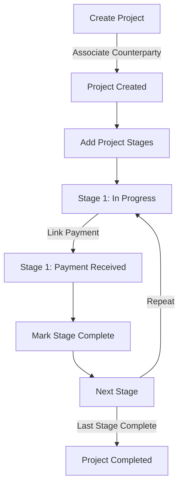
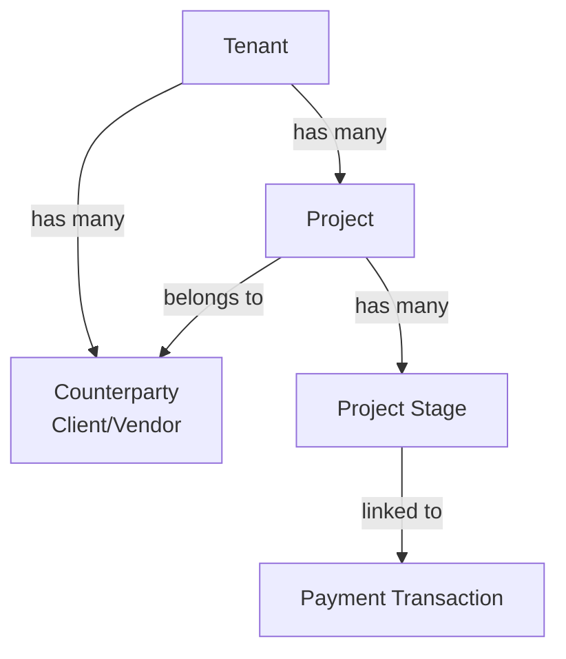

# Business Requirements

## Problem Statement

Organizations need to manage complex business projects that span multiple phases. Each project involves:

- **Client relationships** through counterparties (vendors, customers)
- **Phased delivery** with distinct stages, budgets, and timelines
- **Financial tracking** connecting project stages to actual payments
- **Progress monitoring** through planned vs. actual dates
- **Historical records** for auditing and analysis

Projects are not just tasks—they are comprehensive engagements that span weeks to months, with multiple deliverable phases and associated financial commitments.

## Workflow

### Project Lifecycle

### Stage Management Workflow

## Business Rules

### Project Rules

1. **Unique Naming**: Project names must be unique within a tenant
2. **Required Counterparty**: Every project must be associated with exactly one counterparty
3. **Counterparty Immutability**: Once a counterparty is assigned, it cannot be changed (for audit integrity)
4. **Soft Delete**: Projects are archived, not deleted (historical record preservation)
5. **Tenant Isolation**: Projects are completely isolated by tenant

### Stage Rules

1. **Sequential Numbering**: Stage numbers must be sequential within a project (1, 2, 3, ...)
2. **Unique Stage Numbers**: No duplicate stage numbers within the same project
3. **Budget Required**: Each stage must have a total budget amount (in cents)
4. **Date Constraints**:
   - Start date must be before or equal to planned end date
   - Actual end date should be set when stage is completed
   - Actual end date should be near planned end date (tracked as variance)
5. **Descriptive Content**: Descriptions help track deliverables and scope

### Payment Linking Rules

1. **Unique Links**: Each payment can only be linked to a stage once
2. **Project Integrity**: Payment must be associated with correct project scope
3. **Financial Reconciliation**:
   - Linked payments should not exceed stage budget
   - Total stage payments track progress toward budget
4. **Audit Trail**: All payment linkages are timestamped

## Data Consistency

### Hierarchical Relationships

### Referential Integrity

- **Cascade Delete**: Deleting a project cascades to all stages and payment links
- **Restrict Deletes**: Cannot delete a counterparty if projects exist (enforced by FK)
- **Orphan Prevention**: Stages cannot exist without a parent project

## Business Scenarios

### Scenario 1: Multi-Stage Software Development

**Project**: "Mobile App Development for XYZ Corp"

1. **Stage 1: Discovery & Design** (2 weeks)
   - Budget: 50,000 UZS
   - Link initial payment: 25,000 UZS

2. **Stage 2: Development** (4 weeks)
   - Budget: 100,000 UZS
   - Link progress payments: 50,000 + 50,000 UZS

3. **Stage 3: Testing & Deployment** (1 week)
   - Budget: 25,000 UZS
   - Link final payment: 25,000 UZS

**Total**: 175,000 UZS across 3 stages with specific deliverables and timelines

### Scenario 2: Construction Project with Milestones

**Project**: "Office Building Renovation"

- **Stage 1**: Demolition & Site Prep (Start: Jan 1, Planned End: Jan 31)
- **Stage 2**: Foundation & Framing (Start: Feb 1, Planned End: Mar 15)
- **Stage 3**: Interior & Finishing (Start: Mar 16, Planned End: Apr 30)

Track actual completion dates and compare to planned dates for performance analysis.

### Scenario 3: Consulting Engagement

**Project**: "Business Process Optimization"

- **Stage 1**: Assessment (3 days, Budget: 5,000)
- **Stage 2**: Recommendations (2 days, Budget: 3,000)
- **Stage 3**: Implementation Support (5 days, Budget: 8,000)

Link daily/milestone payments to track consultant engagement and compensation.

## Reporting Requirements

### Project Summary Reports
- Total budget by project
- Total amount paid (linked payments)
- Percentage completion (by budget)
- Timeline variance (planned vs. actual dates)

### Stage-Level Reporting
- Budget utilization per stage
- Payment schedule adherence
- Timeline variance tracking
- Delivery status

### Counterparty Analysis
- Total business value (all projects)
- Avg. project budget and timeline
- Payment history and reliability

## Performance Considerations

### Query Patterns

**Frequent Queries**:
- Find all projects for a tenant (paginated)
- Find all stages for a project
- Find projects for a counterparty
- Find stages with overdue actual completion dates

**Indexes**: Created on `tenant_id`, `counterparty_id`, `project_id`, date fields

### Data Volume

- **Expected Scale**: 1,000s of projects, 10,000s of stages per large tenant
- **Growth**: Primarily driven by number of clients and project frequency
- **Archival**: Old projects remain for historical reporting

## Permission Model

### Project Permissions

- `projects.view.list` - List projects
- `projects.view.detail` - View project details
- `projects.create` - Create new projects
- `projects.edit` - Edit project details
- `projects.delete` - Archive/delete projects
- `projects.stages.manage` - Manage project stages
- `projects.payments.manage` - Link/unlink payments

### Role Assignments

- **Project Manager**: Full project management rights
- **Finance Officer**: Can link payments, view financial impact
- **Accountant**: Read-only access to project financials
- **Tenant Admin**: Full administrative access

## Integration Requirements

### Finance Module Integration

**Counterparty Validation**:
- Projects must reference valid counterparties from finance module
- Counterparty status (active/inactive) should be considered

**Payment Integration**:
- Payment transactions come from Finance module
- Payments linked to stages track project funding
- Enable project-based financial reporting

### Audit & Compliance

- All project modifications logged with user/timestamp
- Payment linkages tracked for financial audit
- Soft delete preserves historical data
- Complete audit trail for compliance reporting

## Success Criteria

1. **Accurate Tracking**: Project budgets and actual payments reconcile
2. **Timeline Management**: Planned vs. actual dates tracked for performance analysis
3. **Financial Clarity**: Clear connection between projects and payments
4. **Audit Ready**: Complete historical record of all changes
5. **Performance**: Queries execute within SLA on large datasets
6. **Security**: Proper tenant isolation and permission enforcement
