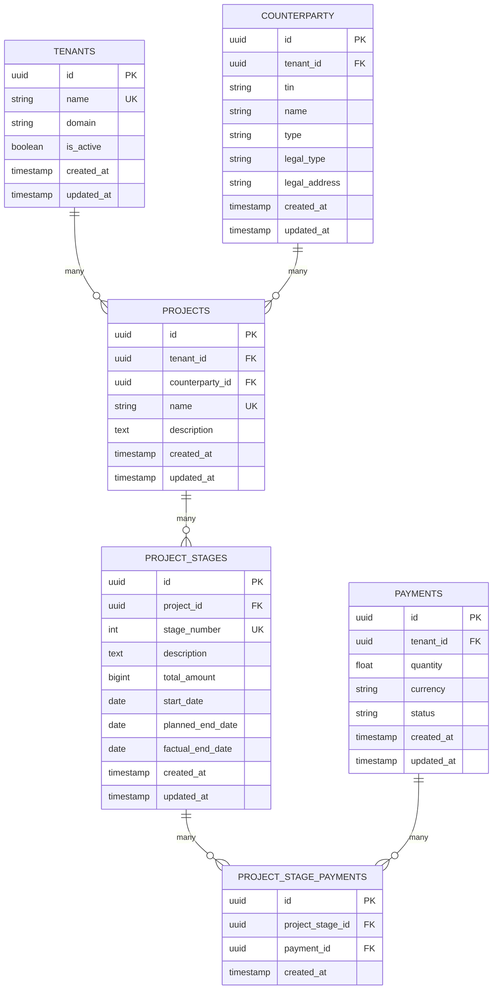

# Data Model

## Entity Relationship Diagram



## Database Schema

### Projects Table

**Purpose**: Store project definitions with client associations

```sql
CREATE TABLE projects (
    id uuid PRIMARY KEY DEFAULT gen_random_uuid(),
    tenant_id uuid NOT NULL REFERENCES tenants(id) ON DELETE CASCADE,
    counterparty_id uuid NOT NULL REFERENCES counterparty(id) ON DELETE RESTRICT,
    name varchar(255) NOT NULL,
    description text,
    created_at timestamp with time zone DEFAULT now(),
    updated_at timestamp with time zone DEFAULT now(),
    UNIQUE(tenant_id, name)
);

CREATE INDEX projects_tenant_id_idx ON projects(tenant_id);
CREATE INDEX projects_counterparty_id_idx ON projects(counterparty_id);
CREATE INDEX projects_name_idx ON projects(name);
```

**Columns**:
- `id` (UUID): Unique project identifier
  - Auto-generated using PostgreSQL's `gen_random_uuid()`
  - Immutable after creation
  - Used in all foreign keys

- `tenant_id` (UUID): Multi-tenant isolation
  - Required (NOT NULL)
  - Foreign key to `tenants` table
  - Cascade delete: Removing tenant removes all projects
  - Indexed for efficient queries

- `counterparty_id` (UUID): Client/vendor reference
  - Required (NOT NULL)
  - Foreign key to `counterparty` table
  - RESTRICT delete: Cannot delete counterparty if projects exist
  - Indexed for efficient lookup by client

- `name` (VARCHAR 255): Project name
  - Required
  - Indexed for search performance
  - Unique constraint with tenant_id (unique per tenant)

- `description` (TEXT): Project details
  - Optional (can be NULL)
  - Supports rich project information

- `created_at` / `updated_at` (TIMESTAMPTZ): Temporal tracking
  - Automatic timestamps
  - Support audit trails and sorting

**Constraints**:
- Primary Key: `id`
- Foreign Keys: `tenant_id`, `counterparty_id`
- Unique: `(tenant_id, name)` - Names unique per tenant
- Indexes: `tenant_id`, `counterparty_id`, `name`

**Query Performance**:
- List all projects: Uses `tenant_id` index
- Find by counterparty: Uses `counterparty_id` index
- Search by name: Uses `name` index

### Project Stages Table

**Purpose**: Track project phases with budgets and timelines

```sql
CREATE TABLE project_stages (
    id uuid PRIMARY KEY DEFAULT gen_random_uuid(),
    project_id uuid NOT NULL REFERENCES projects(id) ON DELETE CASCADE,
    stage_number int NOT NULL,
    description text,
    total_amount bigint NOT NULL,
    start_date date,
    planned_end_date date,
    factual_end_date date,
    created_at timestamp with time zone DEFAULT now(),
    updated_at timestamp with time zone DEFAULT now(),
    UNIQUE(project_id, stage_number)
);

CREATE INDEX project_stages_project_id_idx ON project_stages(project_id);
CREATE INDEX project_stages_stage_number_idx ON project_stages(stage_number);
CREATE INDEX project_stages_start_date_idx ON project_stages(start_date);
CREATE INDEX project_stages_planned_end_date_idx ON project_stages(planned_end_date);
CREATE INDEX project_stages_factual_end_date_idx ON project_stages(factual_end_date);
```

**Columns**:
- `id` (UUID): Unique stage identifier
  - Auto-generated
  - Immutable

- `project_id` (UUID): Parent project reference
  - Required (NOT NULL)
  - Foreign key to `projects` table
  - Cascade delete: Removing project removes all stages

- `stage_number` (INT): Sequential order
  - Required
  - Must be sequential within project (1, 2, 3...)
  - Combined with `project_id` for uniqueness
  - Indexed for efficient ordering

- `description` (TEXT): Stage deliverables and scope
  - Optional
  - Documents what's included in this phase

- `total_amount` (BIGINT): Budget in cents
  - Required
  - Stored as cents (not decimal) for precision
  - Max value: ~9.22 quintillion cents (~$92M)
  - Used for financial reconciliation

- `start_date` (DATE): Planned start date
  - Optional
  - Date only (no time component)
  - Index for timeline queries

- `planned_end_date` (DATE): Expected completion
  - Optional
  - Used for schedule variance calculation
  - Index for timeline queries

- `factual_end_date` (DATE): Actual completion
  - Optional
  - Set when stage completes
  - Index for past project queries

- `created_at` / `updated_at` (TIMESTAMPTZ): Temporal tracking
  - Automatic timestamps

**Constraints**:
- Primary Key: `id`
- Foreign Key: `project_id` (cascade)
- Unique: `(project_id, stage_number)`
- Indexes: `project_id`, `stage_number`, date fields

**Query Performance**:
- List stages by project: Uses `project_id` index
- Find overdue stages: Uses `planned_end_date` index
- Sort by sequence: Uses `stage_number` index

### Project Stage Payments Table

**Purpose**: Link payments to project stages for financial tracking

```sql
CREATE TABLE project_stage_payments (
    id uuid PRIMARY KEY DEFAULT gen_random_uuid(),
    project_stage_id uuid NOT NULL REFERENCES project_stages(id) ON DELETE CASCADE,
    payment_id uuid NOT NULL REFERENCES payments(id) ON DELETE CASCADE,
    created_at timestamp with time zone DEFAULT now(),
    UNIQUE(project_stage_id, payment_id)
);

CREATE INDEX project_stage_payments_project_stage_id_idx ON project_stage_payments(project_stage_id);
CREATE INDEX project_stage_payments_payment_id_idx ON project_stage_payments(payment_id);
```

**Columns**:
- `id` (UUID): Unique link identifier
  - Auto-generated
  - Immutable

- `project_stage_id` (UUID): Stage reference
  - Required (NOT NULL)
  - Foreign key to `project_stages` table
  - Cascade delete: Removing stage removes payment links

- `payment_id` (UUID): Payment reference
  - Required (NOT NULL)
  - Foreign key to `payments` table
  - Cascade delete: Removing payment removes link

- `created_at` (TIMESTAMPTZ): Link timestamp
  - Automatic timestamp
  - Used for audit trail

**Constraints**:
- Primary Key: `id`
- Foreign Keys: `project_stage_id`, `payment_id` (cascade)
- Unique: `(project_stage_id, payment_id)` - Cannot link same payment twice
- Indexes: `project_stage_id`, `payment_id`

**Query Performance**:
- Find payments for stage: Uses `project_stage_id` index
- Find which stage payment belongs to: Uses `payment_id` index

## Data Type Decisions

### UUID vs. SERIAL

**Decision**: Use UUID for project IDs

**Rationale**:
- Distributed system ready (no central sequence)
- Secure (not sequential/guessable)
- Multi-tenant boundaries (can create offline)
- Industry standard for modern systems

**Exception**: Counterparty IDs use SERIAL (existing Finance module standard)

### BIGINT for Amounts

**Decision**: Store amounts in cents as BIGINT

**Examples**:
- 100 UZS = 100 cents = `100` (BIGINT)
- 1,234.56 UZS = 123,456 cents = `123456` (BIGINT)
- 1 UZS = 100 cents = `100` (BIGINT)

**Rationale**:
- Eliminates floating-point precision issues
- Integer arithmetic is exact
- Database native (no type conversion)
- SQL SUM/AVG work correctly

### DATE vs. TIMESTAMPTZ

**Decision**: Use DATE for stage dates, TIMESTAMPTZ for audit timestamps

**Reasoning**:
- Stage dates are calendar dates (no time component)
- Audit timestamps need timezone awareness
- Separate concerns: schedule vs. system events

## Relationships

### Projects → Counterparty (Many-to-One)

- Multiple projects can reference the same counterparty
- Counterparty cannot be deleted if projects exist (RESTRICT)
- Used for client-based reporting and analysis

### Projects → Stages (One-to-Many)

- Each project has 1+ stages
- Stages cascade delete with project
- Total project budget = sum of stage budgets

### Stages → Payments (Many-to-Many)

- Via `project_stage_payments` junction table
- Stage can have multiple payments
- Payment can be linked to multiple stages (though typically one)
- Each link is unique (no duplicate links)

## Data Integrity

### Cascade Behavior

```
DELETE TENANT
  ↓
DELETE PROJECTS (cascade)
  ↓
DELETE PROJECT_STAGES (cascade)
  ↓
DELETE PROJECT_STAGE_PAYMENTS (cascade)
```

### Restrict Behavior

```
DELETE COUNTERPARTY
  ↗
BLOCKED IF projects.counterparty_id = counterparty.id
```

### Unique Constraints

1. **Project Names**: `(tenant_id, name)` unique
   - Prevents duplicate project names per tenant
   - Different tenants can have same project name

2. **Stage Numbers**: `(project_id, stage_number)` unique
   - Ensures sequential numbering per project
   - Supports "Stage 1, Stage 2" semantics

3. **Payment Links**: `(project_stage_id, payment_id)` unique
   - Prevents duplicate payment linkages
   - Each payment linked once per stage

## Indexing Strategy

### Primary Indexes (High Priority)

```sql
-- Tenant isolation (required for every query)
CREATE INDEX projects_tenant_id_idx ON projects(tenant_id);
CREATE INDEX project_stages_project_id_idx ON project_stages(project_id);

-- Foreign key lookups
CREATE INDEX projects_counterparty_id_idx ON projects(counterparty_id);
CREATE INDEX project_stage_payments_project_stage_id_idx ON project_stage_payments(project_stage_id);
CREATE INDEX project_stage_payments_payment_id_idx ON project_stage_payments(payment_id);
```

### Secondary Indexes (Performance)

```sql
-- Search and sorting
CREATE INDEX projects_name_idx ON projects(name);
CREATE INDEX project_stages_stage_number_idx ON project_stages(stage_number);

-- Timeline queries
CREATE INDEX project_stages_start_date_idx ON project_stages(start_date);
CREATE INDEX project_stages_planned_end_date_idx ON project_stages(planned_end_date);
CREATE INDEX project_stages_factual_end_date_idx ON project_stages(factual_end_date);
```

## Storage Estimates

### Typical Record Sizes

**Project**: ~200 bytes
- id: 16 bytes
- tenant_id: 16 bytes
- counterparty_id: 16 bytes
- name: ~50 bytes
- description: ~100 bytes
- timestamps: 32 bytes

**Project Stage**: ~100 bytes
- id: 16 bytes
- project_id: 16 bytes
- stage_number: 4 bytes
- amounts, dates: ~40 bytes
- timestamps: 16 bytes

**Project Stage Payment**: ~50 bytes
- id: 16 bytes
- Foreign keys: 32 bytes
- timestamp: 8 bytes

### Growth Projections

| Metric | 100 Orgs | 1,000 Orgs | 10,000 Orgs |
|--------|----------|-----------|------------|
| Projects | 10,000 | 100,000 | 1,000,000 |
| Stages | 50,000 | 500,000 | 5,000,000 |
| Payments | 100,000 | 1,000,000 | 10,000,000 |
| **Total Size** | **~30 MB** | **~300 MB** | **~3 GB** |

With indexing: ~4-5x the base size (~150 MB - 15 GB)

## Migration Reference

See `migrations/changes-1753010420.sql` for schema creation:
- Creates all three tables
- Establishes foreign keys
- Creates performance indexes
- Includes up/down migration pairs
