# Architecture Specification: Applet System

**Status:** Draft

## Architecture Overview

The Applet System consists of three major components:

1. **Applet Host** - Go-based runtime that loads and executes applets
2. **Applet Package** - Bundled TypeScript/React code + manifest
3. **SDK Integration Points** - Routes, events, database, UI slots

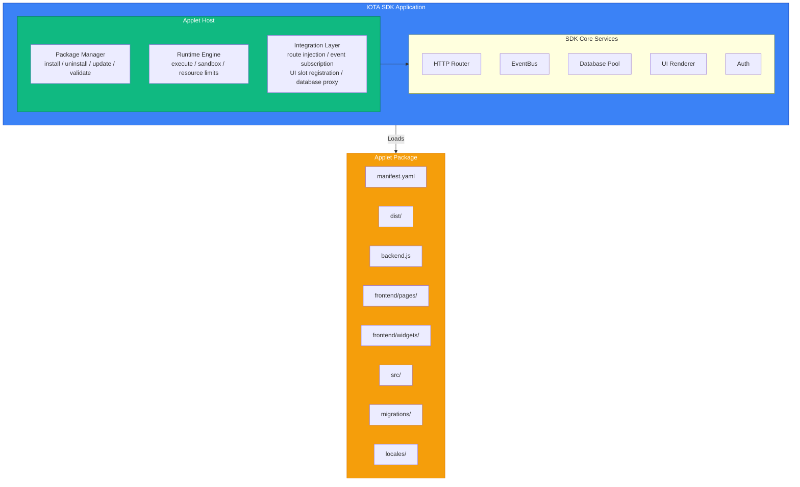

## Architecture Options

### Option A: Embedded Runtime (Goja)

**Description:** JavaScript executed within Go process using Goja VM

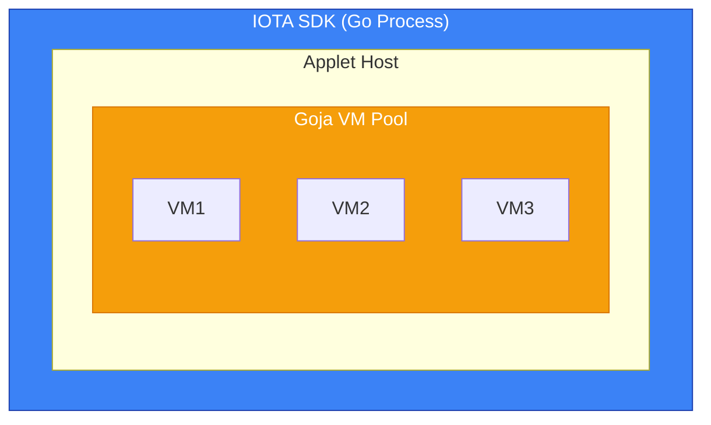

| Aspect | Details |
|--------|---------|
| **Pros** | No external dependencies, direct Go interop, memory safety via Go GC, single binary deployment |
| **Cons** | Limited ES6+ support, no async/await natively, slower than V8/Bun, no native React SSR |
| **Best For** | Simple handlers, scripts, automation |

### Option B: Standalone Runtime (Bun)

**Description:** JavaScript executed in separate Bun process, communicating via IPC/HTTP

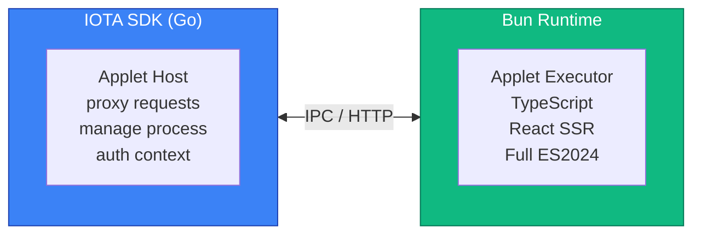

| Aspect | Details |
|--------|---------|
| **Pros** | Full TypeScript/ES2024, native React SSR, fast execution, rich npm ecosystem |
| **Cons** | External process management, IPC overhead, deployment complexity |
| **Best For** | Complex applets, React-based UIs, heavy computation |

### Option C: Sidecar Runtime (Deno/Node)

Similar to Bun but using Deno or Node.js as the runtime.

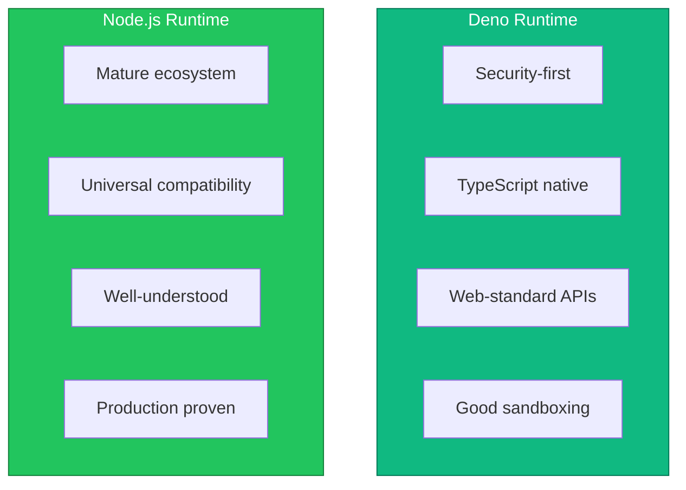

### Option D: Hybrid Architecture (Recommended)

**Description:** Use embedded runtime for simple handlers, sidecar for complex applets

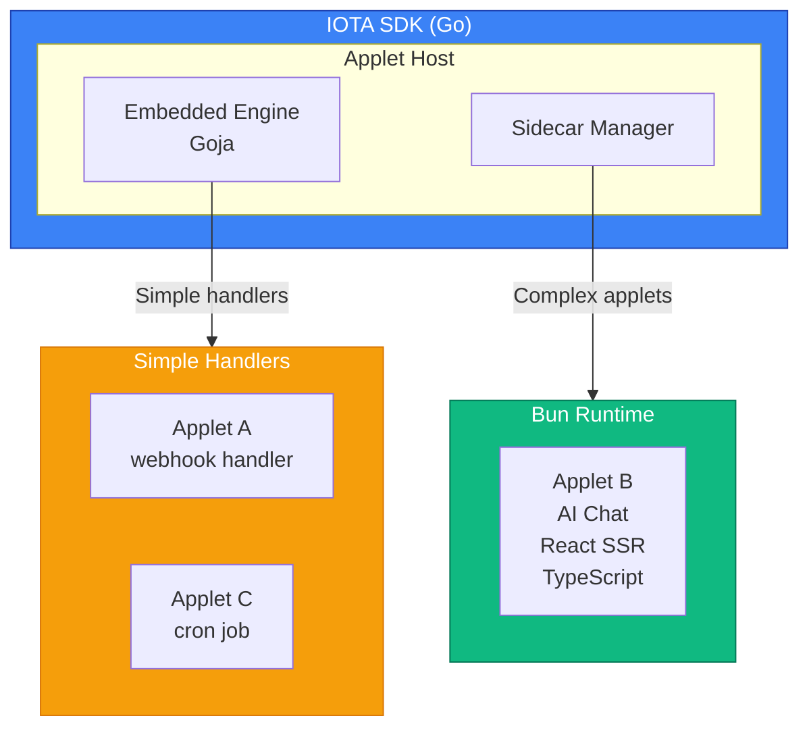

| Aspect | Details |
|--------|---------|
| **Pros** | Best of both worlds, efficient for simple cases, powerful for complex cases |
| **Cons** | Two systems to maintain, decision complexity for developers |
| **Best For** | Production systems with varied applet complexity |

## Recommended Architecture

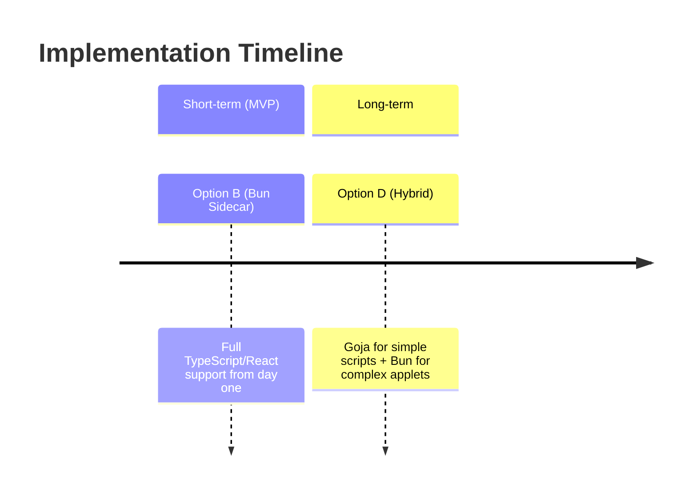

## Component Design

### Package Manager

Responsible for applet lifecycle:

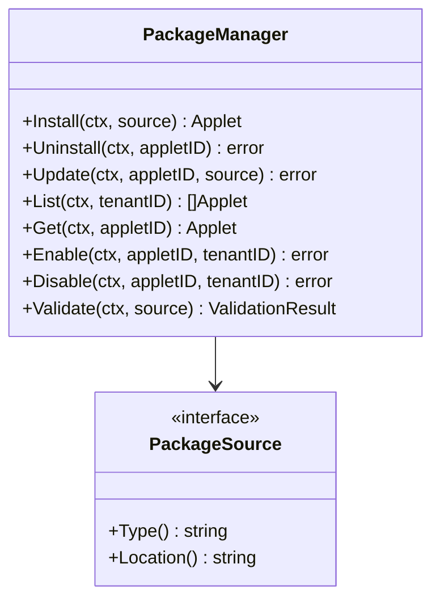

### Runtime Engine

Executes applet code:

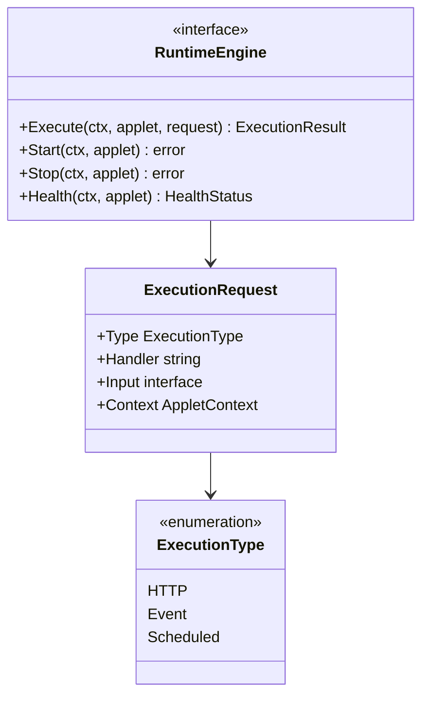

### Integration Layer

Bridges applets with SDK:

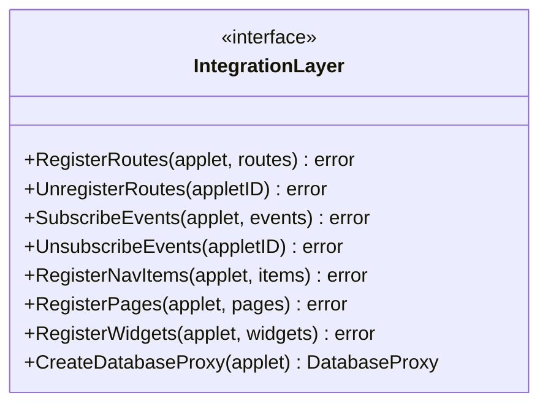

## Communication Protocol (for Sidecar)

### Protocol Comparison

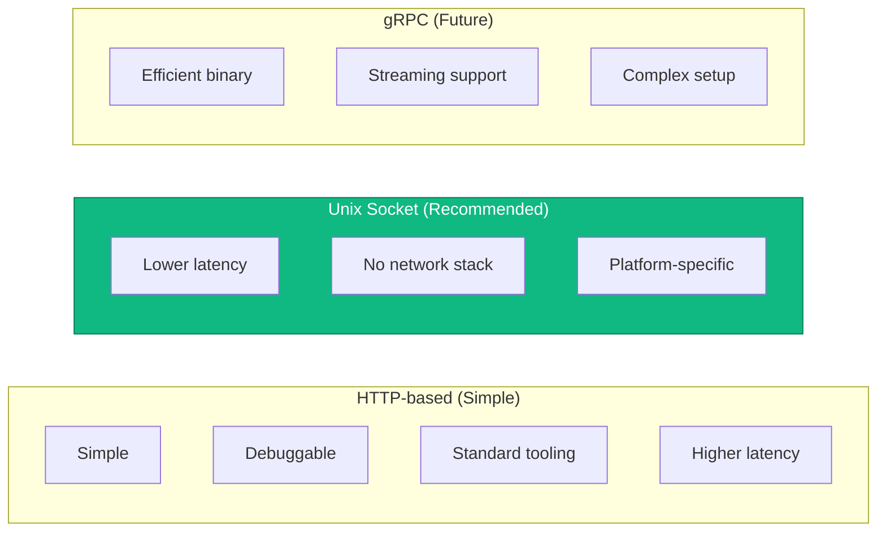

### Message Flow

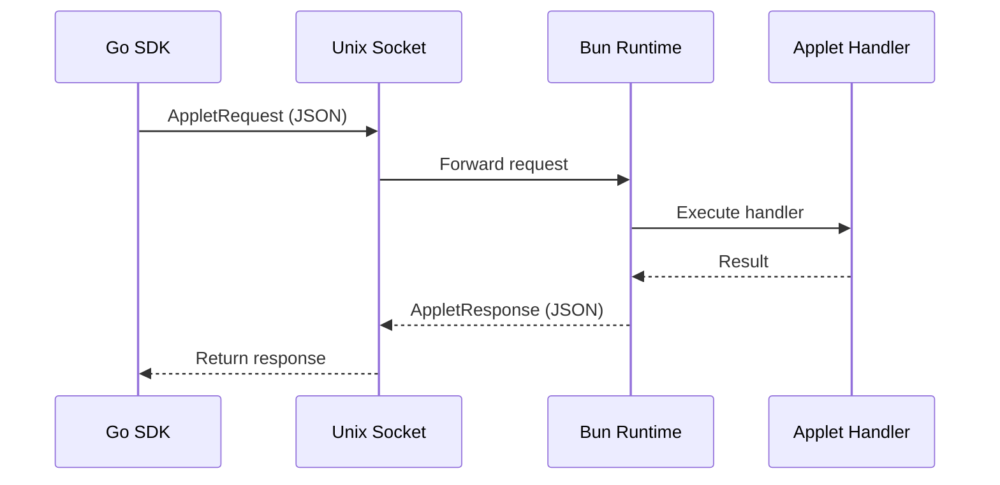

### Message Format

```typescript
interface AppletRequest {
  id: string;              // Request correlation ID
  type: 'http' | 'event' | 'scheduled' | 'render';
  handler: string;         // Handler path
  context: {
    tenantId: string;
    userId?: number;
    permissions: string[];
    locale: string;
  };
  payload: {
    method?: string;
    path?: string;
    headers?: Record<string, string>;
    body?: unknown;
  };
}

interface AppletResponse {
  id: string;
  status: 'success' | 'error';
  data?: { statusCode?: number; body?: unknown; };
  error?: { code: string; message: string; };
}
```

## Security Boundaries

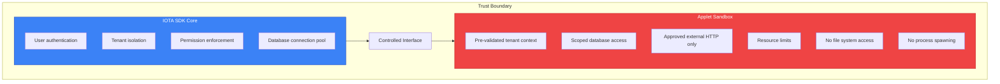

## Error Handling

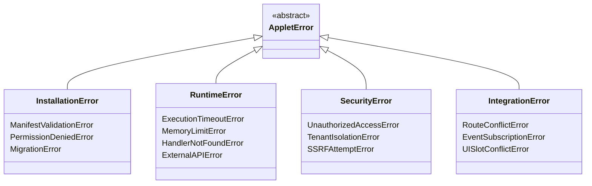

## Monitoring & Observability

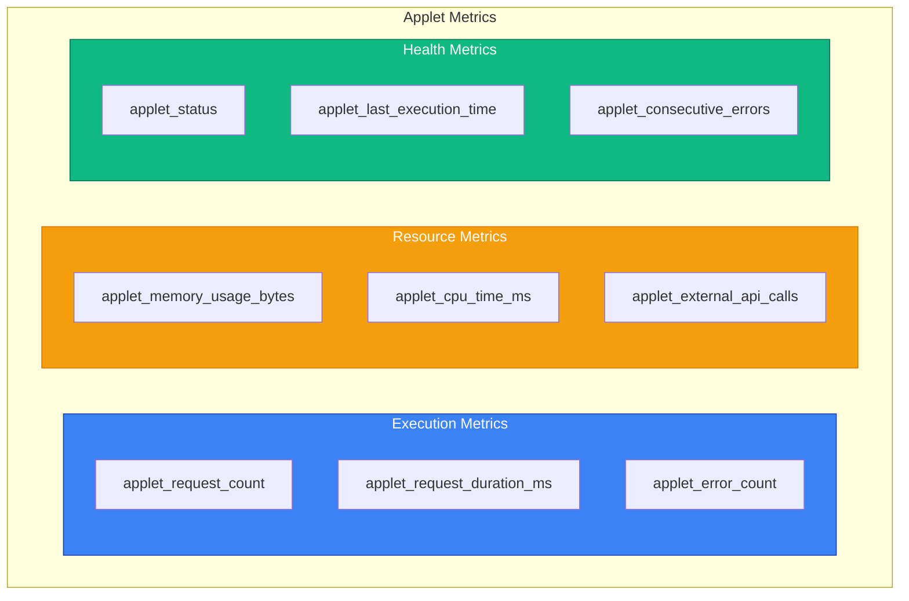

---

## Next Steps

- Review [Runtime Options](./runtime-options.md) for detailed runtime comparison
- See [Permissions](./permissions.md) for security model details
- Check [Distribution](./distribution.md) for packaging and deployment
