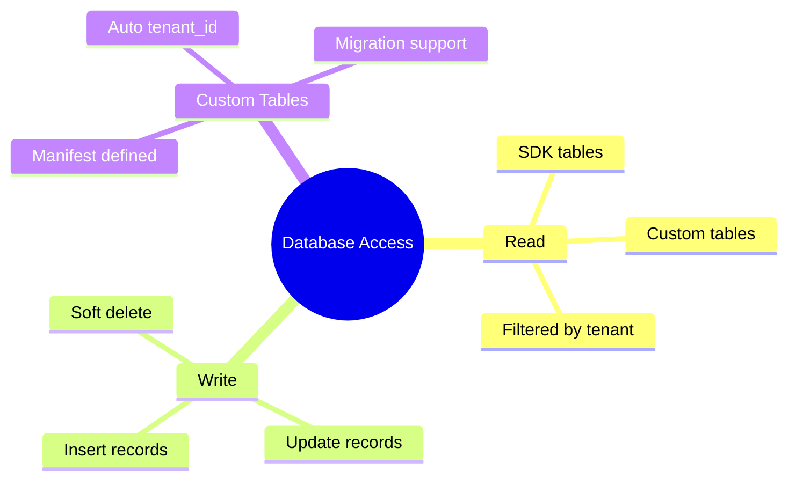
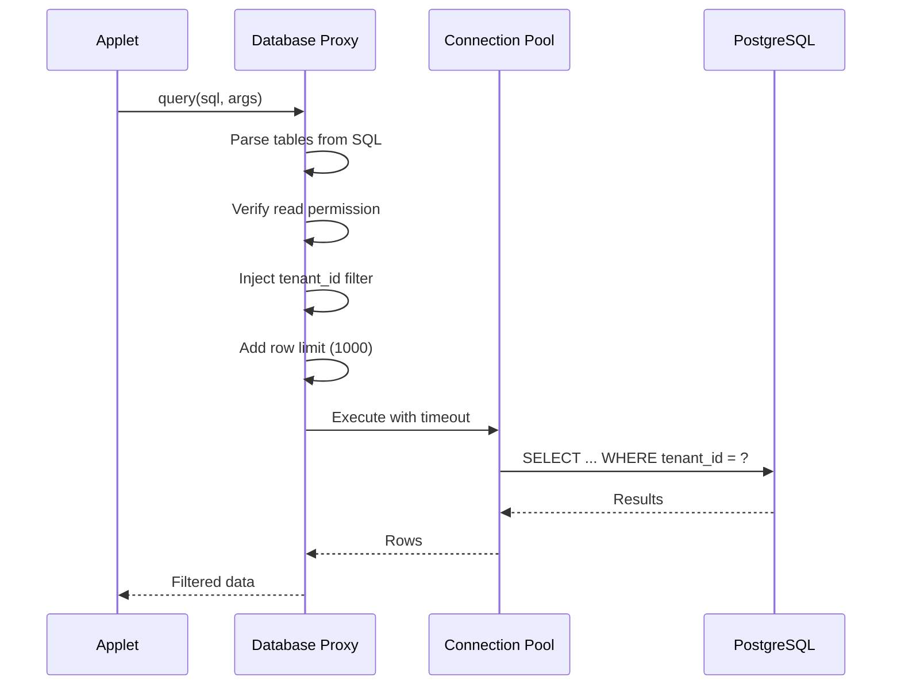
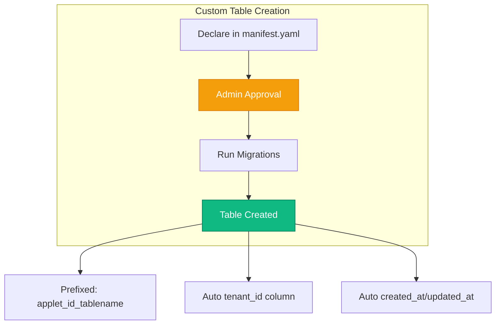
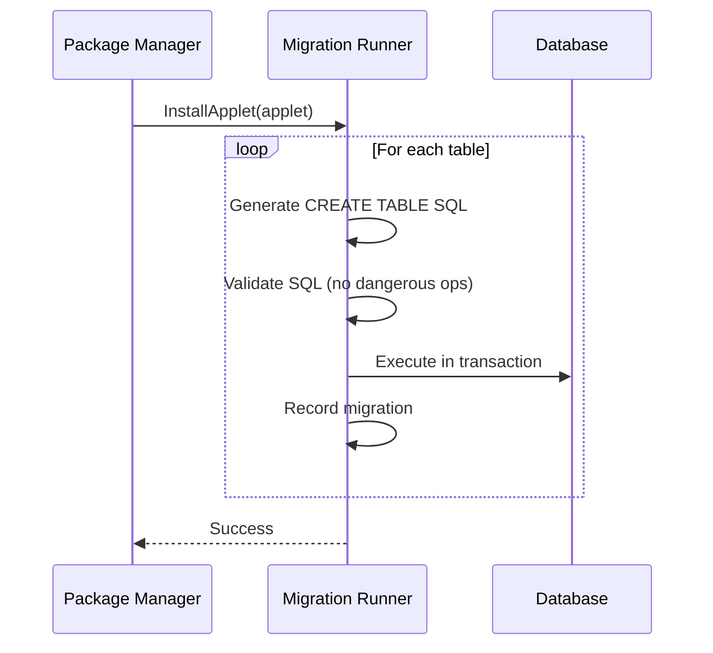
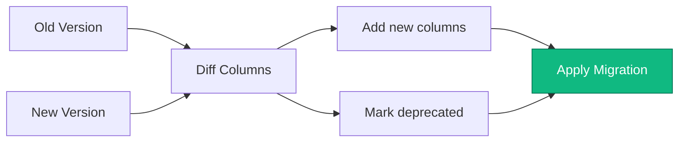
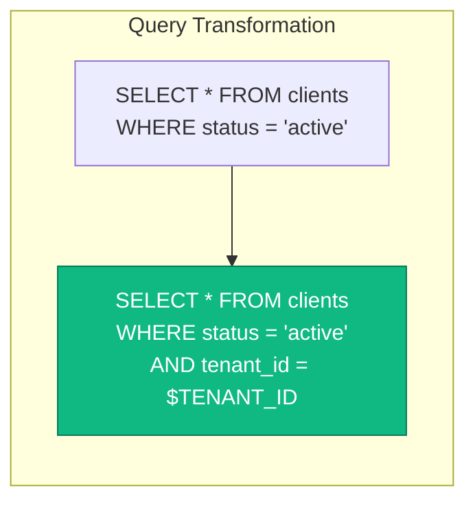
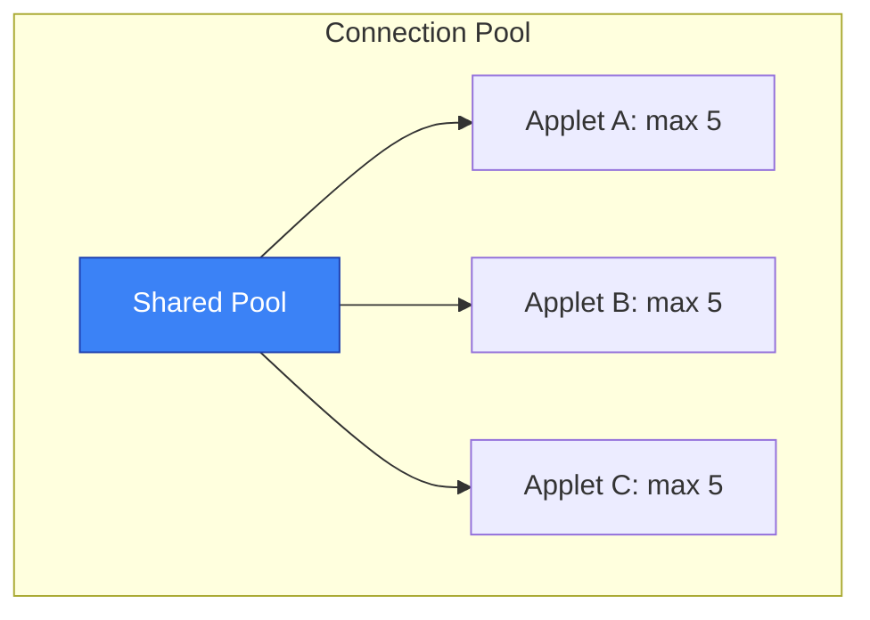
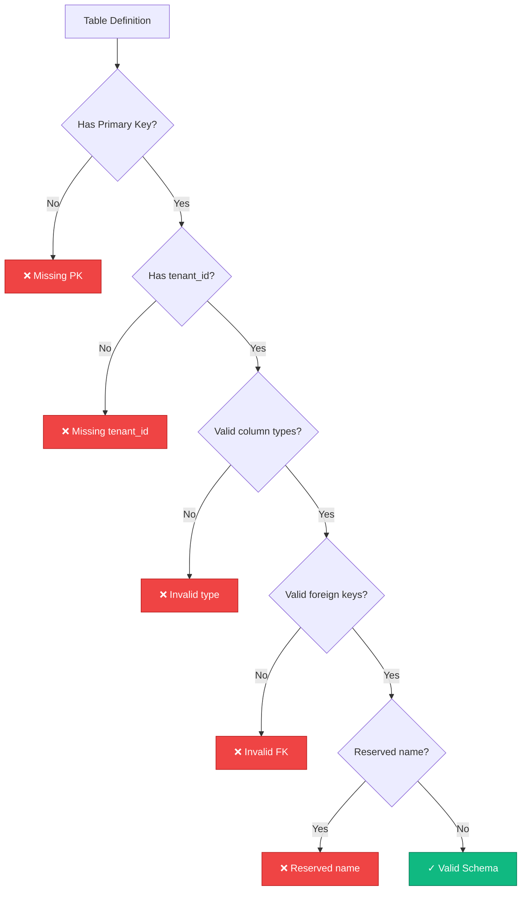

# Database Access Specification

**Status:** Draft

## Overview

Applets need controlled access to the SDK database for:



All access must maintain tenant isolation and security boundaries.

## Access Patterns

### 1. Read Access to SDK Tables



Applets can request read access to specific SDK tables:

```yaml
permissions:
  database:
    read:
      - users          # Core users table
      - clients        # CRM clients
      - chats          # CRM chats
      - chat_messages  # CRM messages
```

**Implementation:**

```typescript
// Applet code
const clients = await sdk.db.query(`
  SELECT id, first_name, last_name, phone
  FROM clients
  WHERE created_at > $1
  ORDER BY created_at DESC
  LIMIT 100
`, [lastSyncDate]);
```

**Under the Hood:**

```go
func (proxy *DatabaseProxy) Query(ctx context.Context, sql string, args ...interface{}) ([]Row, error) {
    // 1. Parse SQL to extract tables
    tables := parseTables(sql)

    // 2. Verify read permission for each table
    for _, table := range tables {
        if !proxy.permissions.CanRead(table) {
            return nil, ErrTableNotAllowed{Table: table, Operation: "read"}
        }
    }

    // 3. Inject tenant_id filter (CRITICAL)
    tenantID := composables.UseTenantID(ctx)
    sql = injectTenantFilter(sql, tenantID)

    // 4. Add safety limits
    sql = addRowLimit(sql, 1000)     // Max rows
    sql = addTimeout(sql, 5000)       // 5 second timeout

    // 5. Execute
    return proxy.pool.Query(ctx, sql, args...)
}
```

### 2. Write Access to SDK Tables

More restricted than read access:

```yaml
permissions:
  database:
    write:
      - clients        # Can create/update clients
      - chats          # Can create/update chats
      - chat_messages  # Can create messages
```

| Operation | Allowed | Notes |
|-----------|---------|-------|
| INSERT | ✓ | tenant_id auto-injected |
| UPDATE | ✓ | Only own tenant's records |
| Soft DELETE | ✓ | If table supports it |
| Hard DELETE | ✗ | Requires explicit permission |
| Modify system columns | ✗ | id, tenant_id, created_at blocked |

**Implementation:**

```typescript
// Applet code - creating a chat message
const message = await sdk.db.insert('chat_messages', {
  chat_id: chatId,
  content: aiResponse,
  sender_type: 'ai',
  // tenant_id is automatically injected
});
```

### 3. Custom Applet Tables



Applets can declare custom tables in their manifest:

```yaml
permissions:
  database:
    createTables: true  # Requires admin approval

tables:
  - name: "ai_chat_configs"
    description: "AI chat configuration per tenant"
    columns:
      - name: id
        type: bigserial
        primary: true
      - name: tenant_id
        type: uuid
        required: true
        index: true
        foreignKey:
          table: tenants
          column: id
          onDelete: CASCADE
      - name: model_name
        type: varchar(100)
        default: "gpt-4"
      - name: system_prompt
        type: text
        nullable: true
      - name: temperature
        type: decimal(3,2)
        default: 0.7
      - name: created_at
        type: timestamptz
        default: now()
      - name: updated_at
        type: timestamptz
        default: now()
    indexes:
      - columns: [tenant_id]
        unique: true
```

**Table Naming Convention:**

All applet tables are prefixed to prevent collisions:

```
applet_{applet_id}_{table_name}

Example: applet_ai_chat_ai_chat_configs
```

## Migration Strategy

### Installation Migration



### Schema Updates



### Uninstallation Options

| Option | Description |
|--------|-------------|
| **Soft Delete** | Rename tables with `_deleted_` prefix, keep for 30 days |
| **Hard Delete** | `DROP TABLE IF EXISTS` immediately |
| **Export & Delete** | Export to JSON/CSV, then drop |

## Query Builder API

Instead of raw SQL, applets can use a query builder:

```typescript
// Safe query builder
const clients = await sdk.db.table('clients')
  .select('id', 'first_name', 'last_name', 'phone')
  .where('created_at', '>', lastSyncDate)
  .orderBy('created_at', 'desc')
  .limit(100)
  .get();

// With joins (if permitted)
const messages = await sdk.db.table('chat_messages')
  .join('chats', 'chat_messages.chat_id', '=', 'chats.id')
  .select('chat_messages.*', 'chats.client_id')
  .where('chat_messages.created_at', '>', yesterday)
  .get();

// Inserts
const newMessage = await sdk.db.table('chat_messages')
  .insert({
    chat_id: chatId,
    content: 'Hello!',
    sender_type: 'ai',
  });

// Updates
await sdk.db.table('clients')
  .where('id', clientId)
  .update({
    last_contacted_at: new Date(),
  });
```

## Tenant Isolation Enforcement

### Automatic Filtering



**Implementation Strategies:**

| Strategy | Description |
|----------|-------------|
| **SQL Rewriting** | Parse SQL AST, inject tenant_id conditions |
| **Row-Level Security** | Use PostgreSQL RLS policies |

### Cross-Tenant Prevention

Queries that could access other tenants are blocked:

```go
func validateQuery(sql string) error {
    // Block UNION that could bypass filters
    if containsUnion(sql) {
        return ErrUnionNotAllowed
    }

    // Block subqueries without tenant filter
    if hasUnfilteredSubquery(sql) {
        return ErrSubqueryMustBeFiltered
    }

    // Block direct tenant_id manipulation
    if modifiesTenantID(sql) {
        return ErrCannotModifyTenantID
    }

    return nil
}
```

## Performance Safeguards

### Query Limits

```go
type QueryLimits struct {
    MaxRows           int           // 1000 default
    MaxExecutionTime  time.Duration // 5 seconds default
    MaxJoins          int           // 3 default
    MaxSubqueries     int           // 2 default
}
```

### Connection Pooling



### Query Caching

```go
// Read queries can be cached
type QueryCache struct {
    cache    *redis.Client
    ttl      time.Duration
    maxSize  int
}

func (c *QueryCache) Get(ctx context.Context, sql string, args []interface{}) ([]Row, bool) {
    key := hashQuery(sql, args, composables.UseTenantID(ctx))
    // Cache key includes tenant_id for isolation
}
```

## Audit Logging

All database operations are logged:

```go
type DatabaseAuditLog struct {
    ID          uuid.UUID
    Timestamp   time.Time
    AppletID    string
    TenantID    uuid.UUID
    UserID      *uint
    Operation   string    // SELECT, INSERT, UPDATE, DELETE
    Table       string
    SQL         string    // Sanitized (no sensitive data)
    RowCount    int
    DurationMs  int
    Success     bool
    Error       *string
}
```

## Data Types Mapping

| Manifest Type | PostgreSQL Type | TypeScript Type |
|---------------|-----------------|-----------------|
| `bigserial` | `BIGSERIAL` | `number` |
| `serial` | `SERIAL` | `number` |
| `uuid` | `UUID` | `string` |
| `varchar(n)` | `VARCHAR(n)` | `string` |
| `text` | `TEXT` | `string` |
| `integer` | `INTEGER` | `number` |
| `bigint` | `BIGINT` | `number` |
| `decimal(p,s)` | `DECIMAL(p,s)` | `number` |
| `boolean` | `BOOLEAN` | `boolean` |
| `timestamptz` | `TIMESTAMPTZ` | `Date` |
| `date` | `DATE` | `string` |
| `jsonb` | `JSONB` | `Record<string, any>` |
| `bytea` | `BYTEA` | `Uint8Array` |

## Schema Validation



---

## Next Steps

- Review [Distribution](./distribution.md) for packaging
- See [Permissions](./permissions.md) for security model
- Check [Architecture](./architecture.md) for system design
