# Distribution Specification: Packaging, Registry, and Installation

**Status:** Draft

## Overview

This document covers how applets are:


## Package Format

### Applet Package Structure


### Manifest Requirements

```yaml
# manifest.yaml - Required fields
manifestVersion: "1.0"
id: "ai-website-chat"           # Unique identifier
version: "1.0.0"                # Semantic version
name:
  en: "AI Website Chat"
runtime:
  engine: "bun"
  entrypoint: "dist/backend/server.js"
```

### Build Process


**Build Pipeline:**

```typescript
// build.config.ts
import { defineConfig } from '@iota/applet-cli';

export default defineConfig({
  backend: {
    entrypoint: 'src/backend/server.ts',
    target: 'bun',
    minify: true,
  },
  frontend: {
    framework: 'react',
    entrypoints: {
      pages: 'src/frontend/pages/**/*.tsx',
      widgets: 'src/frontend/widgets/**/*.tsx',
    },
    splitting: true,
    minify: true,
  },
  locales: {
    source: 'src/locales',
    languages: ['en', 'ru', 'uz'],
  },
});
```

### Checksums & Integrity

```mermaid
flowchart TB
    PKG[Package Files] --> HASH[SHA-256 Hash]
    HASH --> CHECKSUMS[checksums.json]

    subgraph "Verification"
        CHECKSUMS --> COMPARE{Compare Hashes}
        COMPARE -->|Match| PASS[✓ Integrity Verified]
        COMPARE -->|Mismatch| FAIL[✗ Corrupted/Tampered]
    end

    style PASS fill:#10b981,stroke:#047857,color:#fff
    style FAIL fill:#ef4444,stroke:#b91c1c,color:#fff
```



```json
// checksums.json
{
  "algorithm": "sha256",
  "files": {
    "manifest.yaml": "a1b2c3d4...",
    "dist/backend/server.js": "e5f6g7h8...",
    "dist/frontend/pages/config.js": "i9j0k1l2...",
    "locales/en.json": "m3n4o5p6..."
  }
}
```

**Verification:**

```go
func verifyPackageIntegrity(pkg *Package) error {
    checksums, err := parseChecksums(pkg.GetFile("checksums.json"))
    if err != nil {
        return err
    }

    for file, expectedHash := range checksums.Files {
        content := pkg.GetFile(file)
        actualHash := sha256.Sum256(content)

        if hex.EncodeToString(actualHash[:]) != expectedHash {
            return ErrChecksumMismatch{File: file}
        }
    }

    return nil
}
```

## Registry Architecture

### Registry Types


| Registry Type | Description | Use Case |
|---------------|-------------|----------|
| **Official** | Curated, verified, signed | Public applets |
| **Private** | Organization-specific | Internal tools |
| **Local** | Direct upload | Development, air-gapped |

### Registry API

```yaml
# OpenAPI specification for registry
openapi: 3.0.0
info:
  title: IOTA Applet Registry
  version: 1.0.0

paths:
  /api/v1/applets:
    get:
      summary: List applets
      parameters:
        - name: q
          in: query
          description: Search query
        - name: category
          in: query
        - name: page
          in: query
        - name: limit
          in: query

  /api/v1/applets/{id}:
    get:
      summary: Get applet details

  /api/v1/applets/{id}/versions:
    get:
      summary: List versions
    post:
      summary: Publish new version

  /api/v1/applets/{id}/versions/{version}/download:
    get:
      summary: Download package
```

### Publishing Flow


**CLI Publishing:**

```bash
# Login to registry
iota-applet login

# Publish to official registry
iota-applet publish

# Publish to private registry
iota-applet publish --registry https://private.registry.io

# Publish with signing
iota-applet publish --sign --key ~/.iota/signing-key.pem
```

## Installation Flow

### Discovery UI

```mermaid
graph TB
    subgraph "Admin Panel > Applets > Browse"
        SEARCH[Search applets...]
        FILTERS[Category / Sort]

        subgraph "Results"
            A1[🤖 AI Chat<br/>★★★★☆ 4.5<br/>1.2K installs]
            A2[📊 Analytics<br/>★★★★★ 5.0<br/>5.6K installs]
            A3[📦 Inventory<br/>★★★☆☆ 3.2<br/>890 installs]
        end

        A1 --> I1[Install]
        A2 --> I2[Install]
        A3 --> I3[Install]
    end

    style A1 fill:#3b82f6,stroke:#1e40af,color:#fff
    style A2 fill:#10b981,stroke:#047857,color:#fff
    style A3 fill:#f59e0b,stroke:#d97706,color:#fff
```



### Installation Steps


### Installation API

```go
type InstallationManager struct {
    registry      RegistryClient
    storage       PackageStorage
    migrator      MigrationRunner
    runtimeMgr    RuntimeManager
    permissionMgr PermissionManager
}

func (m *InstallationManager) Install(ctx context.Context, req InstallRequest) error {
    // 1. Download package
    pkg, err := m.registry.Download(req.AppletID, req.Version)
    if err != nil {
        return fmt.Errorf("download failed: %w", err)
    }

    // 2. Verify integrity
    if err := verifyPackageIntegrity(pkg); err != nil {
        return fmt.Errorf("integrity check failed: %w", err)
    }

    // 3. Parse manifest
    manifest, err := parseManifest(pkg.GetFile("manifest.yaml"))
    if err != nil {
        return fmt.Errorf("invalid manifest: %w", err)
    }

    // 4. Check permissions are approved
    if !req.PermissionsApproved {
        return ErrPermissionsNotApproved
    }

    // 5. Store package
    if err := m.storage.Store(manifest.ID, manifest.Version, pkg); err != nil {
        return fmt.Errorf("storage failed: %w", err)
    }

    // 6. Run migrations
    if err := m.migrator.InstallApplet(manifest); err != nil {
        m.storage.Remove(manifest.ID, manifest.Version)
        return fmt.Errorf("migration failed: %w", err)
    }

    // 7. Initialize runtime
    if err := m.runtimeMgr.InitializeApplet(manifest); err != nil {
        m.migrator.RollbackApplet(manifest)
        m.storage.Remove(manifest.ID, manifest.Version)
        return fmt.Errorf("runtime init failed: %w", err)
    }

    // 8. Register permissions
    if err := m.permissionMgr.RegisterAppletPermissions(manifest); err != nil {
        return fmt.Errorf("permission registration failed: %w", err)
    }

    // 9. Run onInstall hook
    if manifest.Lifecycle.OnInstall != "" {
        if err := m.runtimeMgr.Execute(ctx, manifest.ID, manifest.Lifecycle.OnInstall); err != nil {
            log.Warn("onInstall hook failed", "error", err)
        }
    }

    return nil
}
```

## Update Flow

### Update Detection


### Update Process

```mermaid
flowchart TB
    START[Update Available] --> DOWNLOAD[1. Download new version]
    DOWNLOAD --> COMPARE[2. Compare permissions]

    COMPARE --> NEW{New permissions?}
    NEW -->|Yes| APPROVAL[Require approval]
    NEW -->|No| CONTINUE[Continue]
    APPROVAL --> CONTINUE

    CONTINUE --> OLD_HOOK[3. Run onUpdate OLD version]
    OLD_HOOK --> STOP[4. Stop running instance]
    STOP --> GRACEFUL[Graceful shutdown]

    GRACEFUL --> MIGRATE[5. Run migrations]
    MIGRATE --> SCHEMA[Apply schema changes]

    SCHEMA --> REPLACE[6. Replace package files]
    REPLACE --> ATOMIC[Atomic swap]

    ATOMIC --> START_NEW[7. Start new version]
    START_NEW --> INIT[Initialize runtime]

    INIT --> NEW_HOOK[8. Run onUpdate NEW version]
    NEW_HOOK --> COMPLETE[Update Complete ✓]

    style START fill:#f59e0b,stroke:#d97706,color:#fff
    style COMPLETE fill:#10b981,stroke:#047857,color:#fff
```



**Rollback Support:**

```go
func (m *InstallationManager) Update(ctx context.Context, appletID string, newVersion string) error {
    // Get current version for rollback
    current, err := m.storage.GetInstalled(appletID)
    if err != nil {
        return err
    }

    // Create rollback point
    rollback := m.createRollbackPoint(current)

    // Attempt update
    err = m.performUpdate(ctx, appletID, newVersion)
    if err != nil {
        // Rollback on failure
        if rollbackErr := m.rollback(rollback); rollbackErr != nil {
            return fmt.Errorf("update failed: %w, rollback failed: %v", err, rollbackErr)
        }
        return fmt.Errorf("update failed, rolled back: %w", err)
    }

    // Clean up rollback point
    m.cleanRollbackPoint(rollback)

    return nil
}
```

## Uninstallation

### Uninstall Flow

```mermaid
flowchart TB
    START[Admin clicks Uninstall] --> CONFIRM[1. Confirmation Dialog]

    CONFIRM --> CHOICE{Data handling?}
    CHOICE -->|Keep 30 days| SOFT[Soft delete]
    CHOICE -->|Export & delete| EXPORT[Export to file]
    CHOICE -->|Delete now| HARD[Hard delete]

    SOFT --> DISABLE[2. Run onDisable hook]
    EXPORT --> DISABLE
    HARD --> DISABLE

    DISABLE --> STOP[3. Stop runtime]
    STOP --> CANCEL_TASKS[Cancel scheduled tasks]
    CANCEL_TASKS --> UNSUB[Unsubscribe events]
    UNSUB --> STOP_BUN[Stop Bun process]

    STOP_BUN --> UNREG[4. Unregister UI]
    UNREG --> REMOVE_NAV[Remove navigation]
    REMOVE_NAV --> UNREG_ROUTES[Unregister routes]
    UNREG_ROUTES --> REMOVE_WIDGETS[Remove widgets]

    REMOVE_WIDGETS --> HOOK[5. Run onUninstall hook]

    HOOK --> DATA[6. Handle data]
    DATA --> CLEAN[7. Remove package files]
    CLEAN --> COMPLETE[8. Complete ✓]

    style START fill:#ef4444,stroke:#b91c1c,color:#fff
    style COMPLETE fill:#10b981,stroke:#047857,color:#fff
```



### Data Handling Options

| Option | Description | Use Case |
|--------|-------------|----------|
| **Soft Delete** | Rename tables with `_deleted_` prefix, keep 30 days | Can reinstall |
| **Export & Delete** | Export to JSON/CSV, then drop | Data backup |
| **Hard Delete** | `DROP TABLE IF EXISTS` immediately | Clean removal |

## Multi-Tenant Considerations

### Tenant-Specific Installation


```go
type TenantAppletInstallation struct {
    AppletID   string
    TenantID   uuid.UUID
    Version    string
    Enabled    bool
    Config     JSONB
    Secrets    map[string]string  // Encrypted
    InstalledAt time.Time
    InstalledBy uint
}
```

## Security Considerations

### Package Signing

```mermaid
flowchart LR
    subgraph "Signing"
        PKG[Package] --> HASH[SHA-256 Hash]
        HASH --> SIGN[Sign with Private Key]
        SIGN --> SIG[signature.sig]
    end

    subgraph "Verification"
        SIG --> VERIFY[Verify with Public Key]
        PKG --> VERIFY
        VERIFY --> RESULT{Valid?}
        RESULT -->|Yes| TRUSTED[✓ Trusted]
        RESULT -->|No| UNTRUSTED[✗ Untrusted]
    end

    style TRUSTED fill:#10b981,stroke:#047857,color:#fff
    style UNTRUSTED fill:#ef4444,stroke:#b91c1c,color:#fff
```



### Vulnerability Scanning

```go
type SecurityScanner struct {
    vulnerabilityDB VulnerabilityDatabase
    staticAnalyzer  StaticAnalyzer
}

func (s *SecurityScanner) Scan(pkg *Package) (*ScanReport, error) {
    report := &ScanReport{}

    // Check for known vulnerabilities in dependencies
    deps := extractDependencies(pkg)
    for _, dep := range deps {
        vulns := s.vulnerabilityDB.Check(dep.Name, dep.Version)
        report.Vulnerabilities = append(report.Vulnerabilities, vulns...)
    }

    // Static analysis of code
    findings := s.staticAnalyzer.Analyze(pkg.GetFile("dist/backend/server.js"))
    report.StaticAnalysis = findings

    // Check permissions for suspicious patterns
    manifest := parseManifest(pkg.GetFile("manifest.yaml"))
    if hasSuspiciousPermissions(manifest) {
        report.Warnings = append(report.Warnings, "Suspicious permission combination")
    }

    return report, nil
}
```

### Installation Restrictions

```go
type InstallationPolicy struct {
    AllowUnsigned      bool
    RequiredSigners    []string  // Required signer IDs
    BlockedApplets     []string  // Blocked applet IDs
    AllowedRegistries  []string  // Allowed registry URLs
    RequireReview      bool      // Manual review required
}
```

---

## Next Steps

- Review [Manifest](./manifest.md) for package configuration
- See [Permissions](./permissions.md) for security model
- Check [Examples](./examples.md) for reference implementations
